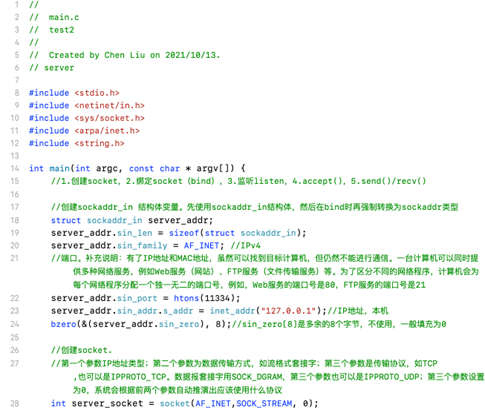
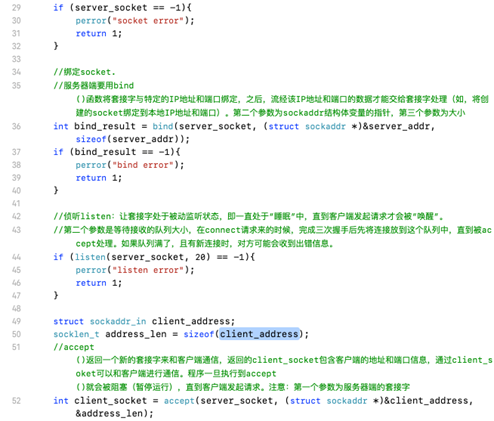
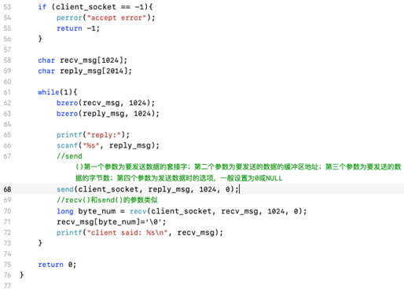
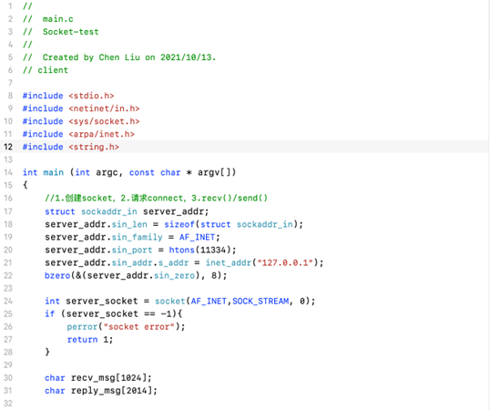
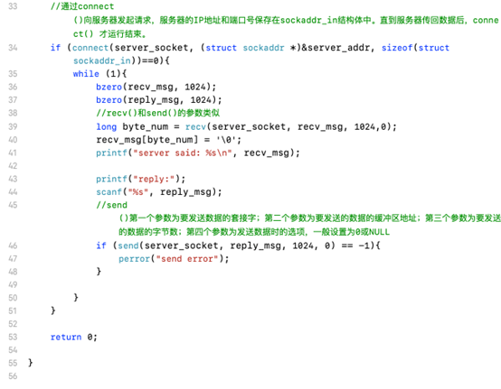
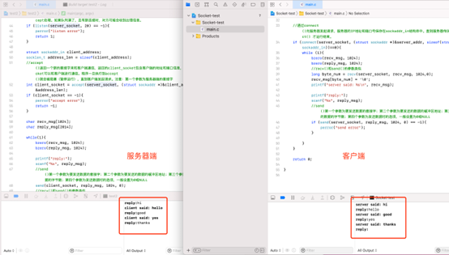
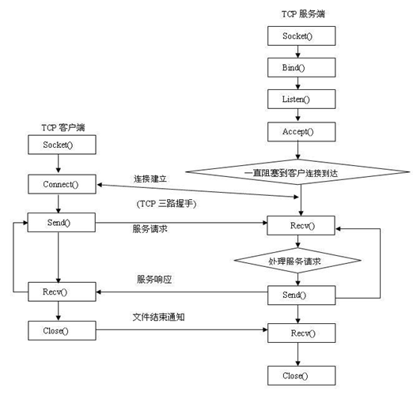

# Socket编程实现客户端与服务器通信

## 一、实验目的
1. 学习Socket编程基础知识；
2. 理解并学会应用socket API，比如，学习基于C的Socket编程相关函数和数据类型；（语言不限，代码可以是任意语言）
3. 熟练掌握TCP的Client/Server模式的通信原理。
4. 学会建立主机与服务器之间的连接；
5. 学会在主机和服务器之间收发消息；


## 二、实验环境
Windows/ macOS （不局限）   语言不局限


## 三、实验流程
1. 分别模仿客户端与服务器端；
2. 使用socket建立连接；
3. 在服务器与客户端进行信息交流；
4. 以流程图形式展现程序运行过程；


## 四、实验结果展示

### 1、代码以及通信过程截图如下（以macOS，C语言为例，以下是简单的代码示例）
(1)TCP，服务器端：




```c
#include <stdio.h>
#include <netinet/in.h>
#include <sys/socket.h>
#include <arpa/inet.h>
#include <string.h>

int main(int argc, char const *argv[])
{
    struct sockaddr_in server_addr;
    server_addr.sin_len = sizeof(struct sockaddr_in);
    server_addr.sin_family = AF_INET;
    server_addr.sin_port = htons(11334);
    server_addr.sin_addr.s_addr = inet_addr("127.0.0.1");
    bzero(&(server_addr.sin_zero), 8);

    int server_socket = socket(AF_INET, SOCK_STREAM, 0);
    if (server_socket == -1)
    {
        perror("socket error");
        return 1;
    }

    int bind_result = bind(server_socket, (struct sockaddr *)&server_addr,
                           sizeof(struct sockaddr));
    if (bind_result == -1)
    {
        perror("bind error");
        return 1;
    }

    if (listen(server_socket, 20) == -1)
    {
        perror("listen error");
        return 1;
    }

    struct sockaddr_in client_address;
    socklen_t address_len = sizeof(client_address);

    int client_socket = accept(server_socket, (struct sockaddr *)&client_address,
                               &address_len);
    if (client_socket == -1)
    {
        perror("accept error");
        return -1;
    }

    char recv_msg[1024];
    char reply_msg[1024];

    while (1)
    {
        bzero(recv_msg, 1024);
        bzero(reply_msg, 1024);

        printf("reply:");
        scanf("%s", reply_msg);

        send(client_socket, reply_msg, 1024, 0);

        long byte_num = recv(client_socket, recv_msg, 1024, 0);
        recv_msg[byte_num] = '\0';
        printf("client said:%s\n", recv_msg);
    }

    return 0;
}
```

(2)TCP，客户端：



```c
#include <stdio.h>
#include <netinet/in.h>
#include <sys/socket.h>
#include <arpa/inet.h>
#include <string.h>

int main(int argc, char const *argv[])
{
    struct sockaddr_in server_addr;
    server_addr.sin_len = sizeof(struct sockaddr_in);
    server_addr.sin_family = AF_INET;
    server_addr.sin_port = htons(11334);
    server_addr.sin_addr.s_addr = inet_addr("127.0.0.1");
    bzero(&(server_addr.sin_zero), 8);

    int server_socket = socket(AF_INET, SOCK_STREAM, 0);
    if (server_socket == -1)
    {
        perror("socket error");
        return 1;
    }

    char recv_msg[1024];
    char reply_msg[1024];

    if (connect(server_socket, (struct sockaddr *)&server_addr,
                sizeof(struct sockaddr)) == 0)
    {
        while (1)
        {
            bzero(recv_msg, 1024);
            bzero(reply_msg, 1024);

            long byte_num = recv(server_socket, recv_msg, 1024, 0);
            recv_msg[byte_num] = '\0';
            printf("server:%s\n", recv_msg);

            printf("reply:");
            scanf("%s", reply_msg);

            if (send(server_socket, reply_msg, 1024, 0) == -1)
            {
                perror("send error");
            }
        }
    }
    return 0;
}
```

运行结果：



### 2、程序流程图如下
采用TCP，其流程图示例

