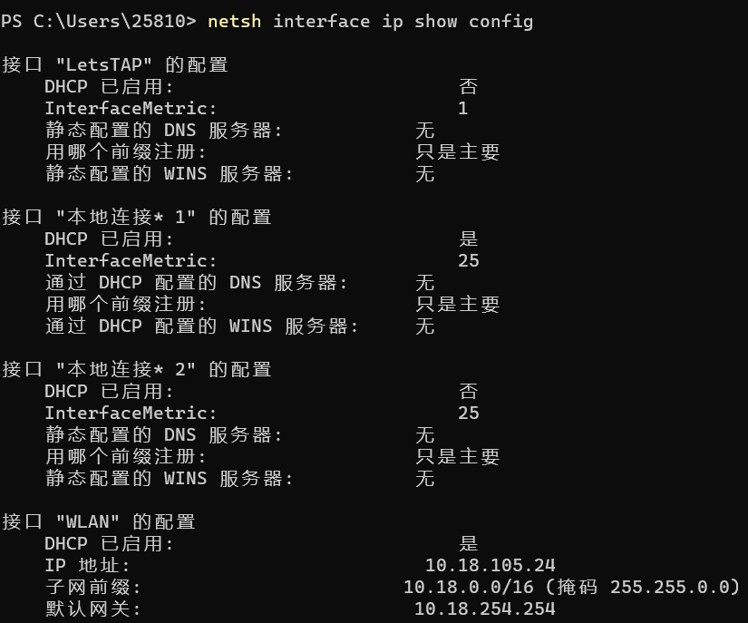
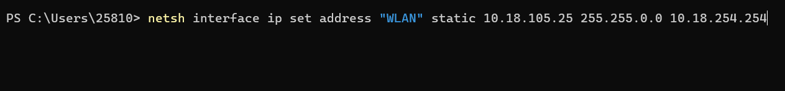
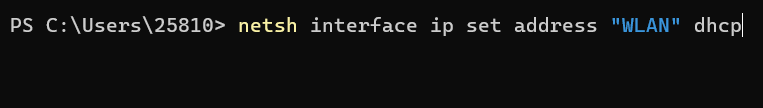
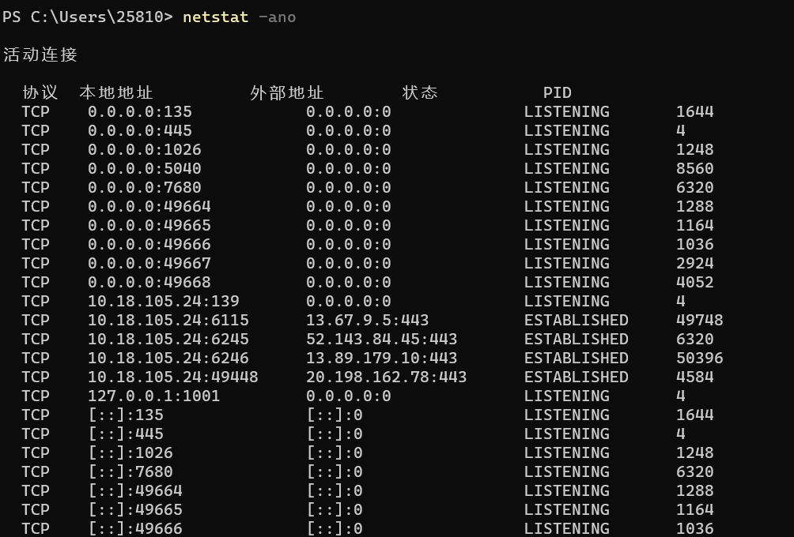
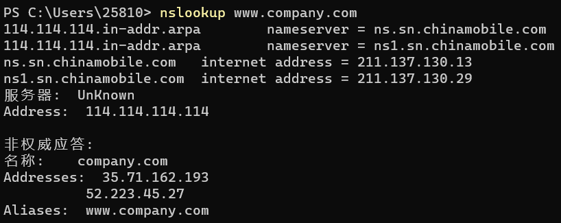
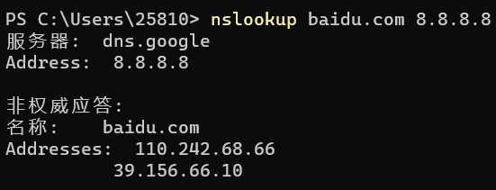
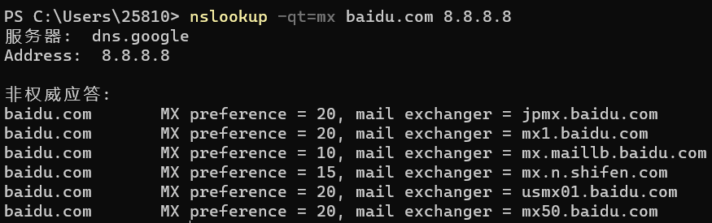
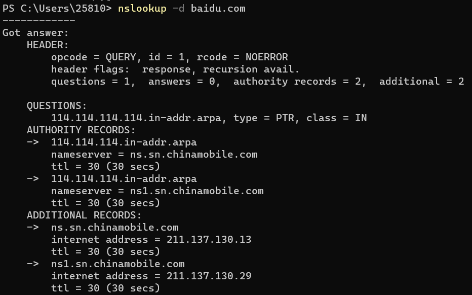
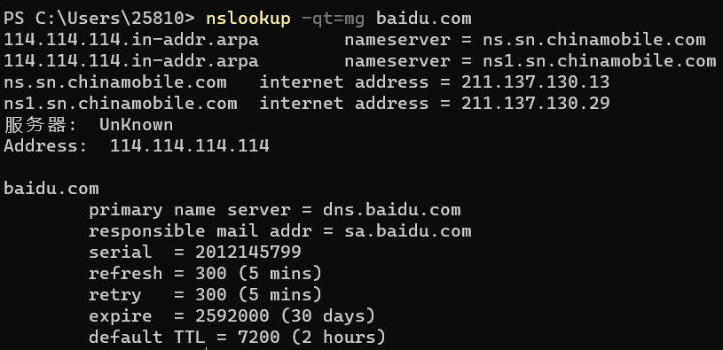

# Windows下网络命令的理解

## 一、【实验目的】
1. 学会使用netsh命令测试本机的TCP/IP网络配置
2. 学会使用netstat命令并检测网络连接
3. 了解ARP原理并使用ARP探索攻击源头
4. 了解nsiookup命令的用法


## 二、【实验环境】
Windows dos


## 三、【实验要求】

### 1. 使用netsh命令查看本机的IP地址，并修改本机的静态或者动态IP地址，完成后截图。
1. netsh命令查看本机的IP地址
```bat
netsh interface ip show config
```


2. 修改本机的静态IP地址
```bat
netsh interface ip set address "WLAN" static 10.18.105.25 255.255.0.0 10.18.254.254
```


1. 修改本机的动态IP地址
```bat
netsh interface ip set address "WLAN" dhcp
```


### 2. 使用netstat命令查看本机的所有端口及占用每个端口的进程的PID，并有针对性地查看占用指定某个端口的进程的PID，完成后截图。
1. netstat命令查看本机的所有端口及占用每个端口的进程的PID
    ```bat
    netstat -ano
    ```
    
2. 查看占用指定某个端口的进程的PID
    ```bat
    netstat -ano|findstr "123"
    ```
    
### 3. 说明ARP通讯协议的过程，并显示本机中的ARP缓存表，说明ARP欺骗的原理以及如何防范这种攻击。
1. ARP通讯协议的过程
   1. A先在其ARP高速缓存中查看有无B的IP地址。如有，就在ARP高速缓存中查出其对应的硬件地址，再把这个硬件地址写入MAC帧，然后通过局域网把该MAC帧发往此硬件地址。如果查不到B的IP的项目，则进入第（2）步。
   2. A的ARP进程在本局域网上广播发送一个ARP请求分组，主要内容是A自己的IP地址、MAC地址，询问的IP地址（也就是B的IP地址）。
   3. 在本局域网上的所有主机运行的ARP进程都收到此ARP请求分组。
   4. 主机B的IP地址与ARP请求分组中要查询的IP地址一致，就收下这个ARP请求分组，并向A单播发送ARP响应分组（其中写入了B自己的硬件地址），同时将A的地址映射写入自己的ARP高速缓存中。由于其余的所有主机IP地址都与ARP请求分组要查询的IP地址不一致，因此都不理睬这个ARP请求分组。
   5. A收到B的ARP响应分组后，就在其ARP高速缓存中写入B的IP地址到硬件地址的映射。
   6. 至此，A得到了从B的IP地址到其MAC地址的映射。当这个映射项目在高速缓存中保存超过生存时间，将被从高速缓存中删除。
2. ARP欺骗的原理以及如何防范这种攻击
   1. 原理：主机发送一个本地的RARP广播，在此广播包中，声明自己的MAC地址并且请求任何收到此请求的RARP服务器分配一个IP地址。本地网段上的RARP服务器收到此请求后，检查其RARP列表，查找该MAC地址对应的IP地址。如果存在，RARP服务器就给源主机发送一个响应数据包并将此IP地址提供给对方主机使用。如果不存在，RARP服务器对此不做任何的响应。源主机收到从RARP服务器的响应信息，就利用得到的IP地址进行通讯；如果一直没有收到RARP服务器的响应信息，表示初始化失败。
   2. 防范：
      1. 主机级被动检测：当系统接收到来自局域网上的ARP请求时，系统检查该请求发送端的IP地址是否与自己的IP地址相同。如果相同，则说明该网络上另有一台机器与自己具有相同的IP地址。
      2. 主机级主动检测：主机定期向所在局域网发送查询自己IP地址的ARP请求报文。如果能够收到另一ARP响应报文，则说明该网络上另一台机器与自己具有相同的IP地址。
      3. 服务器级检测：当服务器收到ARP响应时，为了证实它的真实性，根据反向地址解析协议(RARP)就用从响应报文中给出MAC地址再生成一个RARP请求，它询问这样一个问题："如果你是这个MAC地址的拥有者，请回答你的IP地址"。这样就会查询到这个MAC地址对应的IP地址，比较这两个IP地址，如果不同，则说明对方伪造了ARP响应报文。
      4. 网络级检测：配置主机定期向中心管理主机报告其ARP缓存的内容。这样中心管理主机上的程序就会查找出两台主机报告信息的不一致，以及同一台主机前后报告内容的变化。这些情况反映了潜在的安全问题。或者利用网络嗅探工具连续监测网络内主机硬件地址与IP地址对应关系的变化。

### 4. 简要说明nslookup命令的功能，并任意选其中5个命令进行查看；对过程中出现的"非权威应答"现象做出解释，完成后截图。
1. Nslookup命令的功能：
   1. 功能是查询一台机器的IP地址和其对应的域名。它通常需要一台域名服务器来提供域名服务，如果用户已经设置好域名服务器，就可以用这个命令查看不同主机的IP地址对应的域名。
   2. 该命令的一般格式为：`nslookup [IP地址/域名]`
2. 任意选其中5个命令进行查看
   1. 直接查询：`nslookup domain [dns-server]`
        
   2. 查询IP地址：`nslookup 域名`
        
   3. 查询其他记录：`nslookup --qt=类型 目标域名`
        
   4. 检查域名的缓存时间：`nslookup --d [其他的参数] 目标域名 [指定的服务器地址]`
        
   5. `nslookup --qt=类型 目标域名`
        
3. 对过程中出现的"非权威应答"现象做出解释：假设某个DNS server没有域名test.com的记录信息，当有客户端通过它请求获取test.com的域名信息，此DNS Server会通过迭代递归的方式从test公司实际存储此记录信息的DNS server中获取test.com的域名信息，反馈给发出请求的客户端，同时会把test.com的记录信息放在自身缓存中放置一段时间，当又有客户端请求test.com域名解析时，此DNS server直接从自身缓存中提取返回给客户端，这个回答叫"非权威回答"，简言之凡是从非实际记录存储DNS server中获取的域名解析回答，都叫"非权威回答"。


## 四、【实验总结】
本次实验主要在Windows dos环境下查看了本机的ip地址以及tcp/ip信息配置、了解了ping命令的基本使用和基本原理。
学会了使用ipconfig来查看本机的信息、使用tracert对ip进行追踪、使用netsh命令测试本机的TCP/IP网络配置、使用netstat命令并检测网络连接。
了解Nsiookup命令的用法以及ARP原理，并使用ARP探索攻击源头。
ping命令是基于 ICMP 协议，探测本机与网络中另一主机之间是否可达的命令。
tracert命令诊断实用程序通过向目标计算机发送具有不同生存时间的ICMP数据包，来确定至目标计算机的路由。
实验总体难度适中，由于开始在校园网环境下，所以在同网段的实验时出现了错误。后期使用热点、关闭防火墙成功连接。
在使用netsh命令修改本机的IP后会导致校园网无法使用，重新设置回原来的IP也不行，最后重置网络服务才得以修复。
