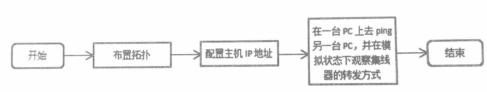
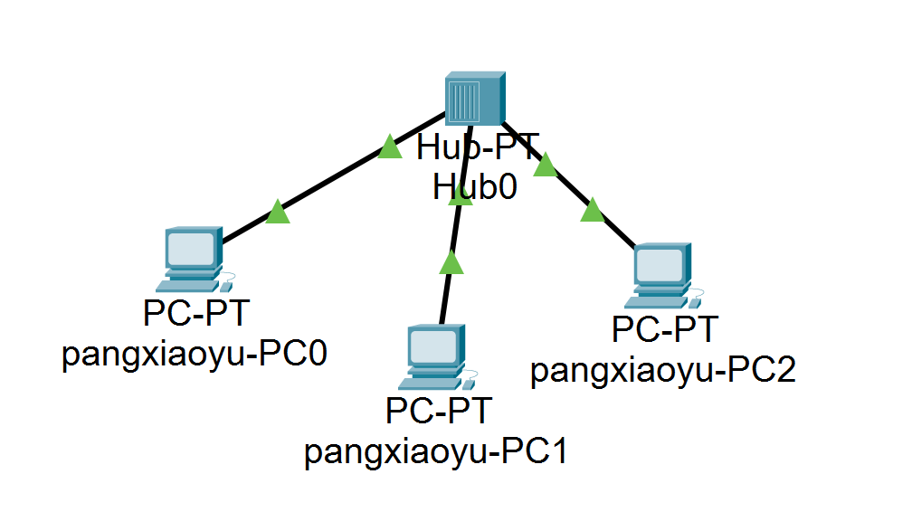
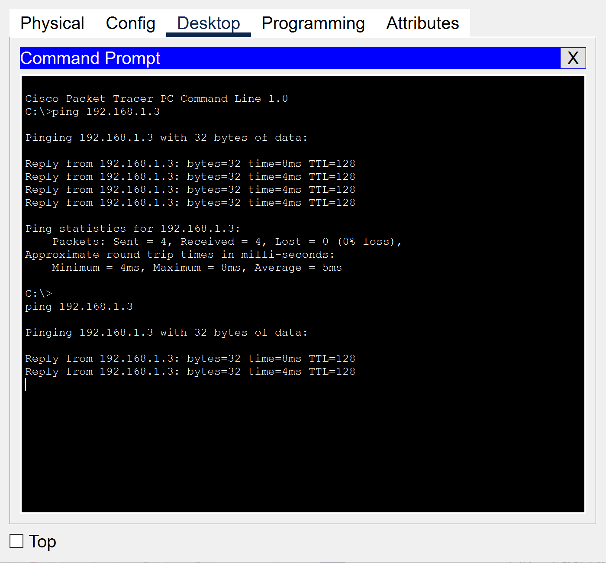
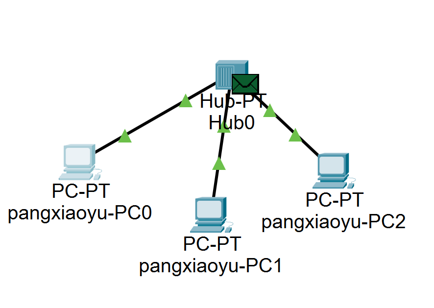
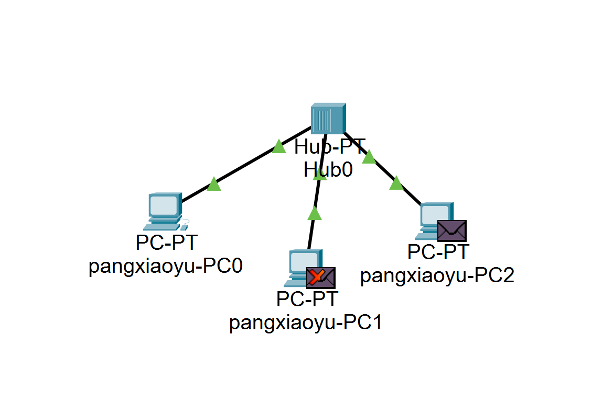
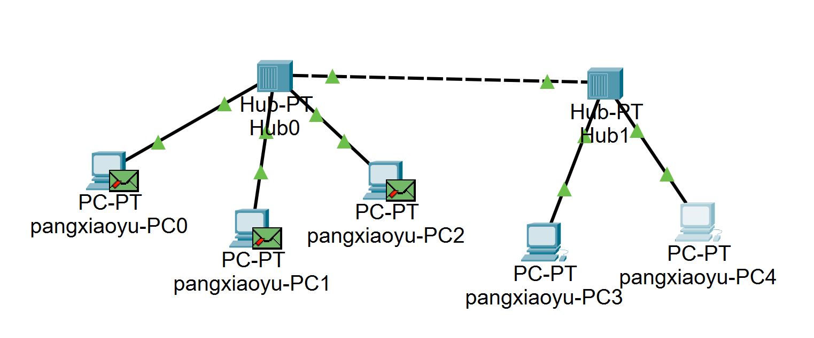
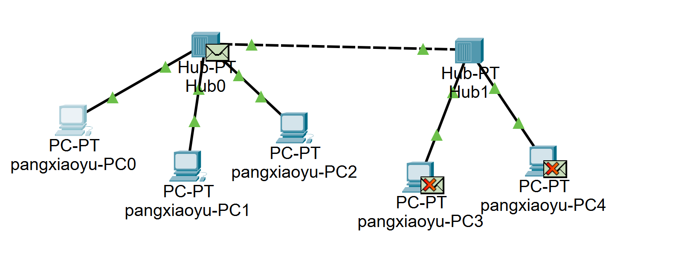
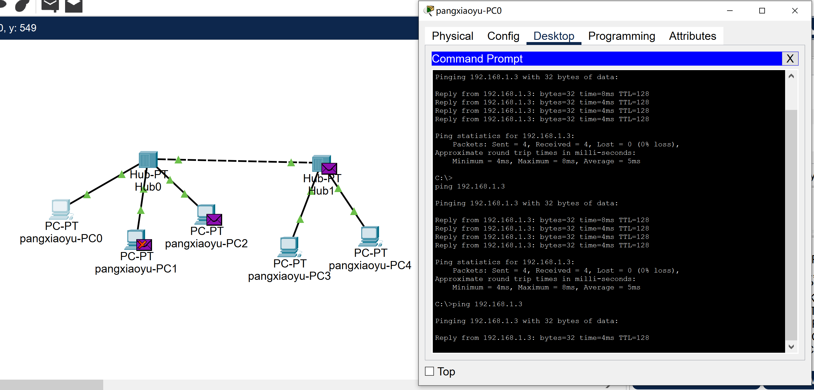

# 实验三  数据链路层1：用集线器组建局域网

## 实验目的
1. 理解集线器的工作方式。
2. 理解碰撞域。

## 实验内容
1. 集线器的工作方式。
   - 最初的以太网是共享总线型的拓扑结构,后来发展为以集线器（Hub）为中心的星型拓扑结构，可以将集线器想象成总线缩短为一点时的设备，内部用集成电路代替总线，所以说使用集线器的星型以太网逻辑上仍然是一个总线网。
   - 集线器通常用来直接连接主机，从一个端口接收信号，并对信号经过整形放大后将其从所有其他端口转发出去，是一个有源的设备。集线器工作在物理层，并不识别比特流里面的帧，也不进行碰撞检测，只做简单的物理层的转发，如果信号发生碰撞，主机将无法收到正确的比特。
   - 集线器及其所连接的所有主机都属于同一个碰撞域，不同于广播域，碰撞域是指物理层信号的碰撞，是物理层的概念。由于集线器工作方式非常简单，也经常被称为傻 Hub。

2. 实验流程
    

## 实验步骤

### 1. 单个集线器组网
实验拓扑图如下所示：

主机IP应配置在同一网段，具体IP配置下表所示：（IP配置表）

| 设备           | IP地址      | 子网掩码      |
| -------------- | ----------- | ------------- |
| pangxiaoyu_PC1 | 192.168.1.1 | 255.255.255.0 |
| pangxiaoyu_PC2 | 192.168.1.2 | 255.255.255.0 |
| pangxiaoyu_PC3 | 192.168.1.3 | 255.255.255.0 |

在PT模拟模式下，由PC1 ping PC3，只选中ICMP协议，观察比特流的轨迹。

由下面两幅图可以看到，集线器将数据包从其他所有端口转发出去，这3台PC属于同一碰撞域。

### 2. 使用集线器扩展以太网
实验拓扑如下图所示，主机IP应配置在同一网段，具体IP配置略。

Hub1的转发如图所示。

命令行ping的结果如图所示。

