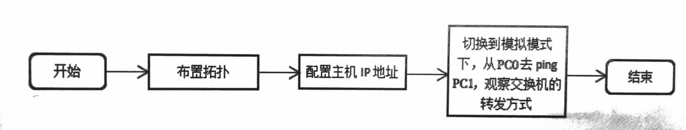
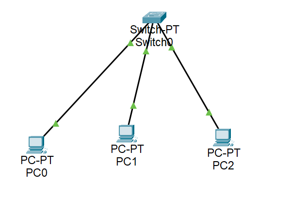
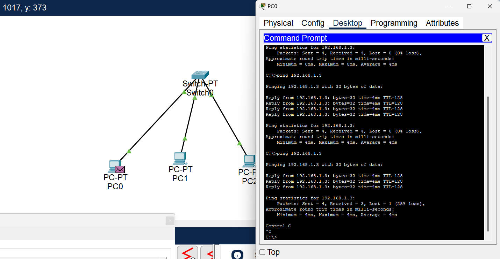
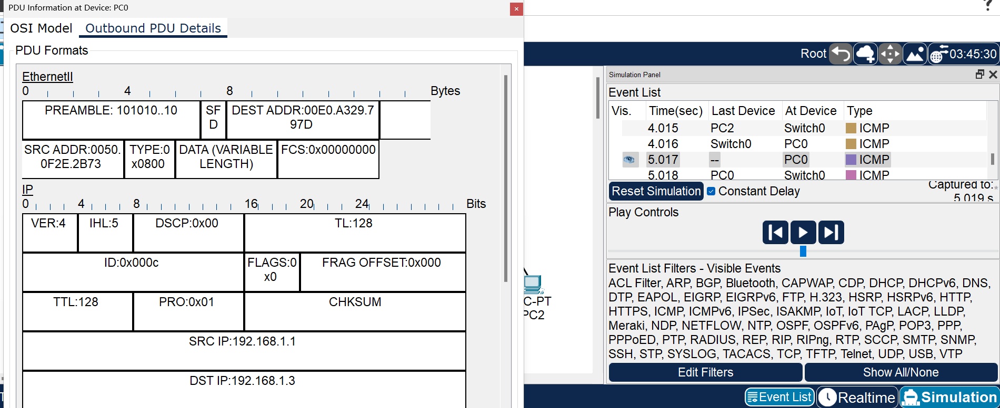
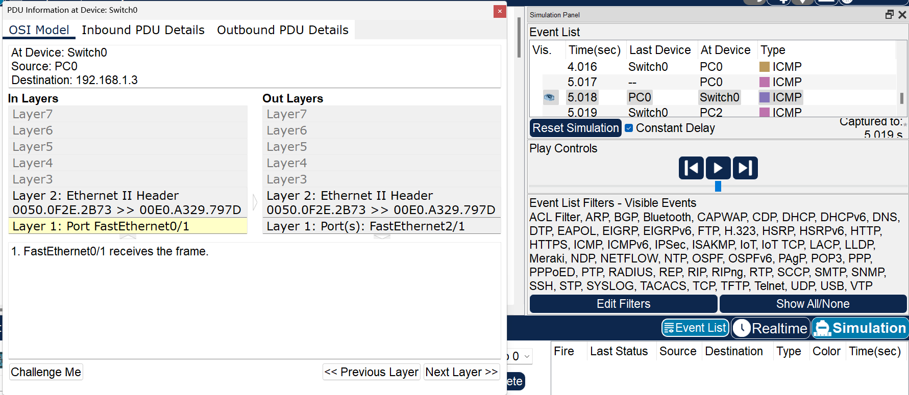
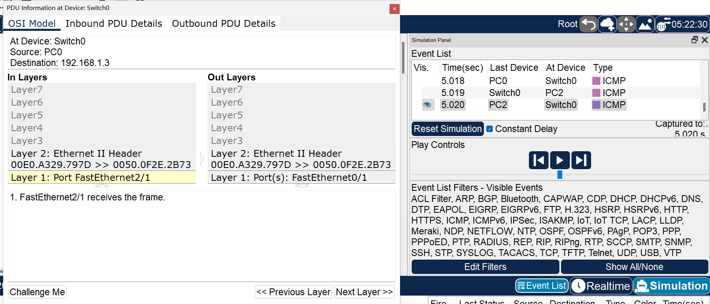

# 数据链路层2：以太网二层交换机原理实验

## 实验目的
1. 理解二层交换机的原理及工作方式。
2. 利用交换机组建小型交换式局域网。


## 实验内容

### 1. 集线器的工作方式。
交换机是目前局域网终中最常用到的组网设备之一，它工作在数据链路层，所以常被称为二层交换机。实际上，交换机有可工作在三层或三层以上层的型号设备，为了表述方便，这里的交换机仅指二层交换机。
数据链路层传输的PDU(协议数据单元)为帧，不同于工作在物理层的集线器，交换机可以根据帧中的目的MAC地址进行有选择的转发，而不是一味地向所有其他端口广播，这依赖于交换机中的交换表。当交换机收到一个帧时，会根据帧里面的目的MAC地址去查交换表，并根据结果将其从对应端口转发出去，这使得网络的性能得到极大的提升。
鉴于交换机的这种转发特性，使得端口间可以并行地通信，比如1端口和2端口通信时，并不影响3端口和4端口同时进行通信，当然，前提是交换机必须有足够的背板带宽。
交换机通常有很多端口，如24口或48口，在组网中被直接用来连接主机，其端口一般都工作在全双工模式下（不运行 CSMA/CD 协议)，尽管它也可以设置为半双工模式，但显然很少有人那样做。

### 2. 实验流程
本实验可以用一台主机去ping另一台主机，并在模拟状态下观察ICMP分组的轨迹，理解交换机的转发过程。



## 实验步骤

### 1、了解交换机工作原理。实验拓扑如下图所示。


具体IP配置下表所示：
IP配置表
| 设备 | IP地址      | 子网掩码      |
| ---- | ----------- | ------------- |
| PC0  | 192.168.1.1 | 255.255.255.0 |
| PC1  | 192.168.1.2 | 255.255.255.0 |
| PC2  | 192.168.1.3 | 255.255.255.0 |

在模拟模式下，只过滤ICMP协议，从PC0去 ping PC2，然后单击下图右图下角的三角按钮，再单击PC0出站包，观察PC0中封装的帧结构，特别是源地址和目的地址，如下二图所示。



### 2、单击到达Switch0中的帧，如下图所示。

该帧被交换机从Fa2/1端口转发到PC2。

### 3、查看交换机交换表。进入交换机CLI界面，在特权模式下查看交换机的交换表进行印证。
```
PT3000 Boot Loader (PT3000-HBOOT-M) Version 12.1(11r)EA1, RELEASE SOFTWARE (fc1)
Compiled Mon 22-Jul-02 18:57 by miwang
Cisco WS-CSwitch-PT (RC32300) processor (revision C0) with 21039K bytes of memory.
Switch-PT starting...
Base ethernet MAC Address: 0050.0FE6.2772
Xmodem file system is available.
Initializing Flash...
flashfs[0]: 1 files, 0 directories
flashfs[0]: 0 orphaned files, 0 orphaned directories
flashfs[0]: Total bytes: 64016384
flashfs[0]: Bytes used: 3117390
flashfs[0]: Bytes available: 60898994
flashfs[0]: flashfs fsck took 1 seconds.
...done Initializing Flash.

Boot Sector Filesystem (bs:) installed, fsid: 3
Parameter Block Filesystem (pb:) installed, fsid: 4


Loading "flash:/pt3000-i6q4l2-mz.121-22.EA4.bin"...
########################################################################## [OK]
              Restricted Rights Legend

Use, duplication, or disclosure by the Government is
subject to restrictions as set forth in subparagraph
(c) of the Commercial Computer Software - Restricted
Rights clause at FAR sec. 52.227-19 and subparagraph
(c) (1) (ii) of the Rights in Technical Data and Computer
Software clause at DFARS sec. 252.227-7013.

           cisco Systems, Inc.
           170 West Tasman Drive
           San Jose, California 95134-1706


Cisco Internetwork Operating System Software
IOS (tm) PT3000 Software (PT3000-I6Q4L2-M), Version 12.1(22)EA4, RELEASE SOFTWARE (fc1)
Copyright (c) 1986-2006 by cisco Systems, Inc.
Compiled Fri 12-May-06 17:19 by pt_team

Cisco WS-CSwitch-PT (RC32300) processor (revision C0) with 21039K bytes of memory.
Processor board ID FHK0610Z0WC
Running Standard Image
6 FastEthernet/IEEE 802.3 interface(s)

63488K bytes of flash-simulated non-volatile configuration memory.
Base ethernet MAC Address: 0050.0FE6.2772
Motherboard assembly number: 73-5781-09 
Power supply part number: 34-0965-01
Motherboard serial number: FOC061004SZ
Power supply serial number: DAB0609127D
Model revision number: C0
Motherboard revision number: A0
Model number: WS-CSwitch-PT
System serial number: FHK0610Z0WC

Cisco Internetwork Operating System Software
IOS (tm) PT3000 Software (PT3000-I6Q4L2-M), Version 12.1(22)EA4, RELEASE SOFTWARE (fc1)
Copyright (c) 1986-2006 by cisco Systems, Inc.
Compiled Fri 12-May-06 17:19 by pt_team

Press RETURN to get started!


%LINK-5-CHANGED: Interface FastEthernet0/1, changed state to up

%LINEPROTO-5-UPDOWN: Line protocol on Interface FastEthernet0/1, changed state to up

%LINK-5-CHANGED: Interface FastEthernet1/1, changed state to up

%LINEPROTO-5-UPDOWN: Line protocol on Interface FastEthernet1/1, changed state to up

%LINK-5-CHANGED: Interface FastEthernet2/1, changed state to up

%LINEPROTO-5-UPDOWN: Line protocol on Interface FastEthernet2/1, changed state to up


Switch>show mac-address-table
          Mac Address Table
-------------------------------------------

Vlan    Mac Address       Type        Ports
----    -----------       --------    -----

   1    0050.0f2e.2b73    DYNAMIC     Fa0/1
   1    00e0.a329.797d    DYNAMIC     Fa2/1
Switch>
```

观察PC2中的进站和出站帧，可以看到其出站和进站的 MAC地址已经相反了，出站的是ping命令对PC0的回答，将被发往PC0，如图所示。

在这种拓扑下，只要主机的IP地址在同一网段，主机之间就可以两两ping通。这种拓扑用来组建一些小型网络，如覆盖一间办公室或宿舍的交换式网络。
