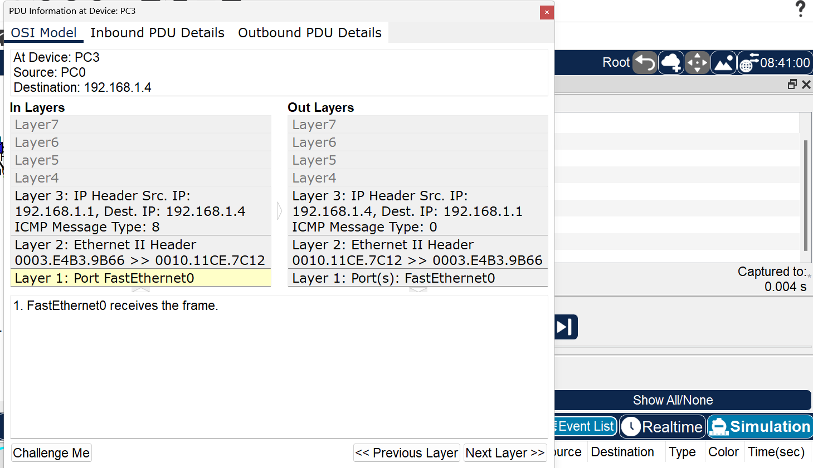
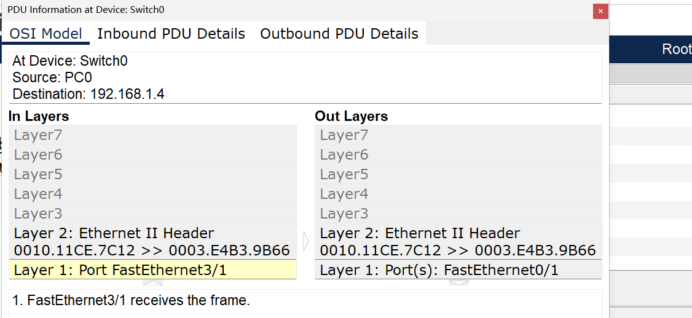

# 数据链路层3：交换机中交换表的自学习功能

## 实验目的
理解二层交换机交换表的自学习功能。


## 实验内容

### 1、基本概念。
交换机可以即插即用，不需要人工配置交换表，交换表的建立是通过交换机自学习得的。其主要思路为主机A封装的帧从交换机的某个端口进入，当然，也可以从该端口到达：主机A。这样，当交换机在收到一个帧时，可以将帧中的源MAC地址和对应的进入端口号记录到交换表中，作为交换表中的一个转发项目，根据交换表去转发该帧，若交换表中没有的MAC地址的记录，则通过广播方式去寻找，即向除该进入端口外的所有其他端口转发。
本实验相关命令如下：
```
clear mac-addresss-table dynamic
```

### 2、实验流程


## 实验步骤

### 1、构建拓扑。创建如图所示的实验拓扑。（注意，这里需要给以太网再增加一个端口，具体操作就是交换机物理模式下关闭交换机电源，然后左列拖住一个CFE端口放到空槽中，然后打开开关就ok了）


### 2、执行ping命令，观察分组。
在模拟模式下，只过滤ARP和 ICMP协议，从PC0 ping PC3，如下图所示。


单击PC0处的ARP分组，该分组被封装为以太网广播帧，观察ARP分组里的源和目的MAC地址，如下图所示。


由于该分组还没有到达交换机，所以，此时交换机的交换表是空的，查看交换机的交换表验证并截图。


### 3、在交换机中添加交换表记录。
ARP分组到达交换机，此时查看交换机的交换表，如下图所示。


实验时利用ping命令去访问另一台主机，在ping包发出前，网络会先运行ARP 协议来获得对方主机的MAC地址。这样，按照自学习算法，交换机会首先学习到ARP分组中的源MAC地址和对应端口号,并记入交换表。


可以看到，PC0的 MAC地址已经被交换机自动学习到了。

### 4、ARP分组被交换机广播出去，如下图所示。

但需要注意，此广播属于ARP的广播（目的MAC地址为全1)，而非交换机找不到转发表中的记录所进行的广播。

### 5、单击PC3上的ARP的应答分组，如下图所示，观察PC3的MAC地址。


### 6、交换机转发ARP分组。
ARP分组返回交换机，如下图所示，此时，按照自学习算法，PC3的MAC地址将被记录到交换表中。


查看交换机的交换表：


### 7、观察交换机的转发。

如图所示，可以看到，交换机直接将该分组由Fa0/1转发出去，而不是向其他端口广播，这正是依据交换表转发的结果。

### 8、清空交换机的MAC地址表，再次由PC0 ping PC3。


