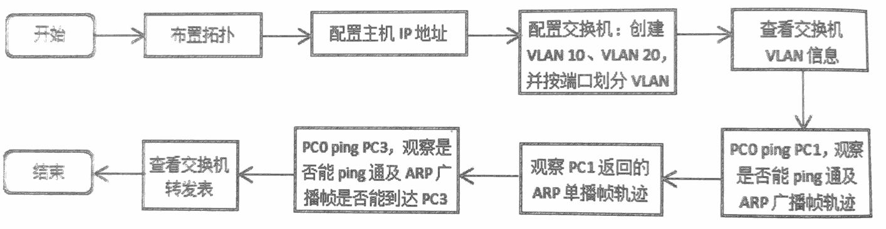
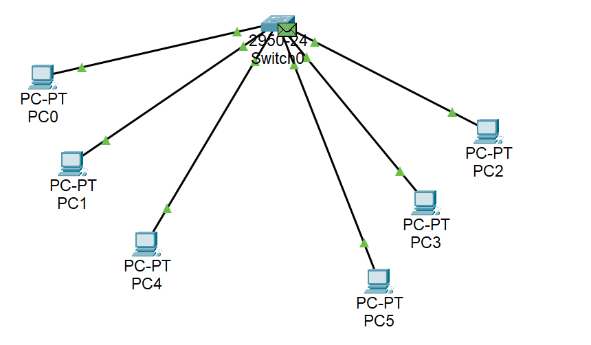
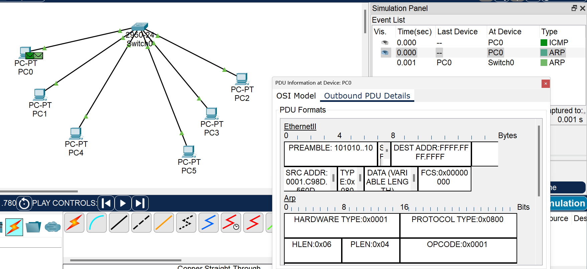
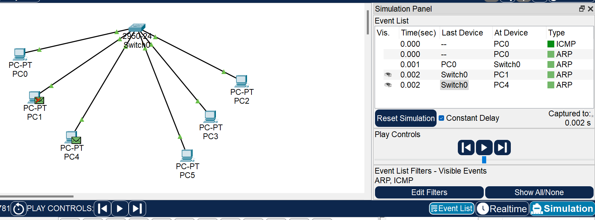
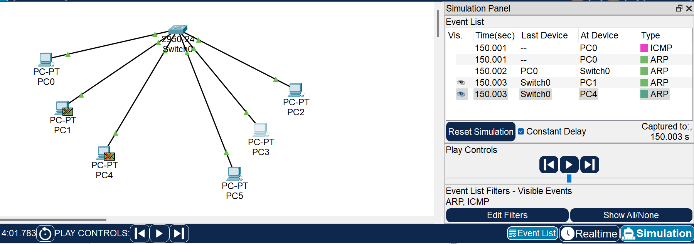

# 数据链路层4：交换机VLAN实验

## 实验目的
1. 理解二层交换机的缺陷。
2. 理解交换机的VLAN，掌握其应用场合。
3. 掌握二层交换机的VLAN的基础配置。


## 实验内容

### 1、基本概念。
一个二层交换网络属于一个广播域，广播域也可以理解为一个广播帧所能达到的范围。
在网络中存在大量的广播，许多协议及应用通过广播来完成某种功能，如 MAC地址的查询，ARP协议等，但过多的广播包在网络中会发生碰撞，一些广播包会被重传，这样，越来越多的广播包会最终将网络资源耗尽，使得网络性能下降，甚至造成网络瘫痪。

虚拟局域网（VLAN，Virtual Local Area Network）技术可以将一个较大的二层交换网络划分为若干个较小的逻辑网络，每个逻辑网络是一个广播域，且与具体物理位置没有关系，这使得 VLAN技术在局域网中被普遍使用，具体来说，VLAN有如下优点。
1. 控制广播域。每个 VLAN属于一个广播域，通过划分不同的 VLAN，广播被限制在一个VLAN内部，将有效控制广播范围，减小广播对网络的不利影响。
2. 增强网络的安全性。对于有敏感数据的用户组可与其他用户通过 VLAN隔离，减小被广播监听而造成泄密的可能性。
3. 组网灵活，便于管理。可以按职能部门、项目组或其他管理逻辑来划分VLAN，便于部门内部的资源共享。由于VLAN 只是逻辑上的分组网络，因此可以将不同地理位置上的用户划分到同一VLAN中。例如，将一幢大楼二层的部分用户和三层的部分用户划到同一VLAN中，尽管他们可能连接在不同的交换机上，地理位置也不同，但却是在一个逻辑网络中，按统一的策略去管理。

交换机中的每个 VLAN 都被赋于一个 VLAN号，以区别于其他VLAN，也可以对每个VLAN起个有意义的名称，方便理解。

VLAN划分的方式如下所列。
1. 基于端口的划分。如将交换机端口划分到某个 VLAN，则连接到该端口上的用户即属于该VLAN。优点是简单、方便，缺点是当该用户离开端口时，需要根据情况重新定义新端口的 VLAN。
2. 基于MAC地址、网络层协议类型等划分VLAN。基于端口的划分方式应用最多，所有支持VLAN的交换机都支持这种方式，这里只介绍基于端口的划分。

常用配置命令如下表所示。
表 常用配置命令
| 命令格式                       | 含义                                      |
| ------------------------------ | ----------------------------------------- |
| vlan vlan-id                   | 创建VLAN,例如:vlan 10                     |
| name vlan-name                 | 给VLAN命名                                |
| switchport mode access         | 将该端口定义为access模式,应用于端口模式下 |
| switchport access vlan vlan-id | 将端口划分到特定VLAN,应用于端口模式下     |
| show vlan                      | 显示VLAN 及端口信息                       |
| show vlan id vlan-id           | 显示特定VLAN信息                          |

### 2、实验流程
本实验可用一台主机去 ping 另一台主机，并在不同情况下观察帧的轨迹，理解碰撞域。实验流程如图所示。



## 实验步骤

### 1、布置拓扑。
将主机IP地址均设置为192.168.1.0/24 网段，
在交换机中创建VLAN 10和VLAN 20，
将 Fa0/1、Fa0/2和Fa0/5端口划人VLAN 10，
将Fa0/3、Fa0/4  Fa0/6划入VLAN 20，如下图所示。

PC0、PC1和PC4属于VLAN 10的广播域，PC2、PC3和PC5属于VLAN 20的广播域，观察VLAN的作用。

### 2、配置交换机。
对交换机按要求做如下配置：
```
Switch(config-if)#exit
Switch(config)#interface FastEthernet0/1
Switch(config-if)#exit
Switch(config)#exit
Switch#
%SYS-5-CONFIG_I: Configured from console by console
conf t
Enter configuration commands, one per line. End with CNTL/Z.
Switch(config)#vlan 10
Switch(config-vlan)#vlan 20
Switch(config-vlan)#exit
Switch(config)#int range f0/1
Switch(config-if-range)#switch mode access
Switch(config-if-range)#switch access vlan 10
Switch(config-if-range)#exit
Switch(config)#int range f0/2
Switch(config-if-range)#switch mode access
Switch(config-if-range)#switch access vlan 10
Switch(config-if-range)#exit
Switch(config)#int range f0/5
Switch(config-if-range)#switch mode access
Switch(config-if-range)#switch access vlan 10
Switch(config-if-range)#exit
switch(config)#int range f0/3
Switch(config-if-range)#switch mode access
Switch(config-if-range)#switch access vlan 20
Switch(config-if-range)#exit
Switch(config)#int range f0/4
Switch(config-if-range)#switch mode access
Switch(config-if-range)#switch access vlan 20
Switch(config-if-range)#exit
Switch(config)#int range f0/6
Switch(config-if-range)#switch mode access
Switch(config-if-range)#switch access vlan 20
Switch(config-if-range)#exit
```

经过以上设置后，查看交换机VLAN信息：
```
Switch(config-if)#do show vlan

VLAN Name                             Status    Ports
---- -------------------------------- --------- -------------------------------
1    default                          active    Fa0/7, Fa0/8, Fa0/9, Fa0/10
                                                Fa0/11, Fa0/12, Fa0/13, Fa0/14
                                                Fa0/15, Fa0/16, Fa0/17, Fa0/18
                                                Fa0/19, Fa0/20, Fa0/21, Fa0/22
                                                Fa0/23, Fa0/24
10   VLAN10                           active    Fa0/1, Fa0/2, Fa0/5
20   VLAN20                           active    Fa0/3, Fa0/4, Fa0/6
1002 fddi-default                     active    
1003 token-ring-default               active    
1004 fddinet-default                  active    
1005 trnet-default                    active    

VLAN Type  SAID       MTU   Parent RingNo BridgeNo Stp  BrdgMode Trans1 Trans2
---- ----- ---------- ----- ------ ------ -------- ---- -------- ------ ------
1    enet  100001     1500  -      -      -        -    -        0      0
10   enet  100010     1500  -      -      -        -    -        0      0
20   enet  100020     1500  -      -      -        -    -        0      0
1002 fddi  101002     1500  -      -      -        -    -        0      0   
1003 tr    101003     1500  -      -      -        -    -        0      0   
1004 fdnet 101004     1500  -      -      -        ieee -        0      0   
1005 trnet 101005     1500  -      -      -        ibm  -        0      0   

VLAN Type  SAID       MTU   Parent RingNo BridgeNo Stp  BrdgMode Trans1 Trans2
---- ----- ---------- ----- ------ ------ -------- ---- -------- ------ ------

Remote SPAN VLANs
------------------------------------------------------------------------------

Primary Secondary Type              Ports
------- --------- ----------------- ------------------------------------------
```

可以发现，交换机知道哪些端口属于哪个VLAN，默认情况下所有端口都属于VLAN 1。

### 3、同一VLAN广播帧。
在模拟模式下，从PC0 ping PC4，只过滤ARP分组和ICMP分组。
其中第一个ARP分组是广播帧，这里我们暂时只关注其广播的属性。
由于该包从Fa0/1端口进入，属于VLAN 10，因此它将在VLAN 10中广播。
观察VLAN 10的广播域，显然，只有PC0、PC1和PC4可以收到这个帧，其中PC1丢弃该帧，而不属于VLAN 10的主机将收不到该广播帧。
如下图所示的是PC0处封装的ARP广播帧，注意观察其目的MAC地址为广播地址（全1）。


### 4、同一VLAN单播帧。

ARP广播帧到达PC1后，PC1会向PC0回复一个单播帧，根据交换机的交换表表自学习算法，PC0的MAC地址会被交换机学习到，所以单播帧将被直接转发到PC0。当然，若转发表中没有该地址，则会在 VLAN 10中广播该帧。

### 5、不同VLAN单播帧。
从PC0 ping PC3，如下图所示。

查看交换机转发表，注意转发表中MAC地址前都有VLAN标识，目前转发表中没有VLAN 20的记录。
```
Switch#show mac-address-table
          Mac Address Table
-------------------------------------------

Vlan    Mac Address       Type        Ports
----    -----------       --------    -----

  10    0001.c98d.560d    DYNAMIC     Fa0/1
  10    00d0.d37b.1b4c    DYNAMIC     Fa0/5
```


## 思考题

### 1、在实验步骤4中，为什么广播帧没有到达PC2、PC3和PC5？
ARP广播帧到达PC1后，PC1会向PC0回复一个单播帧，根据交换机的交换表表自学习算法，PC0的MAC地址会被交换机学习到，所以单播帧将被直接转发到PC0。
当然，若转发表中没有该地址，则会在 VLAN 10中广播该帧。

### 2、在实验步骤5中，从PC0 ping PC3的仿真结果是什么？说明了什么？
转发表中MAC地址前都有VLAN标识，目前转发表中没有VLAN 20的记录。
说明了交换机可以隔离冲突域。
