# 数据链路层5：交换机VLAN中继实验

## 实验目的
1. 理解VLAN中继的概念。
2. 掌握以太网交换机的VLAN中继配置。
3. 掌握VTP的配置。


## 实验内容

### 1、VLAN中继基础知识。
首先看一个例子，拥有VLAN 10和VLAN 20的交换机想要到达另一台拥有相同VLAN的交换机时，需要他们在物理上连接两条链路，分别用来承载VLAN 10和VLAN 20的流量，如图所示。


中继是一条支持多个 VLAN的点到点链路，允许多个 VLAN通过该链路到达另一端,比如可用一条中继链路来代替上图中的两条链路，如图所示。
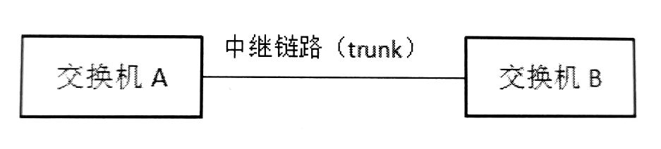

显然，对于交换机来说，这种技术节约了端口数量。一般来说，中继链路被设置在交换机之间的连接上。
1988年IEEE 批准了802.3ac标准，这个标准定义了以太网帧格式的扩展。虚拟局域网的帧称为802.1Q帧，是在以太网帧格式中插入一个4字节的标识符（VLAN标记)，用以指明该帧属于哪一个 VLAN。
随着 VLAN技术在局域网中的应用越来越多，在交换机中配置 VLAN也成为一个比较繁杂的工作，为此，Cisco开发了虚拟局域网中继协议（VTP， VLAN Tunk Protocol)，工作在数据链路层，该协议可以帮助网络管理员自动完成VLAN的创建、删除和同步等工作，减少配置工作量。

配置VTP，需要重点理解以下几点。
1. VTP协议工作在一个域中，所有加入该VTP的交换机必须设置为同一个域。
2. VTP协议遵循客户机/服务器模式，Cisco交换机默认属于服务器模式，对于 VTP客户机，需要指明其客户机模式。VTP协议会将服务器中的VLAN同步到客户机中。
3. 传输VTP协议分组的链路必须是中继链路，access模式无法传递VTP分组。

在客户机模式下，交换机接收到的VLAN信息保存在RAM中，这也意味着，交换机重启后，这些信息会丢失，需要重新学习。

### 2、实验流程
本实验可用一台主机去 ping 另一台主机，并在模拟状态下观察ICMP分组的轨迹，理解碰撞域。实验流程如图所示。
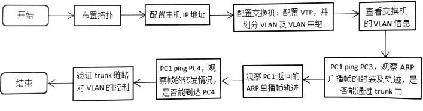


## 实验步骤

### 1、布置拓扑。
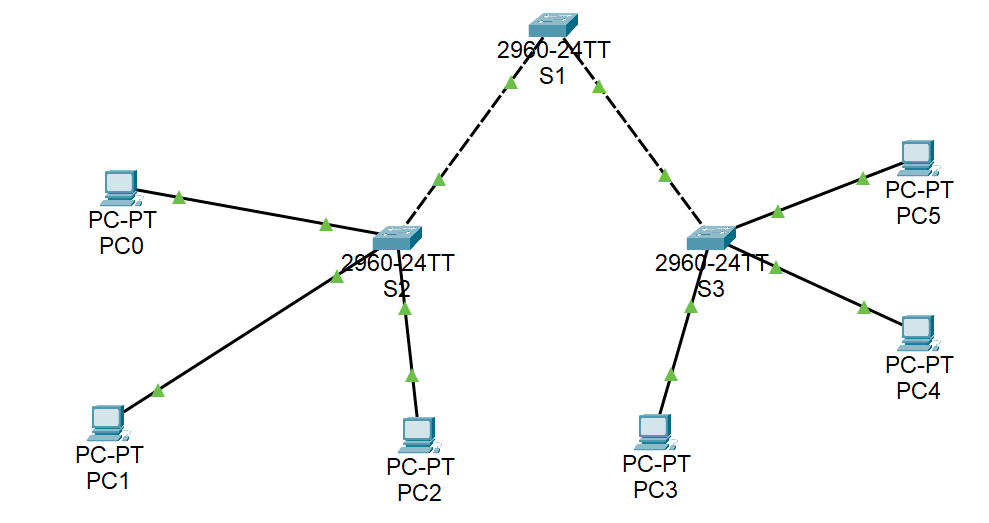
如图所示，拓扑中包含3台交换机(S1、S2和S3)和6台主机，
将主机IP地址均设置为192.168.1.0/24网段，
在交换机S2、S3中创建VLAN 10和VLAN 20，
在S2中将Fa0/1、Fa0/2端口划入VLAN 10，
将Fa0/3端口划入VLAN 20。
在S3中将Fa0/1端口划入VLAN 10，
将Fa0/2和 Fa0/3端口划入VLAN 20。

### 2、配置VTP、交换机 VLAN及端口。
设置S1为 VTP服务器，设置 VTP域名为myvtp，创建VLAN 10和 VLAN 20。（学生更名myvtp为：姓名vtp，例如：zhangsanvtp）
```
Switch>en
Switch#conf t
Enter configuration commands, one per line.  End with CNTL/Z.
Switch(config)#hostname S1
S1(config)#vtp mode server
Device mode already VTP SERVER.
S1(config)#vtp domain pangxiaoyuvtp
Changing VTP domain name from NULL to pangxiaoyuvtp
S1(config)#vlan 10
S1(config-vlan)#vlan 20
S1(config-vlan)#
```

在S2中将Gig0/1端口(简写为g0/1)配置为trunk模式，设置VTP工作模式为客户机，VTP域名为myvtp（学生更名为：姓名vtp，例如：zhangsanvtp），命令如下：
```
Switch>en
Switch#conf t
Enter configuration commands, one per line.  End with CNTL/Z.
Switch(config)#hostname S2
S2(config)#int g0/1
S2(config-if)#switch mode trunk

S2(config-if)#
%LINEPROTO-5-UPDOWN: Line protocol on Interface GigabitEthernet0/1, changed state to down

%LINEPROTO-5-UPDOWN: Line protocol on Interface GigabitEthernet0/1, changed state to up
exit
S2(config)#vtp mode client
Setting device to VTP CLIENT mode.
S2(config)#vtp domain pangxiaoyuvtp
Domain name already set to pangxiaoyuvtp.
S2(config)#
```

在S3中将Gig0/2端口配置为trunk模式，设置S3的VTP工作模式为客户机，VTP域名为myvtp（学生更名为：姓名vtp，例如：zhangsanvtp），命令行略（学生附命令行截图）。交换机S1默认将 Gig0/1和 Gig0/2端口和对方端口协商为trunk模式。
```
Switch>en
Switch#conf t
Enter configuration commands, one per line.  End with CNTL/Z.
Switch(config)#hostname S3
S3(config)#int g0/2
S3(config-if)#switch mode trunk

S3(config-if)#
%LINEPROTO-5-UPDOWN: Line protocol on Interface GigabitEthernet0/2, changed state to down

%LINEPROTO-5-UPDOWN: Line protocol on Interface GigabitEthernet0/2, changed state to up
exit
S3(config)#vtp mode client
Setting device to VTP CLIENT mode.
S3(config)#vtp domain pangxiaoyuvtp
Domain name already set to pangxiaoyuvtp.
S3(config)#
```

配置完成后，请查看交换机的 VLAN信息并附截图（提示：方法见实验六）。
```
S1(config)#do show vlan

VLAN Name                             Status    Ports
---- -------------------------------- --------- -------------------------------
1    default                          active    Fa0/1, Fa0/2, Fa0/3, Fa0/4
                                                Fa0/5, Fa0/6, Fa0/7, Fa0/8
                                                Fa0/9, Fa0/10, Fa0/11, Fa0/12
                                                Fa0/13, Fa0/14, Fa0/15, Fa0/16
                                                Fa0/17, Fa0/18, Fa0/19, Fa0/20
                                                Fa0/21, Fa0/22, Fa0/23, Fa0/24
10   VLAN10                           active    
20   VLAN20                           active    
1002 fddi-default                     active    
1003 token-ring-default               active    
1004 fddinet-default                  active    
1005 trnet-default                    active    

VLAN Type  SAID       MTU   Parent RingNo BridgeNo Stp  BrdgMode Trans1 Trans2
---- ----- ---------- ----- ------ ------ -------- ---- -------- ------ ------
1    enet  100001     1500  -      -      -        -    -        0      0
10   enet  100010     1500  -      -      -        -    -        0      0
20   enet  100020     1500  -      -      -        -    -        0      0
1002 fddi  101002     1500  -      -      -        -    -        0      0   
1003 tr    101003     1500  -      -      -        -    -        0      0   
1004 fdnet 101004     1500  -      -      -        ieee -        0      0   
1005 trnet 101005     1500  -      -      -        ibm  -        0      0   

VLAN Type  SAID       MTU   Parent RingNo BridgeNo Stp  BrdgMode Trans1 Trans2
---- ----- ---------- ----- ------ ------ -------- ---- -------- ------ ------

Remote SPAN VLANs
------------------------------------------------------------------------------

Primary Secondary Type              Ports
------- --------- ----------------- ------------------------------------------
```

```
S2(config)#do show vlan

VLAN Name                             Status    Ports
---- -------------------------------- --------- -------------------------------
1    default                          active    Fa0/4, Fa0/5, Fa0/6, Fa0/7
                                                Fa0/8, Fa0/9, Fa0/10, Fa0/11
                                                Fa0/12, Fa0/13, Fa0/14, Fa0/15
                                                Fa0/16, Fa0/17, Fa0/18, Fa0/19
                                                Fa0/20, Fa0/21, Fa0/22, Fa0/23
                                                Fa0/24, Gig0/2
10   VLAN10                           active    Fa0/1, Fa0/2
20   VLAN20                           active    Fa0/3
1002 fddi-default                     active    
1003 token-ring-default               active    
1004 fddinet-default                  active    
1005 trnet-default                    active    

VLAN Type  SAID       MTU   Parent RingNo BridgeNo Stp  BrdgMode Trans1 Trans2
---- ----- ---------- ----- ------ ------ -------- ---- -------- ------ ------
1    enet  100001     1500  -      -      -        -    -        0      0
10   enet  100010     1500  -      -      -        -    -        0      0
20   enet  100020     1500  -      -      -        -    -        0      0
1002 fddi  101002     1500  -      -      -        -    -        0      0   
1003 tr    101003     1500  -      -      -        -    -        0      0   
1004 fdnet 101004     1500  -      -      -        ieee -        0      0   
1005 trnet 101005     1500  -      -      -        ibm  -        0      0   

VLAN Type  SAID       MTU   Parent RingNo BridgeNo Stp  BrdgMode Trans1 Trans2
---- ----- ---------- ----- ------ ------ -------- ---- -------- ------ ------

Remote SPAN VLANs
------------------------------------------------------------------------------

Primary Secondary Type              Ports
------- --------- ----------------- ------------------------------------------
```

```
S3(config)#do show vlan

VLAN Name                             Status    Ports
---- -------------------------------- --------- -------------------------------
1    default                          active    Fa0/4, Fa0/5, Fa0/6, Fa0/7
                                                Fa0/8, Fa0/9, Fa0/10, Fa0/11
                                                Fa0/12, Fa0/13, Fa0/14, Fa0/15
                                                Fa0/16, Fa0/17, Fa0/18, Fa0/19
                                                Fa0/20, Fa0/21, Fa0/22, Fa0/23
                                                Fa0/24, Gig0/1
10   VLAN10                           active    Fa0/1
20   VLAN20                           active    Fa0/2, Fa0/3
1002 fddi-default                     active    
1003 token-ring-default               active    
1004 fddinet-default                  active    
1005 trnet-default                    active    

VLAN Type  SAID       MTU   Parent RingNo BridgeNo Stp  BrdgMode Trans1 Trans2
---- ----- ---------- ----- ------ ------ -------- ---- -------- ------ ------
1    enet  100001     1500  -      -      -        -    -        0      0
10   enet  100010     1500  -      -      -        -    -        0      0
20   enet  100020     1500  -      -      -        -    -        0      0
1002 fddi  101002     1500  -      -      -        -    -        0      0   
1003 tr    101003     1500  -      -      -        -    -        0      0   
1004 fdnet 101004     1500  -      -      -        ieee -        0      0   
1005 trnet 101005     1500  -      -      -        ibm  -        0      0   

VLAN Type  SAID       MTU   Parent RingNo BridgeNo Stp  BrdgMode Trans1 Trans2
---- ----- ---------- ----- ------ ------ -------- ---- -------- ------ ------

Remote SPAN VLANs
------------------------------------------------------------------------------

Primary Secondary Type              Ports
------- --------- ----------------- ------------------------------------------
```

### 3、VLAN 10的广播帧。
由PC1 ping PC3，首先在PC1处生成ARP广播分组，该分组被封装为以太网帧，观察其模拟状态下的转发轨迹和不同设备上生成的出站及进站帧。
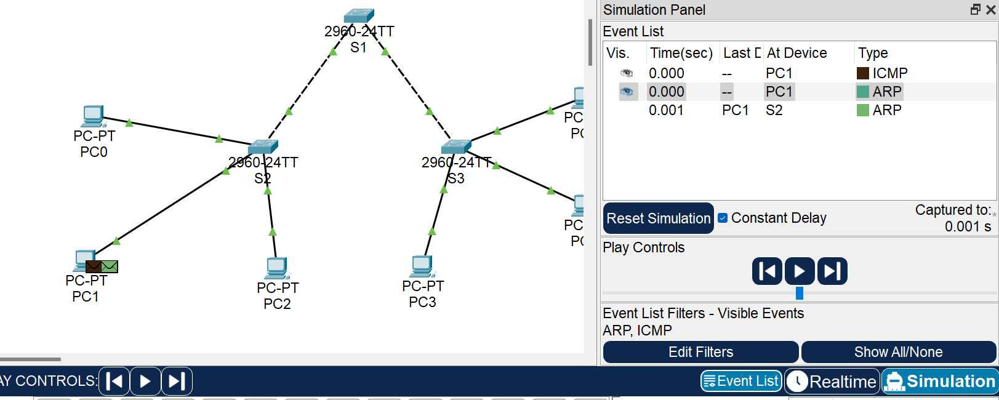
需要注意的是，虽然PC1被划入VLAN 10，但PC1处生成的只是一个普通的以太网帧，802.1Q 的帧并非在这里被封装。
可以看到，ARP广播帧首先被广播到S2，并由S2进一步播到PC0和S1，如下图所示。
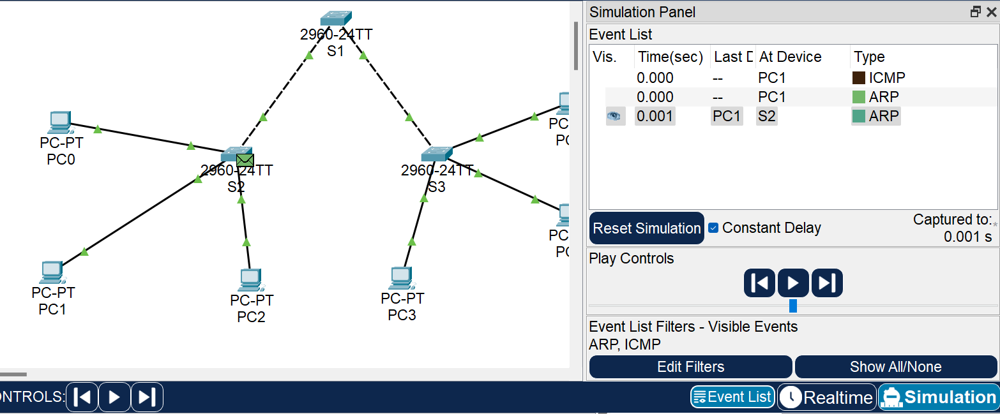
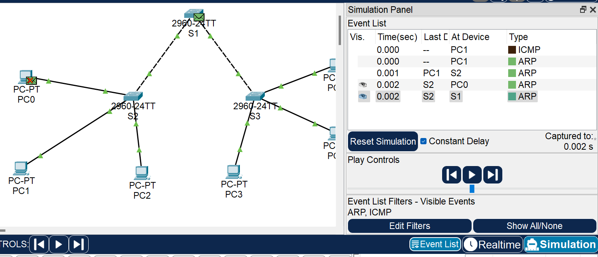

其中PC0处的帧被丢弃，广播到S1处的帧是802.1Q帧，即带 VLAN标记的帧，该帧在交换机S2转发前被封装，S2的入站帧和出站帧如下图所示。
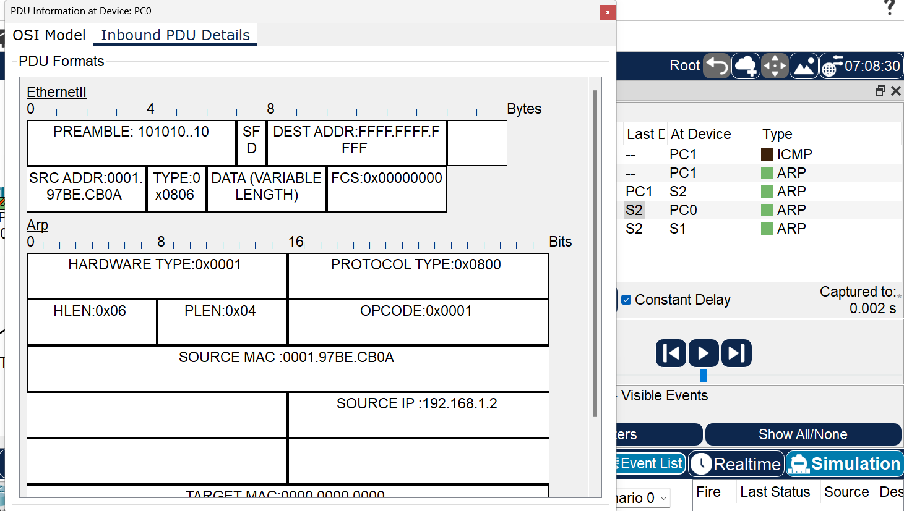
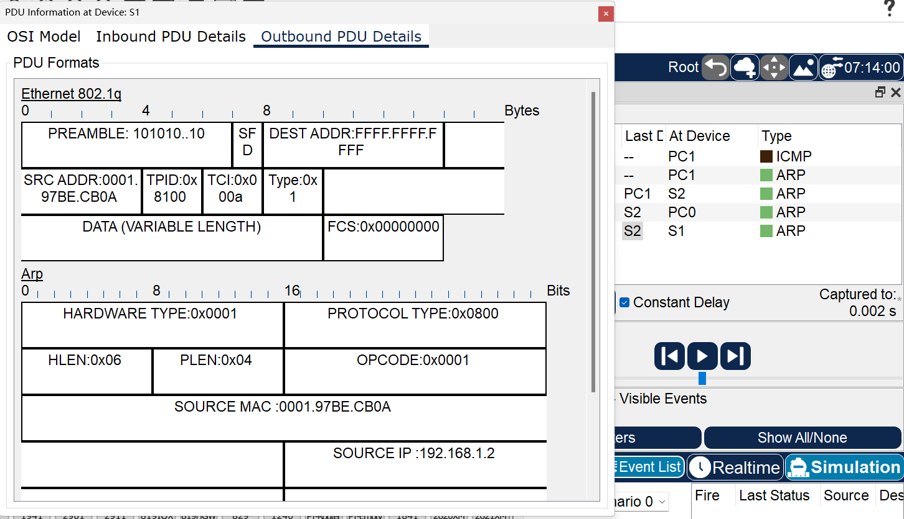

接着从S1被广播到S3，S3的入站帧是802.1Q帧，出站帧是普通以太网帧，被转发到PC3，请同学自行查看入站帧和出站帧并以如上方式截图。
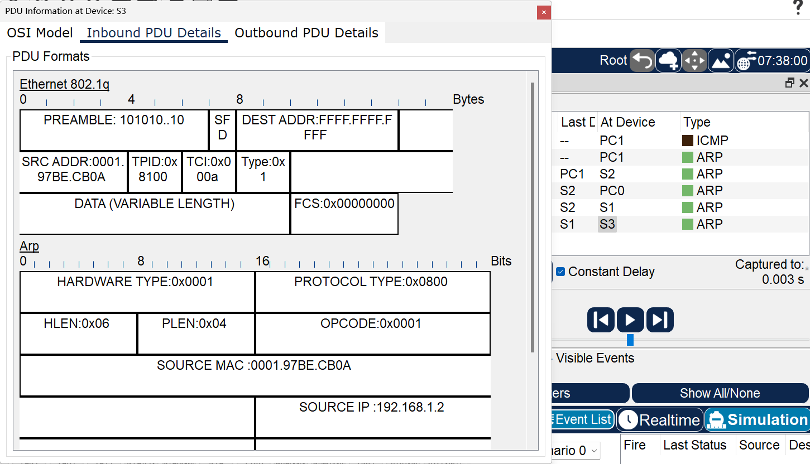
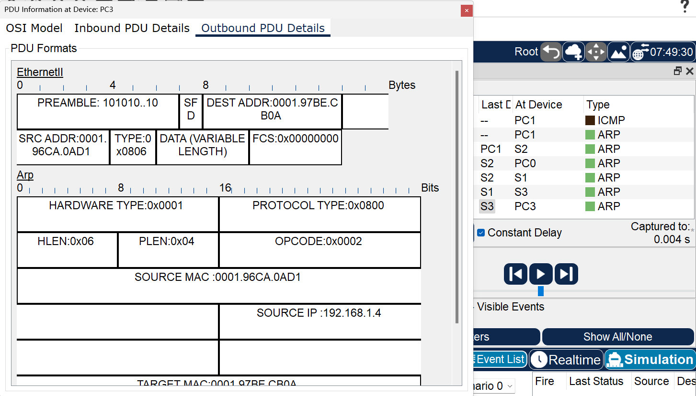
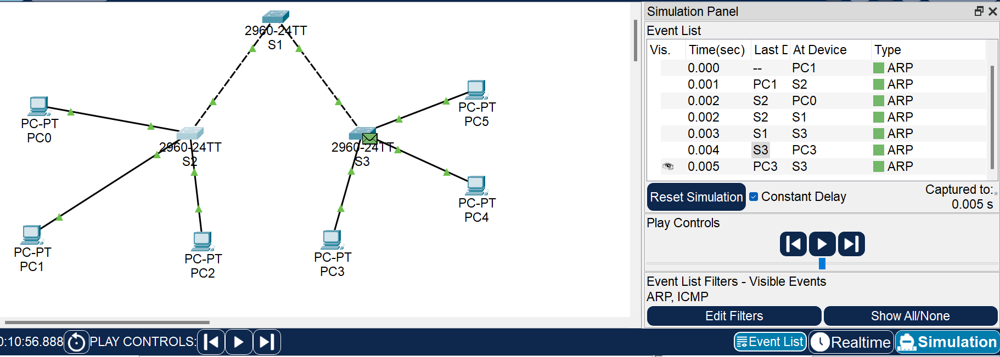

在这个过程中，交换机的广播都是按照VLAN 10的广播域来进行的。这里，PC0、PC1、PC3、S1、S2和S3都属于VLAN 10的广播域。

### 4、VLAN10的单播帧。
这里根据PC3返回的ARP单播帧来分析，观察单播帧被转发的情况。首先PC3生成；向PC1的MAC地址的以太网单播帧,如下图所示。
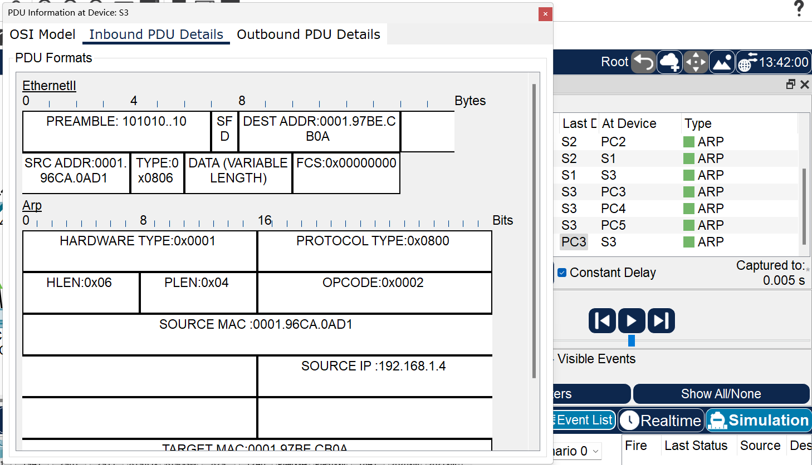

ARP单播帧到达前S3的转发表如下：
```
Switch#show mac-address-table
          Mac Address Table
-------------------------------------------

Vlan    Mac Address       Type        Ports
----    -----------       --------    -----

   1    0001.97be.cb0a    DYNAMIC     Gig0/2
   1    00d0.97b4.161a    DYNAMIC     Gig0/2
```

目的地址为PC1的MAC地址。
ARP单播帧到达前S1的转发表如下：
```
Switch#show mac-address-table
          Mac Address Table
-------------------------------------------

Vlan    Mac Address       Type        Ports
----    -----------       --------    -----

   1    0001.97be.cb0a    DYNAMIC     Gig0/1
   1    000c.85d9.631a    DYNAMIC     Gig0/2
   1    00e0.f77a.5b19    DYNAMIC     Gig0/1
```

可以看到，由于单播帧从S3的 VLAN 10端口进入，所以，各交换机都查找各自VLAN10的交换表，并按照交换表转发。ARP单播帧被S3转发到S1，接着被S1转发到S2，最后被转发到PC1。在此过程中，其他 VLAN 10 和 VLAN 20主机都收不到该单播帧。

### 5、VLAN 10向 VLAN 20发的单播帧。
这里由PC1向PC4 发单播帧，为封装PC1 ping PC4的单播帧，这里执行以下命令，将S3的Fa0/2端口先改为属于VLAN 10：
```
Switch(config)#
Switch(config)#int f0/2
Switch(config-if)#no switch access vlan 20
Switch(config-if)#switch access vlan 10
Switch(config-if)#
```

执行PC1 ping PC4的命令，由于PC4现在属于VLAN10，所以可以ping通。
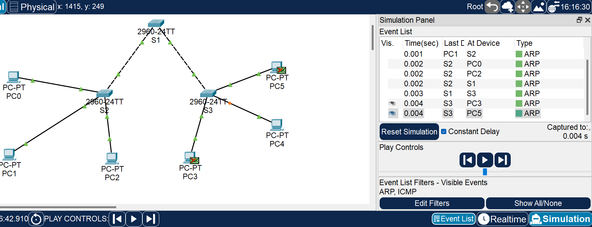

PC1将获得 PC4的MAC地址，该MAC地址被缓存在PC1的ARP缓存中，便于下次需要时封装。这样，在PC1处再次ping PC4时，就可以封装为一个目的地址为PC4的单播帧。
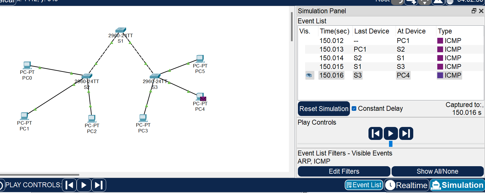

在S3中执行以下命令，将S3的Fa0/2端口再改回属于VLAN 20，并清空交换表。
```
S3(config-if)#no switch access vlan 10
S3(config-if)#switch access vlan 20
S3(config-if)#end
S3#
%SYS-5-CONFIG_I: Configured from console by console
clear mac-address-table
S3#
```

再次执行PC1 ping PC4的命令，可以看到，PC1处已封装了目的MAC地址为PC4地址的MAC帧，如下图所示。
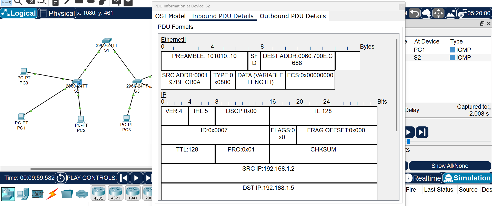

在模拟状态下观察ICMP协议，由于各交换机的交换表中没有对应的记录，所以该帧被交换机在VLAN 10中广播。显然，所有收到该帧的主机都会将其丢弃，而PC4则无法收到该帧。下图为PC3收到该帧后将其丢弃的情况。
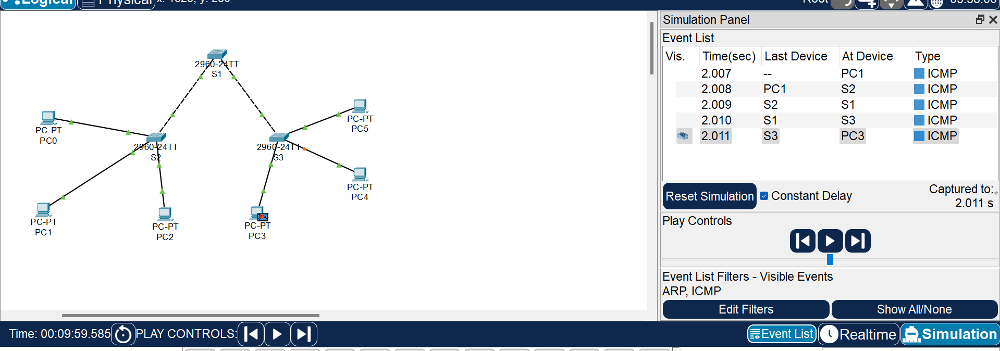

### 6、验证中继控制。
在S2中执行以下命令：
```
S2>en
S2#conf t
Enter configuration commands, one per line.  End with CNTL/Z.
S2(config)#int g0/1
S2(config-if)#switch trunk allowed vlan remove 10
S2(config-if)#
```
将VLAN 10从 trunk中移除，VLAN 10的帧无法从g0/1口通过。此时，由PC1去ping PC3，结果是不通的。请截图证明。
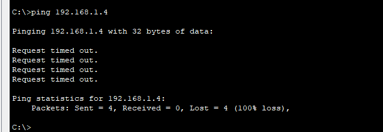

继续执行以下命令：
```
S2(config-if)#switch trunk allowed vlan add 10
S2(config-if)#
```

将VLAN 10添加到trunk中，VLAN 10的帧可以从g0/1口通过。
再由PC1去 ping PC3，结果可以ping 通。请截图证明。
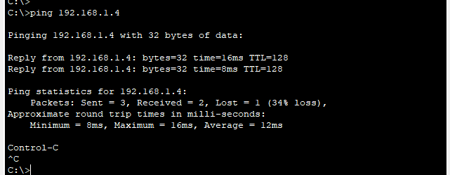

一个 VLAN就是一个广播域，所以在同一个 VLAN 内部，计算机之间的通信就是二层通信。如果计算机与目的计算机处在不同的VLAN 中,那么它们之间是无法进行二层通信的，只能进行三层通信来传递信息，我们将在后面的实验中解决这个问题。


