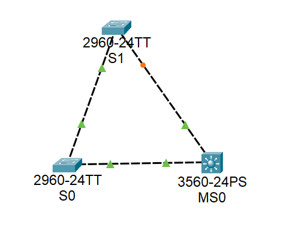

# 数据链路层6：生成树配置

## 实验目的
1. 理解生成树协议的目的和作用。
2. 掌握配置生成树协议。
3. 掌握调整生成树协议中交换机的优先级。


## 实验内容

### 1、生成树基础知识。
生成树协议（spanning-tree）主要用来解决交换网络中的环路问题，使同一个广播域中物理链路上形成的环路，在逻辑上无法形成环路，避免大量广播风暴的形成。另外，生成树还可以为交换网络提供冗余备份链路，该协议将交换网络中的冗余备份链路从逻辑上断开，当主链路出现故障时，能够自动切换到备份链路，保证数据的正常转发。
生成树协议版本：STP、RSTP（快速生成树协议)、MSTP（多生成树协议)。
生成树协议的缺点是收敛时间长。
快速生成树在生成树协议的基础上增加了两种端口角色，替换端口或备份端口，分别作为根端口和指定端口。当根端口或指定端口出现故障时，冗余端口可以直接切换到替换端口或备份端口上，从而实现RSTP协议小于1秒的快速收敛。

常用配置命令如表3-4所示。
表 常用配置命令
| 命令格式                               | 含义                                                          |
| -------------------------------------- | ------------------------------------------------------------- |
| show spanning-tree                     | 查看当前生成树协议信息                                        |
| spanning-tree vlan 1 priority 优先权值 | 设置设备VLAN1的优先级，其值为4096的倍数，数字越小，优先级越高 |
| spanning-tree vlan l root primary      | 将设备调整为VLAN1的根桥                                       |

### 2、实验流程
本实验观察并分析STP的信息，并调整设备优先级，使拓扑更为合理。实验流程如下图所示。


## 实验步骤

### 1、布置拓扑。
如下图所示，拓扑中包含3台交换机S0、S1和 MS0，交换机所有端口均属于VLAN 1，在同一个广播域中，由于在物理上形成了环路，Cisco交换机默认是打开STP的，在STP的作用下，MS0的Fa0/1端口被阻塞，不能进行转发。


### 2、查看交换机的STP信息。
交换机S0的STP信息：
```
Switch>en
Switch#show spanning-tree
VLAN0001
  Spanning tree enabled protocol ieee
  Root ID    Priority    32769
             Address     0006.2A35.5E7A
             This bridge is the root
             Hello Time  2 sec  Max Age 20 sec  Forward Delay 15 sec

  Bridge ID  Priority    32769  (priority 32768 sys-id-ext 1)
             Address     0006.2A35.5E7A
             Hello Time  2 sec  Max Age 20 sec  Forward Delay 15 sec
             Aging Time  20

Interface        Role Sts Cost      Prio.Nbr Type
---------------- ---- --- --------- -------- --------------------------------
Fa0/3            Desg FWD 19        128.3    P2p
Fa0/2            Desg FWD 19        128.2    P2p

Switch#
```

可以看出，S0中 Root ID和 Bridge ID 的地址相同，所以S0就是当前VLAN 1广播域中的根桥，其两个端口均处于转发状态。

交换机S1的STP信息如下：
```
Switch>en
Switch#show spanning-tree
VLAN0001
  Spanning tree enabled protocol ieee
  Root ID    Priority    32769
             Address     0006.2A35.5E7A
             Cost        19
             Port        2(FastEthernet0/2)
             Hello Time  2 sec  Max Age 20 sec  Forward Delay 15 sec

  Bridge ID  Priority    32769  (priority 32768 sys-id-ext 1)
             Address     000D.BD38.EA7C
             Hello Time  2 sec  Max Age 20 sec  Forward Delay 15 sec
             Aging Time  20

Interface        Role Sts Cost      Prio.Nbr Type
---------------- ---- --- --------- -------- --------------------------------
Fa0/2            Root FWD 19        128.2    P2p
Fa0/1            Altn BLK 19        128.1    P2p

Switch#
```

从以上信息可以看出，S1中 Root ID 和 Bridge ID 的地址不相同，所以S1不是当前VLA1广播域中的根桥，其Fa0/2端口是根端口，通往根桥，两个端口均处于转发状态。

交换机 MS0的STP信息如下：
```
Switch>en
Switch#show spanning-tree
VLAN0001
  Spanning tree enabled protocol ieee
  Root ID    Priority    32769
             Address     0006.2A35.5E7A
             Cost        19
             Port        3(FastEthernet0/3)
             Hello Time  2 sec  Max Age 20 sec  Forward Delay 15 sec

  Bridge ID  Priority    32769  (priority 32768 sys-id-ext 1)
             Address     0007.EC79.9D22
             Hello Time  2 sec  Max Age 20 sec  Forward Delay 15 sec
             Aging Time  20

Interface        Role Sts Cost      Prio.Nbr Type
---------------- ---- --- --------- -------- --------------------------------
Fa0/3            Root FWD 19        128.3    P2p
Fa0/1            Desg FWD 19        128.1    P2p

Switch#
```

显然，该三层交换机不是根桥，Fa0/3端口是根端口，通向根桥，而F0/1端口被阻塞，这样就形成一种逻辑上的树形结构，防止了环路。如果将Fa0/3端口shutdown，则 Fa0/2端口将从BLK状态切换到FWD 状态。这样，网络的实际拓扑就变成为如下图所示的结构。


### 3、调整优先级，使三层交换机MS0成为根桥。
在MS0中做如下配置，指定三层交换机为VLAN 1的根桥。
```
Switch#conf t
Enter configuration commands, one per line.  End with CNTL/Z.
Switch(config)#spanning-tree vlan 1 root primary
Switch(config)#exit
Switch#
%SYS-5-CONFIG_I: Configured from console by console
show spanning-tree
VLAN0001
  Spanning tree enabled protocol ieee
  Root ID    Priority    24577
             Address     0002.4A20.3489
             This bridge is the root
             Hello Time  2 sec  Max Age 20 sec  Forward Delay 15 sec

  Bridge ID  Priority    24577  (priority 24576 sys-id-ext 1)
             Address     0002.4A20.3489
             Hello Time  2 sec  Max Age 20 sec  Forward Delay 15 sec
             Aging Time  20

Interface        Role Sts Cost      Prio.Nbr Type
---------------- ---- --- --------- -------- --------------------------------
Fa0/1            Desg FWD 19        128.1    P2p
Fa0/3            Desg FWD 19        128.3    P2p

Switch#
```

执行上述命令后，再次查看生成树信息。

通过对比可以发现，MS0已经成为根桥，其优先级数字变小了，意味着优先级提高了。同时其两个端口都变为FWD状态。调整后的拓扑如下所示。可以看到，S1的Fa0/2变为阻塞状态。


也可以通过直接改变优先级数字来达到目的。比如，在MS0中执行如下命令也可将MS0改为根桥。
```
Switch(config)#spanning-tree vlan 1 priority 4096
```
