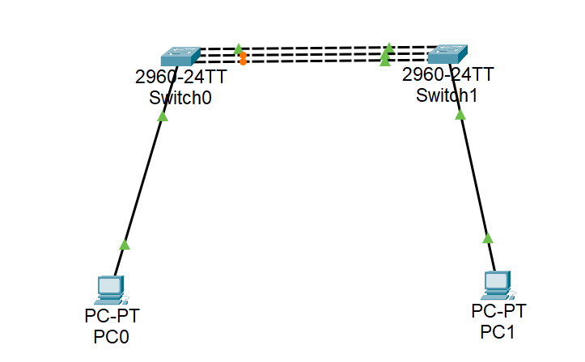
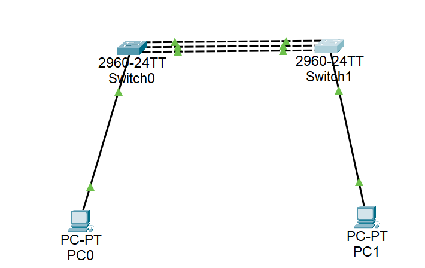
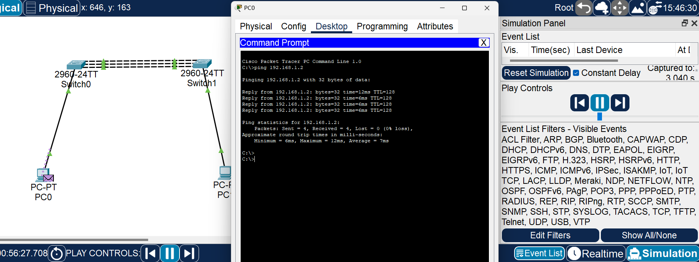

# 数据链路层7：以太通道配置

## 实验目的
1. 理解以太通道的目的和作用。
2. 掌握以太通道的要求和条件。
3. 掌握以太通道的配置。


## 实验内容

### 1、以太通道基础知识。
以太通道（EthernetChannel）是交换机将多个物理端口聚合成一个逻辑端口，可将其理解为一个端口。通过端口聚合，可以提高交换机间的带宽。例如，当2个100M带宽的端口聚合后，就可生成一个200M带宽的逻辑端口。在某种情况下，当带宽不够而又有多余端口时，可以通过聚合来满足需求，节省费用。
一个以太通道内的几个物理端口还可以实现负载均衡，当某个端口出现故障时，逻辑端口内的其他端口将自动承载其余的流量。
参与聚合的各端口必须具有相同的属性，如速率、trunk模式和单双工模式等。
端口聚合可以采用手工方式配置，也可使用动态协议来聚合。PAgP端口聚合协议是Cisco专有的协议，LACP协议是公共的标准。

常用配置命令如下表所示。
表 常用配置命令
| 命令格式                                                | 含义                                                                                                                                                                    |
| ------------------------------------------------------- | ----------------------------------------------------------------------------------------------------------------------------------------------------------------------- |
| interface port-channel 聚合逻辑端口号                   | 用来在全局配置模式下创建聚合端口号，如switch(config)#int port-channel 1，该命令创建聚合逻辑端口号1                                                                      |
| channel-group 聚合逻辑端口号 mode on{auto \| desirable} | 该命令在接口模式下用来应用聚合端口。有三种模式可选，其中auto表示交换机被动形成一个聚合端口，不发送 PAgP分组，是默认值。on表示不发送PAgP分组。desirable表示发送 PAgP分组 |
| port-channel load-balance 负载平衡方式                  | 可按源IP地址、目的IP地址、源MAC地址、目的MAC地址进行负载平衡                                                                                                            |
| show interfaces ethernetchannel                         | 用来查看以太通道状态                                                                                                                                                    |
| show ethernetchannel summary                            | 查看以太通道汇总信息                                                                                                                                                    |
### 2、实验流程


## 实验步骤

### 1、布置拓扑。
如下图所示，拓扑中两台交换机的Fa0/1、Fa0/2和Fa0/3三个端口分别对应连接，但只有一条链路是通的，这是因为生成树默认开启的原因，另两条链路被阻塞了。


### 2、配置以太通道。
通过配置以太通道，使连接交换机的3条链路全部起作用，如下图所示。
交换机Switch0：
```
Switch>en
Switch#conf t
Enter configuration commands, one per line.  End with CNTL/Z.
Switch(config)#int port-channel 5
Switch(config-if)#exit
Switch(config)#int range f0/1-3
Switch(config-if-range)#channel-group 5 mode on
Switch(config-if-range)#exit
Switch(config)#port-channel load-balance
% Incomplete command.
Switch(config)#port-channel load-balance src-mac
Switch(config)#int port-channel 5
Switch(config-if)#switch mode trunk

Switch(config-if)#
```

交换机Switch1：
```
Switch>en
Switch#conf t
Enter configuration commands, one per line.  End with CNTL/Z.
Switch(config)#int port-channel 5
Switch(config-if)#exit
Switch(config)#int range f0/1-3
Switch(config-if-range)#channel-group 5 mode on
Switch(config-if-range)#
%LINK-5-CHANGED: Interface Port-channel5, changed state to up

%LINEPROTO-5-UPDOWN: Line protocol on Interface Port-channel5, changed state to up

%EC-5-CANNOT_BUNDLE2: Fa0/3 is not compatible with Fa0/1 and will be suspended (dtp mode of Fa0/3 is off, Fa0/1is on)

%EC-5-CANNOT_BUNDLE2: Fa0/3 is not compatible with Fa0/2 and will be suspended (dtp mode of Fa0/3 is off, Fa0/2is on)

%LINEPROTO-5-UPDOWN: Line protocol on Interface FastEthernet0/3, changed state to down
exit
Switch(config)#port-channel load-balance src-mac
Switch(config)#int port-channel 5
Switch(config-if)#switch mode trunk

Switch(config-if)#
```



### 3、验证两台主机能否ping通。请截图。


### 4、查看以太通道的汇总信息。
交换机 Switch0的信息如下：
```
Switch>en
Switch#show etherchannel summary
Flags:  D - down        P - in port-channel
        I - stand-alone s - suspended
        H - Hot-standby (LACP only)
        R - Layer3      S - Layer2
        U - in use      f - failed to allocate aggregator
        u - unsuitable for bundling
        w - waiting to be aggregated
        d - default port


Number of channel-groups in use: 1
Number of aggregators:           1

Group  Port-channel  Protocol    Ports
------+-------------+-----------+----------------------------------------------

5      Po5(SU)           -      Fa0/1(P) Fa0/2(P) Fa0/3(P) 
Switch#
```
