# 物理层和数据链路层理解

## 一、【实验目的】
1. 查看本机的ip地址以及tcp/ip信息配置
2. 了解ping命令的基本使用和基本原理
3. 学会使用ipconfig来查看本机的信息并了解其参数的使用
4. 学会使用tracert，并了解其原理


## 二、【实验环境】
Windows dos


## 三、【实验要求】

### 1. 查看本机的ip地址信息以及TCP/IP配置并截图
```bat
ipconfig /all
```

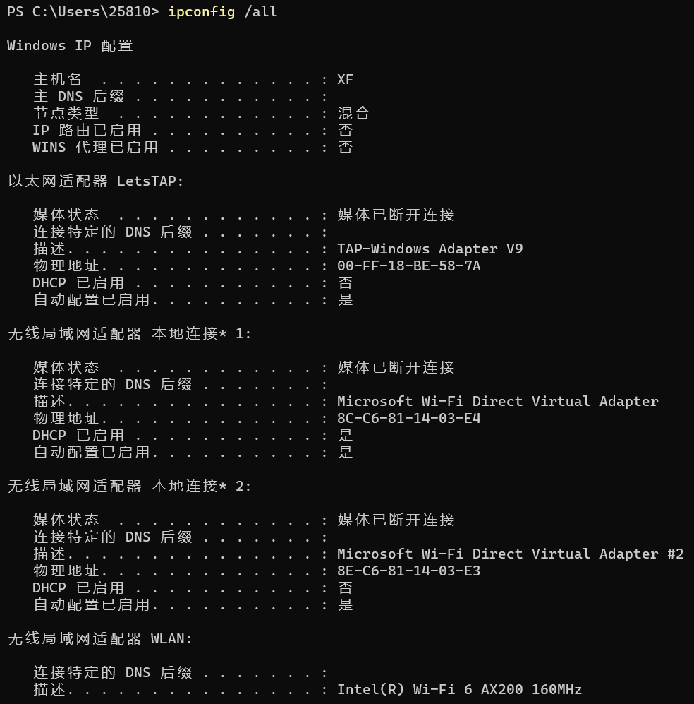

### 2. 说明ping命令的基本原理，然后分别ping回送地址（127.0.0.1）、本机地址、同一网段地址、远程的IP地址、以及网址截图并加以简单的说明
1. ping命令的基本原理
   - 简单来说，「ping」是用来探测本机与网络中另一主机之间是否可达的命令，如果两台主机之间ping不通，则表明这两台主机不能建立起连接。
   - ping命令是基于 ICMP 协议（Internet 控制报文协议（Internet Control MessageProtocol）来工作的。
   - ping命令会发送一份ICMP回显请求报文给目标主机，并等待目标主机返回ICMP回显应答。因为ICMP协议会要求目标主机在收到消息之后，必须返回ICMP应答消息给源主机，如果源主机在一定时间内收到了目标主机的应答，则表明两台主机之间网络是可达的。
2. ping回送地址（127.0.0.1）
    ```bat
    ping 127.0.0.1
    ```
    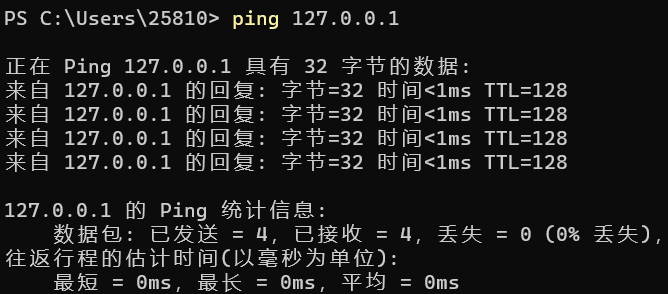
3. ping本机地址
    ```bat
    ping 192.168.43.215
    ```
    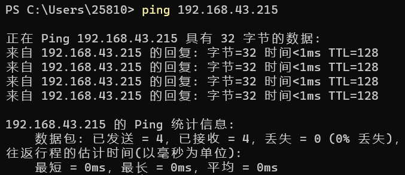
4. ping同一网段地址
    ```bat
    ping 192.168.43.187
    ```
    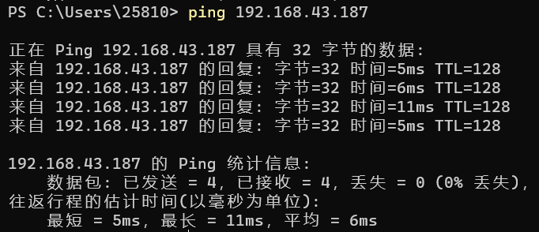
5. ping远程的ip地址
    ```bat
    ping 47.101.67.96
    ```
    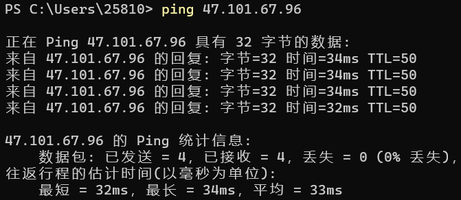
6. ping网址
    ```bat
    ping www.tcyhd.com
    ```
    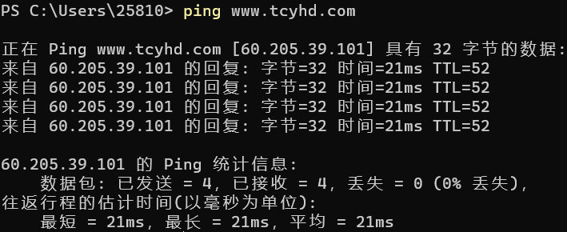

### 3. 使用ipconfig命令查看本机的信息并使用其参数查看信息并加以截图
1. ipconfig
    ```bat
    ipconfig
    ```
    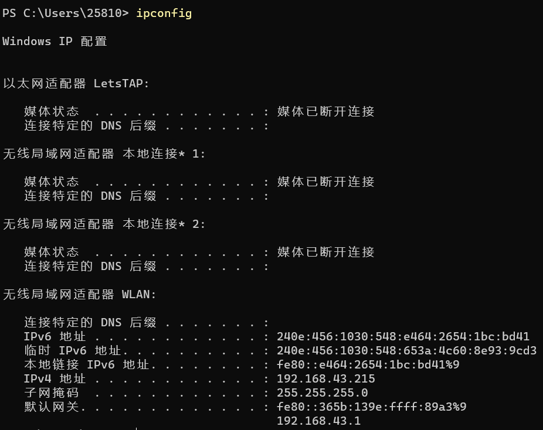
2. 参数: ?（帮助）
    ```bat
    ipconfig /?
    ```
    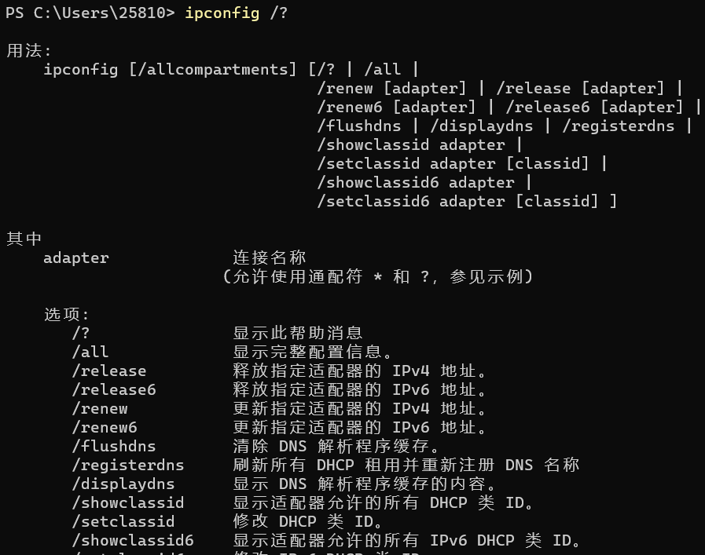
3. 参数: all
    ```bat
    ipconfig /all
    ```
    同【1. 查看本机的ip地址信息以及TCP/IP配置并截图】
4. 参数: displaydns
    ```bat
    ipconfig /displaydns
    ```
    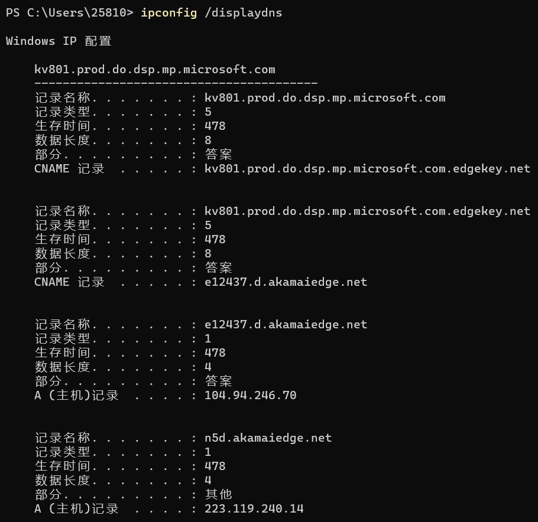
5. 参数: release
    ```bat
    ipconfig /release
    ```
    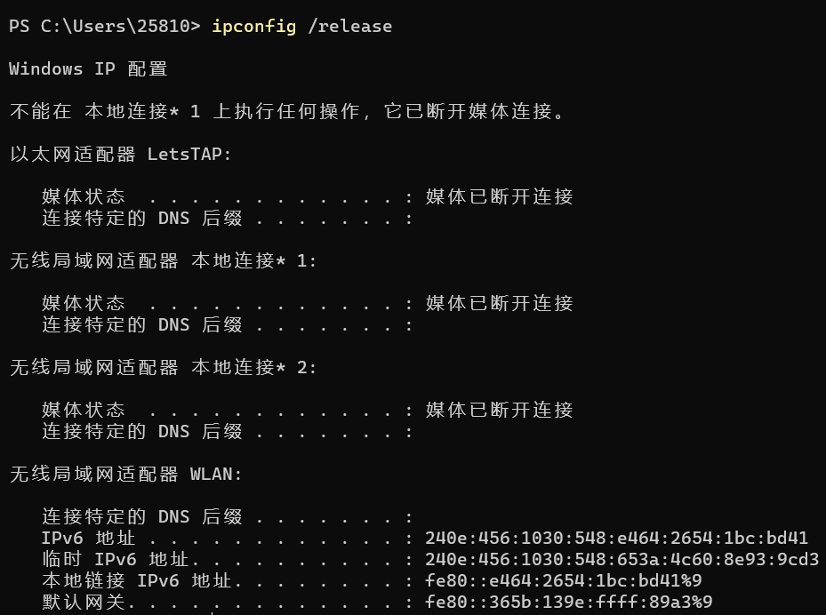

### 4. 说明tracert命令的原理，并跟踪本机地址、同一网段IP地址、不同网段IP地址、网址，返回结果截图并加以说明
1. tracert命令的原理: 
    Tracert命令诊断实用程序通过向目标计算机发送具有不同生存时间的ICMP数据包，来确定至目标计算机的路由，也就是说用来跟踪一个消息从一台计算机到另一台计算机所走的路径。
2. 跟踪本机地址: 
    ```bat
    tracert 192.168.43.215
    ```
    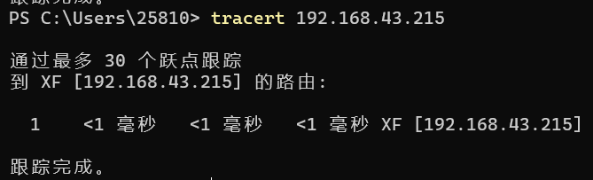
    由上图看出，经过一个节点跟踪到本机的路由，连接速度快。
3. 跟踪同一网段IP地址: 
    ```bat
    tracert 192.168.43.187
    ```
    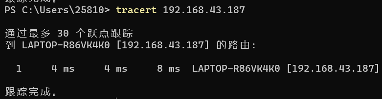
    由上图看出，经过一个节点跟踪到同一网段的路由，连接速度快。
4. 跟踪不同网段IP地址: 
    ```bat
    tracert 47.101.67.96
    ```
    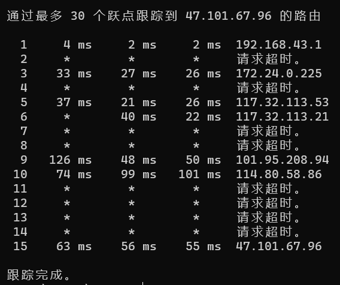
    由上图看出，经过多个节点跟踪到不同网段ip的路由，其中有几次连接超时，表示这个路由节点和当前我们使用的宽带，是无法联通的，速度较慢。
5. 跟踪网址: 
    ```bat
    tracert www.tcyhd.com
    ```
    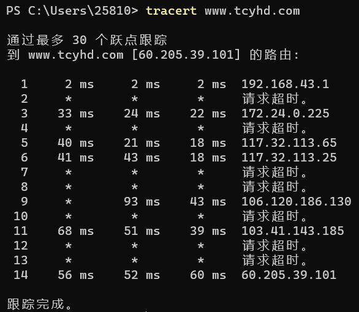
    由上图看出，经过多个节点跟踪到www.tcyhd.com网址，经过18个路由节点，其中有几次连接超时，表示这个路由节点和当前我们使用的宽带，是无法联通的，网络较稳定。
