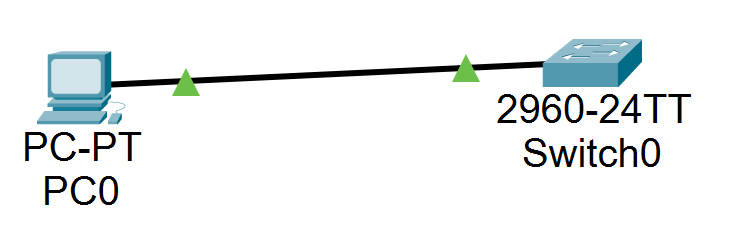
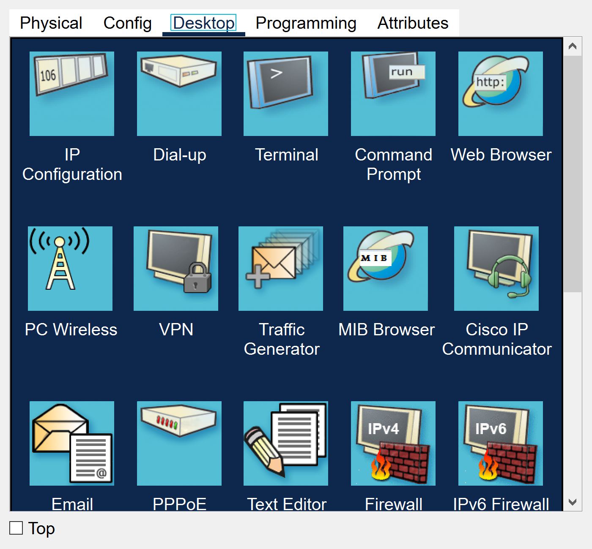
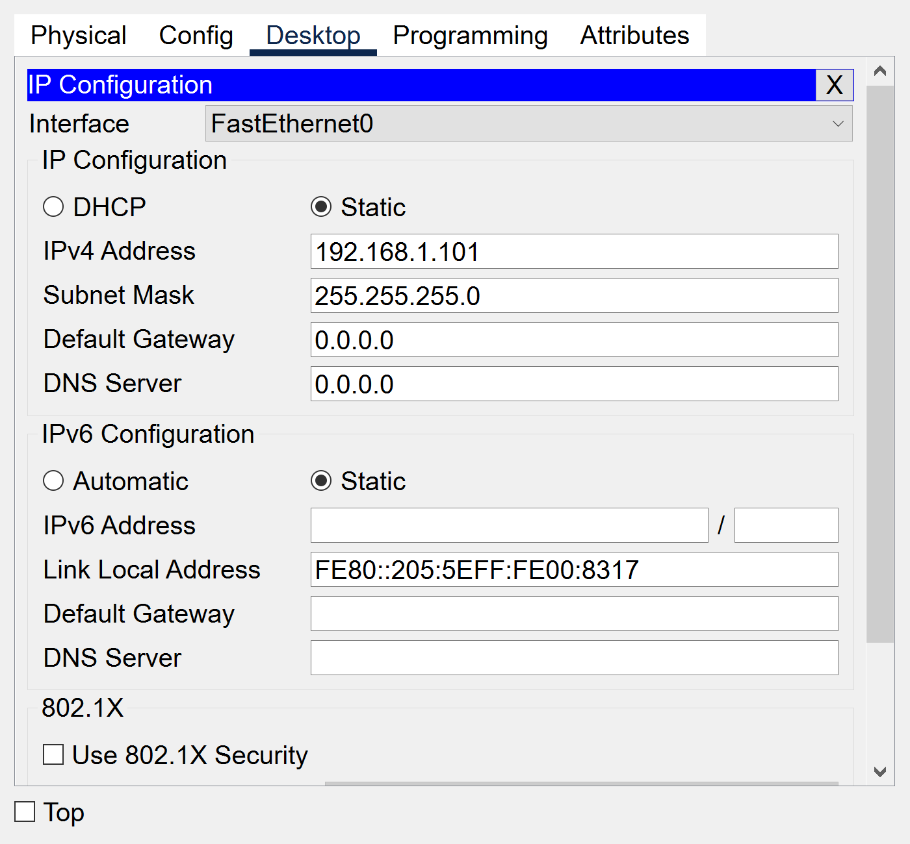
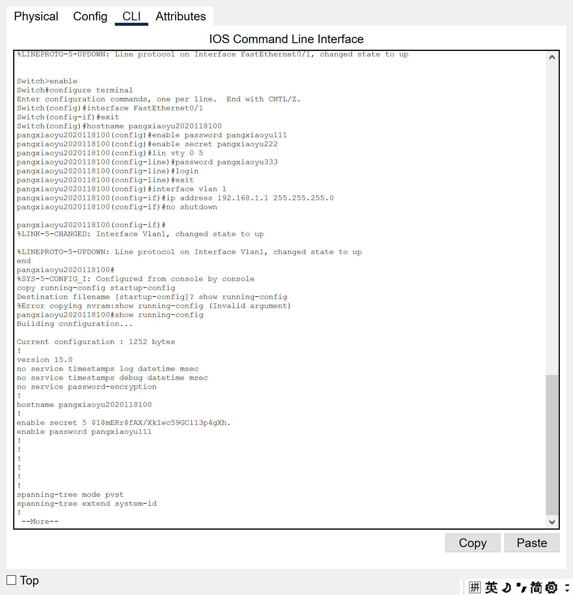
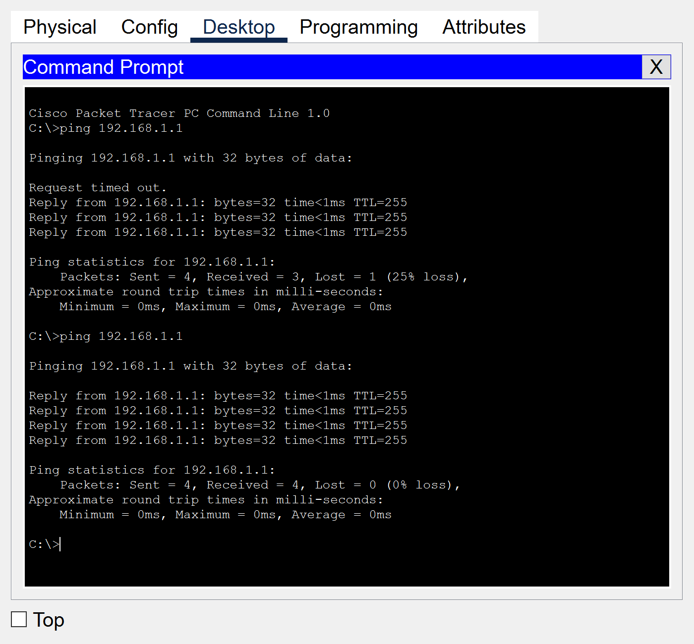

# 物理层：交换机初始配置及其Console端口配置

## 实验目的
1. 掌握通过Console端口对交换机进行配置的方法。
2. 理解并掌握交换机初始配置。


## 实验内容


## 实验步骤

### 1. 实验拓扑如图所示，计算机和交换机通过串行线连接起来。


### 2. 通过Console端口对交换机进行配置。
如图所示，在主机的Desktop（桌面）选项中，单机Terminal（终端）选项。在弹出的对话框中单击OK按钮，就可以登录到配置界面进行配置。



1. 先给PC1主机设置IP地址：
    
2. S1配置 
    ```
    Switch>enable
    Switch#
    Switch#configure terminal
    Enter configuration commands, one per line.  End with CNTL/Z.
    Switch(config)#interface FastEthernet0/1
    Switch(config-if)#exit
    //退出到全局配置模式
    Switch(config)#hostname S1
    （学生更换S1为：姓名学号，例如：zhangsan2019123456）
    //修改交换机主机名为S1（方便识别）
    S1(config)#enable password 111
    （学生更换password 111为：姓名 111，例如：zhangsan 111）
    //设置明文管理密码为111
    S1(config)#enable secret 222
    （学生更换secret 222为：姓名 222，例如：zhangsan 222）
    //设置加密密码为222（设置了加密密码后，明文将不会起作用）
    S1(config)#lin vty 0 5 
    //设置虚拟终端个数（一般为5个，最多为16个）
    S1(config-line)#password 333
    （学生更换password 333为：姓名 333，例如：zhangsan 333）
    //设置远程登录密码为333
    S1(config-line)#login
    //配置远程登录密码后必须要有login，如果没有的话则远程登录密码无效
    S1(config-line)#exit
    //返回上一级（全局配置模式）
    S1(config)#interface vlan 1
    //进入vlan 1 端口
    S1(config-if)#ip address 192.168.1.1 255.255.255.0
    //给vlan1配置ip地址，使PC1与S1可以Ping互通
    S1(config-if)#no shutdown
    //激活vlan 1 端口
    S1(config-if)#
    %LINK-5-CHANGED: Interface Vlan1, changed state to up
    end
    //返回特权模式
    S1#
    %SYS-5-CONFIG_I: Configured from console by console
    copy running-config startup-config
    //将配置保存（从内存RAM保存到硬盘NVRAM）
    Destination filename [startup-config]? show running-config
    S1#show running-config
    //查看交换机配置
    Building configuration...
    Current configuration : 1204 bytes
    !
    version 12.2
    no service timestamps log datetime msec
    no service timestamps debug datetime msec
    no service password-encryption
    !
    hostname S1
    !
    enable secret 5 $1$mERr$S2P5aSfXD02zDqYmOlcpu/
    enable password 111
    !
    !
    !
    !
    !
    !
    spanning-tree mode pvst
    spanning-tree extend system-id
    !
    --More--
    ```

    键入的内容：
    ```
    enable
    configure terminal
    interface FastEthernet0/1
    exit
    hostname pangxiaoyu2020118100
    enable password pangxiaoyu111
    enable secret pangxiaoyu222
    lin vty 0 5 
    password pangxiaoyu333
    login
    exit
    interface vlan 1
    ip address 192.168.1.1 255.255.255.0
    no shutdown
    end
    copy running-config startup-config
    show running-config
    show running-config
    ```
3. 进入到PC1主机命令行界面，检查是否互通： `ping 192.168.1.1`
    