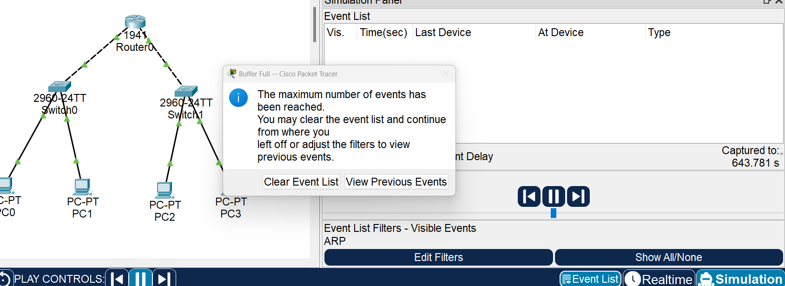

# 网络层1：路由器IP地址配置及直连网络

## 实验目的
1. 理解IP地址和路由器的直连网络。
2. 掌握路由器端口IP地址的配置方法。
3. 理解ARP协议的作用和工作方式。


## 实验内容

### 1、IP地址基础知识。
IP地址是网络层中使用的地址，不管网络层下面是什么网络，或是什么类型的接口，在网络层看来，它只是一个可以用IP地址代表的接口地址而已。网络层依靠IP地址和路由协议将数据报送到目的主机。既然是一个地址，那么一个IP地址就只能代表一个接口，否则会造成地址的二义性；接口则不同，一个接口可以配多个IP地址，这并不会造成地址的二义性。
路由器是互联网的核心设备，它在IP网络间转发数据报，这使得路由器的每个接口都连接一个或多个网络，而两个接口却不可以代表一个网络。路由器的一个配置了IP地址的接口所在的网络就是路由器的直连网络。对于直连网络，路由器并不需要额外对其配置路由，当其接口被激活后，路由器会自动将直连网络加入到路由表中。

常用配置命令如下表所示。
表 常用配置命令
| 命令格式                   | 含义                                                                        |
| -------------------------- | --------------------------------------------------------------------------- |
| ip address IP地址 子网掩码 | 在接口模式下给当前接口配置P地址，例如：ip address 192.168.1.1 255.255.255.0 |
| show ip route              | 在特权模式下查看路由器的路由表                                              |
| do show ip route           | 在非特权模式下查看路由器的路由表                                            |
| no shutdown                | 在接口模式下激活当前接                                                      |

### 2、ARP协议基础知识
互联网常被解释为“网络的网络”，其思想是把所有的网络都统一到一个网络中来，用一种统一的地址(IP地址)，在路由协议的作用下实现互联。但这里面有一个重要问题，互联网是基于IP网络去路由的，而被互联网连接起来的其他网络，比如以太网，它们内部是使用自已的MAC地址去寻址的，当到达一个以太网的网段时，就需要知道目的IP地址对应的MAC地址，这样，才能最终将数据包送到目的地。实际上，这样的过程一直存在。
ARP协议用来解决局域网内一个广播域中的IP地址和MAC地址的映射问题，其中ARP请求是广播分组，该广播域内的主机都可以收到，APP响应是单播分组，由响应主机接发给请求主机。
为了提高效率，避免ARP请求占用过多的网络资源，主机或路由器都设置有ARP高速缓存，用来将请求得到的映射保存起来，以备下次需要时直接使用。该缓存设有时间限制，防止因地址改变导致不能及时更新，造成发送失败的情况。
当然，如果源主机本身发送的就是广播分组，或双方使用的是点对点的链路，就无须发起 ARP请求了。
看下面的例子，两台主机经过了3台路由器连接，接口均使用快速以太网接口。由PC0到PC1的分组发送过程中共经历了4次ARP请求，如下图所示。在此过程中，源和目的IP地址是始终不变的，而源和目的MAC地址在不同的二层广播域中会改变。


### 3、实验流程


## 实验步骤

### 1、布置拓扑。
如下图所示，路由器连接了两个网络，通过g0/0端口连接网络192.168.1.0/24，通过g0/1端口连接网络192.168.2.0/24，这两个网络都属于路由器的直连网络。（提示：PC需要配置默认网关）


### 2、配置路由器的IP地址。
```
Router>enable
Router#configure terminal
Enter configuration commands, one per line.  End with CNTL/Z.
Router(config)#interface GigabitEthernet0/0
Router(config-if)#ip address 192.168.1.254 255.255.255.0
Router(config-if)#exit
Router(config)#interface GigabitEthernet0/1
Router(config-if)#ip address 192.168.2.254 255.255.255.0
Router(config-if)#end
Router#
%SYS-5-CONFIG_I: Configured from console by console
```

### 3、查看路由表。
```
Router#show ip route
Codes: L - local, C - connected, S - static, R - RIP, M - mobile, B - BGP
       D - EIGRP, EX - EIGRP external, O - OSPF, IA - OSPF inter area
       N1 - OSPF NSSA external type 1, N2 - OSPF NSSA external type 2
       E1 - OSPF external type 1, E2 - OSPF external type 2, E - EGP
       i - IS-IS, L1 - IS-IS level-1, L2 - IS-IS level-2, ia - IS-IS inter area
       * - candidate default, U - per-user static route, o - ODR
       P - periodic downloaded static route

Gateway of last resort is not set


Router#

//查看路由表，可以看到路由表是空的
```

### 4、激活端口。
```
//激活端口
Router#configure terminal
Enter configuration commands, one per line.  End with CNTL/Z.
Router(config)#interface GigabitEthernet0/1
Router(config-if)#no shutdown

Router(config-if)#
%LINK-5-CHANGED: Interface GigabitEthernet0/1, changed state to up

%LINEPROTO-5-UPDOWN: Line protocol on Interface GigabitEthernet0/1, changed state to up

Router(config-if)#exit
Router(config)#interface GigabitEthernet0/0
Router(config-if)#no shutdown

Router(config-if)#
%LINK-5-CHANGED: Interface GigabitEthernet0/0, changed state to up

%LINEPROTO-5-UPDOWN: Line protocol on Interface GigabitEthernet0/0, changed state to up
exit
Router(config)#
```

### 5、查看路由表，观察路由表的变化，注意C打头的路由条目为直连路由。
```
Router(config)#do show ip route
Codes: L - local, C - connected, S - static, R - RIP, M - mobile, B - BGP
       D - EIGRP, EX - EIGRP external, O - OSPF, IA - OSPF inter area
       N1 - OSPF NSSA external type 1, N2 - OSPF NSSA external type 2
       E1 - OSPF external type 1, E2 - OSPF external type 2, E - EGP
       i - IS-IS, L1 - IS-IS level-1, L2 - IS-IS level-2, ia - IS-IS inter area
       * - candidate default, U - per-user static route, o - ODR
       P - periodic downloaded static route

Gateway of last resort is not set

     192.168.1.0/24 is variably subnetted, 2 subnets, 2 masks
C       192.168.1.0/24 is directly connected, GigabitEthernet0/0    // 直连路由
L       192.168.1.254/32 is directly connected, GigabitEthernet0/0  // 路由器的IP
     192.168.2.0/24 is variably subnetted, 2 subnets, 2 masks
C       192.168.2.0/24 is directly connected, GigabitEthernet0/1
L       192.168.2.254/32 is directly connected, GigabitEthernet0/1

Router(config)#
```

### 6、查看端口信息。
```
Router#
%SYS-5-CONFIG_I: Configured from console by console

Router#show int g0/0
GigabitEthernet0/0 is up, line protocol is up (connected)
  Hardware is CN Gigabit Ethernet, address is 00d0.ffeb.9601 (bia 00d0.ffeb.9601)
  Internet address is 192.168.1.254/24
  MTU 1500 bytes, BW 1000000 Kbit, DLY 10 usec,
     reliability 255/255, txload 1/255, rxload 1/255
  Encapsulation ARPA, loopback not set
  Keepalive set (10 sec)
  Full-duplex, 100Mb/s, media type is RJ45
  output flow-control is unsupported, input flow-control is unsupported
  ARP type: ARPA, ARP Timeout 04:00:00, 
  Last input 00:00:08, output 00:00:05, output hang never
  Last clearing of "show interface" counters never
  Input queue: 0/75/0 (size/max/drops); Total output drops: 0
  Queueing strategy: fifo
  Output queue :0/40 (size/max)
  5 minute input rate 0 bits/sec, 0 packets/sec
  5 minute output rate 0 bits/sec, 0 packets/sec
     0 packets input, 0 bytes, 0 no buffer
     Received 0 broadcasts, 0 runts, 0 giants, 0 throttles
     0 input errors, 0 CRC, 0 frame, 0 overrun, 0 ignored, 0 abort
     0 watchdog, 1017 multicast, 0 pause input
     0 input packets with dribble condition detected
     0 packets output, 0 bytes, 0 underruns
     0 output errors, 0 collisions, 1 interface resets
     0 unknown protocol drops
     0 babbles, 0 late collision, 0 deferred
     0 lost carrier, 0 no carrier
     0 output buffer failures, 0 output buffers swapped out

Router#
```

### 7、验证连通性。
<!-- 不知道哪里除了幺蛾子，到这里显示的结果就不对了，老师也不讲。 -->
从主机端使用ping命令来测试网络的连通性。


另外，若把g0/1端口配置IP地址为192.168.1.3/24，则会弹出出错提示框，如下图所示，该IP和g0/0端口有重叠。也就是说，不同路由器端口所连接的不能是同一个网络。


### 8、重新配置相同的网络，切到模拟模式下，只选中ARP协议。
<!-- 重试了几次似乎也不行，血压上来了。 -->
由PC0 ping PC3，观察ARP分组的走向及结构，如下图所示。由于目的地址和源IP地址不在同一网络中，所以，PC0首先应将IP分组发送给自己的网关，即路由器。这样，PC0须通过ARP请求分组得到网关的MAC地址，用于发往网关的链路层封装。当PC0得到网关的MAC地址后，会将其添加到自己的ARP高速缓存中，在生存期内再次访问网关时，就不需要发出对网关的ARP请求了。


<!-- 不管那么多了，开摆 -->
此处PC0生成ARP请求分组，该分组将通过交换机被广播到PC1和路由器。PC1会将其丢弃，只有路由器会收下该请求分组，并做出响应，如下图所示。


路由器收下请求分组，将PC0的IP地址和MAC地址记入ARP高速缓存，并生成ARP的响应分组，将其以单播的形式发送给PC0，如下图所示。


PC0收到该响应分组后，就得到了网关（192.168.1.254）的MAC地址。接着主机封装网关的MAC地址，并将分组发送给网关，即路由器的g0/0端口。而路由器会查询路由表，分组将从g0/1端口被转发出去，这样，在g0/1端口处封装MAC帧时，就需要目的IP地址192.168.2.2的MAC地址。由于是第一次，其缓存中并没有保存该IP对应的MAC地址，所以，需要发出ARP请求分组来获得需要的MAC地址，如下图所示。观察该请求分组的广播域。


路由器的PC3处封装的ARP分组如下图所示。


