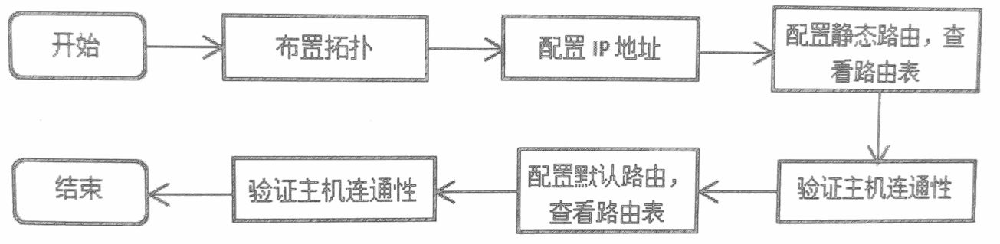
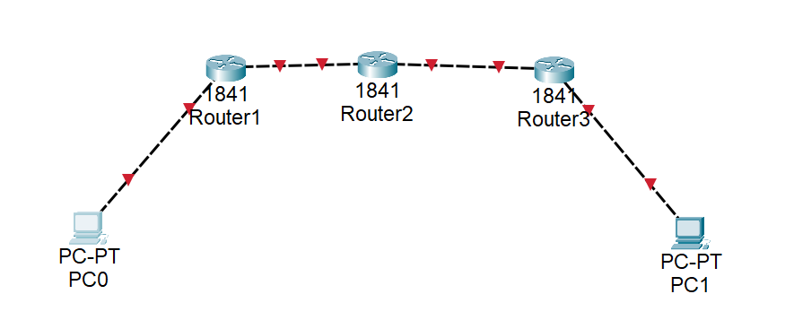
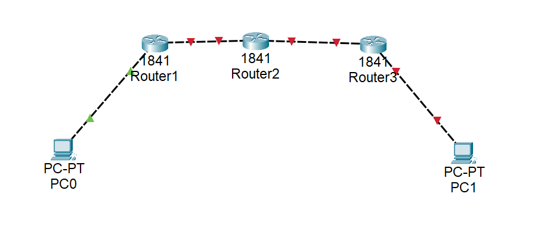
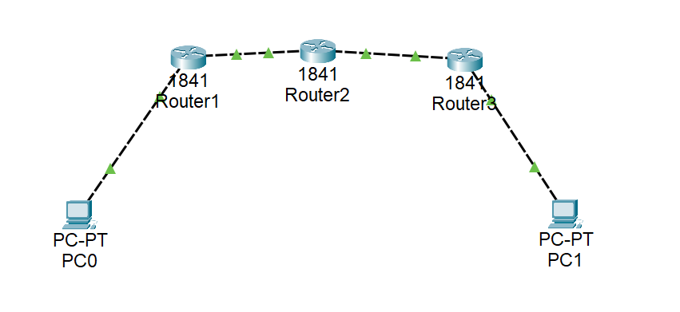
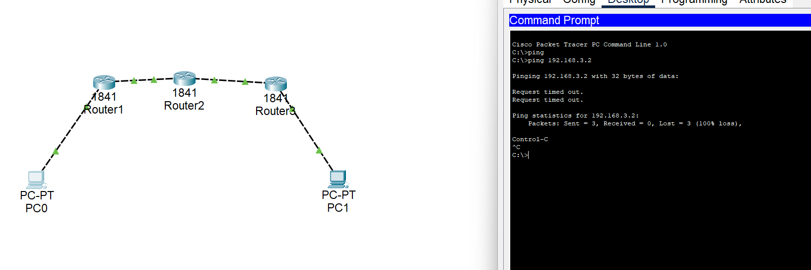
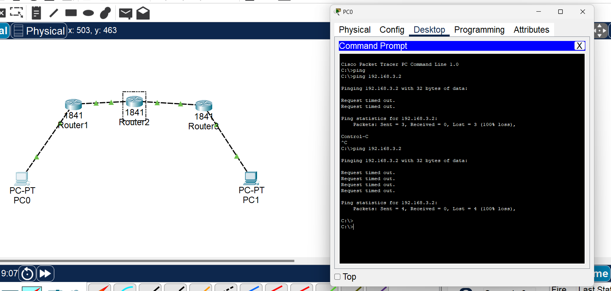

# 网络层2：静态路由与默认路由配置

## 实验目的
1. 理解静态路由的含义。
2. 掌握路由器静态路由的配置方法。
3. 理解默认路由的含义。
4. 掌握默认路由的配置方法。


## 实验内容

### 1、基础知识。
静态路由是指路由信息由管理员手工配置，而不是路由器通过路由算法和其他路由器学习得到。所以，静态路由主要适合网络规模不大、拓扑结构相对固定的网络使用,当网络环境比较复杂时,由于其拓扑或链路状态相对容易变化，就需要管理员再手工改变路由，这对管理员来说是一个烦琐的工作，且网络容易受人的影响，对管理员不论技术上还是纪律上都有更高的要求。
默认路由也是一种静态路由，它位于路由表的最后，当数据报与路由表中前面的表项都不匹配时，数据报将根据默认路由转发。这使得其在某些时候是非常有效的，例如在末梢网络中，默认路由可以大大简化路由器的项目数量及配置，减轻路由器和网络管理员的工作负担,可见,静态路由优先级高于默认路由。

常用配置命令如下所示。
- 配置静态路由格式：
    `Router(config)#ip route 目的网络号 目的网络掩码 下一跳IP地址`
- 配置默认路由格式：
    `Router(config)#ip route 0.0.0.0 0.0.0.0 下一跳IP地址`

### 2、实验流程
本实验配置静态路由和默认路由，要求各IP全部可达。实验流程如图所示。



## 实验步骤

### 1、布置拓扑。如下图所示，并按下表配置IP地址。

表 配置IP地址
| 设备名称 | 端口  | IP地址      | 默认网关    |
| -------- | ----- | ----------- | ----------- |
| 路由器R1 | Fa0/0 | 192.168.0.1 |
| 路由器R1 | Fa0/1 | 192.168.1.1 |
| 路由器R2 | Fa0/0 | 192.168.1.2 |
| 路由器R2 | Fa0/1 | 192.168.2.1 |
| 路由器R2 | Fa0/0 | 192.168.2.2 |
| 路由器R2 | Fa0/1 | 192.168.3.1 |
| PC1      | Fa0   | 192.168.0.2 | 192.168.0.1 |
| PC2      | Fa0   | 192.168.3.2 | 192.168.3.1 |

### 2、进入路由器R1的命令行界面，开启并设置端口IP：
```
Router>enable
Router#configure terminal
Enter configuration commands, one per line.  End with CNTL/Z.
Router(config)#interface FastEthernet0/0
Router(config-if)#no shutdown

Router(config-if)#
%LINK-5-CHANGED: Interface FastEthernet0/0, changed state to up

%LINEPROTO-5-UPDOWN: Line protocol on Interface FastEthernet0/0, changed state to up
ip address 192.168.0.1 255.255.255.0
Router(config-if)#exit
Router(config)#interface FastEthernet0/1
Router(config-if)#no shutdown

Router(config-if)#
%LINK-5-CHANGED: Interface FastEthernet0/1, changed state to up
ip address 192.168.1.1 255.255.255.0
Router(config-if)#
```


可以看到，键入命令“no shutdown”链接成功后会显示绿色。

### 3、进入路由器R2的命令行界面，开启并设置端口IP：
```
Router>enable
Router#configure terminal
Enter configuration commands, one per line.  End with CNTL/Z.
Router(config)#interface FastEthernet0/0
Router(config-if)#no shutdown

Router(config-if)#
%LINK-5-CHANGED: Interface FastEthernet0/0, changed state to up

%LINEPROTO-5-UPDOWN: Line protocol on Interface FastEthernet0/0, changed state to up
ip address 192.168.1.2 255.255.255.0
Router(config-if)#exit
Router(config)#interface FastEthernet0/1
Router(config-if)#no shutdown

Router(config-if)#
%LINK-5-CHANGED: Interface FastEthernet0/1, changed state to up
ip address 192.168.2.1 255.255.255.0
Router(config-if)#
```

### 4、进入路由器R3的命令行界面，开启并设置端口IP：
```
Router>enable
Router#conf t
Enter configuration commands, one per line.  End with CNTL/Z.
Router(config)#interface FastEthernet0/0
Router(config-if)#no shutdown

Router(config-if)#
%LINK-5-CHANGED: Interface FastEthernet0/0, changed state to up

%LINEPROTO-5-UPDOWN: Line protocol on Interface FastEthernet0/0, changed state to up
ip address 192.168.2.2 255.255.255.0
Router(config-if)#exit
Router(config)#interface FastEthernet0/1
Router(config-if)#no shutdown

Router(config-if)#
%LINK-5-CHANGED: Interface FastEthernet0/1, changed state to up

%LINEPROTO-5-UPDOWN: Line protocol on Interface FastEthernet0/1, changed state to up
ip address 192.168.3.1 255.255.255.0
Router(config-if)#
```

### 5、此时，拓扑上的各个连接点应该都是绿的。


### 6、静态路由配置
路由器R1配置：
```
Router(config)#ip route 192.168.2.0 255.255.255.0 192.168.1.2
Router(config)#ip route 192.168.3.0 255.255.255.0 192.168.2.2
```

路由器R2配置：
```
Router(config)#ip route 192.168.0.0 255.255.255.0 192.168.1.1
Router(config)#ip route 192.168.3.0 255.255.255.0 192.168.2.2
```

路由器R3配置：
```
Router(config)#ip route 192.168.1.0 255.255.255.0 192.168.2.1
Router(config)#ip route 192.168.0.0 255.255.255.0 192.168.1.1
```

### 7、进入PC1的命令提示符界面，ping一下PC2的IP：


<!-- 不出所料，果然还是失败了。发现室友也都无法顺利完成实验，那就不是我们的问题了。 -->
<!-- 话说这课程老师存在的意义是什么？连个课程群都没有，上课也不见老师，都是班长发任务，收作业。 -->

查看路由器的路由表，以R1为例，其中S开斗的为静态路由，C开头的为直连路由。
```
Router#show ip route
Codes: C - connected, S - static, I - IGRP, R - RIP, M - mobile, B - BGP
       D - EIGRP, EX - EIGRP external, O - OSPF, IA - OSPF inter area
       N1 - OSPF NSSA external type 1, N2 - OSPF NSSA external type 2
       E1 - OSPF external type 1, E2 - OSPF external type 2, E - EGP
       i - IS-IS, L1 - IS-IS level-1, L2 - IS-IS level-2, ia - IS-IS inter area
       * - candidate default, U - per-user static route, o - ODR
       P - periodic downloaded static route

Gateway of last resort is not set

C    192.168.0.0/24 is directly connected, FastEthernet0/0
C    192.168.1.0/24 is directly connected, FastEthernet0/1
S    192.168.2.0/24 [1/0] via 192.168.1.2
S    192.168.3.0/24 [1/0] via 192.168.2.2

Router#
```

R2的路由表：
```
Router#show ip route
Codes: C - connected, S - static, I - IGRP, R - RIP, M - mobile, B - BGP
       D - EIGRP, EX - EIGRP external, O - OSPF, IA - OSPF inter area
       N1 - OSPF NSSA external type 1, N2 - OSPF NSSA external type 2
       E1 - OSPF external type 1, E2 - OSPF external type 2, E - EGP
       i - IS-IS, L1 - IS-IS level-1, L2 - IS-IS level-2, ia - IS-IS inter area
       * - candidate default, U - per-user static route, o - ODR
       P - periodic downloaded static route

Gateway of last resort is not set

S    192.168.0.0/24 [1/0] via 192.168.1.1
C    192.168.1.0/24 is directly connected, FastEthernet0/0
C    192.168.2.0/24 is directly connected, FastEthernet0/1
S    192.168.3.0/24 [1/0] via 192.168.2.2

Router#
```

R3的路由表：
```
Router#show ip route
Codes: C - connected, S - static, I - IGRP, R - RIP, M - mobile, B - BGP
       D - EIGRP, EX - EIGRP external, O - OSPF, IA - OSPF inter area
       N1 - OSPF NSSA external type 1, N2 - OSPF NSSA external type 2
       E1 - OSPF external type 1, E2 - OSPF external type 2, E - EGP
       i - IS-IS, L1 - IS-IS level-1, L2 - IS-IS level-2, ia - IS-IS inter area
       * - candidate default, U - per-user static route, o - ODR
       P - periodic downloaded static route

Gateway of last resort is not set

S    192.168.0.0/24 [1/0] via 192.168.1.1
S    192.168.1.0/24 [1/0] via 192.168.2.1
C    192.168.2.0/24 is directly connected, FastEthernet0/0
C    192.168.3.0/24 is directly connected, FastEthernet0/1

Router#
```

### 8、默认路由配置。
对于路由器R1来说，其有两个直连网络，分别是192.168.0.0/24和 192.168.1.0/24，这两个网络不需要配置路由。通过前面的静态路由可知，R1 去 192.168.2.0/24和 192.168.3.0/24这两个网络的下一跳都是192.168.1.2，所以，这两个静态路由可以由一条指向192.168.1.2的默认路由代替。在前面配置的基础上，将静态路由删除（静态路由前面加 no)，再增加一条默认路由即可。
```
Router(config)#no ip route 192.168.2.0 255.255.255.0 192.168.1.2
Router(config)#no ip route 192.168.3.0 255.255.255.0 192.168.2.2
Router(config)#ip route 0.0.0.0 0.0.0.0 192.168.1.2
Router(config)#
```

路由器R3的配置参考R0。
```
Router(config)#no ip route 192.168.0.0 255.255.255.0 192.168.1.1
Router(config)#no ip route 192.168.1.0 255.255.255.0 192.168.2.1
Router(config)#ip route 0.0.0.0 0.0.0.0 192.168.2.1
```

由PC1 ping PC2，验证是否能ping通。

