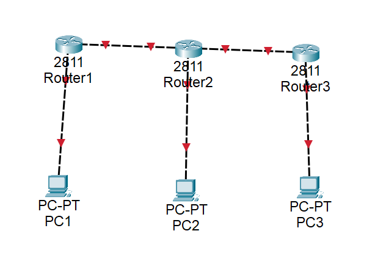
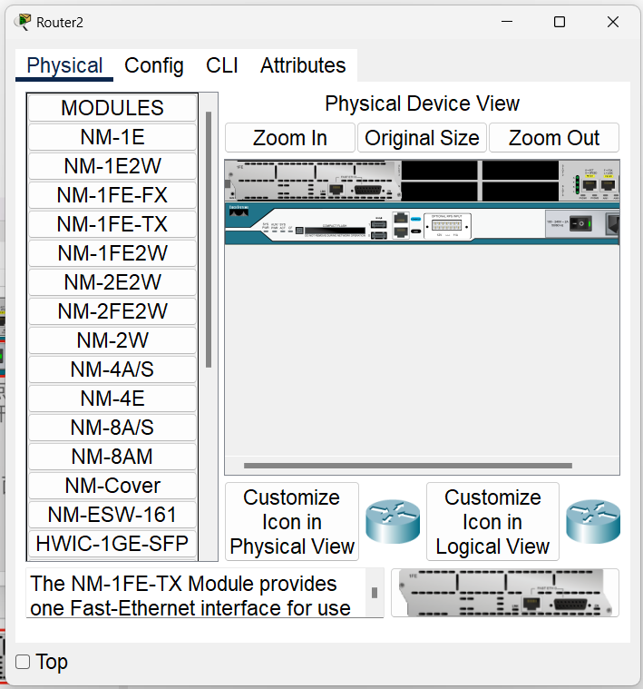
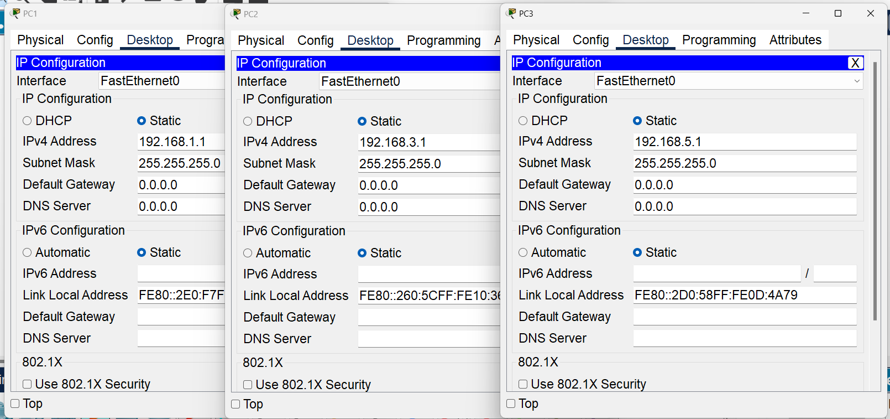
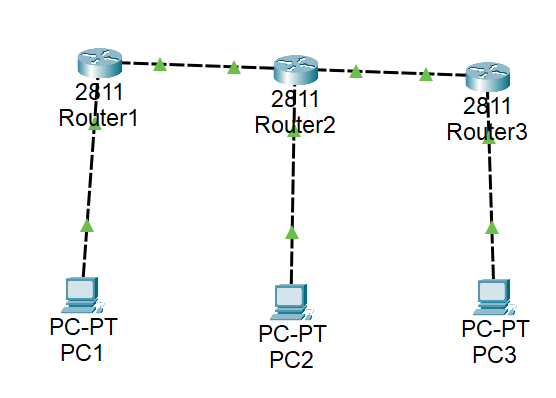
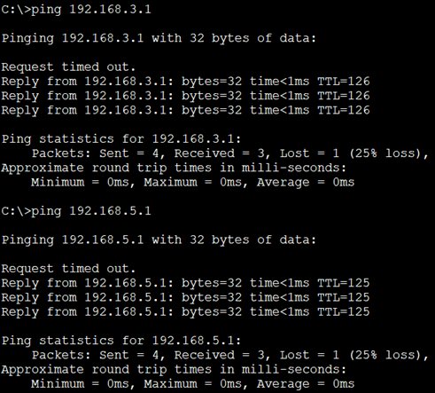
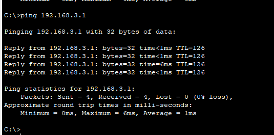

# 实验十三 网络层3：RIP路由协议配置

## 实验目的
1. 理解RIP路由的原理。
2. 掌握RIP路由的配置方法。


## 实验内容

### 1、基础知识。
RIP（Routing Information Protocols）属于内部网关协议（IGP)，用于一个自治系统内部，是一种基于距离向量的分布式的路由选择协议，实现简单，应用较为广泛。其中文名称由信息协议，但却很少被提及，更多的是被更为简洁的英文简称代替。
RIP是在20世纪70年代从美国的Xerox公司开发的早期协议——网关信息协议（GWINFO）中逐渐发展而来的，对应于RFC 1058，紧接着又开发了RIPv2协议和应用于IPv6的 RIPng协议，共三个版本。由于RIP不支持子网及跳数太少等原因，实际上常用的是RIPv2版本。可从以下几方面理解RIP的特点：
1. 在RIP协议中，距离最短的路由就是最好的路由。RIP协议对距离的度量是跳数，初始的直连路由距离为1，此后每经过一台路由器，跳数就加1，这样，经过的路由器数量越多，距离也就越长。RIP规定，一条路由最大的跳数为15，也就是最大距离为16，距离超出16的路由被认为不可达，会被删除。
2. RIP中路由的更新是通过定时广播实现的，接收对象为邻居。默认情况下，路由器每隔30秒向与它相连的网络广播自己的路由表，接到广播的路由器将收到的信息按一定算法添加到自身的路由表中。每个路由器都这样广播，最终网络上所有的路由器都会得知全部RIP范围的路由信息。
3. 环路的解决方法：在 RIP中也存在环路问题，如好消息传播得快，坏消息传播得慢。解决办法通常有以下几种：
   1. 定义最大跳数。比如将 TTL值设为16，如果分组陷入路由循环中，则跳数耗尽后就会被消灭，在RIP中就被视为网络不可达而被删除。
   2. 水平分割。水平分割即单向路由更新，它保证路由器记住每一条路由信息的来源，并且不在收到这条信息的端口上再次发送它，这是不产生路由循环的最基本措施。A从B处得到一个网络的路由信息，A不会向B更新该网络可以通过B到达的信息。这样，当该网络出现故障不可达时，B会将路由信息通告给A，而A则不会把可以通过B到达该网络的路由信息通告给B。如此便可以加快网络收敛，破坏路由环路。
   3. 路由毒化。当某直连网络发生故障时，路由器将其度量值标为无穷大，并将此路由信息通告给邻居，邻居再向其邻居通告，依次毒化各路由器，从而避免环路。
   4. 控制更新时间。也称抑制计时，当一条路田信息无效后，就在一段时间内使这条路由处于抑制状态，即不再接收关于相同目的地址得路由更新。显然，当一个网络频繁地在有效和无效间切换时，往往是有问题的，这时，将该网络的路田信息在一定时间内不更新, 可以增加网络的稳定性，避免路由振荡，是合理的。
4. RIPv1和 RIPv2的主要区别如下：
   1. RIPv1是有类路由协议，RIPv2是无类路由协议。
   2. RIPv1不能支持VLSM，RIPv2可以支持VLSM。
   3. RIPv1没有认证的功能，RIPv2可以支持认证，并且有明文和MD5两种认证。
   4. RIPv1没有手工汇总的功能，RIPv2可以在关闭自动汇总的前提下进行手工汇总。
   5. RIPv1是广播更新，RIPv2是组播更新。
   6. RIPv1对路由没有打标记的功能，RIPv2可以对路由打标记（tag），用于过滤和制订策略。
5. RIP协议常用配置命令。
表 常用配置命令
| 命令格式                | 含义                                         |
| ----------------------- | -------------------------------------------- |
| hostname路由器名称      | 配置路由器名称                               |
| router rip              | 启动RIP路由协议                              |
| version版本号           | 设置RIP版本，可为1或者2                      |
| network网络号           | 网络号应为路由器直连的网络号，是分类网络号   |
| debug ip rip            | 显示RIP路由的动态更新                        |
| auto-summary            | 路由汇总                                     |
| show ip protocols       | 显示路由协议配置与统计等信息                 |
| passive-interface端口名 | 将端口设置为被动端口，此端口不再发送路由信息 |

### 2、实验流程
实验流程如图所示。


## 实验步骤

### 1、RIPv1 实验步骤

#### （1）布置拓扑。如下图所示，并按下表配置IP地址。


提示：路由器R2需要添加一个端口（物理→NM-1FE-TX，关闭电源，把模块拖入设备，再打开电源）


表 配置IP地址
| 设备名称 | 端口  | IP地址           | 默认网关         |
| -------- | ----- | ---------------- | ---------------- |
| 路由器R1 | Fa0/0 | 192.168.1.254/24 |
|          | Fa0/1 | 192.168.2.1/24   |
| 路由器R2 | Fa0/0 | 192.168.3.254/24 |
|          | Fa0/1 | 192.168.2.2/24   |
|          | Fa1/0 | 192.168.4.1/24   |
| 路由器R3 | Fa0/0 | 192.168.5.254/24 |
|          | Fa0/1 | 192.168.4.2/24   |
| PC1      | Fa0   | 192.168.1.1/24   | 192.168.1.254/24 |
| PC2      | Fa0   | 192.168.3.1/24   | 192.168.3.254/24 |
| PC3      | Fa0   | 192.168.5.1/24   | 192.168.5.254/24 |

#### （2）进入路由器的命令行界面，开启并设置端口IP：
路由器R1：
```
Would you like to enter the initial configuration dialog? [yes/no]: no


Press RETURN to get started!


Router>enable
Router#conf t
Enter configuration commands, one per line.  End with CNTL/Z.
Router(config)#hostname S1
S1(config)#interface FastEthernet0/0
S1(config-if)#no shutdown

S1(config-if)#
%LINK-5-CHANGED: Interface FastEthernet0/0, changed state to up

%LINEPROTO-5-UPDOWN: Line protocol on Interface FastEthernet0/0, changed state to up

S1(config-if)#ip address 192.168.1.254 255.255.255.0
S1(config-if)#exit
S1(config)#interface FastEthernet0/1
S1(config-if)#no shutdown

S1(config-if)#
%LINK-5-CHANGED: Interface FastEthernet0/1, changed state to up

S1(config-if)#ip address 192.168.2.1 255.255.255.0
S1(config-if)#
```

路由器R2：
```
Would you like to enter the initial configuration dialog? [yes/no]: no


Press RETURN to get started!


Router>enable
Router#conf t
Enter configuration commands, one per line.  End with CNTL/Z.
Router(config)#hostname S2
S2(config)#interface FastEthernet0/0
S2(config-if)#no shutdown

S2(config-if)#
%LINK-5-CHANGED: Interface FastEthernet0/0, changed state to up

%LINEPROTO-5-UPDOWN: Line protocol on Interface FastEthernet0/0, changed state to up

S2(config-if)#ip address 192.168.3.254 255.255.255.0
S2(config-if)#exit
S2(config)#interface FastEthernet0/1
S2(config-if)#no shutdown

S2(config-if)#
%LINK-5-CHANGED: Interface FastEthernet0/1, changed state to up

%LINEPROTO-5-UPDOWN: Line protocol on Interface FastEthernet0/1, changed state to up

S2(config-if)#ip address 192.168.2.2 255.255.255.0
S2(config-if)#exit
S2(config)#interface FastEthernet1/0
S2(config-if)#no shutdown

S2(config-if)#
%LINK-5-CHANGED: Interface FastEthernet1/0, changed state to up

S2(config-if)#ip address 192.168.4.1 255.255.255.0
S2(config-if)#exit
S2(config)#
```

路由器R3：
```
Would you like to enter the initial configuration dialog? [yes/no]: no


Press RETURN to get started!


Router>enable
Router#conf t
Enter configuration commands, one per line.  End with CNTL/Z.
Router(config)#hostname S3
S3(config)#interface FastEthernet0/0
S3(config-if)#no shutdown

S3(config-if)#
%LINK-5-CHANGED: Interface FastEthernet0/0, changed state to up

%LINEPROTO-5-UPDOWN: Line protocol on Interface FastEthernet0/0, changed state to up

S3(config-if)#ip address 192.168.5.254 255.255.255.0
S3(config-if)#exit
S3(config)#interface FastEthernet0/1
S3(config-if)#no shutdown

S3(config-if)#
%LINK-5-CHANGED: Interface FastEthernet0/1, changed state to up

%LINEPROTO-5-UPDOWN: Line protocol on Interface FastEthernet0/1, changed state to up

S3(config-if)#ip address 192.168.4.2 255.255.255.0
S3(config-if)#exit
S3(config)#
```

（PC的IP请自行配置）


此时，链接会显示绿色：


#### （3）在路由器上配置RIPv1路由。
提示：在此之前，应当已经通过配置-接口页面配置好路由器的端口的IP地址，并在命令行界面对路由器进行命名（方法见前述实验）
配置R1的路由：
```
S1(config)#router rip
S1(config-router)#version 1
S1(config-router)#network 192.168.1.0
S1(config-router)#network 192.168.2.0
S1(config-router)#
```

配置R2的路由：
```
S2(config)#router rip
S2(config-router)#version 1
S2(config-router)#network 192.168.2.0
S2(config-router)#network 192.168.3.0
S2(config-router)#network 192.168.4.0
S2(config-router)#
```

配置R3的路由：
```
S3(config)#router rip
S3(config-router)#version 1
S3(config-router)#network 192.168.4.0
S3(config-router)#network 192.168.5.0
S3(config-router)#
```

#### （4）查看路由器的路由表。
查看R1的路由表：
```
S1#show ip route
Codes: L - local, C - connected, S - static, R - RIP, M - mobile, B - BGP
       D - EIGRP, EX - EIGRP external, O - OSPF, IA - OSPF inter area
       N1 - OSPF NSSA external type 1, N2 - OSPF NSSA external type 2
       E1 - OSPF external type 1, E2 - OSPF external type 2, E - EGP
       i - IS-IS, L1 - IS-IS level-1, L2 - IS-IS level-2, ia - IS-IS inter area
       * - candidate default, U - per-user static route, o - ODR
       P - periodic downloaded static route

Gateway of last resort is not set

     192.168.1.0/24 is variably subnetted, 2 subnets, 2 masks
C       192.168.1.0/24 is directly connected, FastEthernet0/0
L       192.168.1.254/32 is directly connected, FastEthernet0/0
     192.168.2.0/24 is variably subnetted, 2 subnets, 2 masks
C       192.168.2.0/24 is directly connected, FastEthernet0/1
L       192.168.2.1/32 is directly connected, FastEthernet0/1
R    192.168.3.0/24 [120/1] via 192.168.2.2, 00:00:23, FastEthernet0/1
R    192.168.4.0/24 [120/1] via 192.168.2.2, 00:00:23, FastEthernet0/1
R    192.168.5.0/24 [120/2] via 192.168.2.2, 00:00:23, FastEthernet0/1

S1#
```
在该拓扑中共有5个网络，路由汇总默认是开启的，也可以使用命令no auto-summary将自动汇总关闭。
查看路由器R1的RIP协议配置信息及RIP的一些参数：

```
S1#show ip protocols
Routing Protocol is "rip"
Sending updates every 30 seconds, next due in 1 seconds
Invalid after 180 seconds, hold down 180, flushed after 240

//RIP的时间参数
Outgoing update filter list for all interfaces is not set
Incoming update filter list for all interfaces is not set
Redistributing: rip
Default version control: send version 1, receive 1
  Interface             Send  Recv  Triggered RIP  Key-chain
  FastEthernet0/0       11
  FastEthernet0/1       11

//各接口发送和接受路由信息的统计次数
Automatic network summarization is in effect
Maximum path: 4
Routing for Networks:
	192.168.1.0
	192.168.2.0

//路由的网络号
Passive Interface(s):
Routing Information Sources:
	Gateway         Distance      Last Update
	192.168.2.2          120      00:00:19

//路由的源信息
Distance: (default is 120)
S1#
```

查看R2的路由表：
```
S2#show ip route
Codes: L - local, C - connected, S - static, R - RIP, M - mobile, B - BGP
       D - EIGRP, EX - EIGRP external, O - OSPF, IA - OSPF inter area
       N1 - OSPF NSSA external type 1, N2 - OSPF NSSA external type 2
       E1 - OSPF external type 1, E2 - OSPF external type 2, E - EGP
       i - IS-IS, L1 - IS-IS level-1, L2 - IS-IS level-2, ia - IS-IS inter area
       * - candidate default, U - per-user static route, o - ODR
       P - periodic downloaded static route

Gateway of last resort is not set

R    192.168.1.0/24 [120/1] via 192.168.2.1, 00:00:05, FastEthernet0/1
     192.168.2.0/24 is variably subnetted, 2 subnets, 2 masks
C       192.168.2.0/24 is directly connected, FastEthernet0/1
L       192.168.2.2/32 is directly connected, FastEthernet0/1
     192.168.3.0/24 is variably subnetted, 2 subnets, 2 masks
C       192.168.3.0/24 is directly connected, FastEthernet0/0
L       192.168.3.254/32 is directly connected, FastEthernet0/0
     192.168.4.0/24 is variably subnetted, 2 subnets, 2 masks
C       192.168.4.0/24 is directly connected, FastEthernet1/0
L       192.168.4.1/32 is directly connected, FastEthernet1/0
R    192.168.5.0/24 [120/1] via 192.168.4.2, 00:00:15, FastEthernet1/0

S2#
```
共5条路由，其中网络192.168.1.0/24和192.168.5.0/24是通过RIP学习得到的。

查看R3的路由表：
```
S3#show ip route
Codes: L - local, C - connected, S - static, R - RIP, M - mobile, B - BGP
       D - EIGRP, EX - EIGRP external, O - OSPF, IA - OSPF inter area
       N1 - OSPF NSSA external type 1, N2 - OSPF NSSA external type 2
       E1 - OSPF external type 1, E2 - OSPF external type 2, E - EGP
       i - IS-IS, L1 - IS-IS level-1, L2 - IS-IS level-2, ia - IS-IS inter area
       * - candidate default, U - per-user static route, o - ODR
       P - periodic downloaded static route

Gateway of last resort is not set

R    192.168.1.0/24 [120/2] via 192.168.4.1, 00:00:22, FastEthernet0/1
R    192.168.2.0/24 [120/1] via 192.168.4.1, 00:00:22, FastEthernet0/1
R    192.168.3.0/24 [120/1] via 192.168.4.1, 00:00:22, FastEthernet0/1
     192.168.4.0/24 is variably subnetted, 2 subnets, 2 masks
C       192.168.4.0/24 is directly connected, FastEthernet0/1
L       192.168.4.2/32 is directly connected, FastEthernet0/1
     192.168.5.0/24 is variably subnetted, 2 subnets, 2 masks
C       192.168.5.0/24 is directly connected, FastEthernet0/0
L       192.168.5.254/32 is directly connected, FastEthernet0/0

S3#
```

#### （5）查看RIP路由的动态更新。
查看R1的RIP动态更新：
```
S1#debug ip rip
RIP protocol debugging is on
S1#RIP: sending  v1 update to 255.255.255.255 via FastEthernet0/0 (192.168.1.254)
RIP: build update entries
      network 192.168.2.0 metric 1
      network 192.168.3.0 metric 2
      network 192.168.4.0 metric 2
      network 192.168.5.0 metric 3
RIP: sending  v1 update to 255.255.255.255 via FastEthernet0/1 (192.168.2.1)
RIP: build update entries
      network 192.168.1.0 metric 1
RIP: received v1 update from 192.168.2.2 on FastEthernet0/1
      192.168.3.0 in 1 hops
      192.168.4.0 in 1 hops
      192.168.5.0 in 2 hops
RIP: sending  v1 update to 255.255.255.255 via FastEthernet0/0 (192.168.1.254)
RIP: build update entries
      network 192.168.2.0 metric 1
      network 192.168.3.0 metric 2
      network 192.168.4.0 metric 2
      network 192.168.5.0 metric 3
RIP: sending  v1 update to 255.255.255.255 via FastEthernet0/1 (192.168.2.1)
RIP: build update entries
      network 192.168.1.0 metric 1
```

//从Fa0/1端口收到来自192.168.2.2（路由器R2）的RIPv1的更新包，内容如上所示
//通过Fa0/0端口广播发送生成的RIPv1的更新包，内客如上所示。请注意观察，这个更新包是路由器刚刚收到R2传来的更新包后，根据距离向量算法重新生成的路由，再将其转发给邻居。这个邻居在这里是PC1，实际上对于主机来说，并不需要收这样的路由更新。所以，可以将Fa0/0设置为被动接口，这样，路由器就不会从此接口发送路由更新了。但依旧可以接收更新包。比如：R1(confia-router)# passive-interface f0/0。运行此命令后，再次查看RIP的动态更新，将不会有从Fa0/0端口发送的更新，请自行验证

//通过Fa0/1端口广播发送生成的RIPv1的更新包，内客如上所示。请注意这里只有10.0.0.0一个条目，而从Fa0/0端口发送的是3个路由条目。之所以如此，是因为在RIP中为了防环路进行了水平分割

自行验证：
```
S1>enable
S1#conf t
Enter configuration commands, one per line. End with Ctrl/Z.
S1(config)#router rip
S1(config-router)#passive-interface f0/0
S1(config-router)#exit
S1(config)#exit
S1#
%SYS-5-CONFIG_I: Configured from console by console
S1#debug ip rip
RIP protocol debugging is on
S1#RIP: sending  v1 update to 255.255.255.255 via FastEthernet0/0 (192.168.1.254)
RIP: build update entries
      network 192.168.2.0 metric 1
      network 192.168.3.0 metric 2
      network 192.168.4.0 metric 2
      network 192.168.5.0 metric 3
RIP: sending  v1 update to 255.255.255.255 via FastEthernet0/1 (192.168.2.1)
RIP: build update entries
      network 192.168.1.0 metric 1
RIP: received v1 update from 192.168.2.2 on FastEthernet0/1
      192.168.3.0 in 1 hops
      192.168.4.0 in 1 hops
      192.168.5.0 in 2 hops
```

另外，路由更新信息会霸屏，不需要时应及时将其关闭，运行如下命令即可：
```
S1#no debug ip rip
RIP protocol debugging is off
```

请自行解释并验证路由器R2和R3的路由更新信息，如下。
查看R2的RIP动态更新：
```
S1#debug ip rip
RIP protocol debugging is on
S1#RIP: sending  v1 update to 255.255.255.255 via FastEthernet0/1 (192.168.2.1)
RIP: build update entries
      network 192.168.1.0 metric 1
RIP: received v1 update from 192.168.2.2 on FastEthernet0/1
      192.168.3.0 in 1 hops
      192.168.4.0 in 1 hops
      192.168.5.0 in 2 hops
RIP: sending  v1 update to 255.255.255.255 via FastEthernet0/1 (192.168.2.1)
RIP: build update entries
      network 192.168.1.0 metric 1
RIP: received v1 update from 192.168.2.2 on FastEthernet0/1
      192.168.3.0 in 1 hops
      192.168.4.0 in 1 hops
      192.168.5.0 in 2 hops
RIP: sending  v1 update to 255.255.255.255 via FastEthernet0/1 (192.168.2.1)
RIP: build update entries
      network 192.168.1.0 metric 1
RIP: received v1 update from 192.168.2.2 on FastEthernet0/1
      192.168.3.0 in 1 hops
      192.168.4.0 in 1 hops
      192.168.5.0 in 2 hops
RIP: sending  v1 update to 255.255.255.255 via FastEthernet0/1 (192.168.2.1)
RIP: build update entries
      network 192.168.1.0 metric 1
RIP: received v1 update from 192.168.2.2 on FastEthernet0/1
      192.168.3.0 in 1 hops
      192.168.4.0 in 1 hops
      192.168.5.0 in 2 hops
RIP: sending  v1 update to 255.255.255.255 via FastEthernet0/1 (192.168.2.1)
RIP: build update entries
      
```

//从Fa0/1端口收到来自192.168.2.1（路由器R1）的RIPv1的更新包，内容如上所示

//通过Fa0/1端口广播发送生成的RIPv1的更新包，内客如上所示。请注意观察，这个更新包是路由器刚刚收到R1传来的更新包后，根据距离向量算法重新生成的路由，再将其转发给邻居。

//通过Fa0/0端口广播发送生成的RIPv1的更新包，内客如上所示。


查看R3的RIP动态更新：

//从Fa0/1端口收到来自192.168.4.1（路由器R2）的RIPv1的更新包，内容如上所示

//通过Fa0/1端口广播发送生成的RIPv1的更新包。

//通过Fa0/0端口广播发送生成的RIPv1的更新包。

#### （6）由PC0去ping PC1和 PC2，可以 ping通，请自行验证。
<!-- 怎么回事，又ping不通，算了拿将以中的图吧。 -->
<!--  -->

<!-- 似乎发现了问题：之前都是只设置了IP地址没有设置网关，所以不行。 -->


<!-- 晨阳发现了这个问题，强！！！ -->
