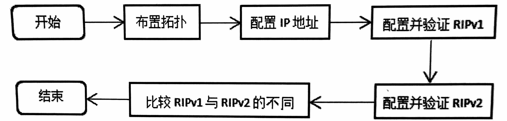
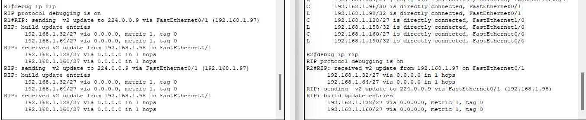
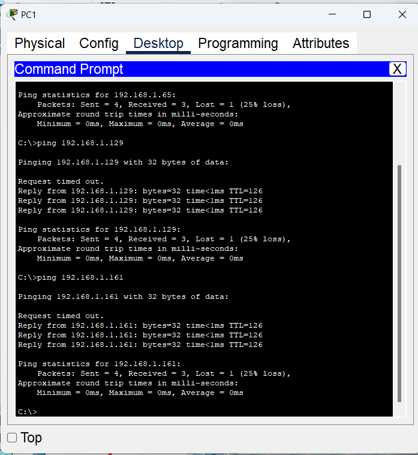
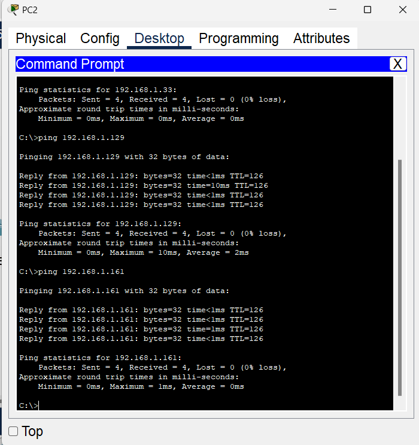
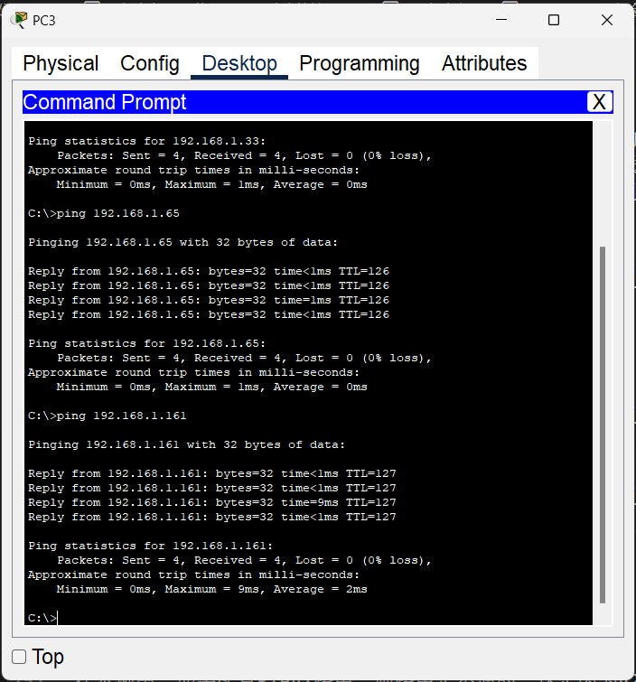
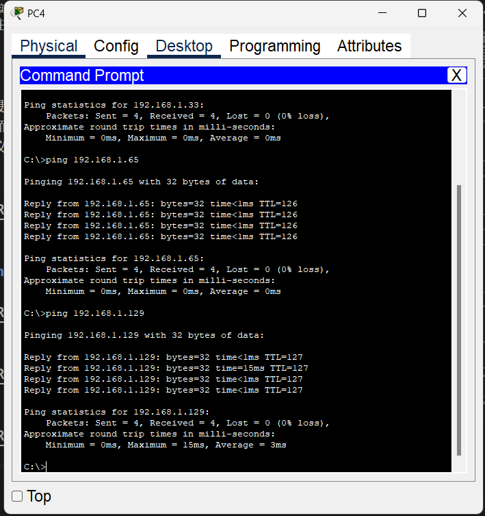

# 实验十四 网络层3：RIP路由协议配置2

## 实验目的
1. 理解RIP路由的原理。
2. 掌握RIP路由的配置方法。


## 实验内容

### 1、基础知识。
RIP（Routing Information Protocols）属于内部网关协议（IGP)，用于一个自治系统内部，是一种基于距离向量的分布式的路由选择协议，实现简单，应用较为广泛。其中文名称由信息协议，但却很少被提及，更多的是被更为简洁的英文简称代替。
RIP是在20世纪70年代从美国的Xerox公司开发的早期协议——网关信息协议（GWINFO）中逐渐发展而来的，对应于RFC 1058，紧接着又开发了RIPv2协议和应用于IPv6的 RIPng协议，共三个版本。由于RIP不支持子网及跳数太少等原因，实际上常用的是RIPv2版本。可从以下几方面理解RIP的特点：
1. 在RIP协议中，距离最短的路由就是最好的路由。RIP协议对距离的度量是跳数，初始的直连路由距离为1，此后每经过一台路由器，跳数就加1，这样，经过的路由器数量越多，距离也就越长。RIP规定，一条路由最大的跳数为15，也就是最大距离为16，距离超出16的路由被认为不可达，会被删除。
2. RIP中路由的更新是通过定时广播实现的，接收对象为邻居。默认情况下，路由器每隔30秒向与它相连的网络广播自己的路由表，接到广播的路由器将收到的信息按一定算法添加到自身的路由表中。每个路由器都这样广播，最终网络上所有的路由器都会得知全部RIP范围的路由信息。
3. 环路的解决方法：在 RIP中也存在环路问题，如好消息传播得快，坏消息传播得慢。解决办法通常有以下几种：
   1. 定义最大跳数。比如将 TTL值设为16，如果分组陷入路由循环中，则跳数耗尽后就会被消灭，在RIP中就被视为网络不可达而被删除。
   2. 水平分割。水平分割即单向路由更新，它保证路由器记住每一条路由信息的来源，并且不在收到这条信息的端口上再次发送它，这是不产生路由循环的最基本措施。A从B处得到一个网络的路由信息，A不会向B更新该网络可以通过B到达的信息。这样，当该网络出现故障不可达时，B会将路由信息通告给A，而A则不会把可以通过B到达该网络的路由信息通告给B。如此便可以加快网络收敛，破坏路由环路。
   3. 路由毒化。当某直连网络发生故障时，路由器将其度量值标为无穷大，并将此路由信息通告给邻居，邻居再向其邻居通告，依次毒化各路由器，从而避免环路。
   4. 控制更新时间。也称抑制计时，当一条路田信息无效后，就在一段时间内使这条路由处于抑制状态，即不再接收关于相同目的地址得路由更新。显然，当一个网络频繁地在有效和无效间切换时，往往是有问题的，这时，将该网络的路田信息在一定时间内不更新, 可以增加网络的稳定性，避免路由振荡，是合理的。
4. RIPv1和 RIPv2的主要区别如下：
   1. RIPv1是有类路由协议，RIPv2是无类路由协议。
   2. RIPv1不能支持VLSM，RIPv2可以支持VLSM。
   3. RIPv1没有认证的功能，RIPv2可以支持认证，并且有明文和MD5两种认证。
   4. RIPv1没有手工汇总的功能，RIPv2可以在关闭自动汇总的前提下进行手工汇总。
   5. RIPv1是广播更新，RIPv2是组播更新。
   6. RIPv1对路由没有打标记的功能，RIPv2可以对路由打标记（tag），用于过滤和制订策略。
5. RIP协议常用配置命令。
表 常用配置命令
| 命令格式                | 含义                                         |
| ----------------------- | -------------------------------------------- |
| hostname路由器名称      | 配置路由器名称                               |
| router rip              | 启动RIP路由协议                              |
| version版本号           | 设置RIP版本，可为1或者2                      |
| network网络号           | 网络号应为路由器直连的网络号，是分类网络号   |
| debug ip rip            | 显示RIP路由的动态更新                        |
| auto-summary            | 路由汇总                                     |
| show ip protocols       | 显示路由协议配置与统计等信息                 |
| passive-interface端口名 | 将端口设置为被动端口，此端口不再发送路由信息 |

### 2、实验流程
实验流程如图所示。


## 实验步骤

### 2、RIPv2实验步骤
为了体现与v1版本的区别，这里网络采用变长子网掩码来设计，拓扑中包含的5个网络如下表所示。
表 5个网络
| 网络地址      | 子网掩码        | 第一个IP地址  | 最后一个IP地址 |
| ------------- | --------------- | ------------- | -------------- |
| 192.168.1.32  | 255.255.255.224 | 192.168.1.33  | 192.168.1.62   |
| 192.168.1.64  | 255.255.255.224 | 192.168.1.65  | 192.168,1.94   |
| 192.168.1.96  | 255.255.255.252 | 192.168.1.97  | 192.168,1.98   |
| 192.168.1.128 | 255.255.255.224 | 192.168.1.129 | 192.168.1.158  |
| 192.168.1.160 | 255.255.255.224 | 192.168.1.161 | 192.168.1.190  |

#### （1）按下图布置拓扑，并配置IP地址。这里将PC的IP地址设为网络的第一个可用的IP地址，网关设为网络的最后一个可用地址。

连接两个路由器的网络为/30的地址，具体IP地址设置如下表所示。
表 配置IP地址
| 设备名称 | 端口  | IP地址           | 默认网关         |
| -------- | ----- | ---------------- | ---------------- |
| 路由器R1 | Fa0/0 | 192.168.1.62/27  |
|          | Fa0/1 | 192.168.1.97/30  |
|          | Fa1/0 | 192.168.1.94/27  |
| 路由器R2 | Fa0/0 | 192.168.1.190/27 |
|          | Fa0/1 | 192.168.1.98/30  |
|          | Fa1/0 | 192.168.1.158/27 |
| PC1      | Fa0   | 192.168.1.33/27  | 192.168.1.62/27  |
| PC2      | Fa0   | 192.168.1.65/27  | 192.168.1.94/27  |
| PC3      | Fa0   | 192.168.1.129/27 | 192.168.1.158/27 |
| PC4      | Fa0   | 192.168.1.161/27 | 192.168.1.190/27 |
配置R1的IP地址：
```
Router>enable
Router#conf t
Enter configuration commands, one per line.  End with CNTL/Z.
Router(config)#hostname R1
R1(config)#interface FastEthernet1/0
R1(config-if)#no shutdown

R1(config-if)#
%LINK-5-CHANGED: Interface FastEthernet1/0, changed state to up

%LINEPROTO-5-UPDOWN: Line protocol on Interface FastEthernet1/0, changed state to up

R1(config-if)#ip address 192.168.1.94 255.255.255.224
R1(config-if)#exit
R1(config)#interface FastEthernet0/0
R1(config-if)#no shutdown

R1(config-if)#
%LINK-5-CHANGED: Interface FastEthernet0/0, changed state to up

%LINEPROTO-5-UPDOWN: Line protocol on Interface FastEthernet0/0, changed state to up

R1(config-if)#ip address 192.168.1.62 255.255.255.224
R1(config-if)#exit
R1(config)#interface FastEthernet0/1
R1(config-if)#no shutdown

R1(config-if)#
%LINK-5-CHANGED: Interface FastEthernet0/1, changed state to up

R1(config-if)#ip address 192.168.1.97 255.255.255.252
R1(config-if)#
```

配置R2的IP地址：
```
Router>enable
Router#conf t
Enter configuration commands, one per line.  End with CNTL/Z.
Router(config)#hostname R2
R2(config)#interface FastEthernet0/1
R2(config-if)#ip address 192.168.1.98 255.255.255.252
R2(config-if)#no shutdown

R2(config-if)#
%LINK-5-CHANGED: Interface FastEthernet0/1, changed state to up

%LINEPROTO-5-UPDOWN: Line protocol on Interface FastEthernet0/1, changed state to up

R2(config-if)#exit
R2(config)#interface FastEthernet1/0
R2(config-if)#ip address 192.168.1.158 255.255.255.224
R2(config-if)#no shutdown

R2(config-if)#
%LINK-5-CHANGED: Interface FastEthernet1/0, changed state to up

%LINEPROTO-5-UPDOWN: Line protocol on Interface FastEthernet1/0, changed state to up

R2(config-if)#exit
R2(config)#interface FastEthernet0/0
R2(config-if)#ip address 192.168.1.190 255.255.255.224
R2(config-if)#no shutdown

R2(config-if)#
%LINK-5-CHANGED: Interface FastEthernet0/0, changed state to up

%LINEPROTO-5-UPDOWN: Line protocol on Interface FastEthernet0/0, changed state to up

R2(config-if)#
```

#### （2）在路由器上配置RIPv1路由。
配置R1的路由：
```
R1(config-if)#exit
R1(config)#router rip
R1(config-router)#version 2
R1(config-router)#network 192.168.1.32
R1(config-router)#network 192.168.1.64
R1(config-router)#network 192.168.1.96
R1(config-router)#no auto-summary
R1(config-router)#passive-interface f0/0
R1(config-router)#passive-interface f1/0
R1(config-router)#
```

配置R2的路由：
```
R2(config-if)#exit
R2(config)#router rip
R2(config-router)#version 2
R2(config-router)#network 192.168.1.96
R2(config-router)#network 192.168.1.128
R2(config-router)#network 192.168.1.160
R2(config-router)#no auto-summary
R2(config-router)#passive-interface f0/0
R2(config-router)#passive-interface f1/0
R2(config-router)#
```

这里将两台路由器RIP的自动汇总关闭（默认是开启的），并设置连接主机的两个接口为被动接口，不向主机发送RIP路由更新分组。
#### （3）查看路由器的路由表。
R1的路由表：
```
R1#show ip route
Codes: L - local, C - connected, S - static, R - RIP, M - mobile, B - BGP
       D - EIGRP, EX - EIGRP external, O - OSPF, IA - OSPF inter area
       N1 - OSPF NSSA external type 1, N2 - OSPF NSSA external type 2
       E1 - OSPF external type 1, E2 - OSPF external type 2, E - EGP
       i - IS-IS, L1 - IS-IS level-1, L2 - IS-IS level-2, ia - IS-IS inter area
       * - candidate default, U - per-user static route, o - ODR
       P - periodic downloaded static route

Gateway of last resort is not set

     192.168.1.0/24 is variably subnetted, 8 subnets, 3 masks
C       192.168.1.32/27 is directly connected, FastEthernet0/0
L       192.168.1.62/32 is directly connected, FastEthernet0/0
C       192.168.1.64/27 is directly connected, FastEthernet1/0
L       192.168.1.94/32 is directly connected, FastEthernet1/0
C       192.168.1.96/30 is directly connected, FastEthernet0/1
L       192.168.1.97/32 is directly connected, FastEthernet0/1
R       192.168.1.128/27 [120/1] via 192.168.1.98, 00:00:08, FastEthernet0/1
R       192.168.1.160/27 [120/1] via 192.168.1.98, 00:00:08, FastEthernet0/1

R1#
```

R2的路由表：
```
R2#show ip route
Codes: L - local, C - connected, S - static, R - RIP, M - mobile, B - BGP
       D - EIGRP, EX - EIGRP external, O - OSPF, IA - OSPF inter area
       N1 - OSPF NSSA external type 1, N2 - OSPF NSSA external type 2
       E1 - OSPF external type 1, E2 - OSPF external type 2, E - EGP
       i - IS-IS, L1 - IS-IS level-1, L2 - IS-IS level-2, ia - IS-IS inter area
       * - candidate default, U - per-user static route, o - ODR
       P - periodic downloaded static route

Gateway of last resort is not set

     192.168.1.0/24 is variably subnetted, 8 subnets, 3 masks
R       192.168.1.32/27 [120/1] via 192.168.1.97, 00:00:00, FastEthernet0/1
R       192.168.1.64/27 [120/1] via 192.168.1.97, 00:00:00, FastEthernet0/1
C       192.168.1.96/30 is directly connected, FastEthernet0/1
L       192.168.1.98/32 is directly connected, FastEthernet0/1
C       192.168.1.128/27 is directly connected, FastEthernet1/0
L       192.168.1.158/32 is directly connected, FastEthernet1/0
C       192.168.1.160/27 is directly connected, FastEthernet0/0
L       192.168.1.190/32 is directly connected, FastEthernet0/0

R2#
```

通过查看路由表可知，两台路由器的路由表均包含5个网络，其中3个是直连网络，另外2个是通过RIP得到的。
#### （4）查看RIP路由的动态更新。
R1的路由动态更新：
//从FastEthernet0/1口收到RIPv2的更新分组，注意是/27的网络
//使用组播发送自己的路由信息分组，而v1版本是通过广播发送的。注意更新分组，RIP使用了水平切割。另外，由于将连接主机的接口定义为被动接口，所以此处没有发往主机的路由更新分组

R2的路由动态更新：


请自行分析R2中的路由动态更新。
#### （5）此时,主机间两两都可以ping通，请自行验证。
PC1：


PC2：


PC3：


PC4：


在本例中，如果配置RIPv1路由，则路由是不通的，这是因为v2版本支持 VLSM（变长子网掩码），而v1版本不支持VLSM。如果将网络192.168.1.96/30改为网络192.168.1.96/27，由于5个网络的掩码位数均相同，所以，不管使用v1版本还是v2版本，网络都是通的。

