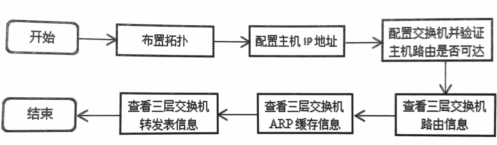
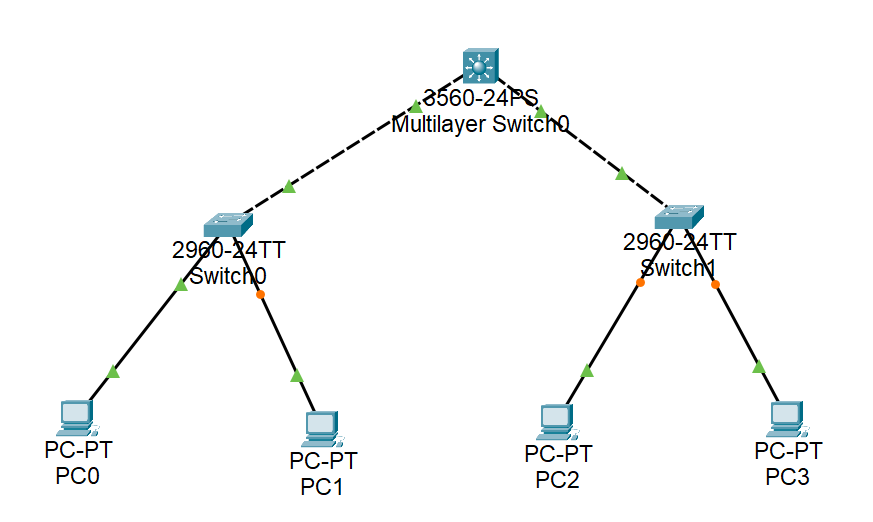
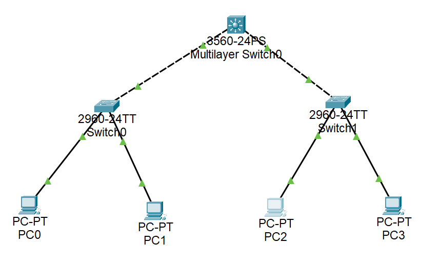
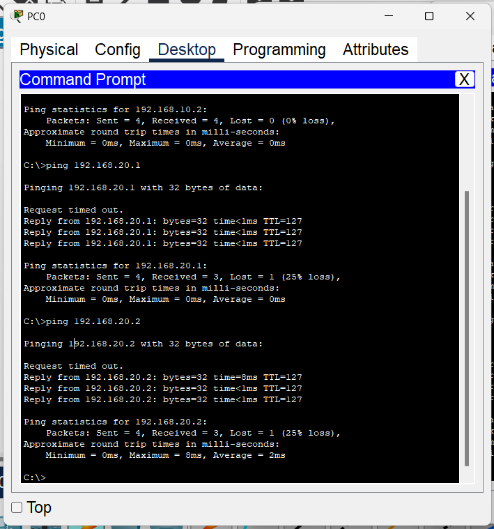
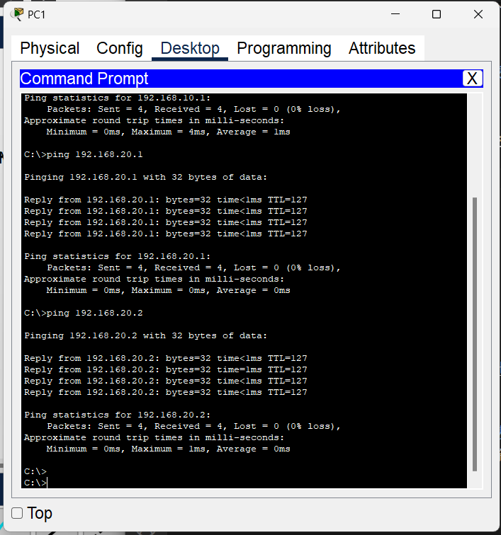
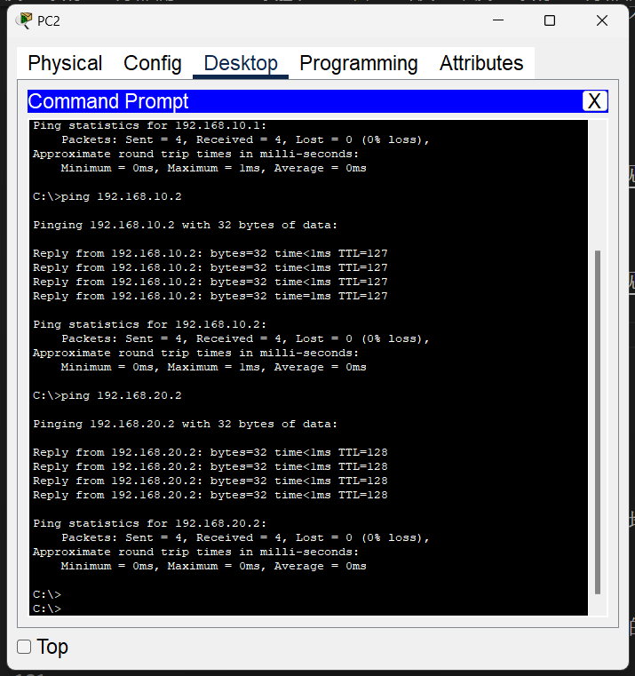
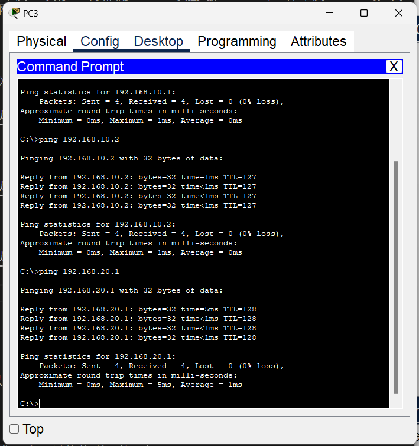

# 实验十五 网络层4：用以太网三层交换机实现VLAN间路由配置

## 实验目的
1. 理解三层（第三层)交换机的功能。
2. 理解三层交换机中SVI（交换虚拟接口）的含义。
3. 掌握利用三层交换机实现VLAN间的路由。


## 实验内容

### 1、基础知识。
二层（第二层）交换机是利用MAC地址表进行转发操作的，而三层交换机是一个带有路由功能的二层交换机，是二者的结合。这里的三层意思就是网络层，其优势是在网络模型中的第三层实现数据包的高速转发。三层交换技术的出现，解决了企业网划分子网之后，子网之间必须依赖路由器进行通信的问题，多用于企业网内部。
当目的IP与源IP不在同一个三层网段时，发送方会向网关请求ARP解析,这个网关往往是三层交换机里的一个地址，三层交换模块会运用其路由功能，找到下一跳的MAC地址，一方面将该地址保存，并将其发送给请求方，另一方面将该MAC地址发送到二层交换引擎的 MAC 地址表中，这样，以后就可以进行高速的二层转发了。所以，三层交换机有时被描述为“一次路由，多次交换”。
在实际组网中，一个 VLAN对应一个三层的网段，三层交换机采用SVI（交换虚拟接口）的方式实现 VLAN间互连。SVI是指交换机中的虚拟接口，对应一个VLAN，并且配置IP地址，将其作为该VLAN对应网段的网关，其作用类似于路由口。

常用配置命令如下所示。
表 常用配置命令
| 命令格式                             | 含义                         |
| ------------------------------------ | ---------------------------- |
| interface vlan虚拟局域网号           | 进入SVI配置模式              |
| switchport trunk encapsulation dot1q | 端口模式下用 dot1q封装该端口 |
| show arp                             | 查看交换机ARP缓存            |
| show mac address-table               | 查看交换机交换表             |
| ip routing                           | 开启交换机路由功能           |

### 2、实验流程



## 实验步骤

### 1、布置拓扑，如下图所示，网络中共划分为两个三层网段，分别对应两个 VLAN，这种情况下二层交换机是无法配通的，这里利用三层交换机使两个网段互通。
<!--  -->
<!-- 等一会就绿了 -->


其IP地址配置如表所示。（PC的IP地址请自行配置）
表 配置IP地址
| 设备名称  | 端口           | IP地址          | VLAN  | 网关           |
| --------- | -------------- | --------------- | ----- | -------------- |
| 交换机MS0 | VLAN 10（SVI） | 192.168.10.254  | 10    |                |
| 交换机MS0 | VLAN 20（SVI） | 192.168.20.254  | 20    |                |
| 交换机MS0 | Gig0/1         |                 | trunk |                |
| 交换机MS0 | Gig0/2         |                 | trunk |                |
| 交换机S0  | Gig0/1         |                 | trunk |                |
| 交换机S0  | Fa0/1          |                 | 10    |                |
| 交换机S0  | Fa0/2          |                 | 10    |                |
| 交换机S1  | Gig0/2         |                 | trunk |                |
| 交换机S1  | Fa0/1          |                 | 20    |                |
| 交换机S1  | Fa0/2          |                 | 20    |                |
| PC0       | Fa0            | 192.168.10.1/24 | 10    | 192.168.10.254 |
| PC1       | Fa0            | 192.168.10.2/24 | 10    | 192.168.10.254 |
| PC2       | Fa0            | 192.168.20.1/24 | 20    | 192.168.20.254 |
| PC3       | Fa0            | 192.168.20.2/24 | 20    | 192.168.20.254 |

### 2、配置三层交换机MS0。
```
Switch>en
Switch#conf t
Enter configuration commands, one per line.  End with CNTL/Z.
Switch(config)#host MS0
MS0(config)#ip routing
//开启三层交换机的路由功能
MS0(config)#vlan 10
//创建VLAN10
MS0(config-vlan)#vlan 20
//创建VLAN20
MS0(config-vlan)#exit
MS0(config)#int range g0/1-2
//同时进入Gig0/1 和Gig0/2两个端口
MS0(config-if-range)#switchport trunk encapsulation dotlq
                                                       ^
% Invalid input detected at '^' marker.
	
MS0(config-if-range)#switchport trunk encapsulation dot1q
//思科三层交换机端口默认不封装dot1q，所以须先封装协议，再将其设为trunk模式
MS0(config-if-range)#switchport mode trunk


MS0(config-if-range)#
%LINEPROTO-5-UPDOWN: Line protocol on Interface GigabitEthernet0/1, changed state to down

%LINEPROTO-5-UPDOWN: Line protocol on Interface GigabitEthernet0/1, changed state to up

%LINEPROTO-5-UPDOWN: Line protocol on Interface GigabitEthernet0/2, changed state to down

%LINEPROTO-5-UPDOWN: Line protocol on Interface GigabitEthernet0/2, changed state to up

MS0(config-if-range)#exit
MS0(config)#int vlan 10
MS0(config-if)#
%LINK-5-CHANGED: Interface Vlan10, changed state to up

%LINEPROTO-5-UPDOWN: Line protocol on Interface Vlan10, changed state to up

//进入VLAN 10接口模式，此接口为虚接口（SVI），作为下面VAN 10的默认网关
MS0(config-if)#ip address 192.168.10.254 255.255.255.0
//给 SVI配置IP地址
MS0(config-if)#int vlan 20
MS0(config-if)#
%LINK-5-CHANGED: Interface Vlan20, changed state to up

%LINEPROTO-5-UPDOWN: Line protocol on Interface Vlan20, changed state to up

MS0(config-if)#ip address 192.168.20.254 255.255.255.0
MS0(config-if)#
```

### 3、配置 S0和S1两个二层交换机。
以S0为例：
```
Switch>en
Switch#conf t
Enter configuration commands, one per line.  End with CNTL/Z.
Switch(config)#host S0
S0(config)#vlan 10
S0(config-vlan)#exit
S0(config)#int range f0/1-2
S0(config-if-range)#switch access vlan 10
S0(config-if-range)#exit
S0(config)#int g0/1
S0(config-if)#switch mode trunk
S0(config-if)#
```

S1：
```
Switch>en
Switch#conf t
Enter configuration commands, one per line.  End with CNTL/Z.
Switch(config)#host S1
S1(config)#vlan 20
S1(config-vlan)#exit
S1(config)#int range f0/1-2
S1(config-if-range)#switch access vlan 20
S1(config-if-range)#exit
S1(config)#int g0/2
S1(config-if)#switch mode trunk
S1(config-if)#
```

### 4、查看三层交换机的路由表。
```
MS0#show ip route
Codes: C - connected, S - static, I - IGRP, R - RIP, M - mobile, B - BGP
       D - EIGRP, EX - EIGRP external, O - OSPF, IA - OSPF inter area
       N1 - OSPF NSSA external type 1, N2 - OSPF NSSA external type 2
       E1 - OSPF external type 1, E2 - OSPF external type 2, E - EGP
       i - IS-IS, L1 - IS-IS level-1, L2 - IS-IS level-2, ia - IS-IS inter area
       * - candidate default, U - per-user static route, o - ODR
       P - periodic downloaded static route

Gateway of last resort is not set

C    192.168.10.0/24 is directly connected, Vlan10
C    192.168.20.0/24 is directly connected, Vlan20

MS0#
```
可以看到两个SVI虚接口连出来的两个直连网络，需要注意如果不开启三层交换机的路由功能，则路由表是空的。

### 5、查看三层交换机的ARP缓存表。
为便于观察，先将主机互相 ping通，再来观察 ARP缓存。
PC0：


PC1：


PC2：


PC3：


观察ARP缓存：
```
MS0#show arp
Protocol  Address          Age (min)  Hardware Addr   Type   Interface
Internet  192.168.10.1            1   00D0.FF71.0BE6  ARPA   Vlan10
Internet  192.168.10.2            1   00E0.A366.5B67  ARPA   Vlan10
Internet  192.168.10.254          -   0090.2BAC.6101  ARPA   Vlan10
Internet  192.168.20.1            1   0060.2F97.2911  ARPA   Vlan20
Internet  192.168.20.2            1   0040.0B82.1BCA  ARPA   Vlan20
Internet  192.168.20.254          -   0090.2BAC.6102  ARPA   Vlan20
MS0#
```

可以看到，即便是不同的目的网络，也可以查询到其对应的MAC地址，便于进行二层封装，达到一次路由，多次交换的效果。

### 6、查看三层交换机的二层交换表。
封装为MAC帧后，再根据二层交换表将帧转发出去，最终找到目的主机。
```
MS0#show mac address-table
          Mac Address Table
-------------------------------------------

Vlan    Mac Address       Type        Ports
----    -----------       --------    -----

   1    0007.ec85.eb1a    DYNAMIC     Gig0/2
   1    00e0.f7dc.ea19    DYNAMIC     Gig0/1
  10    00d0.ff71.0be6    DYNAMIC     Gig0/1
  10    00e0.a366.5b67    DYNAMIC     Gig0/1
  10    00e0.f7dc.ea19    DYNAMIC     Gig0/1
  20    0007.ec85.eb1a    DYNAMIC     Gig0/2
  20    0040.0b82.1bca    DYNAMIC     Gig0/2
  20    0060.2f97.2911    DYNAMIC     Gig0/2
MS0#
```
