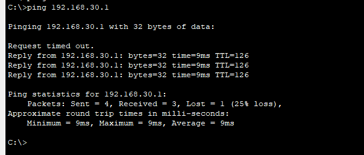

# 网络层7：PPP协议配置（点对点信道）

## 实验目的
1. 理解PPP协议。
2. 掌握不带认证的 PPP协议配置。
3. 掌握 PAP、CHAP认证的 PPP协议配置。


## 实验内容

### 1、基础知识。
点对点协议（Point to Point Protocol，PPP）为在点对点连接上传输多协议数据包提供了一个标准方法，是一种点到点的串行地信协议。这种链路提供全双工操作，并按照顺序传递数据包。
PPP协议提供认证的功能，有两种方式，一种是PAP，一种是CHAP。相对来说，PAP的认证方式安全性没有CHAP高。PAP在传输密码（passworad）时是文明的，而CHAP不传输密码，取代密码的是Hash（哈希值）。PAP认证是通过两次握手实现的，而CHAP则是通过3次握手实现的。

表 常用配置命令
| 命令格式                                      | 含义                                   |
| --------------------------------------------- | -------------------------------------- |
| encapsulation PPP {HDLC}                      | 封装指定协议                           |
| ppp authentication chap{ppp}                  | 指定PPP用户认证方式                    |
| username对方路由器名称 password对方路由器密码 | 在本路由器上记录对方路由器的名字和密码 |
| ppp pap sent-username router1 password pass1  | 设置向对方发送的PAP认证信息            |

### 2、实验流程


## 实验步骤

### 1、拓扑如下图所示，两路由器之间用串口相连，若无串口可先关机，添加WIC-1T串口模块，再开机。两个串口用PPP协议封装，做适当配置使其互通。
本次实验拓扑图不提供设备型号，请学生自己探索设备型号。（提示：路由器可以用2811，连路由器的线选带时钟标记的串行线（红），先连R1，再连R2）


提示：在路由器的physical窗口中，找到WIC-1T模块，拉入路由器中。

IP配置地址如表所示。
表 配置IP地址
| 设备名称 | 端口    | IP地址            | 网关           |
| -------- | ------- | ----------------- | -------------- |
| 路由器R1 | Fa0/0   | 192.168.10.254/24 |
| 路由器R1 | Se0/3/0 | 192.168.20.1/24   |
| 路由器R2 | Se0/3/0 | 192.168.20.2/24   |
| 路由器R2 | Fa0/0   | 192.168.30.254    |
| PC0      | PC0     | 192.168.10.1/24   | 192.168.10.254 |
| PC1      | PC1     | 192.168.30.1/24   | 192.168.30.254 |

### 2、配置路由。
路由器R1：
```
Router>en
Router#conf t
Enter configuration commands, one per line.  End with CNTL/Z.
Router(config)#host R1
R1(config)#interface FastEthernet0/0
R1(config-if)#ip address 192.168.10.254 255.255.255.0
R1(config-if)#no shut

R1(config-if)#
%LINK-5-CHANGED: Interface FastEthernet0/0, changed state to up

%LINEPROTO-5-UPDOWN: Line protocol on Interface FastEthernet0/0, changed state to up

R1(config-if)#exit
R1(config)#interface Serial0/3/0
R1(config-if)#ip address 192.168.20.1 255.255.255.0
R1(config-if)#clock rate 64000

//给DCE端配置时钟频率
（说明： 根据实际的串口号写，可能不一定是Serial0/3/0）

R1(config-if)#no shut

%LINK-5-CHANGED: Interface Serial0/3/0, changed state to down
R1(config-if)#exit
R1(config)#router rip
R1(config-router)#version 2
R1(config-router)#network 192.168.10.0
R1(config-router)#network 192.168.20.0
R1(config-router)#
```

路由器R2：
```
Router>en
Router#conf t
Enter configuration commands, one per line.  End with CNTL/Z.
Router(config)#host R2
R2(config)#interface Serial0/3/0
R2(config-if)#ip address 192.168.20.2 255.255.255.0
R2(config-if)#no shut

R2(config-if)#
%LINK-5-CHANGED: Interface Serial0/3/0, changed state to up

R2(config-if)#exit
R2(config)#interface FastEthernet0/0
R2(config-if)#ip address 192.168.30.254 255.255.255.0
R2(config-if)#no shut

R2(config-if)#
%LINK-5-CHANGED: Interface FastEthernet0/0, changed state to up

%LINEPROTO-5-UPDOWN: Line protocol on Interface FastEthernet0/0, changed state to up

R2(config-if)#exit
R2(config)#router rip
R2(config-router)#version 2
R2(config-router)#network 192.168.20.0
R2(config-router)#network 192.168.30.0
R2(config-router)#
```

经过路由配置后，此时两台PC是可以ping通的（注意：请先自行配置两台PC的IP）。




但两台路由器之间的串行链路并没有封装PPP协议，这是因为Cisco路由器串行接口默认封装了HDLC协议的原因。查看串行接口的信息如下：
```
R1#show int s0/3/0
Serial0/3/0 is up, line protocol is up (connected)
  Hardware is HD64570
  Internet address is 192.168.20.1/24
  MTU 1500 bytes, BW 128 Kbit, DLY 20000 usec,
     reliability 255/255, txload 1/255, rxload 1/255
  Encapsulation HDLC, loopback not set, keepalive set (10 sec)
  Last input never, output never, output hang never
  Last clearing of "show interface" counters never
  Input queue: 0/75/0 (size/max/drops); Total output drops: 0
  Queueing strategy: weighted fair
  Output queue: 0/1000/64/0 (size/max total/threshold/drops)
     Conversations  0/0/256 (active/max active/max total)
     Reserved Conversations 0/0 (allocated/max allocated)
     Available Bandwidth 96 kilobits/sec
  5 minute input rate 15 bits/sec, 0 packets/sec
  5 minute output rate 20 bits/sec, 0 packets/sec
     8 packets input, 644 bytes, 0 no buffer
     Received 0 broadcasts, 0 runts, 0 giants, 0 throttles
     0 input errors, 0 CRC, 0 frame, 0 overrun, 0 ignored, 0 abort
     9 packets output, 772 bytes, 0 underruns
     0 output errors, 0 collisions, 0 interface resets
     0 output buffer failures, 0 output buffers swapped out
     0 carrier transitions
     DCD=up  DSR=up  DTR=up  RTS=up  CTS=up

R1>
```

### 3、封装不带认证的PPP协议。
实际上，尽管HDLC协议也是ISO定义的标准，但该标准被不同的厂家进行了扩展，兼容性并不好。Cisco的 HDLC也是专用的，有时更希望封装兼容性更好的PPP协议，可执行如下操作。
路由器R1：
```
R1(config)#int s0/3/0
R1(config-if)#encapsulation ppp
R1(config-if)#
%LINEPROTO-5-UPDOWN: Line protocol on Interface Serial0/3/0, changed state to down

R1(config-if)#
```

路由器R2：
```
R2(config)#int s0/3/0
R2(config-if)#encapsulation ppp
R2(config-if)#
%LINEPROTO-5-UPDOWN: Line protocol on Interface Serial0/3/0, changed state to up

R2(config-if)#
```

此时验证两台主机可以ping通，查看接口信息，发现已经被封装为PPP协议。请自行验证。


```
R1#show int s0/3/0
Serial0/3/0 is up, line protocol is up (connected)
  Hardware is HD64570
  Internet address is 192.168.20.1/24
  MTU 1500 bytes, BW 128 Kbit, DLY 20000 usec,
     reliability 255/255, txload 1/255, rxload 1/255
  Encapsulation PPP, loopback not set, keepalive set (10 sec)
  LCP Open
  Open: IPCP, CDPCP
  Last input never, output never, output hang never
  Last clearing of "show interface" counters never
  Input queue: 0/75/0 (size/max/drops); Total output drops: 0
  Queueing strategy: weighted fair
  Output queue: 0/1000/64/0 (size/max total/threshold/drops)
     Conversations  0/0/256 (active/max active/max total)
     Reserved Conversations 0/0 (allocated/max allocated)
     Available Bandwidth 96 kilobits/sec
  5 minute input rate 39 bits/sec, 0 packets/sec
  5 minute output rate 41 bits/sec, 0 packets/sec
     21 packets input, 1624 bytes, 0 no buffer
     Received 0 broadcasts, 0 runts, 0 giants, 0 throttles
     0 input errors, 0 CRC, 0 frame, 0 overrun, 0 ignored, 0 abort
     19 packets output, 1596 bytes, 0 underruns
     0 output errors, 0 collisions, 0 interface resets
     0 output buffer failures, 0 output buffers swapped out
     0 carrier transitions
     DCD=up  DSR=up  DTR=up  RTS=up  CTS=up
```

### 4、封装带PAP认证的PPP协议。
在路由配通的基础上，做如下配置。
路由器 R1：
```
R1(config)#int s0/3/0
R1(config-if)#encapsulation ppp
R1(config-if)#ppp authentication pap
R1(config-if)#
%LINEPROTO-5-UPDOWN: Line protocol on Interface Serial0/3/0, changed state to down

R1(config-if)#ppp pap sent-username R1_pap password R1pappassword
//进行PAP认证并发送认证所需的用户名（R1_pap）和密码 （R1pappassword）
R1(config-if)#exit
//该用户名和密码为对方PAP认证发送的用户名和密码，即在R1上记录对方路由器R2的名字和密码
R1(config)#username R2_pap password R2pappassword
R1(config)#
```

路由器R2：
```
R2(config)#int s0/3/0
R2(config-if)#encapsulation ppp
R2(config-if)#ppp authentication pap
R2(config-if)#ppp pap sent-username R2_pap password R2pappassword
//进行PAP认证并发送认证所需的用户名和密码
R2(config-if)#exit
//该用户名和密码为对方PAP认证发送的用户名和密码，即在R2上记录对方路由器R1的名字和密码
R2(config)#username R1_pap password R1pappassword
R2(config)#
```


经验证两台主机可以ping 通。

### 5、封装带CHAP认证的PPP协议。
在路由配通的基础上，做如下配置。
路由器R1：
```
R1(config)#username router2 password pass1
R1(config)#int s0/3/0
R1(config-if)#encapsulation ppp
R1(config-if)#ppp authentication chap
R1(config-if)#
```

//在R1上记录对方路由器R2的名字和密码
//设置PPP认证方式为CHAP

路由器R2：
```
R2(config)#username router1 password pass1
R2(config)#int s0/3/0
R2(config-if)#encapsulation ppp
R2(config-if)#ppp authentication chap
R2(config-if)#
```

串口双方的密码都要一致。
此时PC0能 ping通PC1，请自行验证并查看接口信息。


```
R1#show int s0/3/0
Serial0/3/0 is up, line protocol is up (connected)
  Hardware is HD64570
  Internet address is 192.168.20.1/24
  MTU 1500 bytes, BW 128 Kbit, DLY 20000 usec,
     reliability 255/255, txload 1/255, rxload 1/255
  Encapsulation PPP, loopback not set, keepalive not set
  LCP Open
  Open: IPCP, CDPCP
  Last input never, output never, output hang never
  Last clearing of "show interface" counters never
  Input queue: 0/75/0 (size/max/drops); Total output drops: 0
  Queueing strategy: weighted fair
  Output queue: 0/1000/64/0 (size/max total/threshold/drops)
     Conversations  0/0/256 (active/max active/max total)
     Reserved Conversations 0/0 (allocated/max allocated)
     Available Bandwidth 96 kilobits/sec
  5 minute input rate 38 bits/sec, 0 packets/sec
  5 minute output rate 35 bits/sec, 0 packets/sec
     44 packets input, 3428 bytes, 0 no buffer
     Received 0 broadcasts, 0 runts, 0 giants, 0 throttles
     0 input errors, 0 CRC, 0 frame, 0 overrun, 0 ignored, 0 abort
     39 packets output, 3244 bytes, 0 underruns
     0 output errors, 0 collisions, 0 interface resets
     0 output buffer failures, 0 output buffers swapped out
     0 carrier transitions
     DCD=up  DSR=up  DTR=up  RTS=up  CTS=up

R1#
```
