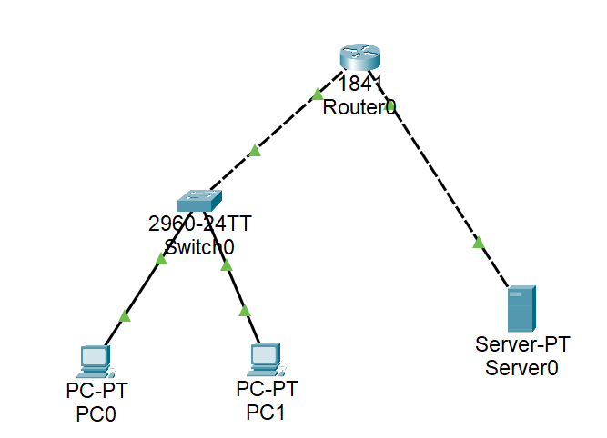

# 运输层：TCP连接实验

## 实验目的
理解TCP连接过程。


## 实验内容

### 1、基础知识
传输控制协议（Transmission Control Protocol，TCP）是运输层的两个主要协议之一，是面向连接的协议，即双方在通信之前必须要先建立连接，通信结束后必须要释放连接。
TCP在建立连接的过程中，客服双方要交换三个报文段，就是所谓的三次握手。为什要三次握手？主要原因在于连接请求报文可能会延迟到达服务器，在这段时间里，客户端因超时等因素重新发出新的连接请求。而对服务器来说，就有可能会收到两个连接请求，而其中一个显然是失效的，不应该建立连接。如果采用两次握手的机制，那么就会建立两个连接，这样就消耗了服务器的资源。

三次握手过程如图5-1所示。


第一次握手时，PC向服务器TCP发出连接请求报文段，这时首部的同步位SYN=1，同时选择一个初始序号seq=x，客户端状态为SYN_SENT。
第二次握手为服务器收到连接请求报文之后，同意建立连接，问客户端发送确认报在确认报文段中SYN位和ACK位都为1，确认号ack=x+1，同时初始序号seq=y。
第三次握手为客户端收到服务器的确认，还要向服务器发出确认，确认报文段的ACK置1，ack=y+1，自己的序号为seq=x+1。

### 2、实验流程


## 实验步骤

### 1、实验拓扑及IP设计如图所示。（如图注意每个设备的型号和连线）


### 2、配置IP及路由，保证PC能ping通。（PC和服务器的IP请先自行配置）
（1）配置代码
```
Router>en
Router#conf t
Enter configuration commands, one per line.  End with CNTL/Z.
Router(config)#host Router
Router(config)#interface FastEthernet0/0
Router(config-if)#ip address 192.168.1.254 255.255.255.0
Router(config-if)#no shut

Router(config-if)#
%LINK-5-CHANGED: Interface FastEthernet0/0, changed state to up

%LINEPROTO-5-UPDOWN: Line protocol on Interface FastEthernet0/0, changed state to up

Router(config-if)#exit
Router(config)#interface FastEthernet0/1
Router(config-if)#ip address 192.168.2.254 255.255.255.0
Router(config-if)#no shut

Router(config-if)#
%LINK-5-CHANGED: Interface FastEthernet0/1, changed state to up

%LINEPROTO-5-UPDOWN: Line protocol on Interface FastEthernet0/1, changed state to up

Router(config-if)#exit
Router(config)#
```

（2）激活后的链路


（3）PC可以ping通


### 3、将工作区切换到模拟模式（simulation），并只选中TCP协议。打开 PC客户端的桌面，单击浏览器，并输入www服务器的IP地址（即输入192.168.2.1），按回车键。由于应用层HTTP协议在运输层使用TCP协议，所以在PC处封装了TCP报文段，如图所示。


单击TCP报文段，观察TCP报文段的内容。双方首先需要先建立TCP连接，接下来观察三次握手的情况（三次，分别对应上图红色圈出的三个TCP）。下图为第一次握手封装的TCP报文段。其SYN=1，seq=0。


下图为www服务器的出站TCP报文段，属于第二次握手。其SYN=1，ACK=1，seq=0，ack=1。


下图为PC封装的TCP报文段，属于第三次握手。其ACK=1，seq=0+1=1，ack=1经过三次握手后，开始传输数据。

