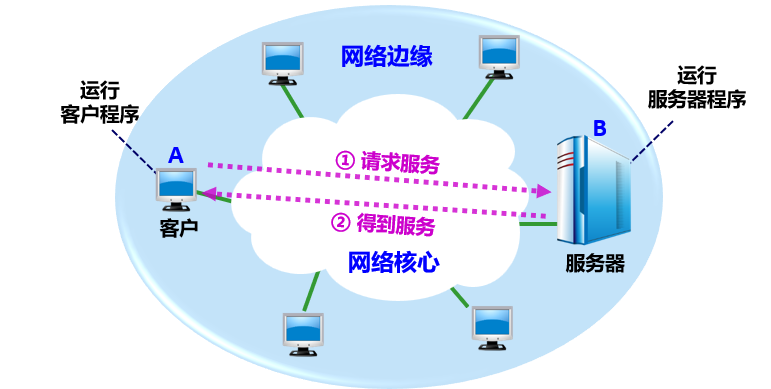

## 1.1 计算机网络在信息时代中的作用

### 1.1.1 计算机网络的定义
信息时代：以网络为核心（万物联网、人人用网）

大众熟悉的三大类网络
- 电信网络：提供电话、电报及传真等服务。
- 有线电视网络：向用户传送各种电视节目。
- 计算机网络：使用户能在计算机之间传送数据文件。
  - 发展最快并起到核心作用

“三网融合”：电信网络、有线电视网络融入现代计算机网络技术

Internet：全球最大、最重要的计算机网络
- 如何称呼 Internet？
- 因特网：推荐，但却长期**未得到推广**。
- 互联网：目前流行最广，事实上的**标准译名**。
- 互联网 ≠ 互连网。
  - 互连网：局部范围互连起来的计算机网络。

> 思考：它们说的是哪个网？
> 上网，联网，网民，网吧，网银，网购，网管，知网。

互联网是什么？
- 应用和服务
  - 游戏，视频，社交，电子邮件，购物，网店，
  - 网银，无现金支付，数字钱包，数字货币，…
- 工作原理
  - 互连结构，交换技术，
  - TCP/IP 体系结构与协议，…

### 1.1.2 计算机网络的特点
互联网的 2 个重要基本特点
- 连通性 (connectivity)
  - 使上网用户之间可以非常便捷、非常经济地交换各种信息
  - 好像这些用户终端都彼此直接连通一样。
- 资源共享 (Sharing)
  - 实现信息共享、软件共享、硬件共享。
  - 由于网络的存在，这些资源好像就在用户身边一样地方便使用。

> 是 Internet 提供许多服务的基础。

互联网在生活中地位
- 已经融入人们的生活、工作、学习和交往。
- 已经成为社会最为重要的基础设施之一。

互联网+：新的经济形态
- 指“互联网+各个传统行业”。
- 把互联网的创新成果深度融合于经济社会各领域。

互联网的负面影响
- 传播病毒
- 窃取：数据，钱财等
- 散布谣言
- 不良信息
- 欺诈
- 网瘾
- ……

> 需要加强对互联网的管理。

## 1.2 互联网概述

### 1.2.1 网络的网络
- 计算机网络：
  - 由若干**节点(node)**和连接这些节点的**链路(link)**组成。
  - 节点可以是计算机、集线器、交换机或路由器等。

  
- 互连网 (internetwork 或 internet)：
  - **多个网络**通过一些路由器**相互连接**起来，构成了一个覆盖范围更大的计算机网络。
  - “网络的网络”(network of networks)。

  

> 用“云”表示网络：主机在“云”里，如上图。
> 用“云”表示网络：主机在“云”外，如下图：

网络与互连网
- 网络：把许多计算机连接在一起。
- 互连网：把许多网络通过一些路由器连接在一起。与网络相连的计算机常称为**主机**。
- 互连网 (internet) ≠ 互联网 (Internet)

### 1.2.2 互联网基础结构发展的三个阶段
- 1969 – 1990
  - 从单个网络 ARPANET 向互联网发展。
- 1985 – 1993
  - 建成了三级结构的互联网。
- 1993 – 现在
  - 全球范围的多层次 ISP 结构的互联网。

**第一阶段：1969 – 1990**
- ARPANET：最初只是一个单个的分组交换网，**不是**一个互连网。
- 1983 年，**TCP/IP 协议**成为 ARPANET 上的标准协议，使得所有使用 TCP/IP 协议的计算机都能利用互连网相互通信。
- 人们把 1983 年作为互联网的诞生时间。
- 1990 年，ARPANET 正式宣布关闭。

**第二阶段：1985 – 1993**
- 国家科学基金网 NSFNET。
- 三级结构：主干网、地区网和校园网（或企业网）。
- 覆盖了全美国主要的大学和研究所，并且成为互联网中的主要组成部分。

**第三阶段：1993 – 现在**
- 出现了**互联网服务提供者** ISP (Internet Service Provider)：
  - 提供**接入**到互联网的服务。
  - 需要收取一定的费用。
- 多层次 ISP 结构：
  - 主干 ISP、地区 ISP 和本地 ISP。
  - 覆盖面积大小和所拥有的 IP 地址数目的不同

> 通信举例：主机A → 本地 ISP → 地区 ISP → 主干 ISP → 地区 ISP → 本地 ISP → 主机B

- **互联网交换点** IXP (Internet eXchange Point)：允许两个网络直接相连并快速交换分组。
  - 常采用工作在数据链路层的网络交换机。
  - 世界上较大的 IXP 的峰值吞吐量都在 Tbit/s 量级。
- **内容提供者** (Content Provider)：在互联网上向所有用户提供视频等内容的公司。**不向用户提供互联网的转接服务**。

20 世纪 90 年代：万维网 WWW 的问世
- 万维网 WWW (World Wide Web)：
  - 由欧洲原子核研究组织 CERN 开发。
  - 成为互联网指数级增长的主要驱动力。
  - 2019 年 3 月底，互联网的用户数已超过了 43.8亿。

### 1.2.3 互联网的标准化工作
互联网的**标准化**工作对互联网的发展起到了非常重要的作用。

组织架构

标准发表：以 RFC 的形式
- RFC：Request For Comments （请求评论）。
- 所有的 RFC 文档都可从互联网上**免费**下载。
- **任何人**都可以用电子邮件随时发表对某个文档的意见或建议。
- **但并非所有的 RFC 文档都是互联网标准。**只有很少部分的 RFC 文档最后才能变成互联网标准。
- RFC 文档**按发表时间的先后**编上序号（即 RFCxxxx，xxxx 是阿拉伯数字）。

标准化过程

## 1.3 互联网的组成
从互联网的工作方式上看，可以划分为两大块：
- 边缘部分： 由所有连接在互联网上的**主机**组成，由用户直接使用，用来进行通信（传送数据、音频或视频）和资源共享。
- 核心部分：由大量**网络**和连接这些网络的**路由器**组成，为边缘部分提供服务（提供连通性和交换）。

### 1.3.1 互联网的边缘部分
- 处在互联网边缘部分的就是连接在互联网上的所有的主机。这些主机又称为**端系统** (end system)。
- **端系统在功能上可能有很大差别**：
  - 小的端系统：普通个人电脑、智能手机、网络摄像头等。
  - 大的端系统：非常昂贵的大型计算机或服务器。
- 端系统的拥有者：可以是个人、单位、或某个 ISP。

“计算机之间通信”实际上是指：主机 A 的某个**进程**和主机 B 上的另一个**进程**进行通信。

端系统之间的两种通信方式
- 客户/服务器方式
  - Client / Server 方式
  - 简称为 C/S 方式
- 对等方式
  - Peer to Peer 方式
  - 简称为 P2P 方式

**客户-服务器方式（C/S 方式）**
- 客户/服务器方式所描述的是进程之间**服务和被服务**的关系。
- 客户是服务的**请求方**，服务器是服务的**提供方**。

> 客户与服务器的通信关系建立后，通信可以是双向的，客户和服务器都可发送和接收数据。

客户 A 向服务器 B 发出请求服务，服务器 B 向客户 A 提供服务。

客户程序和服务器程序主要特点
- 客户程序
  - 被用户**调用后运行**，需**主动**向远地服务器发起通信（请求服务）。必须知道服务器程序的地址。
  - 不需要特殊的硬件和很复杂的操作系统。
- 服务器程序
  - 专门用来提供某种服务的程序，可同时处理多个客户请求。
  - 一直**不断地运行着**，**被动**地等待并接受来自各地的客户的通信请求。不需要知道客户程序的地址。
  - 一般需要强大的硬件和高级的操作系统支持。

**对等连接方式（P2P 方式）**
- 两台主机在通信时**不区分**服务请求方和服务提供方。
- 只要都运行了 P2P 软件，就可以进行平**等的、对等连接通信**。

> 对等连接方式从本质上看仍然是使用客户服务器方式，只是对等连接中的每一个主机**既是客户又是服务器**。

### 1.3.2 互联网的核心部分
- 是互联网中最复杂的部分。
- 向网络边缘中的主机**提供连通性**，使任何一台主机都能够向其他主机通信。
- 在网络核心部分起特殊作用的是**路由器** (router)。
- 路由器是实现分组交换 (packet switching) 的关键构件，其任务是**转发**收到的分组。

> **分组转发**是网络核心部分最重要的功能。

- 典型交换技术包括：
  - 电路交换
  - 分组交换
  - 报文交换 等。
- 互联网的核心部分采用**分组交换技术**。

**电路交换的主要特点**
电线对的数量与电话机数量的平方 $N^2$ 成正比。
- $5$ 部电话机两两直接相连，需 $10$ 对电线。
- $N$ 部电话机两两直接相连，需 $N(N - 1)/2$ 对电线。

当电话机的数量增多时，使用**电话交换机**将这些电话连接起来。

> 每一部电话都直接连接到交换机上，而交换机使用**交换**的方法，让电话用户彼此之间可以很方便地通信。
> 这种交换方式就是**电路交换** (circuit switching)。

“交换 (switching)”的含义
- 转接：把一条电话线转接到另一条电话线，使它们连通起来。
- 从通信资源的分配角度来看，就是按照某种方式**动态地**分配传输线路的资源。

电路交换三个阶段
- 建立连接：建立一条专用的物理通路（占用通信资源）。
- 通话：主叫和被叫双方互相通电话（一直占用通信资源）。
- 释放连接：释放刚才使用的专用的物理通路（归还通信资源）。

> 这种必须经过“建立连接（占用通信资源）、通话（一直占用通信资源）、释放连接（归还通信资源）”三个步骤的交换方式称为电路交换。

电路交换特点：通话的两个用户**始终占用**端到端的通信资源

> 计算机数据具有**突发性**，这导致在传送数据时，通信线路的利用率很低，真正用来传送数据的时间往往不到 10%，甚至不到 1%，已被用户占用的通信线路资源在绝大部分时间里都是空闲的。

**分组交换的主要特点**
采用**存储转发**技术，在发送端，先把较长的报文划分成更小的等长数据段。

数据段前面添加首部就构成了**分组** (packet)

> 分组又称为“包”，而分组的首部也可称为“包头”。

分组交换以“分组”作为数据传输单元
- 互联网采用分组交换技术。**分组是在互联网中传送的数据单元**。
- 发送端**依次**把各分组发送到接收端。

接收端收到分组后**剥去**首部，**还原**成原来的报文

分组在互联网中的转发
- 根据**首部**中包含的目的地址、源地址等重要控制信息进行转发。
- 每一个分组在互联网中**独立选择**传输路径。
- 位于网络核心部分的**路由器负责转发分组**，即进行分组交换。
- 路由器要创建和动态维护**转发表**。

路由器处理分组的过程
- 暂存收到的分组。
- 检查分组首部。
- 查找转发表。
- 按照首部中的目的地址，找到合适的接口转发出去。

(a) 核心部分的路由器把网络互连起来

(b) 核心部分中的网络可用一条链路表示

分组交换的优点
| 优点 | 所采用的手段                                                           |
| ---- | ---------------------------------------------------------------------- |
| 高效 | 在分组传输的过程中**动态分配**传输带宽，对通信链路是**逐段**占用。     |
| 灵活 | 为每一个分组**独立**地选择最合适的转发路由。                           |
| 迅速 | 以分组作为传送单位，可以**不先建立连接**就能向其他主机发送分组。       |
| 可靠 | 保证可靠性的网络协议；分布式多路由的分组交换网，使网络有很好的生存性。 |

分组交换带来的问题
- 排队延迟：分组在各路由器存储转发时需要排队。
- 不保证带宽：动态分配。
- 增加开销：各分组必须携带控制信息；路由器要暂存分组，维护转发表等。

**报文交换**
- 在 20 世纪 40 年代，电报通信就采用了基于存储转发原理的**报文交换** (message switching)。
- 但报文交换的时延较长，从几分钟到几小时不等。
- 现在报文交换已经很少有人使用了。

电路交换、报文交换和分组交换的主要区别

三种交换方式的比较
- 若要连续传送**大量**的数据，且其传送时间**远大于**连接建立时间，则电路交换的传输速率较快。
- 报文交换和分组交换不需要预先分配传输带宽，在传送**突发数据**时可提高整个网络的信道利用率。
- 由于一个分组的长度往往**远小于**整个报文的长度，因此分组交换比报文交换的时延小，同时也具有更好的灵活性。

## 1.4 计算机网络在我国的发展
- 1980 年，铁道部开始进行计算机联网实验。
- 1989 年 11 月，我国第一个公用分组交换网 CNPAC 建成运行。
- 1994 年 4 月 20 日，我国用 64 kbit/s 专线正式连入互联网，我国被国际上正式承认为接入互联网的国家。
- 1994 年 5 月，中国科学院高能物理研究所设立了我国的第一个万维网服务器。
- 1994 年 9 月，中国公用计算机互联网 CHINANET 正式启动。

- 到目前为止，我国陆续建造了基于互联网技术的并能够和互联网互连的多个全国范围的公用计算机网络，其中规模最大的就是下面这五个：
  - 中国电信互联网 CHINANET（也就是原来的中国公用计算机互联网）
  - 中国联通互联网 UNINET
  - 中国移动互联网 CMNET
  - 中国教育和科研计算机网 CERNET
  - 中国科学技术网 CSTNET

- 1994 年，中国教育和科研计算机网 CERNET (China Education and Research NETwork) 是我国第一个 IPv4 互联网主干网。
- 2004 年 2 月，我国的第一个下一代互联网 CNGI 的主干网 CERNET2 试验网正式开通，并提供服务。
  - 试验网以 2.5~10 Gbit/s 的速率连接北京、上海和广州三个 CERNET 核心节点，并与国际下一代互联网相连接。
- 中国互联网络信息中心 CNNIC (ChiNa Network Information Center) 每年两次公布我国互联网的发展情况。
- 到 2019 年底，我国的国际出口带宽已超过 8.8 Tbit/s （1 Tbit/s = 103 Gbit/s）。

对我国互联网事业发展影响较大的人物和事件
- 1996 年，张朝阳创立了中国第一家以风险投资资金建立的互联网公司—爱特信公司。两年后，爱特信公司推出“搜狐”产品，并更名为搜狐公司(Sohu)。搜狐网站(Sohu.com) 是中国首家大型分类查询搜索引擎。
- 1997 年，丁磊创立了网易公司(NetEase)，推出了中国第一家中文全文搜索引擎，开发的超大容量免费邮箱（如163和126等）。
- 1998 年，王志东创立新浪网站(Sina.com)。
  - 新浪的微博是全球使用最多的微博之一。
- 1998 年，马化腾、张志东创立了腾讯公司 (Tencent)。
- 1999 年，腾讯就推出了用在 PC 上的即时通信软件 OICQ，后改名为 QQ。
- 2011 年，腾讯推出了专门供智能手机使用的即时通信软件“微信”。
- 2000 年，李彦宏和徐勇创建了百度网站 (Baidu.com)，现在已成为全球最大的中文搜索引擎。
- 1999 年，马云创建了阿里巴巴网站 (Alibaba.com)。
- 2003 年，马云创立了个人网上贸易市场平台—淘宝网 (Taobao.com)。
- 2004 年，阿里巴巴集团创立了第三方支付平台—支付宝(Alipay.com)。

## 1.5 计算机网络的类别

### 1.5.1 计算机网络的定义
- 计算机网络的精确定义并未统一。
- 较好的定义：
  > 计算机网络主要是由一些通用的、可编程的硬件互连而成的，而这些硬件并非专门用来实现某一特定目的（例如，传送数据或视频信号）。这些可编程的硬件能够用来传送多种不同类型的数据，并能支持广泛的和日益增长的应用。

如何理解？
- “可编程的硬件”表明：这种硬件一定包含有**中央处理器** CPU。
- 计算机网络所连接的硬件包括：
  - 一般的计算机；
  - 智能手机、电视 等。
- 计算机网络可以：
  - 传送数据；
  - 支持多种应用（包括今后可能出现的各种应用）。

### 1.5.2 几种不同类别的计算机网络
- 计算机网络有多种类别。
- 可以按以下方法分类：
  - 按照网络的作用范围进行分类；
  - 按照网络的使用者进行分类；
  - 用来把用户接入到互联网的网络。

**按照网络的作用范围进行分类**
| 类别                                   | 作用范围或距离                                                                      |
| -------------------------------------- | ----------------------------------------------------------------------------------- |
| 广域网 WAN (Wide Area Network)         | 通常为几十到几千公里。有时也称为**远程网**(long haul network)。是互联网的核心部分。 |
| 城域网 MAN (Metropolitan Area Network) | 作用范围一般是一个城市，作用距离约为 5~50 公里。                                    |
| 局域网 LAN (Local Area Network)        | 局限在较小的范围（如 1 公里左右）。通常采用高速通信线路。                           |
| 个人区域网 PAN (Personal Area Network) | 范围很小，大约在 10 米左右。有时也称为**无线个人区域网** WPAN (Wireless PAN)。      |

> 若中央处理机之间的距离非常近（如仅 1 米甚至更小些），则一般就称之为**多处理机系统**，而不称它为计算机网络。|

**按照网络的使用者进行分类**
| 类别                     | 作用范围或距离                                           |
| ------------------------ | -------------------------------------------------------- |
| 公用网 (public network)  | 按规定交纳费用的人都可以使用的网络。也可称为**公众网**。 |
| 专用网 (private network) | 为特殊业务工作的需要而建造的网络。                       |

> 公用网和专用网都可以传送多种业务。如传送的是计算机数据，则分别是公用计算机网络和**专用计算机网络**。|

**用来把用户接入到互联网的网络**
接入网 AN (Access Network)
- 又称**为本地接入网**或**居民接入网**。
- **用于将用户接入互联网**。
- 实际上就是本地 ISP 所拥有的网络，它既不是互联网的核心部分，也不是互联网的边缘部分。
- 是从某个用户端系统到本地 ISP 的**第一个**路由器（也称为边缘路由器）之间的一种网络。
- 从覆盖的范围看，很多接入网还是属于局域网。

## 1.6 计算机网络的性能

### 1.6.1 计算机网络的性能指标
- 性能指标：从不同的方面来度量计算机网络的性能。
- 重要性能指标：速率、带宽、吞吐率、时延、时延带宽积、往返时间、利用率

**速率**
- 最重要的一个性能指标。
- 指的是**数据的传送速率**，也称为**数据率** (data rate) 或**比特率** (bit rate)。
- 单位：bit/s，或 kbit/s、Mbit/s、 Gbit/s 等。
- 速率往往是指**额定速率**或**标称速率**，非实际运行速率。

> 千 = K = 210 = 1024，兆 = M = 220 = 1024 K，吉 = G = 230 = 1024 M
> 1 字节 (Byte) = 8 比特 (bit)

**带宽 (bandwidth)**
- 频域
  - 某个信号具有的**频带宽度**。
  - 单位是**赫**（或千赫、兆赫、吉赫等）。
  - 某信道允许通过的信号频带范围称为该**信道的带宽**（或通频带）。
- 时域
  - 网络中某通道传送数据的能力，表示在单位时间内网络中的某信道所能通过的“**最高数据率**”。
  - 单位就是数据率的单位 bit/s。

> - 两者**本质相同**。
> - 一条通信链路的“带宽”越宽，其所能传输的“最高数据率”也越高。

**吞吐量 (throughput)**
- 单位时间内通过某个网络（或信道、接口）的**实际数据量**。
- 受网络的带宽或网络的额定速率的限制。
  - 额定速率是绝对上限值。
  - 可能会远小于额定速率，甚至下降到零！
- 有时可用**每秒传送的字节数**或**帧数**来表示。

**时延 (delay 或 latency)**
- 指数据（一个报文或分组，甚至比特）从网络（或链路）的一端传送到另一端所需的时间。
- 有时也称为**延迟**或**迟延**。
- 组成：
  1. 发送时延
  2. 传播时延
  3. 处理时延
  4. 排队时延

（1）发送时延
- 也称为传输时延。
- 是主机或路由器发送数据帧所需要的时间，也就是从发送数据帧的**第一个比特**算起，到该帧的**最后一个比特**发送完毕所需的时间。
- $发送时延 = \frac{数据帧长度（bit）}{发送速率（bit/s）}$

（2）传播时延
- 是**电磁波**在信道中传播一定的距离需要花费的时间。
- $传播时延 = \frac{信道长度（米）}{信号在信道上的传播速率（米/秒）}$
- 电磁波传播速率：
  - $自由空间的传播速率是光速 = 3.0 \times 105 km/s$
  - $在铜线电缆中的传播速率约 = 2.3 \times 105 km/s$
  - $在光纤中的传播速率约 = 2.0 \times 105 km/s$

注意：发送时延与传播时延有本质上的不同。
- 发送时延发生在机器内部的发送器中，与传输信道的长度（或信号传送的距离）没有任何关系。
- 传播时延则发生在机器外部的传输信道媒体上，而与信号的发送速率无关。信号传送的距离越远，传播时延就越大。

（3）处理时延
- 主机或路由器在收到分组时，为**处理**分组（例如分析首部、提取数据、差错检验或查找路由）所花费的时间。

（4）排队时延
- 分组在路由器输入输出队列中**排队等待**处理和转发所经历的时延。
- 排队时延的长短往往取决于网络中当时的通信量。当网络的通信量很大时会发生队列溢出，使分组丢失，这相当于排队时延为无穷大。

$$
总时延 = 发送时延 + 传播时延 + 处理时延 + 排队时延
$$

- 一般说来，小时延的网络要**优于**大时延的网络。
- 在某些情况下，一个低速率、小时延的网络很可能要**优于**一个高速率但大时延的网络。

> 必须指出，在总时延中，究竟是哪一种时延**占主导地位**，必须具体分析。

四种时延产生的地方

容易产生的错误概念
> 以下说法是**错误**的：“在高速链路（或高带宽链路）上，比特会传送得更快些”。

- 对于高速网络链路，我们**提高的仅仅是数据的发送速率**，而不是比特在链路上的传播速率。
- 提高数据的发送速率**只是减小了数据的发送时延**。

> 不能笼统地认为：“数据的发送速率越高，其传送的总时延就越小”。

**时延带宽积**
$时延带宽积 = 传播时延 \times 带宽$

- 链路的**时延带宽积**又称为以比特为单位的**链路长度**。
- 管道中的比特数表示从发送端发出**但尚未**到达接收端的比特数。
- 只有在代表链路的管道都充满比特时，链路才得到了充分利用。

**往返时间 RTT (Round-Trip Time)**
表示从发送方**发送完数据**，到发送方**收到来自接收方的确认**总共经历的时间。
$$
\begin{align*}
往返时间 RTT &= 结点 A 到 B 的传播时延 t_{P} \\
            &+ 结点 B 处理和排队时延 t_{PQB} \\
            &+ 结点 B 发送时延 t_{TB} \\
            &+ 结点 B 到 A 的传播时延 t_{P} \\
            &= 2 \times 传播时延 t_{P} \\
            &+ 结点 B 处理和排队时延 t_{PQB} \\
            &+ 结点 B 发送时延 t_{TB}
\end{align*}
$$

- 在互联网中，往返时间**还包括各中间结点**的处理时延、排队时延以及转发数据时的发送时延。
- 当使用卫星通信时，往返时间 RTT 相对较长，此时，RTT 是很重要的一个性能指标。

**利用率**
- 信道利用率
  - 某信道有百分之几的时间是被利用的（即有数据通过）。
  - 完全空闲的信道的利用率是零。
- 网络利用率
  - 全网络的信道利用率的加权平均值。

> 信道利用率越高越好吗？

时延与网络利用率的关系
- 根据排队论，当某信道的利用率增大时，时延会迅速增加。$D = \frac{D_{0}}{1 - U}$
  - $D_{0}$：网络空闲时的时延。
  - D：网络在当前的时延。
  - U：网络当前的利用率，数值在 0 到 1 之间。
- 当信道的利用率增大时，该信道引起的时延迅速增加。
  

### 1.6.2 计算机网络的非性能特征
- 费用：标准化
- 质量：可靠性
- 管理和维护：可扩展性和可升级性

> 这些非性能特征与性能指标有很大的关系。

## 1.7 计算机网络的体系结构

### 1.7.1 计算机网络体系结构的形成
计算机网络是一个非常复杂的系统。

两台计算机要互相传送文件需解决很多问题
1. 必须有一条传送数据的通路。
2. 发起方必须激活通路。
3. 要告诉网络如何识别接收方。
4. 发起方要清楚对方是否已开机，且与网络连接正常。
5. 发起方要清楚对方是否准备好接收和存储文件。
6. 若文件格式不兼容，要完成格式的转换。
7. 要处理各种差错和意外事故，保证收到正确的文件。

提出了不同体系结构
- 最初的 ARPANET 设计时提出了**分层**的设计方法。
- 分层：将庞大而复杂的问题，转化为若干较小的局部问题。
- 1974 年，IBM 按照分层的方法制定并提出了系统网络体系结构 SNA (System Network Architecture)。
- 此后，其他一些公司也相继推出了具有不同名称的体系结构。

> 但由于网络体系结构的不同，不同公司的设备很难互相连通。

国际标准：开放系统互连参考模型 OSI/RM
- ISO (国际标准化组织) 提出的 **OSI/RM** (Open Systems Interconnection Reference Model) 是使各种计算机在世界范围内互连成网的**标准框架**。
- OSI/RM 是个**抽象的概念**。
- 1983年，形成了著名的 ISO 7498 国际标准，即**七层协议的体系结构**。

> OSI 试图达到一种**理想境界**：全球计算机网络都遵循这个统一标准，因而全球的计算机将能够很方便地进行互连和交换数据。但 ISO/OSI 失败了。

- 基于 TCP/IP 的互联网已抢先在全球相当大的范围成功地运行了。
- OSI 的专家们在完成 OSI 标准时**没有商业驱动力**；
- OSI 的协议实现起来**过分复杂**，且运行效率很低；
- OSI 标准的制定**周期太长**，使得按 OSI 标准生产的设备无法及时进入市场；
- OSI 的层次**划分也不太合理**，有些功能在多个层次中重复出现。

两种国际标准
- 法律上的 (de jure) 国际标准 OSI
  - 但并没有得到市场的认可。
- 事实上的 (de facto) 国际标准 TCP/IP
  - 获得了最广泛的应用。

### 1.7.2 协议与划分层次
- 网络协议 (network protocol)，简称为协议，是为进行网络中的数据交换而建立的规则、标准或约定。
- 三个组成要素：
  - 语法：数据与控制信息的结构或格式。
  - 语义：需要发出何种控制信息，完成何种动作以及做出何种响应。
  - 同步：事件实现顺序的详细说明。

> 网络协议是计算机网络的不可缺少的组成部分。

协议的两种形式
- 文字描述：便于人来阅读和理解。
- 程序代码：让计算机能够理解。

> 不论什么形式，都必须能够对网络上信息交换过程做出**精确的解释**。

层次式协议结构
> ARPANET 的研制经验表明：对于非常复杂的计算机网络协议，其结构应该是**层次式**的。

划分层次的概念举例：两台主机通过网络传送文件
1. 将**文件传送模块**作为最高的一层（把文件交给下层模块进行发送，把收到的文件交给上层模块）
2. 再设计一个**通信服务模块**层（把文件交给下层模块进行发送，把收到的文件交给上层模块）
3. 再设计一个**网络接入模块**层（网络接入模块负责做与网络接口细节有关的工作，并向上层提供接入和通信服务。）

分层的优点与缺点
- 各层之间是独立的。
- 灵活性好。
- 结构上可分割开。
- 易于实现和维护
- 能促进标准化工作。
- 有些功能会重复出现，因而产生了额外开销。

注意：每一层的功能应非常明确。
- 层数太少，就会使每一层的协议太复杂。
- 层数太多，又会在描述和综合各层功能的系统工程任务时遇到较多的困难。

各层完成的主要功能
- 差错控制：使相应层次对等方的通信更加可靠。
- 流量控制：发送端的发送速率必须使接收端来得及接收，不要太快。
- 分段和重装：发送端将要发送的数据块划分为更小的单位，在接收端将其还原。
- 复用和分用：发送端几个高层会话复用一条低层的连接，在接收端再进行分用。
- 连接建立和释放：交换数据前先建立一条逻辑连接，数据传送结束后释放连接。

计算机网络的体系结构
- 网络的体系结构 (Network Architecture) 是计算机网络的各层及其协议的**集合**，就是这个计算机网络及其构件所应完成的**功能的精确定义（不涉及实现）**。
- 实现 (implementation) 是遵循这种体系结构的前提下，用何种硬件或软件完成这些功能的问题。

> 体系结构是**抽象**的，而实现则是**具体**的，是真正在运行的计算机硬件和软件。

### 1.7.3 具有五层协议的体系结构

5 应用层
- 任务：通过应用进程间的交互来完成特定网络应用。
- 协议：定义的是**应用进程**间通信和交互的规则。
- 把应用层交互的数据单元称为**报文**(message)。
- 例如：DNS，HTTP，SMTP

4 运输层
- 任务：负责向两台主机中**进程**之间的通信提供通用的数据传输服务。
- 具有复用和分用的功能。
- 主要使用**两种协议**：
  - 传输控制协议 TCP (Transmission Control Protocol)：
    - 提供**面向连接**的、**可靠**的数据传输服务。
    - 数据传输的单位是**报文段** (segment)。
  - 用户数据报协议 UDP (User Datagram Protocol)：
    - 提供无连接的**尽最大努力** (best-effort) 的数据传输服务（**不保证数据传输的可靠性**）。
    - 数据传输的单位是**用户数据报**。

3 网络层
- 为分组交换网上的不同**主机**提供通信服务。
- 两个具体任务：
  - 路由选择：通过一定的算法，在互联网中的每一个路由器上，**生成**一个用来转发分组的**转发表**。
  - 转发：每一个路由器在接收到一个分组时，要依据转发表中指明的路径把分组**转发**到下一个路由器。
- 互联网使用的网络层协议是**无连接**的**网际协议 IP** (Internet Protocol) 和许多种路由选择协议，因此互联网的网络层也叫做网际层或 IP 层。
- IP 协议分组也叫做 **IP 数据报**，或简称为数据报。

2 数据链路层
- 常简称为**链路层**。
- 任务：实现两个**相邻节点**之间的**可靠通信**。
- 在两个相邻节点间的链路上传送**帧**（frame）。
- 如发现有差错，就简单地**丢弃**出错帧。
- 如果需要改正出现的差错，就要采用**可靠传输协议**来**纠正**出现的差错。这种方法会使数据链路层协议复杂。

1 物理层
- 任务：实现**比特**（0 或 1）的传输。
- 确定连接电缆的插头应当有多少根引脚，以及各引脚应如何连接。
- 注意：传递信息所利用的一些**物理媒体**，如双绞线、同轴电缆、光缆、无线信道等，**并不在物理层协议之内**，而是在物理层协议的下面。

数据在各层之间的传递过程

对等层与协议数据单元
- OSI 参考模型把对等层次之间传送的数据单位称为该层的**协议数据单元 PDU** (Protocol Data Unit)。
- 任何两个同样的层次把 PDU （即数据单元加上控制信息）通过水平虚线直接传递给对方。这就是所谓的“**对等层**”之间的通信。

> 各层协议实际上就是在各个**对等层**之间传递数据时的各项规定。

### 1.7.4 实体、协议、服务和服务访问点
- 实体 (entity) ：表示任何可发送或接收信息的硬件或软件进程。
- 协议：控制**两个对等实体**进行通信的规则的集合。
- 在协议的控制下，两个对等实体间的通信使得本层能够**向上一层提供服务**。
- 要实现本层协议，还需要**使用下层所提供的服务**。

注意：协议和服务在概念上是不一样的
- 协议
  - 其实现保证了能够向上一层提供服务。
  - 对上面的服务用户是透明的。
  - 是“水平的”
- 服务
  - 上层使用服务原语获得下层所提供的服务。
  - 上面的服务用户只能看见服务，无法看见下面的协议。
  - 是“垂直的”

服务访问点 SAP
- 在同一系统中相邻两层的实体进行交互（即交换信息） 的地方，通常称为**服务访问点 SAP** (Service Access Point)。
- SAP 是一个抽象的概念，它实际上就是一个**逻辑接口**。
- OSI 把层与层之间交换的数据的单位称为**服务数据单元 SDU** (Service Data Unit)。
- SDU 可以与 PDU 不一样。
  - 例如：可以是多个 SDU 合成为一个 PDU，也可以是一个 SDU 划分为几个 PDU。

相邻两层之间的关系

> 协议很复杂，要应付所有异常情况（这样的协议无法实现！）

### 1.7.5 TCP/IP 的体系结构

路由器在转发分组时**最高**只用到**网际层**，没有使用运输层和应用层。

TCP/IP 体系结构的另一种表示方法
- 现在互联网使用的 TCP/IP 体系结构已经发生了演变，即某些应用程序可以直接使用 IP 层，或甚至直接使用最下面的网络接口层。
  

沙漏计时器形状的 TCP/IP 协议族

互联网中客户-服务器工作方式

同时运行多个服务器进程同时为多个客户进程提供服务

