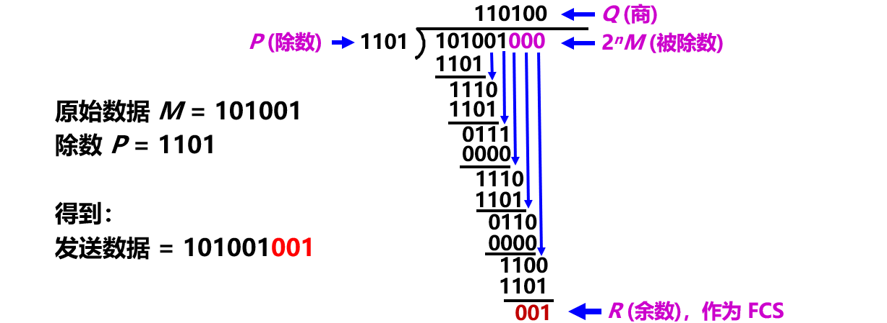
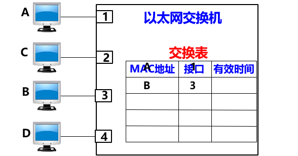
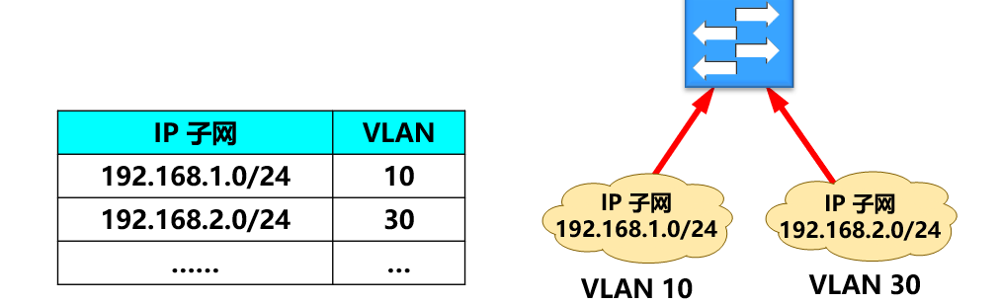

数据链路层的地位

> 注意：不同的链路层可能采用不同的数据链路层协议

数据链路层信道类型
- 点对点信道
  - 
  - 使用一对一的**点对点**通信方式。
- 广播信道
  - 
  - 使用一对多的**广播通信**方式。
  - 必须使用专用的**共享信道协议**来协调这些主机的数据发送。

## 3.1 使用点对点信道的数据链路层

### 3.1.1 数据链路和帧
- 链路 (link) ：
  - 一条无源的点到点的物理线路段，中间**没有**任何其他的交换结点。
  - 一条链路只是一条通路的一个组成部分。
  - 或**物理链路**。
- 数据链路 (data link)：
  - 把实现控制数据传输的协议的硬件和软件加到链路上，就构成了数据链路。
  - 或**逻辑链路**。
  - 典型实现：适配器（即网卡）

数据链路层协议数据单元：帧

> 使用点对点信道的数据链路层

### 3.1.2 三个基本问题
**封装成帧**
- 封装成帧 (framing)：在一段数据的前后分别添加首部和尾部，构成一个帧。
- 首部和尾部的一个重要作用就是进行**帧定界**（即确定帧的界限）。

用帧首部和帧尾部封装成帧，

最大传送单元 MTU (Maximum Transfer Unit) ：规定了所能传送的帧的数据部分长度上限。

用控制字符作为帧定界符
- 控制字符 SOH (Start Of Header) 放在一帧的最前面，表示帧的首部开始。
- 控制字符 EOT (End Of Transmission) 放在一帧的末尾，表示帧的结束。

**透明传输**
- 问题：如果数据中的某个字节的二进制代码恰好和 SOH 或 EOT 一样，数据链路层就会**错误**地“找到帧的边界”，导致错误。
  
- 透明：指某一个实际存在的事物看起来却好像不存在一样。

> “在数据链路层透明传送数据”表示：无论发送什么样的比特组合的数据，这些数据都能够按照原样**没有差错**地通过这个数据链路层。

用“字节填充”或“字符填充”法解决透明传输的问题

**差错控制（检测）**
- 在传输过程中可能会产生比特差错
  

> 在一段时间内，传输错误的比特占所传输比特总数的比率称为误码率 BER (Bit Error Rate)。

循环冗余检验 CRC (Cyclic Redundancy Check) 原理

- 在发送端，**先把数据划分为组**。假定每组 k 个比特。
- **CRC 运算**在每组 M 后面再添加供差错检测用的 n 位**冗余码**，然后构成一个帧发送出去。一共发送 **(k + n)** 位。

CRC 冗余码的计算

1. 用二进制的模 2 运算进行 $2_{n}$ 乘 M 的运算，这相当于在 M 后面添加 n 个 0。
2. 得到的 (k + n) 位的数**除以**事先选定好的长度为 (n + 1) 位的**除数** P，得出**商**是 Q ，**余数**是 R，余数 R 比除数 P 少 1 位，即 R 是 n 位。
3. 将**余数 R** 作为**冗余码**拼接在数据 M 后面，一起发送出去。

> 这种为了进行检错而添加的冗余码常称为**帧检验序列 FCS** (Frame Check Sequence)。

CRC 冗余码的计算举例

帧检验序列 FCS
- 在数据后面添加上的冗余码称为**帧检验序列 FCS** (Frame Check Sequence)。
- 循环冗余检验 CRC 和帧检验序列 FCS **并不等同**。
  1. CRC 是一种常用的检错方法，而 FCS 是添加在数据后面的冗余码。
  2. FCS 可以用 CRC 这种方法得出，但 CRC 并非用来获得 FCS 的唯一方法。

广泛使用的生成多项式P(X)
$$
\begin{align*}
CRC-16 &= X_{16} + X_{15} + X_{2} + 1 \\
CRC-CCITT &= X_{16} + X_{12} + X_{5} + 1 \\
CRC-32 &= X_{32} + X_{26} + X_{23} + X_{22} + X_{16} + X_{12} + X_{11} + X_{10} + X_{8} + X_{7} + X_{5} + X_{4} + X_{2} + X + 1
\end{align*}
$$

注意：
- 仅用循环冗余检验 CRC 差错检测技术只能做到**无差错接受** (accept)。
- 即：“**凡是接受的帧（即不包括丢弃的帧），我们都能以非常接近于 1 的概率认为这些帧在传输过程中没有产生差错**”。
- 即：“凡是接收端数据链路层接受的帧均无差错”。

注意：“无比特差错”与“无传输差错”是不同的
- **可靠传输**：数据链路层的发送端发送什么，在接收端就收到什么。
- **传输差错**可分为两大类：
  - 比特差错；
  - 传输差错：帧丢失、帧重复或帧失序等。
- 在数据链路层使用 CRC 检验，能够实现无比特差错的传输，但这还不是可靠传输。
- 要做到可靠传输，还必须再加上**帧编号、确认和重传**等机制。

## 3.2 点对点协议 PPP

### 3.2.1 PPP 协议的特点
- 对于点对点的链路，目前使用得最广泛的数据链路层协议是**点对点协议 PPP** (Point-to-Point Protocol)。
- PPP 协议在 1994 年就已成为互联网的正式标准 [RFC 1661, STD51]。

用户到 ISP 的链路使用 PPP 协议

PPP 协议应满足的需求
1. 简单 —— **首要要求**。
2. 封装成帧 —— 必须规定特殊的字符作为帧定界符。
3. 透明性 —— 必须保证数据传输的透明性。
4. 多种网络层协议 —— 能够在同一条物理链路上同时支持多种网络层协议。
5. 多种类型链路 —— 能够在多种类型的链路上运行。
6. 差错检测 —— 能够对接收端收到的帧进行检测，并立即丢弃有差错的帧。
7. 检测连接状态 —— 能够及时自动检测出链路是否处于正常工作状态。
8. 最大传送单元 —— 必须对每一种类型的点对点链路设置最大传送单元 MTU 的标准默认值，促进各种实现之间的互操作性。
9. 网络层地址协商 —— 必须提供一种机制使通信的两个网络层实体能够通过协商知道或能够配置彼此的网络层地址。
10. 数据压缩协商 —— 必须提供一种方法来协商使用数据压缩算法。

PPP 协议的三个组成部分：
- 一个将 IP 数据报**封装**到串行链路的方法。
- 一个**链路控制协议 LCP** (Link Control Protocol)。
- 一套**网络控制协议 NCP** (Network Control Protocol)。

### 3.2.2 PPP 协议的帧格式

PPP 有一个 2 个字节的协议字段。其值
- 若为 0x0021，则信息字段就是 IP 数据报。
- 若为 0x8021，则信息字段是网络控制数据。
- 若为 0xC021，则信息字段是 PPP 链路控制数据。
- 若为 0xC023，则信息字段是鉴别数据。

> PPP 是**面向字节**的，所有的 PPP 帧的长度都是**整数字节**。

**各字段的意义**
- 首部：4 个字段
  - 标志字段 F： 0x7E 。连续两帧之间只需要用一个标志字段。
  - 地址字段 A：只置为 0xFF。实际上不起作用。
  - 控制字段 C：通常置为 0x03。
  - 协议字段。
- 尾部：2 个字段。

透明传输问题
- 当 PPP 用在异步传输时，使用**字节填充法**。
- 当 PPP 用在同步传输链路时，采用**零比特填充法**。

**字节填充**

**零比特填充**

### 3.2.3 PPP 协议的工作状态
PPP 链路初始化过程：
- 用户拨号接入 ISP 后，就建立了一条从用户个人电脑到 ISP 的物理连接。
- 用户个人电脑向 ISP 发送一系列的**链路控制协议 LCP** 分组（封装成多个 PPP 帧），以便建立LCP连接。
- 之后进行网络层配置。**网络控制协议 NCP** 给新接入的用户个人电脑分配一个临时的 IP 地址。
- 当用户通信完毕时，NCP **释放**网络层连接，收回原来分配出去的IP地址。LCP **释放**数据链路层连接。最后**释放**的是物理层的连接。

PPP 协议的状态图

## 3.3 使用广播信道的数据链路层

### 3.3.1 局域网的数据链路层
- 局域网最主要的特点：
  - 网络为一个单位所拥有；
  - 地理范围和站点数目均有限。
- 局域网具有如下主要优点：
  - 具有广播功能，从一个站点可很方便地访问全网。
  - 便于系统的扩展和逐渐地演变，各设备的位置可灵活调整和改变。
  - 提高了系统的可靠性、可用性和生存性。

局域网拓扑结构

局域网传输媒体

共享信道带来的问题：若多个设备在共享的广播信道上**同时发送**数据，则会造成彼此干扰，导致发送失败。

媒体共享技术
- 静态划分信道：
  - 频分复用
  - 时分复用
  - 波分复用
  - 码分复用
- 动态媒体接入控制（多点接入）：
  - 随机接入：所有的用户可随机地发送信息。
  - 受控接入：用户必须服从一定的控制。如轮询(polling)。

**以太网的两个标准**
- DIX Ethernet V2：世界上第一个局域网产品（以太网）的规约。
- IEEE 802.3：第一个 IEEE 的以太网标准。

> - 这两种标准的硬件实现可以在同一个局域网上**互操作**。
> - 这两个标准标准只有很小的差别，因此很多人也常把 802.3局域网简称为“以太网”。

局域网数据链路层分为 2 个子层

> - 逻辑链路控制 LLC (Logical Link Control) 子层：与传输媒体无关。
> - 媒体接入控制 MAC (Medium Access Control) 子层：与传输媒体有关。

**适配器的作用**

计算机通过适配器和局域网进行通信

重要功能：
- 进行串行/并行转换。
- 对数据进行缓存。
- 在计算机的操作系统安装设备驱动程序。
- 实现以太网协议。

### 3.3.2 CSMA/CD 协议
- 最早的以太网：将许多计算机都连接到一根**总线**上。
- 总线特点：易于实现广播通信，简单，可靠。
  
- 为了实现**一对一**通信，将接收站的硬件地址写入帧首部中的**目的地址**字段中。仅当数据帧中的目的地址与**适配器硬件地址**一致时，才能接收这个数据帧。
  
- 总线缺点：多个站点同时发送时，会产生发送碰撞或冲突，导致发送失败。
  

以太网采取的 2 种重要措施
1. 采用较为灵活的**无连接的工作方式**。
   - 不必先建立连接就可以直接发送数据。
   - 对发送的数据帧不进行编号，也不要求对方发回确认。

   - 提供不可靠的交付服务
     - 尽最大努力的交付。
     - 对有差错帧是否需要重传则由高层来决定。
   - 同一时间只能允许一台计算机发送
     - 以太网采用最简单的随机接入。
     - 使用 CSMA/CD 协议减少冲突发生的概率。

2. 发送的数据都使用曼彻斯特 (Manchester) 编码。
  

  > 曼彻斯特编码缺点：所占的频带宽度比原始的基带信号**增加了一倍**。

CSMA/CD 协议的要点
- CSMA/CD (Carrier Sense Multiple Access with Collision Detection) ：**载波监听多点接入 / 碰撞检测**。
- 多点接入：说明这是总线型网络。许多计算机以多点接入的方式连接在一根总线上。
- 载波监听：即“边发送边监听”。不管在想要发送数据之前，还是在发送数据之中，每个站都必须不停地检测信道。
- 碰撞检测：适配器边发送数据，边检测信道上的信号电压的变化情况。电压摆动值超过一定的门限值时，就认为总线上至少有两个站同时在发送数据，表明产生了碰撞（或冲突）。

检测到碰撞后
- 适配器立即停止发送。
- 等待一段随机时间后再次发送。

CSMA/CD 协议工作流程

为什么要进行碰撞检测？ 因为信号**传播时延**对载波监听产生了影响

> 可见：每一个站在自己发送数据之后的一小段时间内，存在着遭遇碰撞的可能性。
> A 需要单程传播时延的 2 倍的时间，才能检测到与 B 的发送产生了冲突。

争用期
- 以太网的端到端往返时延 $2 \tau$ 称为**争用期**，或**碰撞窗口**。
- 具体的争用期时间 = 51.2 μs。

> 经过争用期这段时间还没有检测到碰撞，才能肯定这次发送不会发生碰撞。

碰撞后重传的时机
- 采用**截断二进制指数退避** (truncated binary exponential backoff) 确定。
- 发生碰撞的站停止发送数据后，要退避一个随机时间后再发送数据。
  1. 基本退避时间 = $2 \tau$
  2. 从整数集合 $[0, 1, ... , (2k - 1)]$ 中**随机**地取出一个数，记为 r。 $重传所需的时延 = r \times 基本退避时间$。
  4. 参数 $k = \min[重传次数, 10]$
  5. 当重传达 16 次仍不能成功时即丢弃该帧，并向高层报告。

举例
- 第 1 次冲突重传时：
  - k = 1，r 为 $\{0, 1\}$ 集合中的任何一个数。
- 第 2 次冲突重传时：
  - k = 2，r 为 $\{0, 1, 2, 3\}$ 集合中的任何一个数。
- 第 3 次冲突重传时：
  - k = 3，r 为 $\{0, 1, 2, 3, 4, 5, 6, 7\}$ 集合中的任何一个数。

> 若连续多次发生冲突，表明可能有较多的站参与争用信道。
> 上述退避算法可使重传需要推迟的平均时间随重传次数而增大（称为**动态退避**），因而减小发生碰撞的概率，有利于整个系统的稳定。

10 Mbit/s 以太网**争用期**的长度
- 争用期的长度 = 51.2 μs。
- 对于 10 Mbit/s 以太网，在争用期内可发送 512 bit，即 64 字节。

这意味着：
- 以太网在发送数据时，若前 64 字节没有发生冲突，则后续的数据就**不会**发生冲突。
- 以太网规定了**最短有效帧长**为 64 字节。凡长度小于 64 字节的帧都是由于冲突而异常中止的无效帧，应当立即将其丢弃。

以太网的**最大端到端**长度
> 以太网最大端到端单程时延**必须小于**争用期的一半 (即 25.6 μs)，相当于以太网的**最大**端到端长度约为 5 km。

强化碰撞：人为干扰信号

- 发送站检测到冲突后，立即停止发送数据帧，接着就发送 32 或 48 比特的**人为干扰信号** (jamming signal) 。
- 以太网还规定了帧间最小间隔为 9.6 μs。

CSMA/CD 协议的要点

### 3.3.3 使用集线器的星形拓扑
- 传统以太网传输媒体：粗同轴电缆 → 细同轴电缆 → 双绞线。
- 采用双绞线的以太网采用**星形拓扑**。
- 在星形的中心则增加了一种可靠性非常高的设备，叫做**集线器** (hub)。

传统以太网使用同轴电缆，采用总线形拓扑结构

采用双绞线的以太网采用星形拓扑

星形以太网 10BASE-T

集线器的一些特点
- 使用电子器件来模拟实际电缆线的工作，因此整个系统仍然像一个**传统的以太网**那样运行。
- 使用集线器的以太网**在逻辑上仍是一个总线网**，各工作站使用的还是 CSMA/CD 协议，并共享逻辑上的总线。
- 很像一个多接口的转发器，**工作在物理层**。
- 采用了**专门芯片**，进行自适应串音回波抵消，减少了近端串音。

具有 3 个接口的集线器

### 3.3.4 以太网的信道利用率
- 多个站在以太网上同时工作就可能会发生碰撞。
- 当发生碰撞时，信道资源实际上是被浪费了。因此，当扣除碰撞所造成的信道损失后，**以太网总的信道利用率并不能达到 100%**。
- 假设：单程端到端传播时延 = $\tau$ ，则争用期长度 = $2 \tau$ 。检测到碰撞后不发送干扰信号。
- 设：$帧长 = L (bit)$，$数据发送速率 = C (bit/s)$，则 $帧的发送时间 T_{0} = L/C (s)$。

以太网信道被占用的情况

> 注意：成功发送一个帧需要占用信道的时间是 $T_{0} + \tau$，比帧的发送时间要多一个单程端到端时延 $\tau$。

参数 a 与利用率
- 要提高以太网的信道利用率，就必须减小 $\tau$ 与 $T_{0}$ 之比。
- 在以太网中定义了参数 a = 以太网单程端到端时延 $\tau$ 与帧的发送时间 $T_{0}$ 之比：$a = \frac{\tau}{T_{0}}$

> a → 0，表示一发生碰撞就立即可以检测出来， 并立即停止发送，因而信道利用率很高。
> a 越大，表明争用期所占的比例增大，每发生一次碰撞就浪费许多信道资源，使得信道利用率明显降低。

对以太网参数 a 的要求
- 为提高利用率，以太网的参数 a 的值应当**尽可能小**些。
- 当数据率一定时，以太网的连线的**长度受到限制**，否则 $\tau$ 的数值会太大。
- 以太网的**帧长不能太短**，否则 T0 的值会太小，使 a 值太大。

信道利用率的最大值 $S_{max}$

$S_{max} = \frac{T_{0}}{T_{0} + \tau} = \frac{1}{1 + a}$
- 只有当参数 **a 远小于 1** 才能得到尽可能高的极限信道利用率。
- 据统计，当以太网的利用率达到 30% 时就已经处于**重载**的情况。

### 3.3.5 以太网的 MAC 层
**MAC 层的硬件地址**
- **硬件地址**又称为**物理地址**，或 **MAC 地址**。
- IEEE 802 标准为局域网规定了一种 48 位的全球地址（简称为地址）是指局域网上的每一台计算机中**固化在适配器的 ROM 中的地址**。

> 注意：如果连接在局域网上的主机或路由器安装有多个适配器，这样的主机或路由器就有多个“地址”。更准确些说，这种 48 位“地址”应当是某个**接口的标识符**。

48 位的 MAC 地址（EUI-48）

- IEEE 注册管理机构 RA 负责向厂家分配**前 3 个字节** (即高 24 位)，称为**组织唯一标识符** OUI (Organizationally Unique Identifier)。
- 厂家自行指派**后 3 个字节** (即低 24 位)，称为**扩展标识符** (extended identifier)。
- 必须保证生产出的适配器**没有重复地址**。
- 地址被**固化**在适配器的 ROM 中。

单站地址，组地址，广播地址
- IEEE 规定地址字段的第 1 字节的最低位为 I/G (Individual / Group) 位。
- **单站地址**：I/G 位 = 0。
- **组地址**：I/G 位 = 1。组地址用来进行**多播**。
- **广播地址**：所有 48 位都为 1（全 1）。**只能作为目的地址使用**。

全球管理与本地管理
- IEEE 把地址字段第 1 字节的最低第 2 位规定为 G/L (Global / Local) 位。
- **全球管理**：G/L 位 = 0。厂商向 IEEE 购买的 OUI 都属于全球管理。
- **本地管理**：G/L 位 = 1。 这时用户可任意分配网络上的地址。

适配器具有过滤功能
- 每收到一个 MAC 帧，先用硬件检查帧中的 MAC 地址。
- 如果是**发往本站**的帧则收下，然后再进行其他的处理。
- 否则就将此帧丢弃，不再进行其他的处理。

“发往本站的帧”包括以下 3 种帧：
- 单播 (unicast) 帧（一对一）
- 广播 (broadcast) 帧（一对全体）
- 多播 (multicast) 帧（一对多）

> 以**混杂方式** (promiscuous mode) 工作的以太网适配器只要“听到”有帧在以太网上传输就**都接收**下来。

**MAC 帧的格式**
- 常用的以太网 MAC 帧格式有 2 种标准：
  - DIX Ethernet V2 标准
  - IEEE 的 802.3 标准
- 最常用的 MAC 帧是**以太网 V2 的格式**。

以太网 V2 的 MAC 帧格式

- 类型字段用来标志**上一层**使用的是什么协议，以便把收到的 MAC 帧的数据上交给上一层的这个协议。
- 数据字段的正式名称是 **MAC 客户数据字段**。最小长度 64 字节 - 18 字节的首部和尾部 = 数据字段的最小长度（46字节）
- 当数据字段的长度小于 46 字节时，应在数据字段的后面加入整数字节的**填充字段**，以保证以太网的 MAC 帧长不小于 64 字节。
- 由硬件在帧的前面插入 8 字节。第一个字段共 7 个字节，是前同步码，用来迅速实现 MAC 帧的比特同步。第二个字段 1 个字节是帧开始定界符，表示后面的信息就是 MAC 帧。
  - 为了达到比特同步，在传输媒体上实际传送的要比 MAC 帧还多 8 个字节

无效的 MAC 帧
- 数据字段的长度与长度字段的值不一致；
- 帧的长度不是整数个字节；
- 用收到的帧检验序列 FCS 查出有差错；
- 数据字段的长度不在 46 ~ 1500 字节之间。
- 有效的 MAC 帧长度为 64 ~ 1518 字节之间。

> - 对于检查出的无效 MAC 帧就简单地**丢弃**。
> - 以太网**不负责重传**丢弃的帧。

IEEE 802.3 MAC 与以太网 V2 MAC 帧格式的区别

- 当“长度/类型”字段值**大于** 0x0600 时，表示“类型”；**小于** 0x0600 时，表示“长度”。
- 当“长度/类型”字段值**小于** 0x0600 时，数据字段必须**装入**逻辑链路控制 LLC 子层的 **LLC 帧**。
- 在 802.3 标准的文档中，MAC 帧格式包括了 8 字节的前同步码和帧开始定界符。

> 现在市场上流行的都是以太网 V2 的 MAC 帧，但大家也常常把它称为 IEEE 802.3 标准的 MAC 帧。

## 3.4 扩展的以太网

### 3.4.1 在物理层扩展以太网
使用光纤扩展：主机使用光纤和一对光纤调制解调器连接到集线器

使用集线器扩展：用多个集线器连成更大的以太网

用集线器扩展以太网
- 优点
  - 使原来属于不同碰撞域（冲突域）的计算机能够**跨碰撞域通信**。
  - 扩大了以太网覆盖的地理范围。
- 缺点
  - 碰撞域增大了，总的吞吐量未提高。
  - 如果使用不同的以太网技术（如数据率不同），那么就不能用集线器将它们互连起来。

碰撞域
- **碰撞域**（collision domain）又称为**冲突域**，指网络中一个站点发出的帧会与其他站点发出的帧产生碰撞或冲突的那部分网络。
- **碰撞域越大，发生碰撞的概率越高**。

### 3.4.2 在数据链路层扩展以太网
更为常用。早期使用**网桥**，现在使用以太网**交换机**。

网桥与以太网交换机
- 网桥
  - 工作在数据链路层。
  - 根据 MAC 帧的目的地址对收到的帧进行转发和过滤。或者转发，或者丢弃。
- 交换机
  - 工作在数据链路层。
  - 多端口的网桥。
  - 可明显地提高以太网的性能。

**以太网交换机的特点**
- 实质上是一个**多接口网桥**。
  - 通常有十几个或更多的接口。
- 每个接口都直接与一个单台主机或另一个以太网交换机相连，并且一般都工作在**全双工**方式。
- 以太网交换机具有**并行性**。
  - 能同时连通多对接口，使多对主机能同时通信。
  - 相互通信的主机都独占传输媒体，无碰撞地传输数据。
  - 每一个端口和连接到端口的主机构成了一个碰撞域。

以太网交换机的每个接口都是一个碰撞域

- 接口有**存储器**。
- **即插即用**。其内部的帧**交换表**（又称为**地址表**）是通过**自学习算法**自动地逐渐建立起来的。这种交换表就是一个内容可寻址存储器CAM (Content addressable Memory)。
- 使用**专用的交换结构芯片**，用硬件转发，其转发速率要比使用软件转发的网桥快很多。

> 以太网交换机的性能远远超过普通的集线器，而且价格并不贵。

以太网交换机的优点：每个用户独享带宽，增加了总容量

以太网交换机的交换方式
- 存储转发方式
  - 把整个数据帧先缓存，再进行处理。
- 直通 (cut-through) 方式
  - 接收数据帧的同时立即按数据帧的目的 MAC 地址决定该帧的转发接口。
  - 缺点：不检查差错就直接将帧转发出去，有可能转发无效帧。

**以太网交换机的自学习功能**

- 开始时，交换表是空的
- A 先向 B 发送一帧。该帧从接口 1 进入到交换机。
- 交换机收到帧后，先查找交换表。没有查到应从哪个接口转发这个帧给 B。
- 交换机把这个帧的源地址 A 和接口 1 写入交换表中。
- 交换机向除接口 1 以外的所有的接口广播这个帧。
- 由于与该帧的目的地址不相符，C 和 D 将丢弃该帧。
- B 向 A 发送一帧。该帧从接口 3 进入到交换机。
- 交换机收到帧后，先查找交换表。发现交换表中的 MAC 地址有 A，表明要发送给 A 的帧应从接口 1 转发出去。于是就把这个帧传送到接口 1 转发给 A。
- 交换机把这个帧的源地址 B 和接口 3 写入交换表中。

> 考虑到可能有时要在交换机的接口更换主机，或者主机要更换其网络适配器，这就需要更改交换表中的项目。为此，在交换表中每个项目都设有一定的**有效时间**。**过期的项目就自动被删除**。

> 这种**自学习**方法使得以太网交换机能够即插即用，不必人工进行配置。

交换机自学习和转发帧的步骤归纳

2 台以太网交换机互连

- 假设：A 向 B 发送了一帧，C 向 E 发送了一帧，E 向 A 发送了一帧。
- 请分析：此时，S1 和 S2 的交换表内容分别是什么？

存在的问题：回路

- 假定开始时，交换机 S1 和 S2 的交换表都是空的。
- 假定：主机 A 向主机 E 发送一帧。

消除回路：使用生成树协议（SPT）
- **生成树协议 STP** (Spanning Tree Protocol) 要点：
  - **不改变**网络的实际拓扑，但**在逻辑上**则切断某些链路，使得从一台主机到所有其他主机的路径是**无环路的树状结构**，从而消除了兜圈子现象。

  

**从总线以太网到星形以太网**
- 早期
  - 采用无源的总线结构。
  - 使用 CSMA/CD 协议，以半双工方式工作。
- 现在
  - 以太网交换机为中心的星形结构
  - 不使用共享总线，没有碰撞问题，不使用 CSMA/CD 协议，以全双工方式工作。但仍然采用以太网的帧结构。

### 3.4.3 虚拟局域网
以太网存在的主要问题
- 广播风暴
- 安全问题
- 管理困难 等

**广播风暴**

一个以太网是一个广播域
- **广播域**（broadcast domain）：指这样一部分网络，其中任何一台设备发出的广播通信都能被该部分网络中的所有其他设备所接收。
- 交换机之间的冗余链路形成广播风暴
  

**安全问题**
- 交换机每个接口都处于一个**独立的碰撞域**（或冲突域）中，但所有计算机都处于**同一个广播域**中。
- 无法隔离不同部门的通信
  

虚拟局域网 VLAN
- 利用以太网交换机可以很方便地实现虚拟局域网 VLAN (Virtual LAN)。
- IEEE 802.1Q 对虚拟局域网 VLAN 的定义：
  - **虚拟局域网 VLAN** 是由一些局域网网段构成的**与物理位置无关的逻辑组**，而这些网段具有某些共同的需求。每一个 VLAN 的帧都有一个明确的标识符，指明发送这个帧的计算机是属于哪一个 VLAN。

> 虚拟局域网其实只是局域网给用户提供的一种**服务**，并**不是**一种新型局域网。

- 10 台计算机划分为三个虚拟局域网：
  - VLAN1, VLAN2 和 VLAN3
- 每个虚拟局域网是一个广播域。
  - VLAN1, VLAN2 和 VLAN3 是三个不同的广播域。
- 当 B1 向 VLAN2 工作组内成员发送数据时，
  - 工作站 B2 和 B3 将会收到其广播的信息。
- B1 发送数据时，VLAN1 和 VLAN3 中的工作站 A1，A2 和 C1 等都不会收到 B1 发出的广播信息。
- 虚拟局域网限制了接收广播信息的工作站数，使得网络不会因传播过多的广播信息 (即“广播风暴”) 而引起性能恶化。

虚拟局域网（VLAN）技术具有以下主要优点：
- 改善了性能
- 简化了管理
- 降低了成本
- 改善了安全性

划分虚拟局域网的方法
- 基于交换机端口
  
  - 最简单、也是最常用的方法。
  - 属于在第 1 层划分虚拟局域网的方法。
  - 缺点：不允许用户移动。
- 基于计算机网卡的 MAC 地址
  
  - 根据用户计算机的 **MAC 地址**划分虚拟局域网。
  - 属于在第 2 层划分虚拟局域网的方法。
  - 允许用户移动。
  - 缺点：需要输入和管理大量的 MAC 地址。如果用户的 MAC 地址改变了，则需要管理员重新配置VLAN。
- 基于协议类型
  
  - 根据以太网帧的第三个字段“**类型**”确定该类型的协议属于哪一个虚拟局域网。
  - 属于在第 2 层划分虚拟局域网的方法。
- 基于 IP 子网地址
  
  - 根据以太网帧的第三个字段“类型”和 IP 分组首部中的源 IP 地址字段确定该 IP 分组属于哪一个虚拟局域网。
  - 属于在第 3 层划分虚拟局域网的方法。
- 基于高层应用或服务
  
  - 根据高层应用或服务、或者它们的组合划分虚拟局域网。
  - 更加灵活，但更加复杂。

虚拟局域网使用的以太网帧格式

## 3.5 高速以太网

### 3.5.1 100BASE-T 以太网
- 又称为**快速以太网** (Fast Ethernet)。
- 在双绞线上传送 100 Mbit/s 基带信号的星形拓扑以太网。
- 仍使用 IEEE 802.3 的 CSMA/CD 协议。
- 1995 定为正式标准：IEEE 802.3u。

100BASE-T 以太网的特点
- 可在**全双工**方式下工作而无冲突发生。
- 在全双工方式下工作时，**不使用 CSMA/CD** 协议。
- 使用 IEEE 802.3 协议规定的 MAC 帧格式。
- 保持最短帧长不变，但将一个网段的最大电缆长度减小到 100 米。
- 帧间时间间隔从原来的 $9.6 \mu s$ 改为现在的 $0.96\mu s$。

100 Mbit/s 以太网的 3 种不同的物理层标准
| 名称       | 媒体 | 网段最大长度 | 特点                             |
| ---------- | ---- | ------------ | -------------------------------- |
| 100BASE-TX | 铜缆 | 100 m        | 两对 UTP 5 类线或屏蔽双绞线STP。 |
| 100BASE-T4 | 铜缆 | 100 m        | 4 对 UTP 3 类线或 5 类线。       |
| 100BASE-FX | 光缆 | 2000 m       | 2 根光纤，发送和接收各用一根。   |

### 3.5.2 吉比特以太网
特点：
1. 允许在 1 Gbit/s 下以全双工和半双工 **2 种方式**工作。
2. 使用 IEEE 802.3 协议规定的 MAC 帧格式。
3. 在**半双工**方式下使用 CSMA/CD 协议，而在**全双工**方式不使用 CSMA/CD 协议。
4. 与 10BASE-T 和 100BASE-T 技术**向后兼容**。

吉比特以太网的物理层
- 使用 2 种成熟的技术：一种来自现有的以太网，另一种则是美国国家标准协会 ANSI 制定的光纤通道 FC (Fiber Channel)。

| 名称        | 媒体 | 网段最大长度 | 特点                                       |
| ----------- | ---- | ------------ | ------------------------------------------ |
| 1000BASE-SX | 光缆 | 550 m        | 多模光纤（50 和 62.5 m）                  |
| 1000BASE-LX | 光缆 | 5000 m       | 单模光纤（10 m）多模光纤（50 和 62.5 m） |
| 1000BASE-CX | 铜缆 | 25 m         | 使用 2 对屏蔽双绞线电缆 STP                |
| 1000BASE-T  | 铜缆 | 100 m        | 使用 4 对 UTP 5 类线                       |

半双工方式工作的吉比特以太网
- 半双工时采用 CSMA/CD，必须进行碰撞检测。
- 为保持 64 字节最小帧长度，以及 100 米的网段的最大长度，增加了 2 个功能：
  - **载波延伸** (carrier extension)
  - **分组突发** (packet bursting)

> 注意：全双工方式工作的吉比特以太网不使用载波延伸和分组突发。

载波延伸
- 将争用时间增大为 512 字节。凡发送的 MAC 帧长不足 512 字节时，就用一些特殊字符填充在帧的后面。
  

分组突发
- 当很多短帧要发送时，第 1 个短帧采用载波延伸方法进行填充，随后的一些短帧则可一个接一个地发送，只需留有必要的帧间最小间隔即可。这样就形成可一串分组的突发，直到达到 1500 字节或稍多一些为止。
  

### 3.5.3 10 吉比特以太网 (10GE) 和更快的以太网
- 10 吉比特以太网（10GE）主要特点：
  1. 万兆比特。
  2. 与 10、100 Mbit/s 和 1 Gbit/s 以太网的帧格式**完全相同**。
  3. 保留了 IEEE 802.3 标准规定的**以太网最小和最大帧长**。
  4. 只使用**光纤**作为传输媒体。
  5. **只工作在全双工方式**，没有争用问题，**不使用 CSMA/CD 协议**。

10GE 以太网的物理层
| 名称        | 媒体 | 网段最大长度 | 特点                           |
| ----------- | ---- | ------------ | ------------------------------ |
| 10GBASE-SR  | 光缆 | 300 m        | 多模光纤（0.85 m）            |
| 10GBASE-LR  | 光缆 | 10 km        | 单模光纤（1.3 m）             |
| 10GBASE-ER  | 光缆 | 40 km        | 单模光纤（1.5 m）             |
| 10GBASE-CX4 | 铜缆 | 15 m         | 使用 4 对双芯同轴电缆 (twinax) |
| 10GBASE-T   | 铜缆 | 100 m        | 使用 4 对 6A 类 UTP 双绞线     |

40GE/100GE 以太网的物理层
| 物理层                     | 40GE        | 100GE                        |
| -------------------------- | ----------- | ---------------------------- |
| 在背板上传输至少超过 1 m   | 40GBASE-KR4 |
| 在铜缆上传输至少超过 7 m   | 40GBASE-CR4 | 100GBASE-CR10                |
| 在多模光纤上传输至少 100 m | 40GBASE-SR4 | 100GBASE-SR10，*100GBASE-SR4 |
| 在单模光纤上传输至少 10 km | 40GBASE-LR4 | 100GBASE-LR4                 |
| 在单模光纤上传输至少 40 km | *40GBASE-ER | 100GBASE-ER4                 |

端到端的以太网传输
- 以太网的工作范围已经扩大到城域网和广域网，**实现了端到端的以太网传输**。
- 好处：
  1. 技术成熟；
  2. 互操作性很好；
  3. 在广域网中使用以太网时价格便宜；
  4. 采用统一的以太网帧格式，简化了操作和管理。

### 3.5.4 使用以太网进行宽带接入
- IEEE 在 2001 年初成立了 802.3 EFM 工作组，专门研究高速以太网的宽带接入技术问题。
- 以太网宽带接入具有以下特点：
  1. 可以提供**双向**的宽带通信。
  2. 可以根据用户对带宽的需求灵活地进行**带宽升级**。
  3. 可以实现端到端的以太网传输，中间**不需要再进行帧格式的转换**。
  4. 但**不支持**用户身份鉴别。

PPPoE
- PPPoE (PPP over Ethernet) ：在以太网上运行 PPP。
- 将 PPP 帧封装到以太网中来传输。
- 现在的光纤宽带接入 FTTx 都要使用 PPPoE 的方式进行接入。
- 利用 ADSL 进行宽带上网时，从用户个人电脑到家中的 ADSL 调制解调器之间的连接也使用 RJ-45 和 5 类线，也使用 PPPoE。
