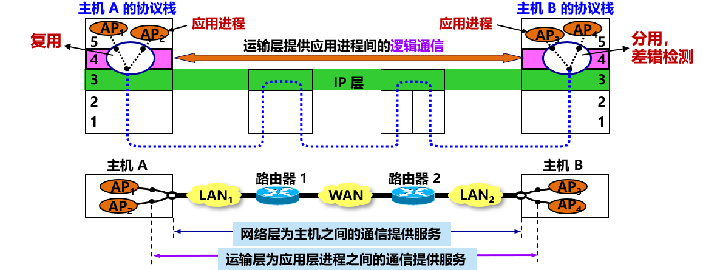
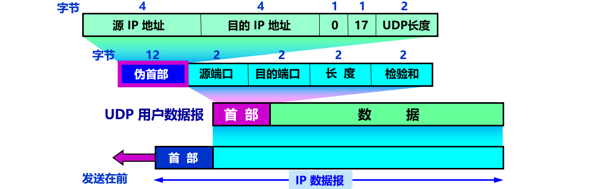
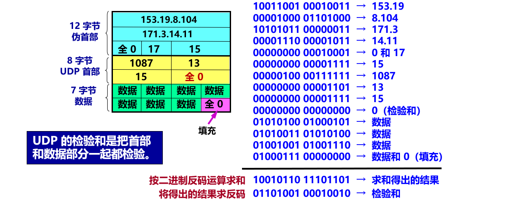
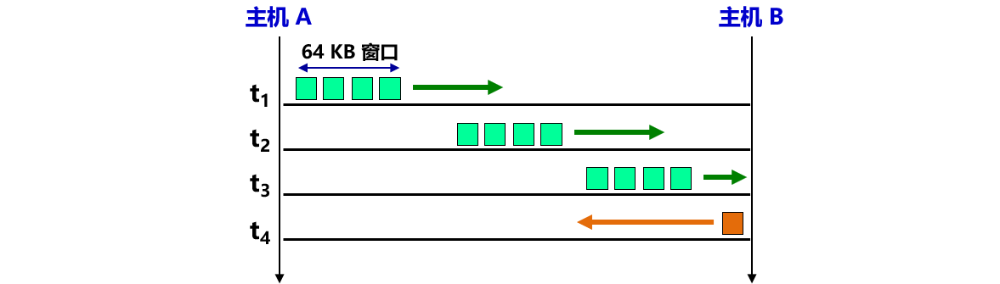
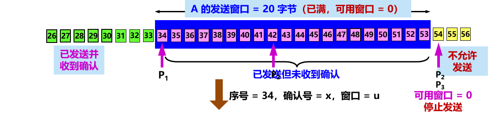

## 5.1 运输层协议概述

### 5.1.1 进程之间的通信

运输层的作用

屏蔽作用
- 运输层向高层用户**屏蔽**了下面网络核心的细节（如网络拓扑、所采用的路由选择协议等），使应用进程看见的就是好像在两个运输层实体之间有一条**端到端的逻辑通信信道**。
  

可靠信道与不可靠信道

### 5.1.2 运输层的两个主要协议
互联网的正式标准：

- 用户数据报协议 **UDP** (User Datagram Protocol)
- 传输控制协议 **TCP** (Transmission Control Protocol)

运输协议数据单元
- 两个对等运输实体在通信时传送的数据单位叫作**运输协议数据单元 TPDU** (Transport Protocol Data Unit)。
- TCP 传送的数据单位协议是 **TCP 报文段** (segment)。
- UDP 传送的数据单位协议是 **UDP 报文**或**用户数据报**。

UDP 与 TCP 的区别
- UDP
  - 传送数据之前不需要先建立连接。
  - 收到 UDP 报后，不需要给出任何确认。
  - 不提供可靠交付，但是一种最有效的工作方式。
- TCP
  - 提供可靠的、面向连接的运输服务。
  - 不提供广播或多播服务。
  - 开销较多。

使用 UDP 和 TCP 的典型应用和应用层协议

### 5.1.3 运输层的端口

- **复用**：应用进程都可以通过运输层再传送到 IP 层（网络层）。
- **分用**：运输层从 IP 层收到发送给应用进程的数据后，必须分别交付给**指明的**各应用进程。

需要考虑的问题
- 进程的创建和撤销都是**动态**的，因此发送方几乎无法识别其他机器上的进程。
- 我们往往需要利用**目的主机**提供的功能来**识别**终点，而**不需要知道**具体实现这个功能的进程是哪一个。
- 有时我们会**改换**接收报文的进程，但并不需要通知所有的发送方。

端口号 (protocol port number)
- 解决方法：在运输层使用**协议端口号** (protocol port number)，或通常简称为**端口** (port)。把端口设为通信的**抽象终点**。

软件端口与硬件端口
- 软件端口
  - 协议栈层间的**抽象**的协议端口。
  - 是应用层的各种协议**进程**与运输**实体**进行层间**交互**的地点。
  - 不同系统实现端口的方法可以不同。
- 硬件端口
  - 不同硬件**设备**进行**交互**的接口。

TCP/IP 运输层端口的标志
- 端口用一个 **16 位端口号**进行标志，允许有 65,535 个不同的端口号。
- 端口号只具有**本地意义**，只是为了标志**本计算机应用层中的各进程**。
- 在互联网中，不同计算机的相同端口号没有联系。

> 由此可见，两个计算机中的进程要互相通信，不仅必须知道对方的端口号，而且还要知道对方的 IP 地址。

两大类、三种类型的端口

常用的熟知端口

## 5.2 用户数据报协议 UDP

### 5.2.1 UDP 概述
- UDP 只在 IP 的数据报服务之上增加了一些功能：
  - 复用和分用
  - 差错检测

UDP 的主要特点
1. **无连接**。发送数据之前不需要建立连接。
2. **使用尽最大努力交付**。即不保证可靠交付。
3. **面向报文**。UDP 一次传送和交付一个完整的报文。
4. **没有拥塞控制**。网络出现的拥塞不会使源主机的发送速率降低。很适合多媒体通信的要求。
5. 支持**一对一**、**一对多**、**多对一**、**多对多**等交互通信。
6. **首部开销小**，只有 8 个字节。

> UDP 通信的特点：简单方便，但不可靠。

UDP 是面向报文的

- **发送方** UDP 对应用层交下来的报文，既不合并，也不拆分，按照样发送。
- **接收方** UDP 对 IP 层交上来的 UDP 用户数据报，去除首部后就原封不动地交付上层的应用进程，一次交付一个完整的报文。

应用程序必须选择合适大小的报文。
- 若报文太长，IP 层在传送时可能要进行分片，降低 IP 层的效率。
- 若报文太短，会使 IP 数据报的首部的相对长度太大，降低 IP 层的效率。

UDP 通信和端口号的关系
- 复用：将 UDP 用户数据报组装成不同的 IP 数据报，发送到互联网。
- 分用：根据 UDP 用户数据报首部中的目的端口号，将数据报分别传送到相应的端口，以便应用进程到端口读取数据。
- 多对一的通信
  
- 一对多的通信
  
- （请注意：运输层之间的这条虚线不是一条连接，表示的是一条逻辑通道）

### 5.2.2 UDP 的首部格式

1. 源端口：源端口号。在需要对方回信时选用。不需要时可用全 0。
2. 目的端口：目的端口号。终点交付报文时必须使用。
3. 长度：UDP 用户数据报的长度，其最小值是 8（仅有首部）。
4. 检验和：检测 UDP 用户数据报在传输中是否有错。有错就丢弃。

> 用户数据报 UDP 有两个字段：数据字段和首部字段。首部字段有 8 个字节，由 4 个字段组成，每个字段都是 2 个字节。
> 

UDP 基于端口的分用

- 接收方 UDP 根据首部中的目的端口号，把报文通过相应的端口上交给应用进程。
- 如果接收方 UDP 发现收到的报文中的目的端口号不正确（即不存在对应于该端口号的应用进程），就丢弃该报文，并由 ICMP 发送“端口不可达”差错报文给发送方。

> 在计算检验和时，临时把 12 字节的“伪首部”和 UDP 用户数据报连接在一起。伪首部仅仅是为了计算检验和。
> 

计算 UDP 检验和的例子

## 5.3 传输控制协议 TCP 概述

### 5.3.1 TCP 最主要的特点
- TCP 是**面向连接**的运输层协议，在无连接的、不可靠的 IP 网络服务基础之上提供**可靠交付**的服务。为此，在 IP 的数据报服务基础之上，增加了保证可靠性的一系列措施。
  

- TCP 是**面向连接**的运输层协议。
- 每一条 TCP 连接**只能有两个端点** (endpoint)，每一条 TCP 连接只能是**点对点**的（一对一）。
- TCP 提供**可靠交付**的服务。
- TCP 提供**全双工**通信。
- **面向字节流**
  - TCP 中的“流”(stream) 指的是流入或流出进程的**字节序列**。
  - 面向字节流：虽然应用程序和 TCP 的交互是一次一个数据块，但 TCP 把应用程序交下来的数据看成仅仅是一连串**无结构的字节流**。

TCP 面向流的概念
- TCP **不保证**接收方应用程序所收到的数据块和发送方应用程序所发出的数据块具有对应大小的关系。
- 但接收方应用程序**收到的字节流**必须和发送方应用程序**发出的字节流**完全一样。

> 
> 

### 5.3.2 TCP 的连接
- TCP 把连接作为**最基本的抽象**。
  
- 每一条 TCP 连接有两个端点。
- TCP 连接的端点：套接字 (socket) 或插口。

套接字 (socket)
- 套接字 $socket = (IP地址 : 端口号)$
- 每一条 TCP 连接**唯一**地被通信两端的两个端点（即**两个套接字**）所确定：
- $TCP 连接 ::= {socket_1, socket_2} = \{(IP_1: port_1)，(IP_2: port_2)\}$

TCP 连接，IP 地址，套接字
- TCP 连接就是由协议软件所提供的一种**抽象**。
- TCP 连接的端点是抽象的**套接字**，即（IP 地址：端口号）。
- 同一个 IP 地址可以有多个**不同**的 TCP 连接。
- 同一个端口号也可以出现在多个**不同**的 TCP 连接中。

Socket 有多种不同的意思
- 应用编程接口 API 称为 socket API, 简称为 socket。
- socket API 中使用的一个函数名也叫作 socket。
- 调用 socket 函数的端点称为 socket。
- 调用 socket 函数时其返回值称为 socket 描述符，可简称为 socket。
- 在操作系统内核中连网协议的 Berkeley 实现，称为 socket 实现。

## 5.4 可靠传输的工作原理
IP 网络提供的是不可靠的传输

理想传输条件的特点
- 传输信道不产生差错。
- 不管发送方以多快的速度发送数据，接收方总是来得及处理收到的数据。

> - 在理想传输条件下，不需要采取任何措施就能够实现可靠传输。
> - **但实际网络都不具备理想传输条件**。必须使用一些可靠传输协议，在不可靠的传输信道实现可靠传输。

### 5.4.1 停止等待协议
- 每发送完一个分组就**停止**发送，**等待**对方的确认。在收到确认后再发送下一个分组。
- 全双工通信的双方既是发送方也是接收方。
- 假设仅考虑 A 发送数据，而 B 接收数据并发送确认。因此 A 叫做**发送方**，而 B 叫做**接收方**。

**无差错情况**

- A 发送完分组 M1 后就暂停发送，等待 B 的确认 (ACK)。
- B 收到 M1 向 A 发送 ACK。
- A 在收到了对 M1 的确认后，就再发送下一个分组 M2。

**出现差错**
- 两种情况：
  1. B 接收 M1 时检测出了**差错**，就丢弃 M1，其他什么也不做（不通知 A 收到有差错的分组）。
  2. M1 在传输过程中**丢失**了，这时 B 当然什么都不知道，也什么都不做。
- 在这两种情况下，**B 都不会发送任何信息**。
  
- 问题：A 如何知道 B 是否正确收到了 M1 呢？
- 解决方法：**超时重传**
  1. A 为每一个已发送的分组设置一个**超时计时器**。
  2. A 只要在超时计时器到期之前收到了相应的确认，就撤销该超时计时器，**继续**发送下一个分组 M2 。
  3. 若 A 在超时计时器规定时间内没有收到 B 的确认，就认为分组错误或丢失，就**重发**该分组。

**确认丢失和确认迟到**

- 确认丢失
  1. 若 B 所发送的对 M1 的确认**丢失**了，那么 A 在设定的超时重传时间内将不会收到确认，因此 A 在超时计时器到期后**重传** M1。
  2. 假定 B 正确收到了 **A 重传**的分组 M1。这时 B 应采取两个行动：
     - (1) **丢弃**这个重复的分组 M1，不向上层交付。
     - (2) **向 A 发送确认**。
- 确认迟到
  1. B 对分组 M1 的确认迟到了，因此 A 在超时计时器到期后**重传** M1。
  2. B 会收到**重复**的 M1，**丢弃**重复的 M1，并**重传**确认分组。
  3. A 会收到重复的确认。对重复的确认的处理：**丢弃**。

**信道利用率**

- 信道利用率：$U = \frac{T_D}{T_D + RTT + T_A}$
- 当往返时间 RTT 远大于分组发送时间 $T_D$ 时，信道的利用率会非常低。
- 优点：简单。缺点：信道利用率太低。

停止等待协议要点
- **停止等待**。发送方每次只发送一个分组。在收到确认后再发送下一个分组。
- **暂存**：在发送完一个分组后，发送方必须暂存已发送的分组的副本，以备重发。
- **编号**。对发送的每个分组和确认都进行编号。
- **超时重传**。发送方为发送的每个分组设置一个超时计时器。若超时计时器超时位收到确认，发送方会**自动**超时重传分组。
- 超时计时器的重传时间应当比数据在分组传输的平均往返时间**更长一些**，防止不必要的重传。
- 简单，但信道利用率太低。

提高传输效率：流水线传输

> 由于信道上一直有数据不间断地传送，
> 流水线传输可获得很高的信道利用率。

> 连续 ARQ 协议和滑动窗口协议采用流水线传输方式。

### 5.4.2 连续 ARQ 协议
- 发送窗口：发送方维持一个发送窗口，位于发送窗口内的分组都可被**连续发送**出去，而不需要等待对方的确认。
- 发送窗口滑动：发送方每收到一个确认，就把发送窗口**向前滑动一个分组的位置**。
- 累积确认：接收方对**按序到达**的**最后**一个分组发送确认，表示：到这个分组为止的所有分组都已正确收到了。

发送窗口

累积确认

- 优点
  - 容易实现，即使确认丢失也不必重传。
- 缺点
  - 不能向发送方反映出接收方已经正确收到的所有分组的信息。

> 连续 ARQ 协议采用 Go-back-N（回退N）。
> Go-back-N（回退N）：表示需要再**退回**来**重传**已发送过的 N 个分组。
> 当通信线路质量不好时，连续 ARQ 协议会带来负面的影响。

## 5.5 TCP 报文段的首部格式
- TCP 虽然是面向字节流的，但 TCP 传送的数据单元却是报文段。
- 一个 TCP 报文段分为首部和数据两部分，而 TCP 的全部功能都体现在它首部中各字段的作用。
- TCP 报文段首部的前 20 个字节是固定的，后面有 4n 字节是根据需要而增加的选项 (n 是整数)。因此 TCP 首部的最小长度是 20 字节。

- 源端口和目的端口：各占 2 字节。端口是运输层与应用层的服务接口。运输层的复用和分用功能通过端口实现。
- 序号：占 4 字节。TCP 连接中传送的数据流中的**每一个字节**都有一个序号。序号字段的值则指的是本报文段**所发送**的数据的**第一个字节**的序号。
  - 现有 5000 个字节的数据。假设报文段的最大数据长度为 1000 个字节，初始序号为 1001。
    - 报文段 1 序号 = 1001 （数据字节序号：1001 ~ 2000）
    - 报文段 2 序号 = 2001 （数据字节序号：2001 ~ 3000）
    - 报文段 3 序号 = 3001 （数据字节序号：3001 ~ 4000）
    - 报文段 4 序号 = 4001 （数据字节序号：4001 ~ 5000）
    - 报文段 5 序号 = 5001 （数据字节序号：5001 ~ 6000）
- 确认号：占 4 字节，是**期望收到**对方的下一个报文段的数据的**第一个字节**的序号。
  - > 记住：若确认号 = N，则表明：到序号 N – 1 为止的所有数据都已正确收到。
- 数据偏移（即首部长度）：占 4 位，指出 TCP 报文段的**数据起始处**距离 TCP **报文段的起始处**有多远。单位是 32 位字（以 4 字节为计算单位）。
- 保留：占 6 位，保留为今后使用，但目前应置为 0。
- 紧急 URG：控制位。当 URG = 1 时，表明紧急指针字段有效，告诉系统此报文段中有紧急数据，应尽快传送 (相当于高优先级的数据)。
- 确认 ACK：控制位。只有当 ACK =1 时，确认号字段才有效。当 ACK =0 时，确认号无效。
- 推送 PSH (PuSH) ：控制位。接收 TCP 收到 PSH = 1 的报文段后，就尽快（即“推送”向前）交付接收应用进程，而不再等到整个缓存都填满后再交付。
- 复位 RST (ReSeT) ：控制位。当 RST=1 时，表明 TCP 连接中出现严重差错（如主机崩溃或其他原因），必须释放连接，然后再重新建立运输连接。
- 同步 SYN (SYNchronization) ：控制位。
  - 同步 SYN = 1 表示这是一个连接请求或连接接受报文。
  - 当 SYN = 1，ACK = 0 时，表明这是一个**连接请求**报文段。
  - 当 SYN = 1，ACK = 1 时，表明这是一个**连接接受**报文段。
- 终止 FIN (FINish) ：控制位。用来释放一个连接。
  - FIN=1 表明此报文段的发送端的数据已发送完毕，并要求释放运输连接。
- 窗口：占 2 字节。
  - 窗口值告诉对方：从本报文段首部中的确认号算起，接收方目前允许对方发送的数据量（以字节为单位）。
  - > 记住：窗口字段明确指出了现在允许对方发送的数据量。窗口值经常在**动态变化**。
- 检验和：占 2 字节。检验和字段检验的范围包括首部和数据这两部分。
  - 在计算检验和时，要在 TCP 报文段的前面加上 12 字节的**伪首部**。
  - 在计算检验和时，临时把 12 字节的“伪首部”和 TCP 报文段连接在一起。伪首部仅仅是为了计算检验和。 
- 紧急指针：占 2 字节。在 URG = 1时，指出本报文段中的紧急数据的字节数（紧急数据结束后就是普通数据），指出了紧急数据的末尾在报文段中的位置。
- 选项：长度可变，最长可达 40 字节。
- 填充：使整个 TCP 首部长度是 4 字节的整数倍。

**选项**
> MSS (Maximum Segment Size)
> 是 TCP 报文段中的数据字段的最大长度。
> 数据字段加上 TCP 首部才等于整个的 TCP 报文段。
> 所以，MSS是“TCP 报文段长度减去 TCP 首部长度”。

选项：长度可变，最长可达 40 字节。—— 长度可变。TCP 最初只规定了一种选项，即最大报文段长度 MSS。MSS 告诉对方 TCP：“我的缓存所能接收的报文段的数据字段的最大长度是 MSS 个字节。”

选项（2）：最大报文段长度 MSS
- 最大报文段长度 MSS (Maximum Segment Size) 是每个 TCP 报文段中的**数据字段**的最大长度。
- 与接收窗口值没有关系。
  

  > TCP 报文段长度 = 数据字段长度 + TCP 首部长度
  > 数据字段长度 = TCP 报文段长度 – TCP 首部长度
- 不能太小
  - 网络利用率降低。
  - 例如：仅 1 个字节。利用率就不会超过1/41。
- 不能太大
  - 开销增大。
  - IP 层传输时要分片，终点要装配。
  - 分片传输出错时，要整个分组。
- 应尽可能大
  - 只要在 IP 层传输时不再分片。
  - 默认值 = 536 字节。
    - 报文段长度 = 536 + 20 = 556 字节。
    - IP 数据报长度 = 576 字节。

选项（3）：窗口扩大
- 
  - TCP 窗口字段长度= 16 位，最大窗口大小 = 64 K 字节。
  - 对于传播时延和带宽都很大的网络，为获得高吞吐率较，需要更大的窗口。
- 
  - **窗口扩大选项**：占 3 字节，其中一个字节表示**移位值 S**。
  - 新的窗口值位数从 16 增大到 (16 + S)，相当于把窗口值向左移动 S 位。
  - 移位值允许使用的**最大值**是 14，窗口最大值增大到 $2^{(16 + 14)} – 1 = 2^{30} – 1$。
  - 窗口扩大选项可以在双方初始建立 TCP 连接时进行协商。

选项（8）：时间戳
- 占 10 字节。最主要的 2 个字段：
  - 时间戳值字段（4字节）和时间戳回送回答字段（4字节）。
- 2 个主要功能：
  1. 计算往返时间 RTT
  2. 防止序号绕回 PAWS (Protect Against Wrapped Sequence numbers)。
     - 序号重复时，为了使接收方能够把**新报文段**和迟到很久的**旧报文段**区分开，可以在报文段中加上时间戳。

## 5.6 TCP 可靠传输的实现

### 5.6.1 以字节为单位的滑动窗口
- TCP 使用流水线传输和滑动窗口协议实现高效、可靠的传输。
- TCP 的滑动窗口是**以字节为单位**的。
- 发送方 A 和接收方 B 分别维持一个**发送窗口**和一个**接收窗口**。
- 发送窗口：在没有收到确认的情况下，发送方可以**连续**把窗口内的数据**全部发送**出去。凡是已经发送过的数据，在未收到确认之前都必须**暂时保留**，以便在超时重传时使用。
- 接收窗口：只允许接收**落入**窗口内的数据。

发送窗口
- A 根据 B 给出的窗口值，构造出自己的发送窗口。
- 发送窗口里面的**序号**表示允许发送的序号。
- 窗口越大，发送方就可以在收到对方确认之前连续发送更多的数据，因而可能获得更高的传输效率。

假定 A 发送了序号为 31 ~ 41 共 11 个字节的数据

- $P_1 = 后沿，P_2 = 当前，P_3 = 前沿$。
- $P_3 – P_1 = A 的发送窗口（又称为通知窗口）$
- $P_2 – P_1 = 已发送但尚未收到确认的字节数$
- $P_3 – P_2 = 允许发送但尚未发送的字节数（又称为可用窗口）$

接收窗口

- B 收到了序号为 32 和 33 的数据，但未收到序号为 31 的数据。
- 因此，因此发送的确认报文段中的确认号是 31（即期望收到的序号）。

窗口的滑动

1. ACK = 1，确认号 = 31，窗口 = 20
2. 序号 = 31，确认号 = x，窗口 = w
3. 前进

- A 未收到确认的**原因**有：① B 未发送；② B已发送，但还未到达 A 。
- 为保证可靠传输，A 只能认为 B 还没有收到这些数据。A 经过一段时间后（由超时计时器控制）就**重传**这部分数据，重新设置超时计时器，直到收到 B 的确认为止。
- 如果 A **按序收到**落在发送窗口内的确认号， 就使发送窗口向前滑动，并发送新的数据。

发送缓存与发送窗口
> 发送方的应用进程把字节流写入 TCP 发送缓存。
> 
> 缓存中的字节数 = 发送应用程序最后写入缓存的字节 - 最后被确认的字节

接收缓存与接收窗口
> 接收方的应用进程从 TCP 接收缓存中读取尚未被读取的字节。
> 
> - 若不能及时读取，缓存最终会被填满，使接收窗口减小到零。
> - 如果能够及时读取，接收窗口就可以增大，但最大不能超过接收缓存的大小。

需要强调三点
- 第一，发送窗口是根据接收窗口设置的，但在同一时刻，发送窗口并**不总是**和接收窗口**一样大**（因为有一定的时间滞后）。
- 第二，TCP 标准**没有规定**对不按序到达的数据应如何处理。通常是先临时存放在接收窗口中，等到字节流中所缺少的字节收到后，再**按序交付**上层的应用进程。
- 第三，TCP 要求接收方必须有**累积确认**的功能，以减小传输开销。接收方可以在合适的时候发送确认，也可以在自己有数据要发送时把确认信息顺便**捎带**上。但接收方**不应过分推迟**发送确认，否则会导致发送方不必要的重传，**捎带确认**实际上并不经常发生。

### 5.6.2 超时重传时间的选择
- TCP 发送方在规定的时间内没有收到确认就要**重传**已发送的报文段。
- 但**重传时间**的选择是 TCP 最复杂的问题之一。
- 互联网环境复杂，IP 数据报所选择的路由变化很大，导致运输层的往返时间 (RTT) 的变化也很大。

TCP 超时重传时间设置
- **不能太短**，否则会引起很多报文段的不必要的重传，使网络负荷增大。
- **不能过长**，会使网络的空闲时间增大，降低了传输效率。

> TCP 采用了一种**自适应算法**，它记录一个报文段发出的时间，以及收到相应确认的时间。
> 这两个时间**之差**就是报文段的**往返时间 RTT**。

加权平均往返时间 $RTT_S$
- 加权平均往返时间 $RTT_S$ 又称为**平滑的往返时间**。
- $新的 RTT_S = (1 - \alpha) \times (旧的 RTT_S) + \alpha \times (新的 RTT 样本)$
  - 其中，$0 \le \alpha \lt 1$。
  - 若 $\alpha \to 0$，表示 RTT 值更新较慢。
  - 若 $\alpha \to 1$，表示 RTT 值更新较快。
  - RFC 6298 推荐的 $\alpha$ 值为 1/8，即 0.125。

超时重传时间 RTO
- RTO (Retransmission Time-Out) 应**略大于**加权平均往返时间 $RTT_S$。
- RFC 6298 建议 RTO：
  - $RTO = RTT_S + 4 \times RTT_D$
  - 其中：RTTD 是 RTT **偏差的加权平均值**。
- RFC 6298 建议 $RTT_D$：
  - $新的RTT_D = (1 - \beta) \times (旧的RTT_D) + \beta \times |RTT_S - 新的 RTT 样本|$
  - 其中：$\beta$ 是个小于 1 的系数，其推荐值是 1/4，即 0.25。

往返时间 (RTT) 的测量相当复杂
- 超时重传报文段后，如何判定此确认报文段是对原来的报文段的确认，还是对重传报文段的确认？

Karn 算法
- 在计算平均往返时间 RTT 时，只要报文段**重传**了，就**不采用**其往返时间样本。
- 新问题：当报文段的时延突然**增大**很多时，在原来得出的重传时间内，不会收到确认报文段，于是就重传报文段。但根据 Karn 算法，不考虑重传的报文段的往返时间样本。这样，超时重传时间就无法更新，造成很多不必要的重传。

修正的 Karn 算法
- 报文段每重传一次，就把 RTO 增大一些：$新的RTO = \gamma \times (旧的RTO)$
- $系数 \gamma 的典型值 = 2$。
- 当**不再发生**报文段的重传时，才根据报文段的往返时延**更新**平均往返时延 RTT 和超时重传时间 RTO 的数值。

### 5.6.3 选择确认 SACK
> 假设最大报文段长度 MSS = 5000 字节，起始序号 = 1。
> 接收方收到了和前面的字节流不连续的两个字节块，缺少序号 1001 ~ 1500 、3001 ~ 3500 、4501~5000 的字节。

- 问题：若收到的报文段无差错，只是未按序号，中间还缺少一些序号的数据，那么能否设法**只传送缺少的数据**而不重传已经正确到达接收方的数据？
- 解决：选择确认 SACK (Selective ACK)

RFC 2018 对 SACK 的规定
- 如果要使用**选择确认**，在建立 TCP 连接时，要在 TCP 首部的选项中加上**允许 SACK** 选项，且双方必须事先商定好。
- 如果使用选择确认，原来首部中的**确认号**的用法仍然不变（累积确认）。只是在 TCP 首部中都增加了 **SACK 选项**，以便报告收到的**不连续的**字节块的**边界**。

## 5.7 TCP 的流量控制

### 5.7.1 利用滑动窗口实现流量控制
- **流量控制** (flow control) ：让发送方的发送速率不要太快，使接收方来得及接收。
- 利用**滑动窗口机制**可以很方便地在 TCP 连接上实现对发送方的流量控制。

利用可变窗口进行流量控制举例，可能发生死锁
> A 向 B 发送数据，MSS = 100 字节。
> 在连接建立时，B 告诉 A：“我的接收窗口 rwnd = 400（字节）”。

持续计时器
- **持续计时器** (persistence timer)：只要 TCP 连接的一方收到对方的**零窗口**通知，就启动该持续计时器。
  - 若持续计时器设置的时间到期，就发送一个**零窗口探测报文段**（仅携带 1 字节的数据），对方在确认这个探测报文段时给出当前窗口值。
  - 若窗口仍然是零，收到这个报文段的一方就重新设置持续计时器。
  - 若窗口不是零，则死锁的僵局就可以打破了。

### 5.7.2 TCP 的传输效率
控制TCP发送报文段的时机：三种机制
1. TCP 维持一个变量，它等于最大报文段长度 MSS。只要缓存中存放的数据达到 MSS 字节时，就组装成一个 TCP 报文段发送出去。
2. 由发送方的应用进程指明要求发送报文段，即 TCP 支持的**推送** (push) 操作。
3. 发送方的一个计时器期限到了，这时就把当前已有的缓存数据装入报文段（但长度不能超过 MSS）发送出去。

> 如何控制 TCP 发送报文段的时机仍然是一个较为复杂的问题。

糊涂窗口综合症：每次仅发送一个字节或很少几个字节的数据时，有效数据传输效率变得很低的现象。

发送方糊涂窗口综合症
- 发送方 TCP **每次接收到一字节**的数据后就发送。
- 发送一个字节需要形成 41 字节长的 IP 数据报。效率很低。
- 解决方法：使用 Nagle 算法。
  

接收方糊涂窗口综合症
> 原因：接收方应用进程消耗数据太慢，例如：每次只读取一个字节。

- 解决方法：让接收方等待一段时间，使得或者接收缓存**已有足够空间**容纳一个最长的报文段，或者等到接收缓存**已有一半空闲的空间**。只要出现这两种情况之一，接收方就发出确认报文，并向发送方通知当前的窗口大小。

> 上述两种方法可配合使用，使得在发送方不发送很小的报文段的同时，接收方也不要在缓存刚刚有了一点小的空间就急忙把这个很小的窗口大小信息通知给发送方。

## 5.8 TCP 的拥塞控制

### 5.8.1 拥塞控制的一般原理
- 在某段时间，若对网络中某资源的需求超过了该资源所能提供的可用部分，网络的性能就要明显变坏，整个网络的吞吐量将随输入负荷的增大而下降。这种现象称为**拥塞** (congestion)。
- 最坏结果：**系统崩溃**。

拥塞产生的原因
- 由许多因素引起。例如：
  - 节点缓存容量太小；
  - 链路容量不足；
  - 处理机处理速率太慢；
  - 拥塞本身会进一步加剧拥塞；
- 出现网络拥塞的条件：$\sum 对资源需求 > 可用资源$

增加资源能解决拥塞吗？
- 例如：
  - 增大缓存，但未提高输出链路的容量和处理机的速度，排队等待时间将会大大增加，引起大量超时重传，解决不了网络拥塞；
  - 提高处理机处理的速率会将瓶颈转移到其他地方；
  - 拥塞引起的重传并不会缓解网络的拥塞，反而会加剧网络的拥塞。

拥塞控制与流量控制的区别
- 拥塞控制
  - 防止过多的数据注入到网络中，避免网络中的路由器或链路过载。
  - 是一个全局性的过程，涉及到所有的主机、路由器，以及与降低网络传输性能有关的所有因素。
- 流量控制
  - 抑制发送端发送数据的速率，以使接收端来得及接收。
  - 点对点通信量的控制，是个端到端的问题。

拥塞控制所起的作用

拥塞控制的一般原理
- 拥塞控制的前提：网络能够**承受**现有的网络负荷。
- 实践证明，拥塞控制是很难设计的，因为它是一个**动态问题**。
- 分组的丢失是网络发生拥塞的**征兆**，而不是原因。
- 在许多情况下，甚至正是**拥塞控制本身**成为引起网络性能恶化、甚至发生死锁的原因。

开环控制和闭环控制
- 开环控制
  - 在设计网络时，事先**考虑周全**，力求工作时不发生拥塞。
  - 思路：力争**避免**发生拥塞。
  - 但一旦整个系统运行起来，就不再中途进行改正了。
- 闭环控制
  - 基于反馈环路的概念。
  - 根据网络**当前运行状态**采取相应控制措施。
  - 思路：在发生拥塞后，采取措施进行控制，**消除**拥塞。

闭环控制措施
- 1，监测：监测网络系统，检测拥塞在何时、何处发生。
  - 主要指标有：
    - 由于缺少缓存空间而被丢弃的分组的百分数；
    - 平均队列长度；
    - 超时重传的分组数；
    - 平均分组时延；
    - 分组时延的标准差，等等。
  - 这些指标的上升都标志着拥塞的增长。
- 2，传送：将拥塞发生的信息传送到可采取行动的地方。
  - 将拥塞发生的信息传送到产生分组的**源站**。
  - 在路由器转发的分组中保留一个比特或字段，用该**比特或字段**的值表示网络没有拥塞或产生了拥塞。
  - **周期性**地发出探测分组等。
- 3，调整：调整网络系统的运行以解决出现的问题。
  - 过于频繁，会使系统产生不稳定的振荡。
  - 过于迟缓，不具有任何实用价值。
  - 选择正确的时间常数是相当困难的。

### 5.8.2 TCP 的拥塞控制方法
- TCP 采用基于**滑动窗口的方法**进行拥塞控制，属于闭环控制方法。
- TCP 发送方维持一个**拥塞窗口 cwnd** (Congestion Window)
- 拥塞窗口的大小取决于网络的拥塞程度，并且是**动态变化**的。
- 发送端利用拥塞窗口根据网络的拥塞情况调整发送的数据量。
- 发送窗口大小不仅取决于接收方窗口，还取决于网络的拥塞状况。
- 真正的发送窗口值：$真正的发送窗口值 = \min (接收方通知的窗口值，拥塞窗口值)$

控制拥塞窗口变化的原则
- 只要网络没有出现拥塞，拥塞窗口就可以再增大一些，以便把更多的分组发送出去，提高网络的利用率。
- 但只要网络出现拥塞或有可能出现拥塞，就必须把拥塞窗口减小一些，以减少注入到网络中的分组数，缓解网络出现的拥塞。

发送方判断拥塞的方法：隐式反馈
- 超时重传计时器超时：网络已经出现了拥塞。
- 收到 3 个重复的确认：预示网络可能会出现拥塞。

> 因传输出差错而丢弃分组的**概率很小**（远小于1 %）。
> 因此，发送方在超时重传计时器启动时，**就判断网络出现了拥塞**。

TCP 拥塞控制算法
- 四种拥塞控制算法（ RFC 5681） ：
  - 慢开始 (slow-start)
  - 拥塞避免 (congestion avoidance)
  - 快重传 (fast retransmit)
  - 快恢复 (fast recovery)

**慢开始 (Slow start)**
- 目的：探测网络的负载能力或拥塞程度。
- 算法：由小到大逐渐增大注入到网络中的数据字节，即：由小到大逐渐**增大拥塞窗口**数值。
- 2 个控制变量：
  - 拥塞窗口 cwnd
    - 初始值：2 种设置方法。
      - 1 至 2 个最大报文段 MSS （旧标准）
      - 2 至 4 个最大报文段 MSS（RFC 5681）
  - 慢开始门限 ssthresh
    - 防止拥塞窗口增长过大引起网络拥塞。
- 拥塞窗口 cwnd 增大：在每收到一个**对新的报文段的确认**，就把拥塞窗口增加最多一个**发送方的最大报文段 SMSS** (Sender Maximum Segment Size) 的数值。
  - $拥塞窗口 cwnd 每次的增加量 = \min (N, SMSS)$
  - 其中 N 是原先未被确认的、但现在被刚收到的确认报文段所确认的字节数。

> 发送方每收到一个对新报文段的确认（重传的不算在内）就使 cwnd 加 1。

传输轮次（transmission round）
- **一个传输轮次**所经历的时间其实就是**往返时间 RTT**。
- **传输轮次强调**：把拥塞窗口 cwnd 所允许发送的报文段都连续发送出去，并收到了对已发送的最后一个字节的确认。
- 例如：拥塞窗口 cwnd = 4，这时的往返时间 RTT 就是发送方连续发送 4 个报文段，并收到这 4 个报文段的确认，总共经历的时间。

慢开始门限 ssthresh
- 防止拥塞窗口 cwnd 增长过大引起网络拥塞。
- 用法：
  - 当 cwnd < ssthresh 时，使用慢开始算法。
  - 当 cwnd > ssthresh 时，停止使用慢开始算法，改用拥塞避免算法。
  - 当 cwnd = ssthresh 时，既可使用慢开始算法，也可使用拥塞避免算法。

**拥塞避免**
- 目的：让拥塞窗口 cwnd **缓慢地**增大，**避免**出现拥塞。
- 拥塞窗口 cwnd 增大：**每经过一个往返时间 RTT**（不管在此期间收到了多少确认），发送方的拥塞窗口 cwnd = cwnd + 1。
- 具有**加法增大 AI** (Additive Increase) 特点：使拥塞窗口 cwnd 按**线性**规律缓慢增长。

> 注意：
> 拥塞避免并非完全避免拥塞，而是让拥塞窗口增长得缓慢些，使网络不容易出现拥塞。

> 每经过一个往返时间 RTT，发送方就把拥塞窗口 cwnd 加 1。

当网络出现拥塞时
- 无论在慢开始阶段还是在拥塞避免阶段，只要发送方判断网络出现拥塞（重传定时器超时）：
  - $ssthresh = \max (cwnd/2，2)$
  - cwnd = 1
  - 执行慢开始算法
- 目的：迅速减少主机发送到网络中的分组数，使得发生拥塞的路由器有足够时间把队列中积压的分组处理完毕。

慢开始和拥塞避免算法的实现举例

- 当 TCP 连接进行初始化时，将拥塞窗口置为 1（窗口单位不使用字节而使用报文段）。
- 将慢开始门限的初始值设置为 16 个报文段，即 ssthresh = 16。
- 开始执行慢开始算法时，拥塞窗口 cwnd=1，发送第一个报文段。
- 发送方每收到一个对新报文段的确认 ACK，就把拥塞窗口值加 1，因此拥塞窗口 cwnd 随着往返时延 RTT 按指数规律增长。
- 当拥塞窗口 cwnd 增长到慢开始门限值 ssthresh 时，改为执行拥塞避免算法，拥塞窗口按线性规律增长。
- 当拥塞窗口 cwnd = 24 时，网络出现了超时，发送方判断为网络拥塞。调整门限值 ssthresh = cwnd / 2 = 12，同时设置拥塞窗口 cwnd = 1，进入慢开始阶段。
- 按照慢开始算法，发送方每收到一个对新报文段的确认 ACK，就把拥塞窗口值加 1。当拥塞窗口 cwnd = ssthresh = 12 时，改为执行拥塞避免算法，拥塞窗口按线性规律增大。
- 当拥塞窗口 cwnd = 16 时，发送方连续收到 3 个对同一个报文段的重复确认（记为 3-ACK）。发送方改为执行**快重传**和**快恢复**算法。

**快重传** FR (Fast Retransmission) 算法
- 目的：让发送方**尽早**知道发生了个别报文段的丢失。
- 发送方只要连续收到**三个重复的确认**，就**立即进行重传**（即“快重传”），这样就不会出现超时。
- 使用快重传可以使整个网络的吞吐量提高约 20%。
- 快重传算法要求接收方**立即发送确认**，即使收到了失序的报文段，也要立即发出对已收到的报文段的重复确认。

> 注意：
> 快重传并非取消重传计时器，而是在某些情况下可以更早地（更快地）重传丢失的报文段。

快重传举例

**快恢复** FR (Fast Recovery)算法
- 当发送端收到连续三个重复的确认时，**不执行**慢开始算法，而是执行**快恢复算法 FR** (Fast Recovery) 算法：
  - 慢开始门限 ssthresh = 当前拥塞窗口 cwnd / 2 ；
  - 乘法减小 MD (Multiplicative Decrease) 拥塞窗口。
    - 新拥塞窗口 cwnd = 慢开始门限 ssthresh ；
  - 执行拥塞避免算法，使拥塞窗口缓慢地线性增大（加法增大 AI）。

> 二者合在一起就是所谓的 AIMD 算法，使 TCP 性能有明显改进。

慢开始和拥塞避免算法的实现举例

- 当拥塞窗口 cwnd = 16 时，发送方连续收到 3 个对同一个报文段的重复确认（记为 3-ACK）。发送方改为执行**快重传**和**快恢复**算法。
- 执行**快重传**和**快恢复**算法：发送方调整门限值 ssthresh = cwnd / 2 = 8，设置拥塞窗口 cwnd = ssthresh = 8，开始执行拥塞避免算法。

TCP 拥塞控制流程图

发送窗口的上限值
- $发送窗口的上限值 = \min [rwnd, cwnd]$
- 当 $rwnd < cwnd$ 时，是接收方的**接收能力**限制发送窗口的最大值。
- 当 $cwnd < rwnd$ 时，是**网络拥塞**限制发送窗口的最大值。

### 5.8.3 主动队列管理 AQM
- TCP 拥塞控制和网络层采取的策略有密切联系。
- 例如：
  - 若路由器对某些分组的处理时间特别长，就可能引起发送方 TCP 超时，对这些报文段进行重传。
  - 重传会使 TCP 连接的发送端认为在网络中发生了拥塞，但实际上网络并没有发生拥塞。
- 对 TCP 拥塞控制**影响最大**的就是路由器的**分组丢弃策略**。

“先进先出”FIFO 处理规则
- **先进先出FIFO** (First In First Out) 处理规则：
- **尾部丢弃策略** (tail-drop policy)：当队列已满时，以后到达的所有分组（如果能够继续排队，这些分组都将排在队列的尾部）将都被丢弃。
- 路由器的尾部丢弃往往会导致一连串分组的丢失，这就使发送方出现超时重传，使 TCP 进入拥塞控制的慢开始状态，结果使 TCP 连接的发送方突然把数据的发送速率降低到很小的数值。

先进先出（FIFO）处理规则与尾部丢弃策略
> 在最简单的情况下，路由器队列通常采用
> 先进先出 (FIFO) 处理规则与尾部丢弃策略 (tail-drop policy)。
> 当队列已满时，以后到达的所有分组将都被丢弃。

> 分组丢弃使发送方出现超时重传，使 TCP 连接进入慢开始状态。

严重问题：全局同步
> 若路由器进行了尾部丢弃，
> 所有到达的分组都被丢弃，不论它们属于哪个 TCP 连接。

> 分组丢弃使发送方出现超时重传，使多个 TCP 连接同时进入慢开始状态，
> 发生全局同步 (global syncronization)。

主动队列管理 AQM
- 1998 年提出了主动队列管理 AQM (Active Queue Management)。
- 主动：不要等到路由器的队列长度已经达到最大值时才不得不丢弃后面到达的分组，而是在队列长度**达到某个值得警惕的数值时**（即当网络拥塞有了某些拥塞征兆时），就**主动丢弃**到达的分组。
- AQM 可以有不同实现方法，其中曾流行多年的就是**随机早期检测 RED** (Random Early Detection)。

随机早期检测 RED
- 路由器队列维持两个参数：
  - 队列长度**最小**门限 $TH_{min}$
  - 队列长度**最大**门限 $TH_{max}$ 。
- RED 对每一个到达的分组都先计算平均队列长度 LAV 。
  - 若平均队列长度**小于最小**门限 $TH_{min}$，则将新到达的分组放入队列进行排队。
  - 若平均队列长度**超过最大**门限 $TH_{max}$ ，则将新到达的分组丢弃。
  - 若平均队列长度**介于**在最小门限 $TH_{min}$ 和最大门限 $TH_{ax}$ **之间**，则按照某一**概率 p** 将新到达的分组丢弃。

RED 路由器到达队列维持两个参数：$Th_{min}$， $Th_{max}$，分成为三个区域：

RED 对每一个到达的分组都先计算平均队列长度 $L_{AV}$ 。
- 当 $L_{AV} < Th_{min}$ 时，丢弃概率 $p = 0$。
- 当 $L_{AV} > Th_{max}$ 时，丢弃概率 $p = 1$。
- 当 $Th_{min} \le L_{AV} \le Th_{max}$ 时，丢弃概率 p： $0 < p < 1$ 。

> 困难：丢弃概率 p 的选择，因为 p 并不是个常数。
> 例如，按线性规律变化，从 0 变到 $p_{max}$。

- 多年的实践证明，RED 的使用效果并不太理想。
- 2015 年公布的 RFC 7567 已经把 RFC 2309 列为“陈旧的”，并且不再推荐使用 RED。
- 但对路由器进行主动队列管理 AQM 仍是必要的。
- AQM 实际上就是对路由器中的分组排队进行**智能管理**，而不是简单地把队列的尾部丢弃。
- 现在已经有几种不同的算法来代替旧的 RED，但都还在实验阶段。

## 5.9 TCP 的运输连接管理
- TCP 是面向连接的协议。
- TCP 连接有三个阶段：
  - 连接建立
  - 数据传送
  - 连接释放
- TCP 的连接**管理**就是使 TCP 连接的建立和释放都能正常地进行。

TCP 连接建立过程中要解决的三个问题
1. 要使每一方能够确知对方的**存在**。
2. 要允许双方**协商**一些参数（如最大窗口值、是否使用窗口扩大选项和时间戳选项以及服务质量等）。
3. 能够对运输实体资源（如缓存大小、连接表中的项目等）进行**分配**。

> - TCP 连接的建立采用**客户服务器**方式。
> - **主动发起**连接建立的应用进程叫做**客户** (client)。
> - **被动等待**连接建立的应用进程叫做**服务器** (server)。

### 5.9.1 TCP 的连接建立
- TCP 建立连接的过程叫做**握手**。
- 采用**三报文握手**：在客户和服务器之间交换三个 TCP 报文段，以防止已失效的连接请求报文段突然又传送到了，因而产生 TCP 连接建立错误。

TCP 的连接建立：采用三报文握手（采用三报文握手建立 TCP 连接的各个状态）

- B 的 TCP 服务器进程**先创建**传输控制块 TCB，准备接受客户进程的连接请求。
- A 的 TCP 向 B 主动发出连接请求报文段，其首部中的同步位 SYN = 1，并选择序号 seq = x，表明传送数据时的第一个数据字节的序号是 x。
  > 注意：TCP规定，SYN 报文段（即SYN = 1的报文段）**不能携带数据**，但要消耗掉一个序号。
- B 的 TCP 收到连接请求报文段后，如同意，则发回确认。
- B 在确认报文段中应使 SYN = 1，使 ACK = 1，其确认号 ack = x + 1，自己选择的序号 seq = y。
  > 这个报文段也**不能携带数据**，但同样要消耗掉一个序号。
- A 收到此报文段后向 B 给出确认，其 ACK = 1，确认号 ack = y + 1。
- A 的 TCP 通知上层应用进程，连接已经建立。
  > TCP 标准规定：**ACK 报文段可以携带数据**。
  > 但如果不携带数据，则不消耗序号。下一个数据报文段的序号仍是 seq = x + 1。
- B 的 TCP 收到主机 A 的确认后，也通知其上层应用进程：TCP 连接已经建立。双方可以开始数据传送。

### 5.9.2 TCP 的连接释放
- TCP 连接释放过程比较复杂。
- 数据传输结束后，通信的**双方**都可释放连接。
- TCP 连接释放过程是**四报文握手**。

TCP 的连接释放：采用四报文握手

- A 的应用进程先向其 TCP 发出连接释放报文段，并停止再发送数据，**主动关闭** TCP 连接。
- A 把连接释放报文段首部的 FIN = 1，其序号seq = u，等待 B 的确认。
  > TCP规定：FIN 报文段即使不携带数据，也消耗掉一个序号。
- B 发出确认，ACK=1，确认号 ack = u+1，这个报文段的序号 seq = v。
- TCP 服务器进程通知高层应用进程。
- 从 A 到 B 这个方向的连接就释放了，TCP 连接处于**半关闭** (half-close) 状态。B 若发送数据，A 仍要接收。
- 若 B 已经没有要向 A 发送的数据，其应用进程就通知 TCP 释放连接。
- FIN=1，ACK=1，确认号 ack = u+1。
- A 收到连接释放报文段后，必须发出确认。
- ACK=1，确认号 ack=w+1，自己的序号 seq = u + 1
- 请注意：此时 TCP 连接还没有释放掉。必须经过**时间等待计时器** (TIME-WAIT timer) 设置的时间 **2MSL** 后，A 才释放 TCP 连接。

必须等待 2MSL 的时间
- 第一，保证发送的**最后一个 ACK** 报文段能够到达 B。
- 第二，防止“已失效的连接请求报文段”出现在本连接中。

保活计时器
- 用来**防止**在 TCP 连接出现**长时期空闲**。
- 通常设置为 2 小时 。
- 若服务器过了 2 小时还没有收到客户的信息，它就发送**探测**报文段。
- 若发送了 10 个探测报文段（每一个相隔 75 秒）还没有响应，就假定客户出了故障，因而就**终止**该连接。

### 5.9.3 TCP 的有限状态机

