## 7.1 网络安全问题概述

### 7.1.1 计算机网络面临的安全性威胁
两大类威胁：**被动攻击**和**主动攻击**。
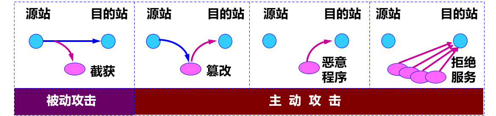

被动攻击
- 指攻击者从网络上**窃听**他人的通信内容。
- 通常把这类攻击称为**截获**。
- 攻击者只是观察和分析某一个协议数据单元 PDU，以便了解所交换的数据的某种性质，但**不干扰**信息流。
- 这种被动攻击又称为**流量分析** (traffic analysis)。

主动攻击
- 篡改：故意篡改网络上传送的报文。这种攻击方式有时也称为**更改报文流**。
- 恶意程序 (rogue program)：种类繁多，主要包括：计算机病毒、计算机蠕虫、特洛伊木马、逻辑炸弹、后门入侵、流氓软件等。
- 拒绝服务 DoS (Denial of Service)：指攻击者向互联网上的某个服务器不停地发送大量分组，使该服务器无法提供正常服务，甚至完全瘫痪。

分布式拒绝服务 DDoS
- 若从互联网上的成百上千的网站**集中攻击**一个网站，则称为**分布式拒绝服务 DDoS** (Distributed Denial of Service)。
- 有时也把这种攻击称为**网络带宽攻击**或**连通性攻击**。

计算机网络通信安全的目标
- 对于主动攻击，可以采取适当措施加以检测。
- 对于被动攻击，通常是检测不出来的。
- 计算机网络通信安全的目标：
  - 防止分析出报文内容和流量分析。
  - 防止恶意程序。
  - 检测更改报文流和拒绝服务。
- 对付被动攻击：**加密**技术。
- 对付主动攻击：**加密**技术 + **鉴别**技术。

### 7.1.2 安全的计算机网络
- 网络的安全性是不可判定的。
- 一个安全的计算机网络应达到四个目标：
1. 保密性
   - 只有信息的发送方和接收方才能懂得所发送信息的内容。
   - 是网络安全通信的**最基本**的内容，也是对付**被动攻击**必须具备的功能。
   - 需要使用各种密码技术。
2. 端点鉴别
   - 鉴别信息的发送方和接收方的**真实身份**。
   - 在对付**主动攻击**中是非常重要的。
3. 信息的完整性
   - 信息的内容**未被篡改过**。
   - 在应对**主动攻击**中是必不可少的。
   - 信息的完整性与端点鉴别往往是不可分割的。
   - 鉴别同时包含了**端点鉴别**和**报文完整性**。
4. 运行的安全性
   - 系统能正常运行并提供服务。
   - **访问控制** (access control) 对计算机系统的安全性是非常重要的。
   - 必须对访问网络的权限加以控制，并规定每个用户的访问权限。

### 7.1.3 数据加密模型
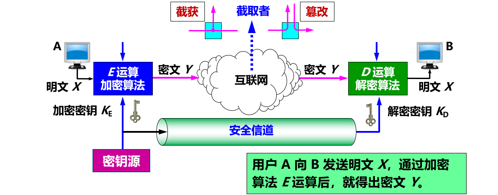

密钥
- 加密和解密用的密钥 K (key) 是一串秘密的字符串（即比特串）。
- 明文通过加密算法 E 和加密密钥 K 变成密文Y：
  - $Y = E_{K}(X)$
- 接收端利用解密算法 D 运算和解密密钥 K 解出明文 X。解密算法是加密算法的逆运算。
  - $D_{K}(Y) = D_{K}(E_{K}(X)) = X$

> - 加密密钥和解密密钥可以一样，也可以不一样。
> - 密钥通常由**密钥中心**提供。
> - 当密钥需要向远地传送时，一定要通过另一个**安全信道**。

一些重要概念
- 密码编码学 (cryptography) ：密码体制的设计学。
- 密码分析学 (cryptanalysis) ：在未知密钥的情况下从密文推演出明文或密钥的技术。
- 密码编码学与密码分析学合起来即为密码学 (cryptology)。

- 如果不论截取者获得了多少密文，但在密文中都没有足够的信息来唯一地确定出对应的明文，则这一密码体制称为**无条件安全的**，或称为**理论上是不可破的**。
- 如果密码体制中的密码**不能**被可使用的**计算资源破译**，则这一密码体制称为在**计算上是安全的**。

## 7.2 两类密码体制

### 7.2.1 对称密钥密码体制
**加密密钥**与**解密密钥**都使用**相同密钥**的密码体制。
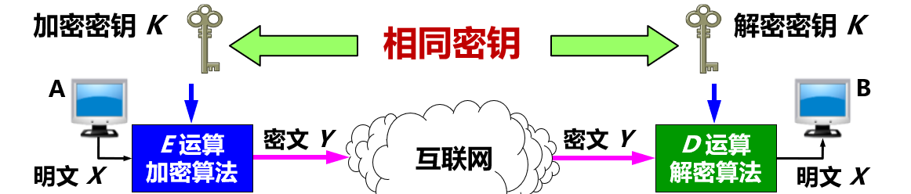

数据加密标准 DES
- DES 属于**对称密钥密码体制**，是一种**分组密码**。
- 在加密前，先对整个明文进行分组。每一个组长为 64 位。
- 然后对每一个 64 位 二进制数据进行加密处理，产生一组 64 位密文数据。
- 最后将各组密文**串接**起来，即得出整个的密文。
- 使用的密钥为 64 位（实际密钥长度为 56 位，有 8 位用于奇偶校验)。

DES 的保密性
- 仅取决于对**密钥的保密**，其算法是公开的。
- 严重问题：DES 密钥长度较短。
- 现在已经设计出搜索 DES 密钥的专用芯片。56 位 DES 已不再认为是安全的了。

三重 DES
- 使用两个 56 位的密钥。
- 把一个 64 位明文用一个密钥加密，再用另一个密钥解密，然后再使用第一个密钥加密，即
  - $Y = DES_{K_{1}}(DES_{K_{2}}^{-1}(DES_{K_{1}}(X)))$
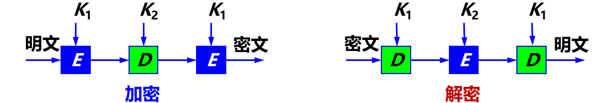

高级加密标准 AES
- 2002 年成为美国政府加密标准。现在是 ISO/IEC 18033-3 标准。
- **高级加密标准 AES**（Advanced Encryption Standard）是一种分组密码，分组长度为 128 位。
- 有三种加密标准，其密钥分别为 128 位、192 位和 256 位。
- 加密步骤复杂，运算速度比 3DES 快得多，安全性也大大加强。

### 7.2.2 公钥密码体制
- 又称为**公开密钥密码体制**。
- 使用**不同**的**加密密钥**与**解密密钥**。
- 这种加密体制又称为**非对称密钥密码体制**。
- 公钥密码体制产生的主要原因：
- 对称密钥密码体制的**密钥分配**问题。
- 对**数字签名**的需求。
- 典型：**RSA** 体制，一种基于数论中的大数分解问题的体制。

公钥密码体制
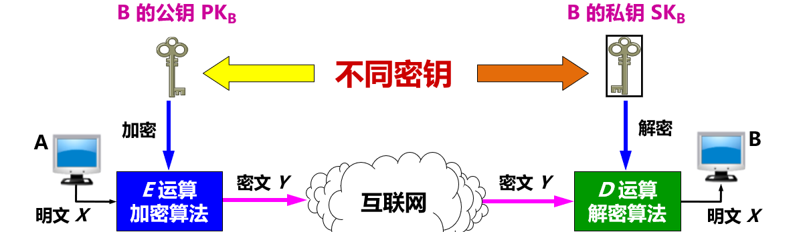

加密密钥与解密密钥
- 加密密钥 PK（public key，即公钥）：公开。
- **解密密钥** SK（secret key，即私钥或秘钥）：**需要保密**。
- 加密算法 E 和解密算法 D ：公开。
- 虽然私钥 SK 是由公钥 PK 决定的，但却不能根据 PK 计算出 SK。

公钥算法的特点
- 密钥对产生器产生出接收者 B 的**一对密钥**：
  - 加密密钥 $PK_{B}$ 和 解密密钥 $SK_{B}$ 。
  - **加密密钥** $PK_{B}$ 就是接收者 B 的**公钥**，向公众公开。
  - **解密密钥** $SK_{B}$ 就是接收者 B 的**私钥**，对其他任何人都保密。
- 发送者 A 用 B 的**公钥** $PK_{B}$ 对明文 X **加密**（E 运算），然后发送给 B。
  - $Y = E_{PK_{B}}(X)$
- 接收者 B 用自己的**私钥** $SK_{B}$ **解密**（D 运算），即可恢复出明文：
  - $D_{SK_{B}}(Y) = D_{SK_{B}}(E_{PK_{B}}(X)) = X$
- 从已知的 $PK_{B}$ 实际上**不可能推导出** $SK_{B}$，即从 $PK_{B}$ 到 $SK_{B}$ 是“**计算上不可能的**”。
- 加密密钥是公开的，但**不能用来解密**，即：
  - $D_{PK_{B}}(E_{PK_{B}}(X)) \neq X$
- 加密和解密运算可以**对调**，即加密和解密是**互逆**的：
  - $E_{PK_{B}}(D_{SK_{B}}(X)) = D_{SK_{B}}(E_{PK_{B}}(X)) = X$

公开密钥与对称密钥的区别
- 使用对称密钥：
  - 在通信信道上可以进行**一对一**的**双向**保密通信。
  - 这种保密通信仅限于持有此密钥的双方。
- 使用公开密钥：
  - 在通信信道上可以是**多对一**的**单向**保密通信。
  - 例如：很多顾客都向同一个网站发送各自的信用卡信息。

> 任何加密方法的安全性取决于**密钥的长度**，以及攻破密文所需的**计算量**。

> 公钥加密算法的开销较大，不会使传统密码体制被弃用。

## 7.3 鉴别

### 7.3.1 报文鉴别
- 鉴别 (authentication) 是网络安全中一个很重要的问题。
- 鉴别包括：
  - 实体鉴别
    - 鉴别发信者，防止冒充者。
    - 实体：发信的人或进程。
    - 也常称为端点鉴别。
  - 鉴别报文的完整性
    - 报文未被他人篡改过。

> 报文鉴别通常包含：鉴别报文的发送者，鉴别报文的完整性。

- 鉴别与加密不同
  - 加密可以实现鉴别。
  - 但许多报文不需要加密，但需要鉴别。
- 鉴别与授权不同
  - 授权 (authorization) 涉及的问题是：所进行的过程是否被允许（如是否可以对某文件进行读或写）。

**用数字签名进行鉴别（原理）**
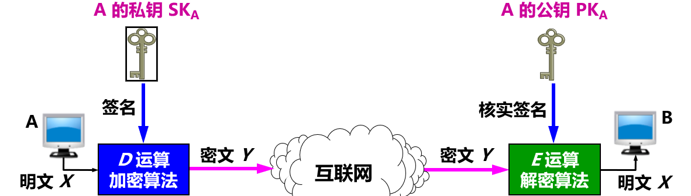
- 鉴别发送者：
  - A 用其私钥 $SK_{A}$ 对报文 X 进行 D 运算得到的密文。B 为了核实签名，用 A 的公钥 $PK_{A}$ 进行 E 运算，还原出明文 X。
- 鉴别报文：
  - 由于无法得到并使用 A 的私钥 $SK_{A}$ 对报文 X 进行 D 运算，B 对收到的报文进行核实签名的 E 运算将会得出不可读的明文，可以发现报文已被篡改过。
- 不可否认：
  - A 要抵赖曾发送报文给 B，B 可把 X 及 $D_{SK_{A}}(X)$ 出示给进行公证的第三者。第三者很容易用 $PK_{A}$ 去证实 A 确实发送 X 给 B。

数字签名的三个功能：
- 实体鉴别：证明来源。
- 报文鉴别：防篡改，保证完整性。
- 不可否认：防抵赖。

> 关键：没有其他人能够持有 A 的私钥 SKA。

可保证机密性的数字签名
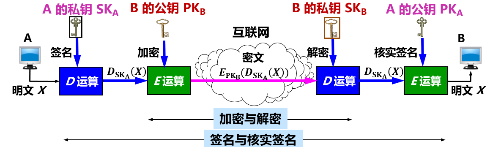
- 先后进行**两次 D 运算**和**两次 E 运算**，运算量太大，花费非常多的 CPU 时间。目前普遍使用开销小得多的对称密钥加密。
- 要实现数字签名必须使用公钥密码，但一定要设法减小公钥密码算法的开销。

**密码散列函数**
- 散列函数（又称为杂凑函数，哈希函数）在计算机领域中广泛使用。
- 符合密码学要求的散列函数又常称为**密码散列函数** (cryptographic hash function)。
- 密码散列函数 H(X) 应具有以下四个特点：
  1. 结果的长度应较短和固定。
  2. 应具有很好的抗碰撞性，避免不同的输入产生相同的输出。
  3. 应是单向函数(one-way function)，不能逆向变换。
  4. 其他特性：输出的每一个比特都与输入的每一个比特有关；仅改动输入的一个比特，输出也会相差极大；包括许多非线性运算等。

密码散列函数是单向的
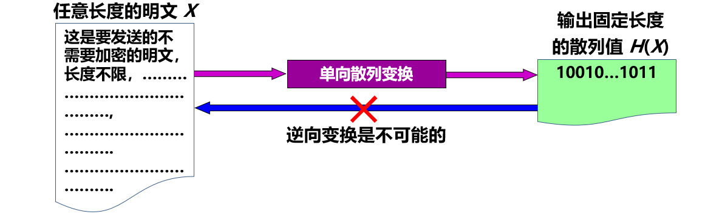

实用的单向密码散列函数
- MD5：Message Digest 5，**报文摘要**的第 5 个版本。
- SHA-1：Secure Hash Algorithm，**安全散列算法**。
- SHA-1 比 MD5 更安全，但计算起来却比 MD5 要慢些。
- 1995 年发布的新版本 SHA-1 `[RFC 3174]` 在安全性方面有了很大的改进。

MD5 算法
- MD5 的设计者 Rivest 曾提出一个猜想：
  > 根据给定的 MD5 报文摘要代码，要找出一个与原来报文有相同报文摘要的另一报文，其难度在计算上几乎是不可能的。
- 基本思想：用足够复杂的方法，使报文摘要代码中的每一位都与原来报文中的每一位有关。

MD5 算法计算步骤
1. 附加：把任意长的报文按模 $2^{64}$ 计算其余数（64位），追加在报文的后面。
2. 填充：在报文和余数之间填充 1～512 位，使得填充后的总长度是 512 的整数倍。填充的首位是 1，后面都是 0。
   - 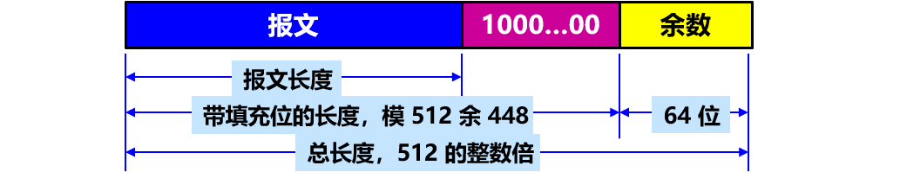
3. 分组：把追加和填充后的报文分割为多个 512 位的数据块，每个 512 位的报文数据再分成 4 个 128 位的数据块。
4. 计算：将 4 个 128 位的数据块依次送到不同的散列函数进行 4 轮计算。每一轮又都按 32 位的小数据块进行复杂的运算。一直到最后计算出 MD5 报文摘要代码（128 位）。
   > 在2004年，中国学者王小云发表了轰动世界的密码学论文，证明可以用系统的方法找出一对报文，这对报文具有相同的 MD5 报文，而这仅需 15 分钟，或不到 1 小时。MD5 的安全性就产生了动摇。随后，又有许多学者开发了对 MD5 实际的攻击。MD5 最终被安全散列算法 SHA 标准所取代。

安全散列算法 SHA-1
- **安全散列算法 SHA** (Secure Hash Algorithm)：由美国标准与技术协会 NIST 提出的一个散列算法系列。
- 和 MD5 相似，但其散列值的长度为 **160 位**。
- SHA-1 也是先把输入报文划分为许多 512 位长的数据块，然后经过复杂运算后得出散列值。

> 但 SHA-1 后来也被证明其实际安全性并未达到设计要求，并且也曾被王小云教授的研究团队攻破。谷歌也宣布了攻破 SHA-1 的消息。许多组织都已纷纷宣布停用 SHA-1。
- SHA-1 已被 SHA-2、SHA-3 所替代。
- SHA-2 的多种变型：
  - SHA-224，SHA-256，SHA-384，SHA-512。
- SHA-3 的多种变型：
  - SHA3-224，SHA3-256，SHA3-384，SHA3-512。
- SHA-3 采用了与 SHA-2 完全不同的散列函数。

> 目前，密码学家尚无法把一个任意已知的报文 X，篡改为具有同样 MD5 或 SHA-1 散列值的另一报文 Y。

**用报文鉴别码实现报文鉴别**
- 散列函数问题：可以**防篡改**，但**不能防伪造**，不能真正实现报文鉴别。
  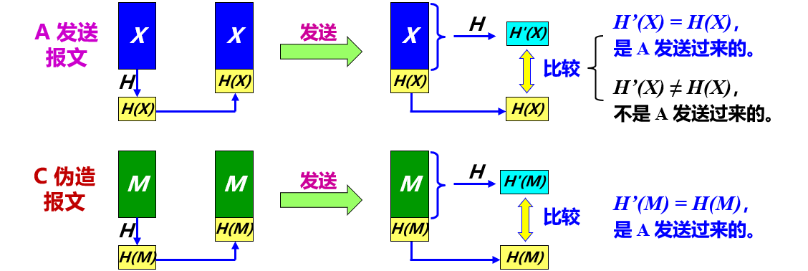
- 解决方法：采用报文鉴别码 MAC。
  > 把双方共享的密钥 K 与报文 X 进行拼接，然后进行散列运算。
  > 散列运算得出的结果为固定长度的 H(X + K)，称为报文鉴别码 MAC (Message Authentication Code)。

用报文鉴别码 MAC 鉴别报文
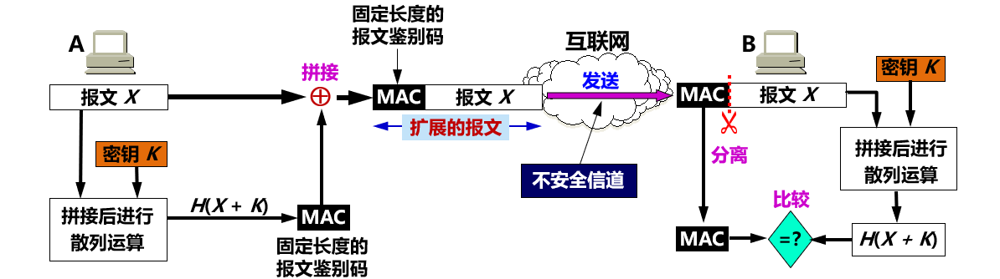
- 只要入侵者不掌握密钥 K，就无法伪造 A 发送的报文（因为无法伪造 A 的 MAC）。
- 鉴别过程并没有执行加密算法，消耗的计算资源少。

> 这样的报文鉴别码称为**数字签名**或**数字指纹**。

HMAC 与 MAC 不同
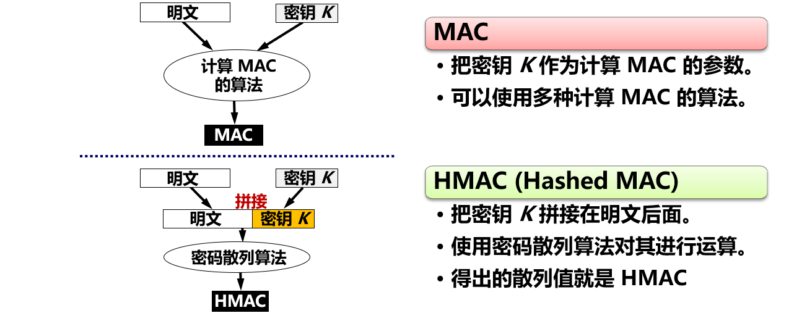

使用已签名的报文鉴别码 MAC 对报文鉴别
- 问题：如何分发共享密钥 K？ 解决：采用公钥系统。

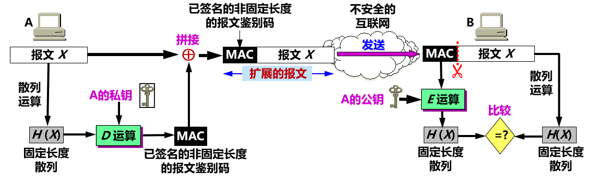
- 没有对报文进行加密，而是对很短的散列 H(X) 进行 D 运算。
- 入侵者没有 A 的私钥，因此不可能伪造出 A 发出的报文。

> - 所得到的扩展报文：不可伪造，不可否认。
> - 可简称为：“A 用自己的私钥进行签名，B 用 A 的公钥进行鉴别”。

### 7.3.2 实体鉴别
- 实体鉴别与报文鉴别不同。
- 报文鉴别：对**每一个**收到的报文都要鉴别报文的发送者。
- 实体鉴别：在系统接入的**全部持续时间内**，对和自己通信的对方实体只需验证**一次**。

最简单的实体鉴别过程
- 使用共享的对称密钥 $K_{AB}$ 实现实体鉴别。

> 存在明显漏洞：不能抵抗重放攻击。
> **重放攻击** (replay attack)：入侵者 C 不需要破译报文，而是直接把由 A 加密的报文发送给 B，使 B 误认为 C 就是 A。B 就会向伪装成 A 的 C 发送许多本来应当发给 A 的报文。

使用不重数进行鉴别
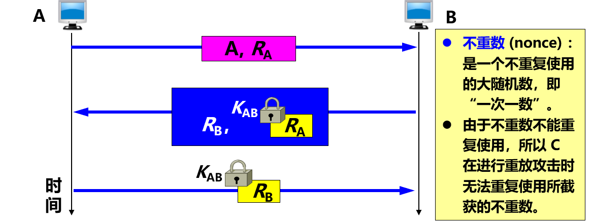

使用公钥体制进行不重数鉴别
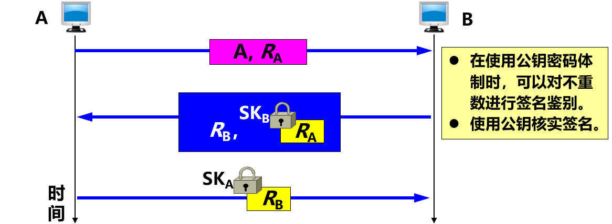

假冒攻击
- C 冒充是 A，发送报文给 B，说：“我是 A”。
- B 选择一个不重数 $R_{B}$，发送给 A，但被 C **截获**了。
- C 用自己的私钥 $SK_{C}$ **冒充**是 A 的私钥，对 $R_{B}$ 加密，并发送给 B。
- B 向 A 发送报文，要求对方把解密用的公钥发送过来，但这报文也被 C **截获**了。
- C 把自己的公钥 $PK_{C}$ **冒充**是 A 的公钥发送给 B。
- B 用收到的公钥 $PK_{C}$ 对收到的加密的 $R_{B}$ 进行解密，其结果当然正确。于是 B 相信通信的对方是 A，接着就向 A 发送许多敏感数据，但都被 C 截获了。

中间人攻击
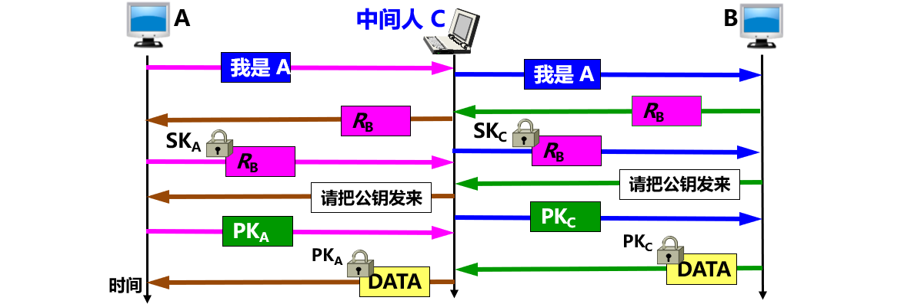

> 可见，**公钥**的**分配**以及认证公钥的**真实性**是一个非常重要的问题。

## 7.4 密钥分配
- 安全性：完全基于**密钥的安全保护**上。
- 密钥管理包括：密钥的产生、分配、注入、验证和使用。
- 密钥分配是密钥管理中最大的问题。
- 密钥必须通过**最安全**的通路进行分配。
- 网外分配方式：派非常可靠的信使携带密钥分配给互相通信的用户。
- 网内分配方式：密钥自动分配。

### 7.4.1 对称密钥的分配
- 常用方式：设立**密钥分配中心 KDC** (Key Distribution Center)。
- KDC 任务：给需要进行秘密通信的用户**临时分配**一个会话密钥（**仅使用一次**）。
- 用户 A 和 B 都是 KDC 的登记用户，并已经在 KDC 的服务器上安装了各自和 KDC 进行通信的**主密钥**（master key）$K_{A}$ 和 $K_{B}$。
- 主密钥可简称为密钥。

KDC 对会话密钥 $K_{AB}$ 的分配
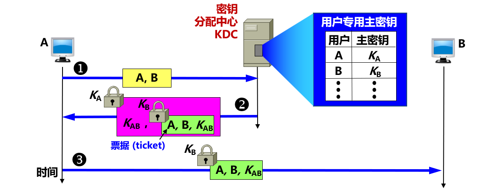
> 注意：在网络上传送密钥时，都是经过加密的。解密用的密钥都不在网上传送。

- 为防止重放攻击，KDC 还可在报文中加入**时间戳**。
- 会话密钥 $K_{AB}$ 是一次性的，因此保密性较高。
- KDC 分配给用户的密钥 $K_{A}$ 和 $K_{B}$，应定期更换，以减少攻击者破译密钥的机会。

对称密钥分配协议：Kerberos
- 目前最出名的是 Kerberos V5。
- 既是鉴别协议，同时也是 KDC，是互联网**建议标准**。
- 使用比 DES 更加安全的高级加密标准 AES 进行加密。
- 使用两个服务器：
  - 鉴别服务器 AS (Authentication Server)
  - 票据授予服务器 TGS (Ticket-Granting Server)。
- **只用于**客户与服务器之间的鉴别，不用于人对人的鉴别。

Kerberos 工作原理
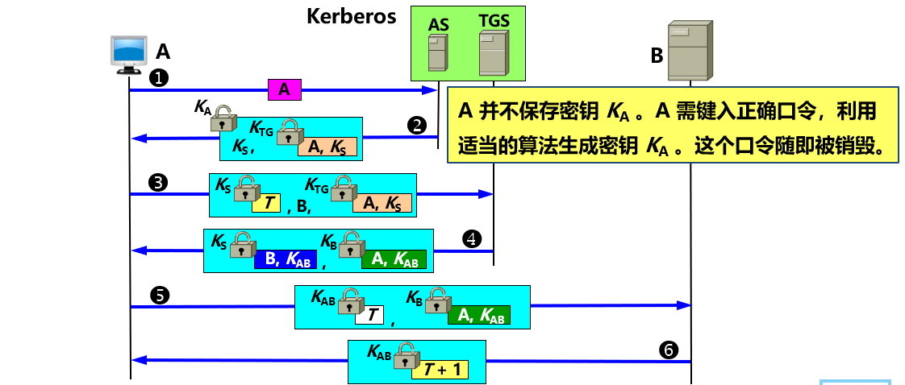

Kerberos 要求“松散的”同步
- Kerberos 要求所有使用 Kerberos 的主机必须在时钟上进行**松散的**同步。
- **松散的同步**：要求所有主机的时钟误差不能太大，例如，不能超过 5 分钟的数量级。这个要求是为了防止重放攻击。

### 7.4.2 公钥的分配
- 在公钥密码体制中，如果每个用户都具有其他用户的公钥，就可实现安全通信。
- 但不能随意公布用户的公钥，因为：
  - 无法防止假冒和欺骗。
  - 使用者也无法确定公钥的真正拥有者。
- 方法：借助可信任的第三方机构。

认证中心 CA (Certification Authority)
- 可信任的第三方机构。
- 负责签发数字证书。
- 一般由政府出资建立。

数字证书 (digital certificate)
- 有时也简称为**证书**。
- 是对公钥与其对应的实体 (人或机器) 进行绑定的一个证明，因此它常称为**公钥证书**。
- 每个证书中写有公钥及其拥有者的标识信息（例如：人名、地址、电子邮件地址或 IP 地址等）。
- 更重要的是：证书中有 **CA** 使用自己私钥的**数字签名**。
- 把 CA 的数字签名和未签名的 B 的证书放在一起，就最后构成了已签名的 B 的数字证书。
- 证书被 CA 进行了数字签名，是**不可伪造**的。

- 任何用户都可从可信任的地方（如代表政府的报纸）获得认证中心 CA 的公钥，以验证证书的真伪。
- 数字证书是**公开**的，不需要加密。

已签名的 B 的数字证书的产生过程
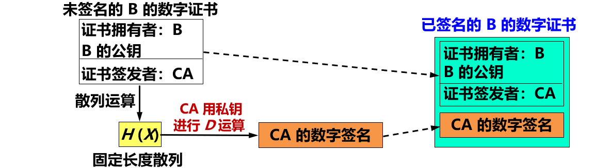
> 核实：A 拿到 B 的数字证书后，使用数字证书上给出的 CA 的公钥，对数字证书中 CA 的数字签名进行 **E 运算**，得出一个数值。再对 B 的数字证书 (CA 数字签名除外的部分) 进行散列运算，又得出一个数值。比较这两个数值。若一致，则数字证书是真的。

X.509 数字证书
- 数字证书的格式必须标准化。
- ITU-T 制定了 X.509 协议标准，描述证书的结构。
- IETF 采用 X.509 V3 作为互联网的建议标准。
- X.509 又称为互联网公钥基础结构 PKI (Public Key Infrastructure)。

| 版本号            | 区分 X.509 不同版本                    |
| ----------------- | -------------------------------------- |
| 序列号            | CA 发放，唯一                          |
| 签名算法          | 签署证书所使用的算法和参数             |
| 发行者            | 签发者的唯一标识符                     |
| 有效期            | 包括起始时间和终止时间                 |
| 主体名 (或主题名) | 公钥和数字证书拥有者的唯一标识符       |
| 公钥              | 数字证书拥有者的公钥和使用算法的标识符 |
| 发行者 ID         | 任选，唯一，标识发行者                 |
| 主体 ID           | 任选，唯一，标识证书持有者             |
| 扩展域            | 扩充信息                               |
| 认证机构签名      | 用 CA 私钥对证书签名                   |

认证系统
- X.509 提出：把多级认证中心**链接**起来的，构成一个**树状的认证系统**。
- 末端是用户。
- **最高一级**的认证中心都称为**根认证中心** (Root CA)，是公认可信的认证中心（或无条件信任的），且其公钥是公开的。

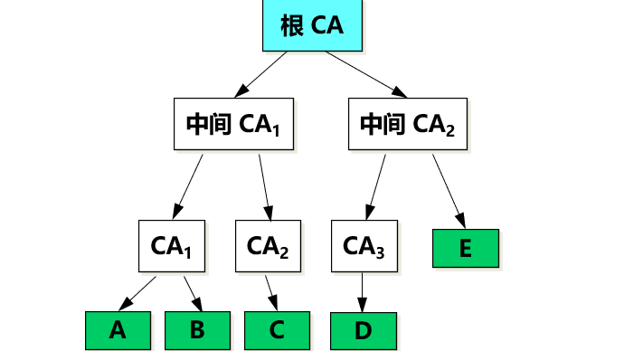
> 可以有不止一个根 CA。
> 从根 CA 向下的所有链接都称为**信任链**。

证书链
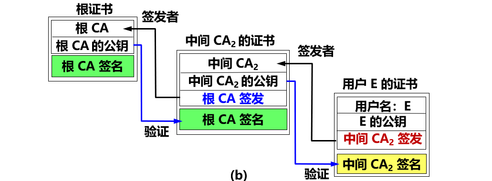
- 与信任链对应的是**证书链**。
- 最顶层的根证书的数字签名是**自签名的**（即自己的私钥给自己签名）。

证书撤销与更新
- 证书不是永久有效，它可以过期，也可以被吊销。
- 每一个 CA 应当有一个公布于众的、用本 CA 的私钥签名的**证书撤销名单**，并定期更新。
- 有很多原因导致证书被吊销，例如：
  1. 用户私钥被盗或遗失。
  2. 用户不再被该 CA 认证。
  3. CA 签署用户证书的私钥被泄漏。

## 7.5 互联网使用的安全协议

### 7.5.1 网络层安全协议
- IP 几乎不具备任何安全性，不能保证：
  - 数据机密性
  - 数据完整性
  - 数据来源认证
- 由于其在设计和实现上存在安全漏洞，使各种攻击有机可乘。例如：攻击者很容易构造一个包含虚假地址的 IP 数据报。
- IPsec 提供了标准、健壮且包含广泛的机制保证 IP 层安全。

**IPsec 协议族概述**
- IPsec：IP security，IP 安全。
- IPsec **不是一个单一协议**，而是能够在 IP 层提供互联网通信安全的**协议族**。
- IPsec **是个框架**：允许通信双方选择合适的算法和参数（例如，密钥长度）。
- 为保证互操作性，IPsec 还包含了所有 IPsec 都必须实现的一套加密算法。

IPsec 由三部分组成
1. IP 安全数据报格式：两个协议
   - 鉴别首部 AH (Authentication Header) 协议
   - 封装安全有效载荷 ESP (Encapsulation Security Payload) 协议
2. 加密算法：三个协议
3. 互联网密钥交换 IKE (Internet Key Exchange) 协议

- **AH** 协议提供源点鉴别和数据完整性，但不能保密。
- **ESP** 协议提供源点鉴别、数据完整性和保密。
  > AH 协议的功能都已包含在 ESP 协议中。
  > 使用 ESP 协议就可以不使用 AH 协议。
- IPsec 支持 IPv4 和 IPv6。
- 使用 ESP 或 AH 协议的 IP 数据报称为 **IP 安全数据报**（或 IPsec数据报）。

IP 安全数据报有两种工作方式
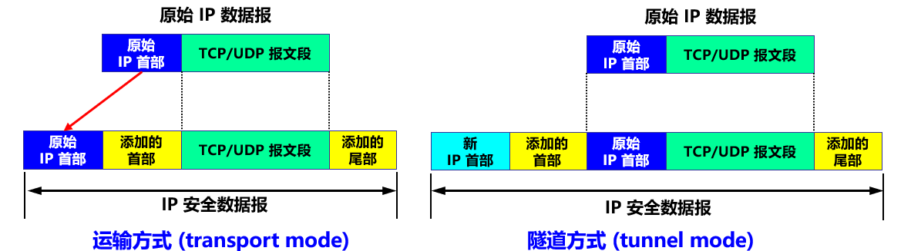
- 运输方式 (transport mode)
  - 在整个**运输层报文段**的前后分别添加若干控制信息，再加上 IP 首部。
  - 适合于主机到主机之间的安全传送。
  - 需要使用 IPsec 的主机都运行 IPsec 协议。
- 隧道方式 (tunnel mode)
  - 在原始的 **IP 数据报**的前后分别添加若干控制信息，再加上新的 IP 首部。
  - 需要在 IPsec 数据报所经过的所有路由器上都运行 IPsec 协议。
  - 隧道方式常用来实现虚拟**专用网** VPN。

IP 安全数据报的 IP 首部是不加密的
- 无论使用哪种方式，最后得出的 **IP 安全数据报的 IP 首部都是不加密的**。
- **安全数据报**：指数据报的**数据部分**是经过加密的，并能够被鉴别的。
- 通常把数据报的数据部分称为数据报的**有效载荷** (payload)。

**安全关联**
- 在发送 IP 安全数据报之前，在源实体和目的实体之间必须创建一条网络层的逻辑连接。此逻辑连接叫做**安全关联 SA** (Security Association) 。

> IPsec 把传统互联网无连接的网络层转换为具有逻辑连接的网络层。

安全关联的特点
- 安全关联是从源点到终点的**单向连接**，它能够提供安全服务。
- 在安全关联 SA 上传送的就是 IP 安全数据报。
- 如要进行双向安全通信，则两个方向都需要建立安全关联。
- 若 n 个员工进行双向安全通信，一共需要创建 (2 + 2n) 条安全关联 SA。

路由器 R1 到 R2 的安全关联 SA
> 假定公司总部的主机 H1 要和分公司的主机 H2 通过互联网进行安全通信。公司总部与分公司之间的安全关联 SA 是在路由器 R1 和 R2 之间建立的。
> 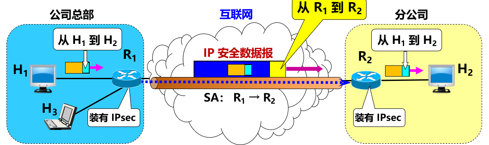

主机 H1 到 H3 之间的通信
> 假定公司总部的主机 H1 要和内部的主机 H3 进行通信。由于都在公司内部，不需要加密，因此不需要建立安全关联。

路由器 R1 到主机 H2 的安全关联 SA
> 若公司总部的主机 H1 要和某外地业务员的主机 H2 进行安全通信，需要在公司总部的路由器 R1 和外地业务员的主机 H2 建立安全关联 SA。
> 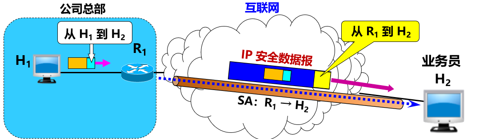

安全关联 SA 包括的状态信息
1. 一个 32 位的连接标识符，称为**安全参数索引 SPI** (Security Parameter Index)。
2. 安全关联 SA 的**源点**和**终点**的 IP 地址（例如路由器 R1 和 R2 的 IP 地址）。
3. 所使用的**加密类型**（例如，DES 或 AES）。
4. 加密使用的**密钥**。
5. 完整性检查的**类型**（例如，使用报文摘要 MD5 或 SHA-1 的报文鉴别码 MAC）。
6. 鉴别使用的**密钥**。

**IP 安全数据报的格式**
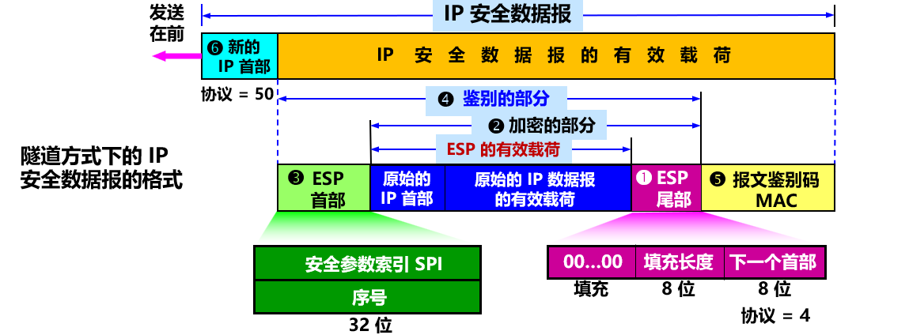
> 注意：对于路由器 R1 到 R2 的安全关联 SA，在“原始的 IP 首部”中，用主机 H1 和 H2 的 IP 地址分别作为源地址和目的地址，而在 IP 安全数据报的“新的 IP 首部”中，用路由器 R1 和 R2 的 IP 地址分别作为源地址和目的地址。

**IPsec 的其他构件**
- 安全关联数据库 SAD (Security Association Database)
  - 存放 SA。
- 安全策略数据库 SPD (Security Policy Database)
  - 指明什么样的数据报需要进行 IPsec 处理。
- 互联网密钥交换 IKE (Internet Key Exchange)
  - 为 IP 安全数据报创建安全关联 SA。

互联网密钥交换 IKE
- 非常复杂。互联网的正式标准 `[RFC 7296]`。
- IKEv2 以另外三个协议为基础：
  1. Oakley：密钥生成协议 [RFC 2412]。
  2. 安全密钥交换机制 SKEME (Secure Key Exchange Mechanism)：用于密钥交换的协议。它利用公钥加密来实现密钥交换协议中的实体鉴别。
  3. 互联网安全关联和密钥管理协议 ISAKMP (Internet Secure Association and Key Management Mechanism)：用于实现 IKE 中定义的密钥交换，使 IKE 的交换能够以标准化、格式化的报文创建安全关联 SA。

### 7.5.2 运输层安全协议
现在广泛使用以下两个协议：
- 安全套接字层 SSL (Secure Socket Layer)
- 运输层安全 TLS (Transport Layer Security)

**协议 TLS 的要点**
- 安全套接层 SSL 由 Netscape 于 1994 年开发，广泛应用于基于万维网的各种网络应用（但不限于万维网应用）。
- SSL 作用在端系统应用层的 HTTP 和运输层之间，在 TCP 之上建立起一个安全通道，为通过 TCP 传输的应用层数据提供安全保障。
- 1999 年，IETF 在 SSL 3.0 基础上设计了 TLS 1.0，为所有基于 TCP 的网络应用提供安全数据传输服务。
- 2018 年 8 月，IETF 发布了经历了 28 个草案后才通过的最新版本TLS 1.3 [RFC 8446，建议标准]（不向后兼容）。
- 2020 年，旧版本 TLS 1.0/1.1 均被废弃。

协议 TLS 的位置
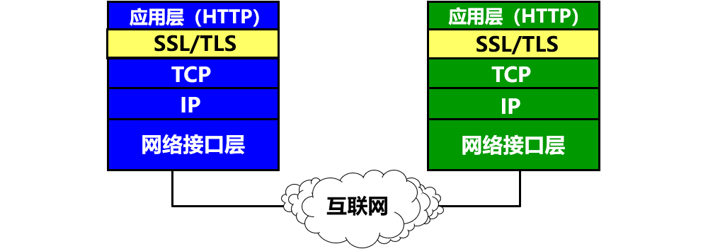
- 在发送方，TLS 接收应用层的数据，对数据进行加密，然后把加密后的数据送往 TCP 套接字。
- 在接收方，TSL 从 TCP 套接字读取数据，解密后把数据交给应用层。

TLS 与应用层协议独立无关
- TLS 提供了一个简单的带有套接字的应用程序接口 API，与 TCP 的API 相似。
- 应用层使用 TLS 最多的就是 HTTP。**TLS 可用于任何应用层协议**。
- 应用程序 HTTP 调用 TLS 对整个网页进行加密时，网页上会提示用户，在网址栏原来显示 http 的地方，现在变成了 **https**。
- **s 代表 security**，表明现在使用的是提供安全服务的 HTTP 协议（TCP 的 HTTPS 端口号是 443，而不是平时使用的端口号 80）。

协议 TLS 具有双向鉴别的功能
- 常用单向鉴别：客户端（浏览器）需要**鉴别服务器**，确信即将访问的网站服务器是安全和可信的。
- 两个前提：
  1. 服务器需要有一个有效的 **CA 证书**来证明自己。CA 证书是运输层安全协议 TLS 的基石。
  2. 浏览器应具有一些**手段**来证明服务器是安全和可信的。
- 建立安全会话两个阶段：
  1. 握手阶段：使用握手协议
  2. 会话阶段：使用记录协议

TLS 建立安全会话的工作原理
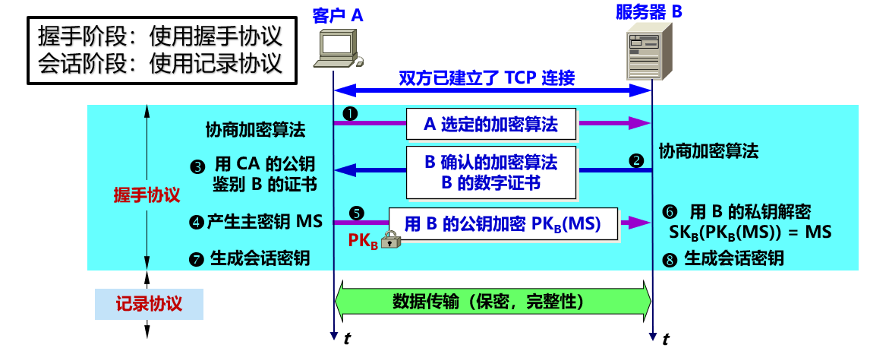

TLS 的握手阶段：验证服务器，生成会话阶段所需的共享密钥
1. 协商加密算法。 ① 浏览器 A 向服务器 B 发送浏览器的 TLS 版本号和一些可选的加密算法。 ② B 从中选定自己所支持的算法（如 RSA），并告知 A，同时把自己的 CA 数字证书发送给 A。
2. 服务器鉴别。③ 客户 A 用数字证书中 CA 的公钥对数字证书进行验证**鉴别**。
3. 生成主密钥。④ 客户 A 按照双方确定的密钥交换算法**生成主密钥 MS** (Master Secret)。 ⑤ 客户 A 用 B 的公钥 $PK_{B}$ **对主密钥 MS 加密**，得出加密的主密钥 $PK_{B}(MS)$，发送给服务器 B。
4. 服务器 B 用自己的私钥把**主密钥解密**出来 ⑥：$SK_{B}(PK_{B}(MS)) = MS$ 。这样，客户 A 和服务器 B 都有了为后面数据传输使用的共同的主密钥 MS。
5. 生成会话密钥 ⑦ 和 ⑧。为了使双方的通信更加安全，客户 A 和服务器 B **最好使用不同的密钥**。主密钥被分割成 **4 个不同的密钥**。每一方都拥有这样 4 个密钥（注意：这些都是对称密钥）：
   - 客户 A 发送数据时使用的会话密钥 $K_{A}$
   - 客户 A 发送数据时使用的 MAC 密钥 $M_{A}$
   - 服务器 B 发送数据时使用的会话密钥 $K_{B}$
   - 服务器 B 发送数据时使用的 MAC 密钥 $M_{B}$

TLS 的会话阶段：保证传送数据的机密性和完整性
- 把长的数据划分为较小的数据块，叫做**记录** (record)。对每一个记录进行鉴别运算和加密运算。
- 记录协议对每一个记录**按发送顺序**赋予序号，第一个记录作为 0。发送下一个记录时序号就加 1，序号最大值不得超过 $2^{64} – 1$，且**不允许序号绕回**。
- 序号未写在记录之中，而是**在进行散列运算时，把序号包含进去**。客户 A 向服务器 B 发送一个明文记录时，对 MAC 密钥 $M_{A}$ 、记录的当前序号和明文记录进行散列运算，**鉴别明文记录的完整性**（内容和顺序均无误）。使用会话密钥 $K_{A}$ 进行加解密。

> 这种对记录加密的方法称为带关联数据的鉴别加密 AEAD (Authenticated Encryption with Associated Data) 。

TLS 传送的记录格式

- 类型字段：指明所传送的记录是握手阶段的报文，还是应用程序传送的报文，或最后要关闭 TLS 连接的报文。
- 长度字段：字节数，用于从 TCP 报文中提取 TLS 记录。

**协议 TLS 必须包含的措施**
握手阶段补充的措施：
1. 客户 A 和服务器 B相互发送**不重数**，**防止重放攻击**。
2. 生成**预主密钥** PMS (Pre-Master Secret)，为下一步生成主密钥使用。
3. 生成主密钥。客户 A 和服务器 B 各自使用同样的（已商定的）算法，使用预主密钥 PMS 、客户的不重数和服务器的不重数，生成主密钥 MS。
4. 客户 A 向服务器 B 发送的全部握手阶段报文的 MAC。
5. 服务器 B 向客户 A 发送的全部握手阶段报文的 MAC。

- 关闭 TLS 连接：
  - 关闭 TLS 连接之前，A 或 B 应当**先发送**关闭 TLS 的记录，**以防止截断攻击** (truncation attack)。
- **截断攻击**：在 A 和 B 正在进行会话时，入侵者突然发送 TCP 的 FIN 报文段来关闭 TCP 连接。
- 如果 A 或 B 没有事先发送一个要关闭 TLS 的记录，那么 A 或 B 见到 TCP 的 FIN 报文段时，就知道这是入侵者的截断攻击了。因为入侵者无法伪造关闭 TLS 的记录。

- TLS 1.3 中使用了更加安全的**椭圆曲线密码 ECC**（Elliptic Curve Cryptography）与 **AES**，运算速度比 1.2 版本有很大的提高。
- TLS 1.3 还添加了 **0-RTT** 的功能。
  - 如果客户之前连接过某服务器，TLS 1.3 通过储存先前会话的秘密信息，不需要经过 1-RTT 的握手过程，仅需 0-RTT 即可开始会话阶段，更加提高了 TLS 的效率。
  - 必须要防止可能发生的重放攻击。

### 7.5.3 应用层安全协议
- 仅讨论应用层中有关**电子邮件的安全协议**。
- 发送电子邮件是个**即时行为**，是**单向报文**的安全问题。
  - 发送方 A 和接收方 B 不会事先建立任何会话。
  - 接收方 B 读取邮件后，可能会/不会回复邮件。
- 电子邮件安全协议应当为每种加密操作定义相应的算法，以及密钥管理、鉴别、完整性保护等方法。

PGP (Pretty Good Privacy)
- PGP (Pretty Good Privacy) 是一个完整的电子邮件安全软件包，包括加密、鉴别、电子签名和压缩等技术。
- 将现有的一些算法如 MD5，RSA，以及 IDEA 等综合在一起。
- 提供电子邮件的安全性、发送方鉴别和报文完整性。
- 并不是互联网的正式标准。
- PGP 很难被攻破。在目前，可以认为 PGP 是足够安全的。

发送方 A 的 PGP 处理过程
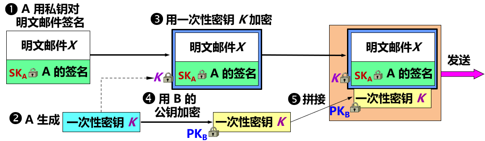
1. 用 A 的私钥 $SK_{A}$ 对明文邮件 X 进行**签名**。把签名拼接在明文邮件 X 后面。
2. A 利用随机数生成一次性密钥 K（共享的对称密钥）。
3. 用 A 生成的一次性密钥 K 对已签名的邮件**加密**。
4. 用 B 的公钥 $PK_{B}$ 对 A 生成的一次性密钥 K 进行**加密**。
5. 把已加密的一次性密钥和已加密的签名邮件，**拼接**在一起发送给 B。

接收方 B 的 PGP 处理过程
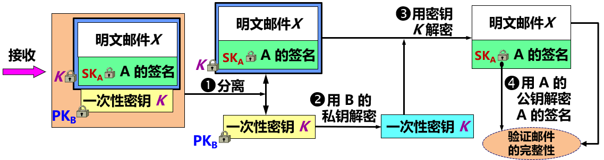
1. B 根据邮件的种类，**分离**出已加密的一次性密钥和已加密的签名报文。
2. 用 B 的私钥 $SK_{B}$ **解出**一次性密钥 K 。
3. 用解出的一次性密钥 K 对加密的签名邮件进行**解密**，**分离**出明文邮件 X 和 A 的数字签名。
4. 用 B 手中的 A 的公钥 $PK_{A}$ 对 A 的数字签名进行**解密**，即可接着验证邮件的完整性。

## 7.6 系统安全：防火墙与入侵检测
- 前述基于密码的安全机制不能有效解决以下安全问题：
  - 用户入侵：
    - 利用系统漏洞进行未授权登录；
    - 授权用户非法获取更高级别权限等。
  - 软件入侵：
    - 通过网络传播病毒、蠕虫和特洛伊木马。
    - 拒绝服务攻击等。
- 解决方法：
  - 防火墙：控制进出网络边界的分组。
  - 入侵检测：深度分析与检测进入的分组，发现疑似入侵行为。

### 7.6.1 防火墙
- 防火墙 (firewall) ：
  > 一种访问控制技术，通过严格控制进出网络边界的分组，**禁止**任何不必要的通信，从而减少潜在入侵的发生，尽可能降低这类安全威胁所带来的安全风险。
- 防火墙是一种特殊编程的路由器，安装在一个网点和网络的其余部分**之间**，目的是**实施**访问控制策略。
- **访问控制策略**由使用防火墙的单位自行制定。

防火墙在互连网络中的位置
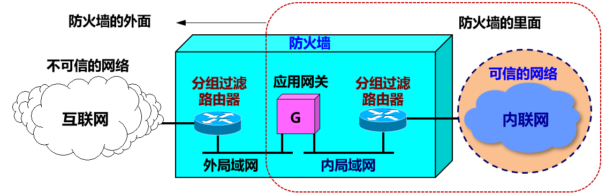
> 一般把防火墙里面的网络称为“可信的网络”(trusted network) ，
> 把防火墙外面的网络称为“不可信的网络”(untrusted network)。

两类防火墙技术：分组过滤路由器
- 具有分组**过滤**功能的路由器。根据过滤规则对进出内部网络的分组进行过滤（转发或者丢弃）。
- 过滤规则：基于分组的网络层或运输层首部信息，例如：源/目的IP地址、源/目的端口、协议类型（TCP 或 UDP），等等。
- 无状态的：独立地处理每一个分组。
- 有状态的：跟踪每个连接或会话的通信状态，根据状态信息决定是否转发分组。
- 优点：简单高效，对用户透明。
- 缺点：不能对高层数据进行过滤。例如：不能禁止某个用户对某个特定应用进行某个特定的操作，不能支持应用层用户鉴别等。

两类防火墙技术：应用网关
- 也称为**代理服务器** (proxy server)
- 对报文进行中继，实现**基于**应用层数据的**过滤**和高层用户**鉴别**。
- 所有进出网络的应用程序报文都必须通过应用网关。
- 应用网关在**应用层**打开报文，查看请求是否合法。
  - 如果合法，应用网关以客户进程的身份将请求报文转发给原始服务器。
  - 如果不合法，则丢弃报文。
- 缺点：
  - 每种应用都需要一个不同的应用网关
  - 在应用层转发和处理报文，处理负担较重。
  - 对应用程序不透明，需要在应用程序客户端配置应用网关地址。

### 7.6.2 入侵检测系统
- 入侵检测系统 IDS (Intrusion Detection System) 能够在入侵已经开始，但还没有造成危害或在造成更大危害前，及时检测到入侵，以便尽快阻止入侵，把危害降低到最小。
- IDS 对进入网络的分组执行**深度分组检查**。当观察到可疑分组时，向网络管理员发出告警或执行阻断操作（由于 IDS 的“误报”率通常较高，多数情况不执行自动阻断）。
- IDS 能用于检测多种网络攻击，包括：网络映射、端口扫描、DoS 攻击、蠕虫和病毒、系统漏洞攻击等。 

两种入侵检测方法：基于特征的 IDS
- 维护一个所有已知攻击标志性特征的数据库。
- 特征和规则通常由网络安全专家生成，由机构的网络管理员定制并将其加入到数据库中。
- 只能检测已知攻击，对于未知攻击则束手无策。
- 至今为止，大多数部署的 IDS 主要是基于特征的。

两种入侵检测方法：基于异常的 IDS 
- 通过观察正常运行的网络流量，学习正常流量的统计特性和规律。
- 当检测到网络中流量某种统计规律不符合正常情况时，则认为可能发生了入侵行为。
- 但区分正常流和统计异常流是一个非常困难的。

## 7.7 一些未来的发展方向
1. 椭圆曲线密码 (Elliptic Curve Cryptography，ECC) ：已在 TLS 1.3 的握手协议中占据非常重要的地位，现已大量用于电子护照、金融系统。
2. 移动安全 (Mobile Security) ：例如移动支付安全等。
3. 量子密码 (Quantum Cryptography) ： 量子计算机的到来将使得目前许多使用中的密码技术无效，后量子密码学（Post-Quantum Cryptography）的研究方兴未艾。
4. 商密九号算法 SM9：一种标识密码(Identity-Based Cryptography) 算法。在互联网应用上有前景。
