## 8.1 概述
- 许多用户开始利用互联网传送音频/视频信息。
- 在许多情况下，这种音频/视频常称为多媒体信息。
- 多媒体信息：内容上相互关联的文本、图形、图像、声音、动画和活动图像等所形成的复合数据信息。

- 多媒体信息的两个最主要特点
  - 信息量很大。
  - 标准语音：64 kbit/s ( PCM，8 kHz 速率采样，8 位编码）；
  - 高质量立体声音乐 CD：1.4 Mbit/s（PCM，44.1 kHz 速率采样，16 位编码）；
  - 数码照片 (1280 × 960)：3.52 MB（24 位编码）；
  - 彩色电视：250 Mbit/s。
- 在传输多媒体数据时，对时延和时延抖动均有较高的要求。
  - 边传输边播放。

互联网是非等时的
- 模拟的多媒体信号经过采样和模数转换变为数字信号，再组装成分组。这些分组的发送时间间隔是**恒定的（等时的）**。
- 传统互联网中，每个分组被独立传送，到达接收端时就变成为**非等时的**。

实现等时：在接收端设置缓存
- 接收端设置适当大小的**缓存**。当缓存中的分组数达到一定的数量后，再以恒定速率按顺序把分组读出进行还原播放。
- 缓存实际上就是一个先进先出的队列。

缓存：消除了时延的抖动，但增加了时延
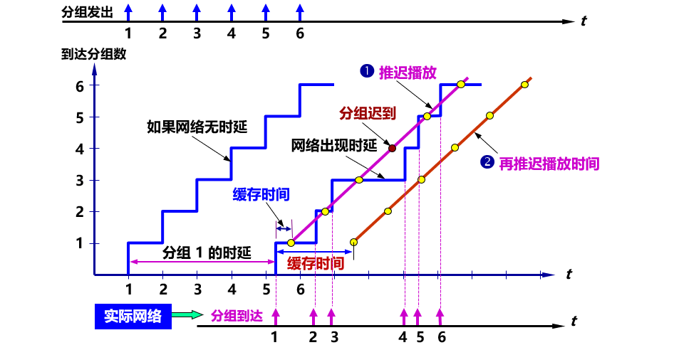

需要注意的问题
- 在传送**时延敏感** (delay sensitive) 的实时数据时，不仅**传输时延**不能太大，而且**时延抖动**也必须受到限制。
- 传送实时数据时，少量分组的**丢失**对播放效果的影响并不大（因为是由人主观评价的），是可以容忍的。
- **丢失容忍** (loss tolerant) 是实时数据的另一个重要特点。
- 发送多媒体分组时应当给每一个分组加上**序号**，以按序还原和播放分组。
- 增加一个**时间戳** (timestamp)，告诉接收端分组的产生时间。

> 有了序号和时间戳，再采用适当的算法，接收端就知道应在什么时间开始播放缓存中的分组，既可减少分组的丢失率，也可使播放的延迟在可容忍的范围之内。

必须改造现有的互联网
- 大量使用光缆和高速路由器，网络的时延和时延抖动就可以足够小，在互联网上传送实时数据就不会有问题。
- 从根本改变互联网的协议栈，把互联网改造为能够对**端到端**的带宽实现**预留** (reservation)，把**无连接协议**的互联网转变为**面向连接**的网络。
- 部分改动互联网的协议栈，付出的代价较小，也能够使多媒体信息在互联网上的传输质量得到改进。

互联网提供的音频/视频服务类型大体上可分为三种：
1. 流式 (streaming) 存储音频/视频 ——边下载边播放。
   - 播放时并没有把“下载”的内容存储在硬盘上。
   - 结束后，在用户的硬盘上没有留下有关播放内容的任何痕迹。
2. 流式实况音频/视频 ——边录制边发送，连续播放。
3. 交互式音频/视频 ——实时交互式通信。

## 8.2 流式存储音频/视频
“存储”音频/视频文件**不是实时产生的**，而是已经录制好的，通常存储在光盘或硬盘中。

传统浏览器从服务器下载已经录制好的音频/视频文件步骤
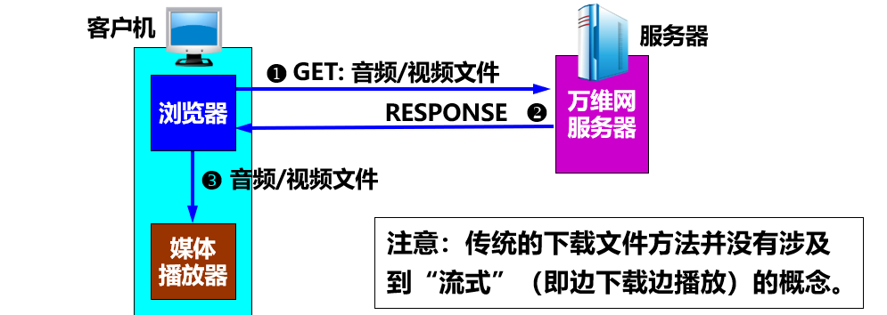

### 8.2.1 具有元文件的万维网服务器
**元文件**就是一种非常小的文件，它描述或指明其他文件的一些重要信息。这里的元文件保存了有关这个音频/视频文件的信息。
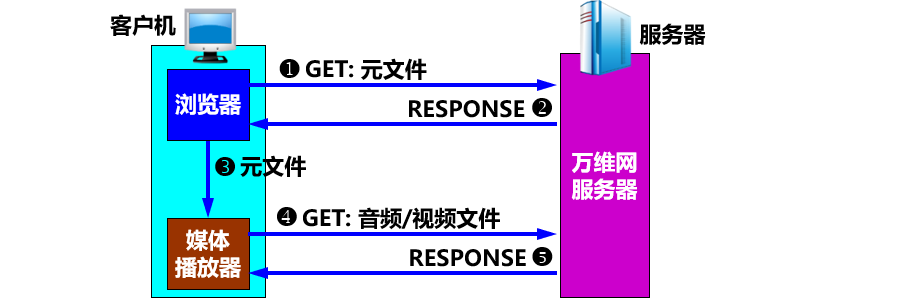

### 8.2.2 媒体服务器
- 使用**两个分开的**服务器：**万维网服务器**，**媒体服务器**。
- 媒体服务器：
  - 流式服务器 (streaming server)，支持流式音频和视频的传送。
- 媒体播放器与媒体服务器的**关系**：
  - **客户与服务器**的关系。
  - 媒体播放器向媒体服务器请求音频/视频文件。
- 媒体播放器与媒体服务器之间的**交互**：采用另外的协议。

使用媒体服务器
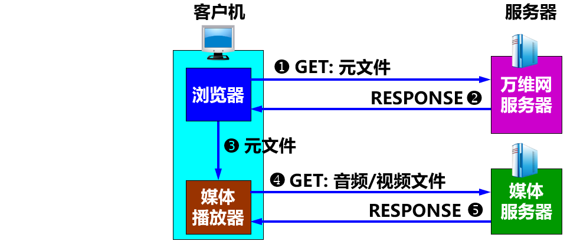
> 媒体播放器不是向万维网服务器、而是向媒体服务器请求音频/视频文件。

下载时使用 TCP，还是 UDP？
- 采用 UDP 有以下缺点：
  1. 由于网络情况多变，接收端的播放器很难做到始终按规定的速率播放。
  2. 很多单位的防火墙往往阻拦外部 UDP 分组的进入，因而使用 UDP 传送多媒体文件时会被防火墙阻拦掉。
  3. 使用 UDP 传送流式多媒体文件时，如果在用户端希望能够控制媒体的播放，如进行暂停、快进等操作，还需要使用另外的协议RTP 和 RTSP，增加了成本和复杂性。
- 现在，对流式存储音频/视频的播放，如 YouTube 和 Netflix，都是**采用 TCP** 来传送。
- 使用 TCP 传送流式视频的主要步骤
  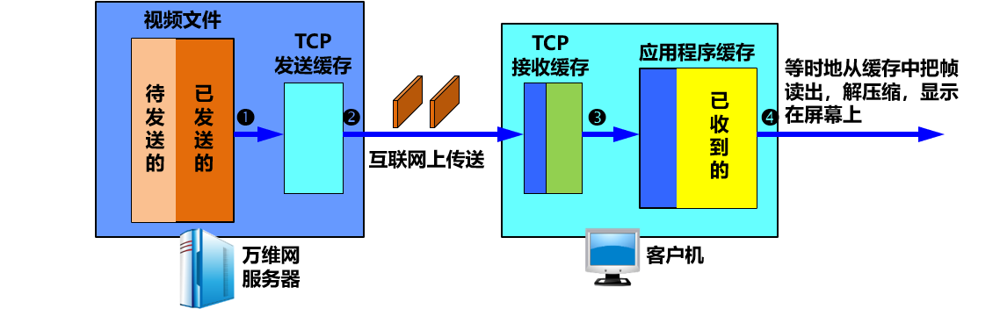
- 如果是观看实况转播，应当首先考虑使用 UDP 来传送。
  - 若使用 TCP 传送，当出现网络严重拥塞时，会产生播放暂停。
  - 使用 UDP 传送时，即使因网络拥塞丢失了一些分组，对观看的感觉也会比突然出现暂停要好些。

### 8.2.3 实时流式协议 RTSP
- 实时流式协议 RTSP (Real-Time Streaming Protocol) ：
  - 应用层的**多媒体播放控制协议**，**不传送数据**。
  - 以客户服务器方式工作。
  - 使用户在播放从互联网下载的实时数据时能够进行控制，如：暂停/继续、后退、前进等。
  - 又称为“互联网录像机遥控协议”。

- RTSP 是**有状态**的协议，它记录客户机所处于的状态（初始化状态、播放状态或暂停状态）。
- RTSP 控制分组既可在 **TCP** 上传送，也可在 **UDP** 上传送。
- RTSP **没有定义**音频/视频的压缩方案，也**没有规定**音频/视频在网络中传送时应如何封装在分组中，**没有规定**音频/视频流在媒体播放器中应如何缓存。

使用 RTSP 的媒体服务器的工作过程
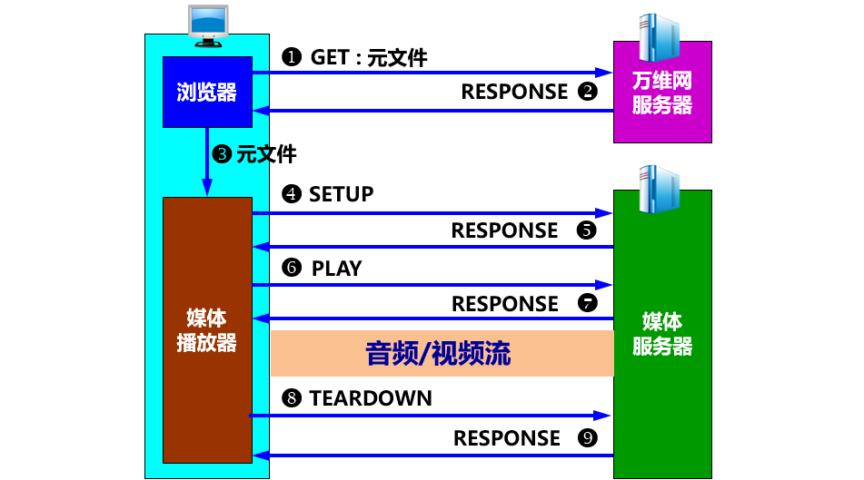

使用 RTSP 的媒体服务器的工作过程
1. 浏览器向万维网服务器请求音频/视频文件。
2. 万维网服务器从浏览器发送携带有元文件的响应。
3. 浏览器把收到的元文件传送给媒体播放器。
4. RTSP 客户与媒体服务器的 RTSP 服务器建立连接。
5. RTSP 服务器发送响应 RESPONSE 报文。
6. RTSP 客户发送 PLAY 报文，**开始下载**音频/视频文件。
7. RTSP 服务器发送响应 RESPONSE 报文。
8. RTSP 客户发送 TEARDOWN 报文断开连接。
9. RTSP 服务器发送响应 RESPONSE 报文。

## 8.3 交互式音频/视频

### 8.3.1 IP 电话概述
- IP 电话是在互联网上传送多媒体信息。
- 多个英文同义词：
  - VoIP (Voice over IP)
  - Internet Telephony
  - VON (Voice On the Net)

**狭义的和广义的 IP 电话**
- 狭义的 IP 电话：指在 IP 网络上打电话。
- 广义的 IP 电话：不仅仅是电话通信，而且还可以是在 IP 网络上进行交互式多媒体实时通信（包括话音、视像等），甚至还包括**即时传信 IM** (Instant Messaging)。

> IP 电话可看成是一个正在演进的多媒体服务平台，是话音、视像、数据综合的基础结构。

**IP 电话网关**
- 公用电话网与 IP 网络的**接口设备**。
- 作用：
  1. 在电话呼叫阶段和呼叫释放阶段进行电话信令的转换。
  2. 在通话期间进行话音编码的转换。
  3. 实现 PC 用户到固定电话用户打 IP 电话（仅需经过 IP 电话网关一次），以及固定电话用户之间打 IP 电话（需要经过 IP 电话网关两次）。

IP 电话网关的几种连接方法
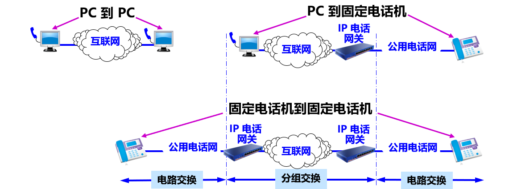

**IP 电话的通话质量**
- 影响 IP 电话通话质量的两个主要因素：
  - 通话双方端到端的**时延**和**时延抖动**；
  - 话音分组的**丢失率**。
- 但这两个因素是不确定的，取决于当时网络上的通信量。
- 经验证明：在电话交谈中，端到端的时延不应超过 250 ms，否则交谈者就能感到不自然。

造成 IP 电话端到端时延的因素
1. 话音信号进行模数**转换**要经受时延。
2. 话音比特流**装配**成话音分组的时延。
3. 话音分组的**发送**需要时间，此时间等于话音分组长度与通信线路的数据率之比。
4. 话音分组在互联网中的**存储转发**时延。
5. 话音分组在接收端缓存中**暂存**所引起的时延。
6. 话音分组**还原**成模拟话音信号的时延。
7. 话音信号在通信线路上的**传播**时延。
8. 终端设备的硬件和操作系统产生的**接入**时延。

> 1、2、6 的时延取决于话音编码的方法。

IP 电话低速率话音编码的 ITU-T 标准
- G.729：速率为 8 kbit/s 的共轭结构代数码激励线性预测声码器 CS-ACELP (Conjugate-Structure Algebraic-Code-Excited Linear Prediction) 声码器。
- G.723.1：速率为 5.3/6.3 kbit/s 的线性预测编码 LPC (Linear Prediction Coding) 声码器。

G.729 和 G.723.1 的主要性能比较
| 标准    | 比特率（kbit/s） | 帧大小（ms） | 处理时延（ms） | 帧长（字节） | 数字信号处理 MIPS |
| ------- | ---------------- | ------------ | -------------- | ------------ | ----------------- |
| G.729   | 8                | 10           | 10             | 10           | 20                |
| G.723.1 | 5.3/6.3          | 30           | 30             | 20/24        | 16                |

接收端的播放时延有一个最佳值
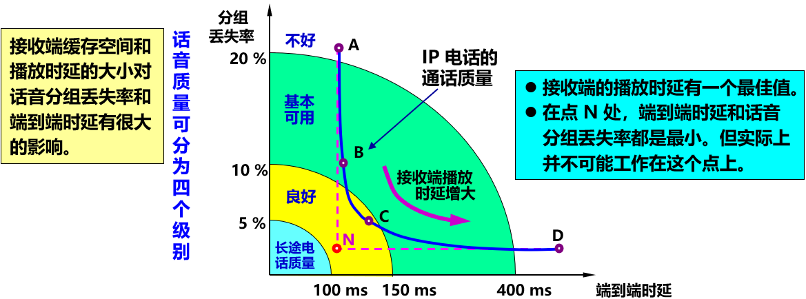

采用线速路由器
- 提高路由器的转发分组的速率对提高 IP 电话的质量也是很重要的。
- 线速路由器：吉比特路由器，每秒可转发 5 百万至 6 千万个分组（交换速率达 60 Gbit/s 左右）。普通路由器每秒可转发 50~100 万个分组。
- 可以进一步减少由网络造成的时延。

关于 Skype
- Skype 采用了 **P2P** 和**全球索引技术**提供快速路由选择机制，管理成本大大降低。由于用户路由信息**分布式存储**于因特网的结点中，因此呼叫连接完成得很快。
- Skype 采用了**端对端加密**方式，保证信息的安全性。
- Skype 使用 P2P 的技术，用户数据主要存储在 P2P 网络中，因此必须保证存储在公共网络中的数据是可靠的和没有被篡改的。
- Skype 对公共目录中存储的和用户相关的数据都采用了数字签名，保证了数据无法被篡改。

### 8.3.2 IP 电话所需要的几种应用协议
- 至少需要两种应用协议：
  - **信令协议**：在互联网上找到被叫用户。
  - 话音分组的**传送协议**：使电话通信的话音数据能够以时延敏感属性在互联网中传送。
- 为了在互联网中提供实时交互式的音频/视频服务，需要新的**多媒体体系结构**。

提供实时交互式音频/视频服务所需的应用层协议
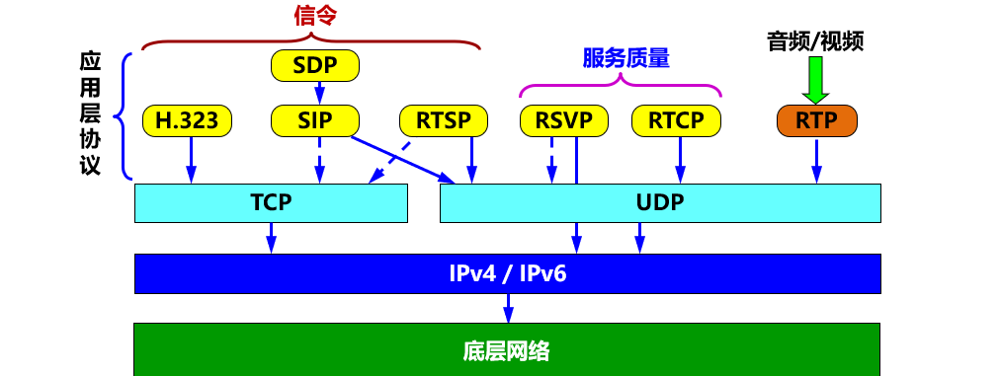

### 8.3.3 实时运输协议 RTP
- **实时运输协议 RTP** (Real-time Transport Protocol) 为实时应用提供**端到端**的运输，但**不提供**任何服务质量的保证。
- 需要发送的多媒体数据块（音频/视频）经过压缩编码处理后，先送给 RTP 封装成为 **RTP 分组**（也可称为 RTP 报文）。RTP 分组装入运输层的 **UDP** 用户数据报后，再向下递交给 IP 层。
- RTP 是一个**协议框架**，只包含了实时应用的一些共同的功能。
- RTP **不对**多媒体数据块做任何处理，而只是向应用层提供一些附加的信息，让应用层知道应当如何进行处理。

RTP 的层次
- 从应用开发者的角度看，RTP 应当是应用层的一部分。
- 由于 RTP 向多媒体应用程序提供了服务（如时间戳和序号），因此也可以将 RTP 看成是在 UDP 之上的一个运输层的子层。

注意
- RTP 分组**只包含** RTP 数据，**控制**由另一个配套使用的 **RTCP** 协议提供。
- RTP 在端口号 1025 到 65535 之间选择一个未使用的**偶数** UDP 端口号，在同一次会话中的 RTCP 则使用下一个**奇数** UDP 端口号。但端口号 5004 和 5005 则分别用作 RTP 和 RTCP 的**默认**端口号。

RTP 分组的首部格式
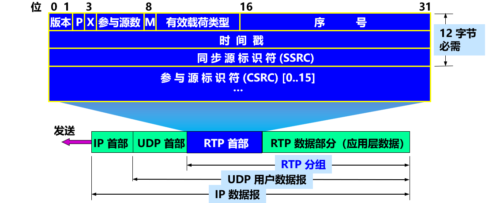
- 版本：占 2 位。当前使用的是版本 2。
- 填充 P：占 1 位。在某些特殊情况下需要对应用数据块加密，要求每一个数据块有确定的长度。如不满足这种长度要求，就需要进行填充。这时就把 P 位置 1，表示这个 RTP 分组的数据有若干填充字节。在数据部分的最后一个字节用来表示所填充的字节数。
- 扩展 X：占 1 位。X 置 1 表示在此 RTP 首部后面还有扩展首部。扩展首部很少使用。
- 参与源数：占 4 位。给出后面的参与源标识符的数目。
- 标记 M：占 1 位。M 置 1 表示这个 RTP 分组具有特殊意义。例如，在传送视频流时用来表示每一帧的开始。
- 有效载荷类型 (payload type)：占 7 位。指出后面的 RTP 数据属于何种格式的应用。收到 RTP 分组的应用层就根据此字段指出的类型进行处理。
- 序号：占 16 位。对每一个发送出的 RTP 分组，其序号加 1。在一次 RTP 会话开始时的初始序号是随机选择的。序号使接收端能够发现丢失的分组，同时也能将失序的 RTP 分组重新按序排列好。
- 时间戳：占 32 位。反映了 RTP 分组中数据的**第一个字节**的采样时刻。在一次会话开始时时间戳的初始值是随机选择的。即使在没有信号发送时，时间戳的数值也要随时间而不断地增加。接收端使用时间戳可准确知道应当在什么时间还原哪一个数据块，从而消除时延的抖动。还可以用来使视频应用中声音和图像同步。
- 同步源标识符 SSRC (Synchronous SouRCe identifier)：占 32 位。是一个数，用来标志 RTP 流(stream) 的来源。SSRC 与 IP 地址无关，在新的 RTP 流开始时随机地产生。有多个 RTP 流复用到一个 UDP 用户数据报中时，SSRC 可使接收端的 UDP 能够将收到的 RTP 流送到各自的终点。
- 参与源标识符 CSRC (Contributing SouRCe identifier)：**选项**，最多可有 15 个。CSRC 是一个 32 位数，用来标志来源于不同地点的 RTP 流。在多播环境中，可以用中间的一个站（叫做混合站 mixer）把发往同一个地点的多个 RTP 流混合成一个流，在目的站再根据 CSRC 的数值把不同的 RTP 流分开。

### 8.3.4 实时运输控制协议 RTCP
- RTCP (RTP Control Protocol) 是**与 RTP 配合使用**的协议，与 RTP 协议不可分割。
- 主要功能：
  - 服务质量的监视与反馈；
  - 媒体间的同步；
  - 播组中成员的标识。

RTCP 分组
- RTCP 分组**使用 UDP** 传送，但**不对**音频/视频分组进行封装。
- 可将**多个** RTCP 分组封装在一个 UDP 用户数据报中。
- RTCP 分组**周期性**地在网上传送，它带有发送端和接收端对服务质量的统计信息报告。

RTCP 使用的五种分组类型
| 类型 | 缩写表示 | 意义       |
| ---- | -------- | ---------- |
| 200  | SR       | 发送端报告 |
| 201  | RR       | 接收端报告 |
| 202  | SDES     | 源点描述   |
| 203  | BYE      | 结束       |
| 204  | APP      | 特定应用   |

### 8.3.5 H.323
- 信令标准。
- 是 ITU-T 于 1996 年制定的为在局域网上传送话音信息的建议书。
- 1998 年的第二个版本改用的名称是“**基于分组的多媒体通信系统**”。
- H.323 是互联网的端系统之间进行实时声音和视频会议的标准。
- H.323 不是一个单独的协议，而是**一组协议**。包括：
  - 系统和构件的描述，呼叫模型的描述，呼叫信令过程，
  - 控制报文， 复用，话音编解码器，视像编解码器，
  - 以及数据协议等。

H.323 终端使用 H.323 协议进行多媒体通信

H.323 标准指明的四种构件
1. H.323 终端。
2. 网关 : 连接两种不同的网络，使 H.323 网络可以和非 H.323 网络通信。
3. 网闸 (gatekeeper)：所有的呼叫都要通过网闸，因为网闸提供地址转换、授权、带宽管理和计费功能。可以帮助 H.323 终端找到距离公用电话网上的被叫用户最近的一个网关。
4. 多点控制单元 MCU (Multipoint Control Unit)：MCU 支持三个或更多的 H.323 终端的音频或视频会议，管理会议资源、确定使用的音频或视频编解码器。

> 这些构件连网就可以进行**点对点**或**一点对多点**的多媒体通信。

用 H.323 网关连接非 H.323 网络
> 网关、网闸和MCU在**逻辑上是分开的**构件，但它们可实现在一个物理设备中。在 H.323 标准中，将 H.323 终端、网关和 MCU 都称为 **H.323 端点** (end point)。
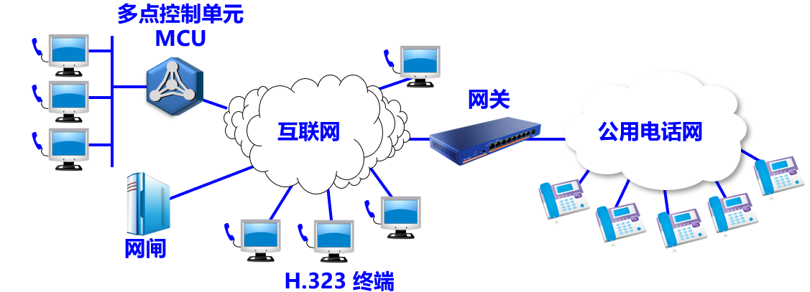

H.323 的协议体系结构

- H.323 是一个协议族，可以使用不同的运输协议。
  - H.323 以已有的电路交换电话网为基础，增加了 IP 电话的功能。
  - H.323 信令沿用原有电话网的信令模式，因此与原有电话网的连接比较容易。

1. 音频编解码器。要求至少要支持 G.711（64 kbit/s 的 PCM）。建议支持如 G.722（16 kbit/s 的 ADPCM）, G.723.1（5.3/6.3 的 LPC）, G.728（16 kbit/s 的低时延 CELP）和 G.729（8 kbit/s 的 CS-ACELP）等。
2. 视频编解码器。要求必须支持 H.261 标准（176 x 144 像素）。
3. H.255.0 登记信令：登记/接纳/状态 RAS (Registration/Admission/Status)。
4. H.225.0 呼叫信令：用来在两个 H.323 端点之间建立连接。
5. H.245 控制信令：用来交换端到端的控制报文，以便管理 H.323 端点的运行。
6. T.120 数据传送协议：与呼叫相关联的数据交换协议。用户在参加音频/视频会议时，可以和其他与会用户共享屏幕上的白板。使用 TCP 协议时能够保证数据传送的正确（在传送音频/视频文件时，使用的是 UDP，因此不能保证服务质量）。

### 8.3.6 会话发起协议 SIP
- H.323 过于复杂，不便于发展基于 IP 的新业务。
- **会话发起协议 SIP** (Session Initiation Protocol) 是一套较为简单且实用的标准，目前已成为互联网的建议标准。
- SIP 协议以互联网为基础，把 IP 电话视为互联网上的**新应用**。
- SIP 协议只涉及到 IP 电话的信令和有关服务质量问题，没有提供像 H.323 那样多的功能。
- SIP 没有指定使用 RTP 协议，但实际上大家还是选用 RTP 和 RTCP 作为配合使用的协议。

SIP 系统的构件
- SIP 使用文本方式的客户服务器协议。
- 两种构件：**用户代理**和**网络服务器**。
- 用户代理包括：
  - **用户代理客户**：用来发起呼叫。
  - **用户代理服务器**：用来接受呼叫。
- 网络服务器分为：
  - **代理服务器**：接受来自主叫用户的呼叫请求，并将其转发给下一跳代理服务器，最后将呼叫请求转发给被叫用户。
  - **重定向服务器**：不接受呼叫，它通过响应告诉客户下一跳代理服务器的地址，由客户按此地址向下一跳代理服务器重新发送呼叫请求。

SIP 的地址
- 十分灵活。可以是电话号码，也可以是电子邮件地址、IP 地址或其他类型的地址。但一定要使用 SIP 的地址格式，例如：
  - 电话号码 ：sip:zhangsan@8625-87654321
  - IPv4 地址：sip:zhangsan@201.12.34.56
  - 电子邮件地址：sip:zhangsan@public1.ptt.js.cn

SIP 特点
- 和 HTTP 相似，SIP 是基于报文的协议。
- SIP 使用了 HTTP 的许多首部、编码规则、差错码以及一些鉴别机制。
- 比 H.323 具有更好的可扩缩性。

一个简单的 SIP 会话共有三个阶段：
1. 建立会话
2. 通信
3. 终止会话。

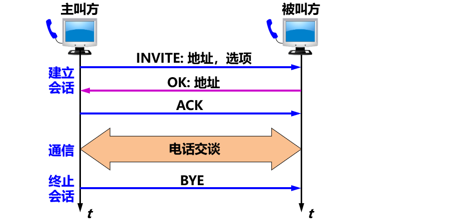

SIP 登记器的用途：跟踪被叫方
- SIP 有一种跟踪用户的机制，可以找出被叫方使用的 IP 地址。
- 为了实现跟踪，SIP 使用**登记**的概念。
- SIP 定义一些服务器作为 **SIP 登记器** (registrar)。
- 每一个 SIP 用户都有一个相关联的 SIP 登记器。

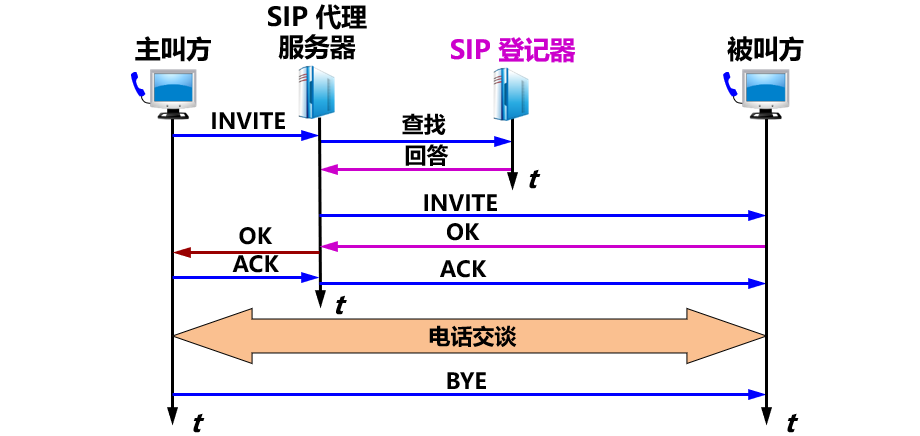
如果被叫没有在这个 SIP 登记器登记，该 SIP 登记器就发回重定向报文，指示 SIP 代理服务器向另一个 SIP 登记器重新进行 DNS 查询，直到找到被叫为止。

会话描述协议 SDP
- 会话描述协议 SDP (Session Description Protocol)：
  - SIP 的配套协议。
  - 在电话会议的情况下特别重要，因为电话会议的参加者是动态地加入和退出。
- SDP 详细指明了媒体编码、协议的端口号以及多播地址。
- SDP 是互联网建议标准。

## 8.4 改进“尽最大努力交付”的服务
- 互联网平等对待所有分组。
- 但不同服务要求提供不同的服务质量 QoS。

### 8.4.1 使互联网提供服务质量
- **服务质量 QoS** (Quality of Service)
  > 服务性能的总效果，此效果决定了一个用户对服务的满意程度。
  > 简单理解：有服务质量的服务就是能够满足用户的应用需求的服务。
- 服务质量可用若干**基本性能指标**来描述，包括：可用性、差错率、响应时间、吞吐量、分组丢失率、连接建立时间、故障检测和改正时间等。
- 服务提供者可向其用户保证某一种等级的服务质量。

QoS 机制分析
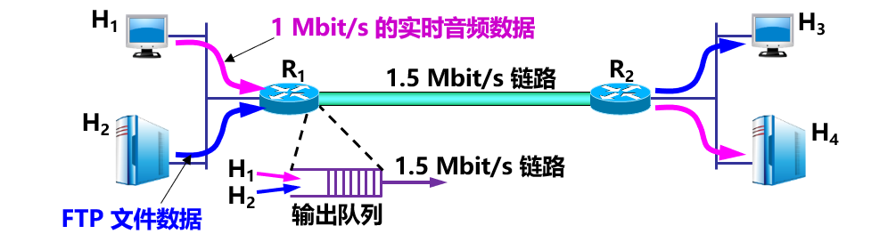
- 一个 1 Mbit/s 的实时音频数据和一个低优先级 FTP 文件数据
  - 需要增加一个机制，给不同性质的分组打上不同的**标记**。
  - 使路由器能识别实时数据分组，并使这些分组以高优先级进入输出队列，而仅在队列有多余空间时才准许低优先级的 FTP 数据分组进入。
- 一个 1 Mbit/s 的实时音频数据和一个高优先级 FTP 文件数据
  - 需要增加一种**分类** (classification) 机制，即路由器**根据某些准则**对输入分组进行分类，然后对不同类别的通信量给予不同的优先级。
- 一个数据率异常的实时音频数据和一个 FTP 文件数据
  - 路由器应能对数据流进行通信量的**管制** (policing)，使该数据流不影响其他正常数据流在网络中通过。
  - 应在路由器中再增加一种**调度** (scheduling) 机制，更加合理地分配和利用网络资源。
- 都发送数据率为 1 Mbit/s 的实时数据
  - 需要另一种增加**呼叫接纳** (call admission) 机制。一个数据流要预先声明它所需的服务质量，然后或者被准许进入网络（能得到所需的服务质量），或者被拒绝进入网络（不能满足所需的服务质量）。

> 为使互联网能够提供一定的服务质量，应当设法增加一些机制，包括：分组的类别、管制、调度以及呼叫接纳。

### 8.4.2 调度和管制机制
> **调度**和**管制**机制是使互联网能够提供服务质量的重要措施。

**调度机制**
- 调度：指排队的规则。
- 默认排队规则：**先进先出 FIFO** (First In First Out)。
  - 先到达的分组先获得服务。
  - 当队列已满时，后到达的分组就被丢弃。
- FIFO 的最大缺点：
  - 不能区分时间敏感分组和一般数据分组，并且也不公平。

分组按优先级排队
- 在先进先出的基础上增加**按优先级排队**，就能使优先级高的分组优先得到服务。
  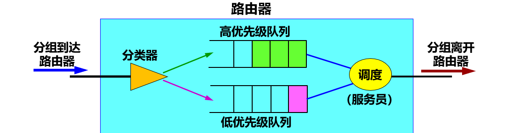

优先级排队：高优先级分组优先接受服务
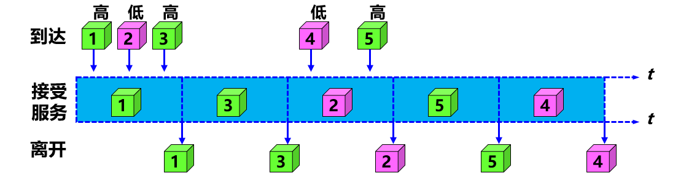
> 缺点：不公平。在高优先级队列中总是有分组时，低优先级队列中的分组就长期得不到服务。

公平排队 FQ (Fair Queuing)
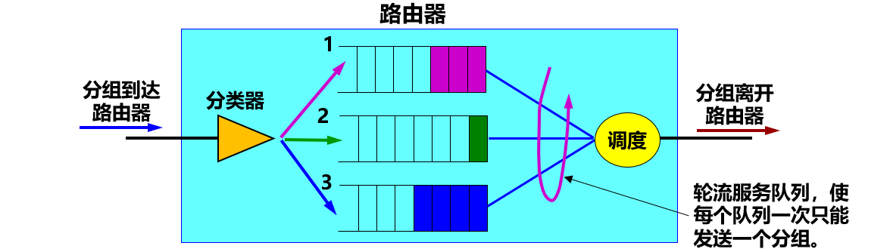
> 缺点：不是真公平。长分组得到的服务时间长，短分组就比较吃亏，并且公平排队并没有区分分组的优先级。

加权公平排队 WFQ (Weighted Fair Queuing)
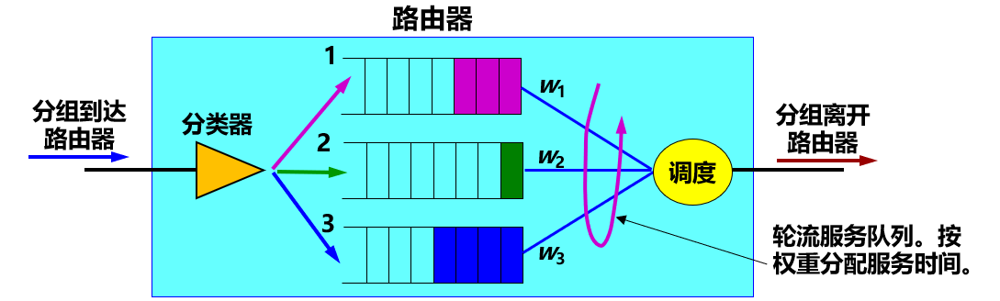
> 增加了队列权重，使高优先级队列中的分组有更多的机会得到服务。

- 给队列 i 指派一个权重 $w_{i}$ 。
- 队列 i 得到的 $平均服务时间 = w_{i} / (\sum w_{j})$
  - 其中，$\sum w_{j}$ 是对所有的非空队列的权重求和。
- 队列 i 将得到的有保证的带宽 $R_{i}$ 应为 $R_{i} = \frac{R \times w_{i}}{\sum w_{j}}$

WFQ 与 FIFO 的比较
- 分组流 1 的分组连续输入
  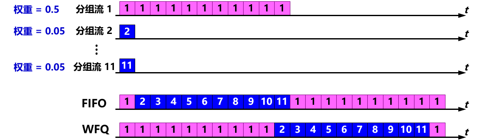
- 分组流 1 的分组断续输入
  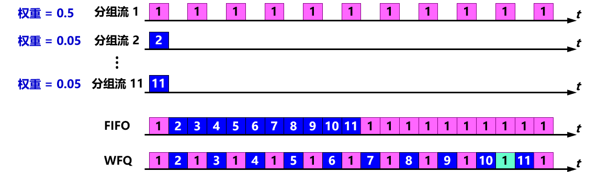

> 不管是哪一种情况，分组流 1 都能够得到更多时间的服务。

**管制机制**
- 根据以下三个方面进行管制：
  1. 平均速率：指在**一定的时间间隔**内通过的分组数。
  2. 峰值速率：限制数据流在非常短的时间间隔内的流量。
  3. 突发长度：限制在非常短的时间间隔内**连续**注入到网络中的分组数。

漏桶管制器 (leaky bucket policer) （简称为漏桶）
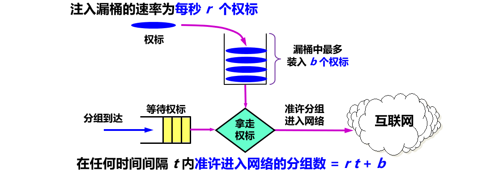
- 注意：“准许进入网络”**不等于**说“已经进入了网络”。
- 控制权标进入漏桶的速率 r，就可对分组进入网络的速率进行管制。

**漏桶机制与加权公平排队相结合**
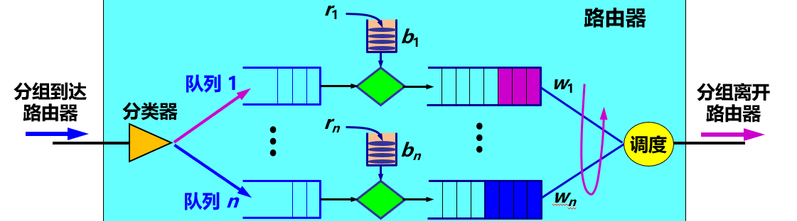
> 把漏桶机制与加权公平排队结合起来，可以控制队列中的**最大时延**。

- 假定：有 n 个分组流输入到一个路由器，复用后从一条链路输出。每一个分组流使用漏桶机制进行管制，漏桶参数为 $b_i$ 和 $r_i$ ，i = 1, 2, …, n。
- 设：漏桶 i 已装满了 $b_i$ 个权标。因此 $b_i$ 个分组可马上从路由器输出。
- 分组流 i 得到的带宽是由WFQ给出。这 $b_i$ 个分组中的最后一个分组所经受的时延最大，它等于传输这 bi 个分组所需的时间 $d_{max}$，即 $b_i$ 除以WFQ给出的传输速率：
  - $d_{max} = \frac{b_i}{R \times w_i / \sum w_j}$

### 8.4.3 综合服务 IntServ 与资源预留协议 RSVP
- **综合服务 IntServ** (Integrated Services) 可对**单个的应用会话**提供服务质量的保证。
- 两个主要特点：
  - 资源预留。给不断出现的会话已预留了多少资源（即链路带宽和缓存空间）。
  - 呼叫建立。为会话在源站到目的站的路径上的每个路由器预留足够的资源。

IntServ 定义了两类服务
- 有保证的服务 (guaranteed service) ：保证一个分组在通过路由器时的排队时延有一个严格的上限。
- 受控负载的服务 (controlled-load service) ：使应用程序得到比通常的“尽最大努力”更加可靠的服务。

IntServ 有四个组成部分
1. 资源预留协议 RSVP：IntServ 的**信令协议**。
2. 接纳控制 (admission control)：决定是否同意对某一资源的请求。
3. 分类器 (classifier)：将进入路由器的分组进行分类，并根据分类的结果将不同类别的分组放入特定的队列。
4. 调度器 (scheduler)：根据服务质量要求决定分组发送的前后顺序。

流 (flow)
- “流”是在多媒体通信中的一个常用的名词，一般定义为：
  > 具有**同样**的源 IP 地址、源端口号、目的 IP 地址、目的端口号、协议标识符、以及服务质量需求的一连串分组。

资源预留协议 RSVP
- 一个会话必须首先声明它所需的服务质量，以便使路由器能够确定是否有足够的资源来满足该会话的需求。
- 当请求被接受时，链路带宽和缓存空间就被分配给这个分组流。
- 资源预留协议 RSVP (ReSource reserVation Protocol) ：
  - 资源预留。
  - 采用多播树方式。

RSVP 协议的工作原理
- 假设：主机 H1 要向互联网上的四台主机 H2 ~ H5 发送多播视频节目，这四台主机打算以某种数据率来接收 H1 发送的视频节目。
  - 源点用多播发送 PATH 报文
    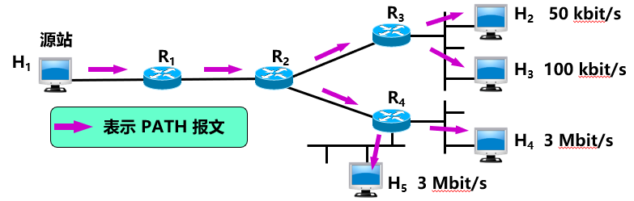
  - 各终点向源点返回 RESV 报文
    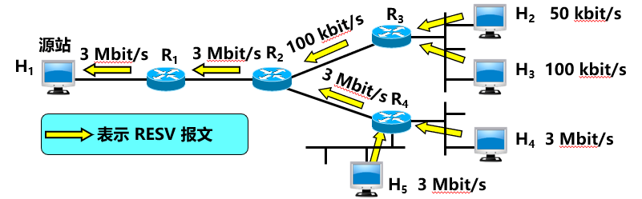

- IntServ/RSVP 所基于的概念是**端系统中与分组流有关的状态信息**。
- 各路由器中的预留信息只存储**有限时间**（称为**软状态** soft-state），因而各终点对这些预留信息必须**定期进行更新**。
- RSVP 协议不是运输层协议，而是**网络层**的控制协议。
- RSVP **不携带**应用数据。

IntServ 体系结构在路由器中的实现（分为前台和后台两个部分。）
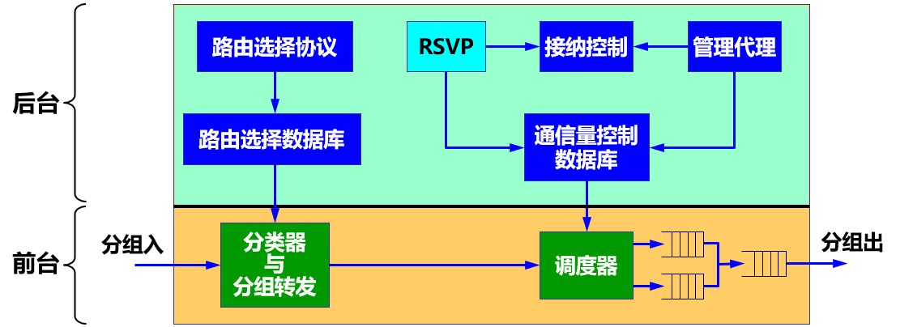
- 前台：两个功能块。每一个进入的分组都要通过这两个功能块。
  - 分类器与分组转发。
  - 分组的调度器。
- 后台：四个功能块，两个数据库。
  - 路由选择协议：负责维持**路由选择数据库**。
  - RSVP 协议：为每一个流预留必要的资源，并不断地更新**通信量控制数据库**。
  - 接纳控制：确定是否有足够的资源可供这个流使用。
  - 管理代理：用来修改通信量控制数据库和管理接纳控制功能块，包括设置接纳控制策略。

综合服务 IntServ 体系结构存在的主要问题
1. 状态信息的数量与流的数目**成正比**。因此在大型网络中，按每个流进行资源预留会产生很大的开销。
2. IntServ 体系结构**复杂**。若要得到有保证的服务，所有的路由器都必须装有 RSVP、接纳控制、分类器和调度器。
3. 服务质量等级数量**太少**，**不够灵活**。

### 8.4.4 区分服务 DiffServ
**区分服务的基本概念**
- 由于**综合服务 IntServ** 和资源预留协议 RSVP 都较复杂，很难在大规模的网络中实现，因此 IETF 提出了新的策略，即区分服务 DiffServ 。
- **区分服务 DiffServ** (Differentiated Services) 有时也简写为 **DS**。因此，具有区分服务功能的结点就称为 DS 结点。

区分服务 DiffServ 的要点
1. 力图**不改变**网络的基础结构，但在路由器中**增加**区分服务的功能。
   - 区分服务字段 DS：服务类型字段 (IPv4) ，通信量类字段 (IPv6)。
   - 根据 DS 字段的值来转发分组。
   - 利用 DS 字段提供不同等级的服务质量。
   - DS 字段现只使用前 6 bit，即区分服务码点 DSCP (Differentiated Services CodePoint)。
     
2. 网络被**划分**为许多个 DS 域。
   - 将所有的复杂性放在 DS 域的**边界节点** (boundary node) 中，使 DS 域内部路由器工作得尽可能地简单。
   - 边界节点可以是主机、路由器或防火墙等。
     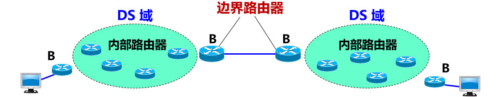
3. 边界路由器中的功能较多。分为：
   - 分类器 (classifier)
   - 通信量调节器 (conditioner)
     - 标记器 (marker)
     - 整形器 (shaper)
     - 测定器 (meter)
4. 聚合 (aggregation) 功能。
   - 将若干个流根据其 DS 值**聚合**成少量的流。
   - 路由器对**相同 DS 值**的流都按**相同的优先级**进行转发，简化了网络内部的路由器的转发机制。
   - 区分服务 DiffServ **不需要**使用 RSVP 信令。

服务等级协定 SLA
- 在使用 DS 字段之前，互联网的 ISP 要和用户商定服务等级协定 SLA (Service Level Agreement)。
- 在 SLA 中指明：被支持的服务类别（可包括吞吐量、分组丢失率、时延和时延抖动、网络的可用性等）和每一类所容许的通信量。

边界路由器中的各功能块的关系
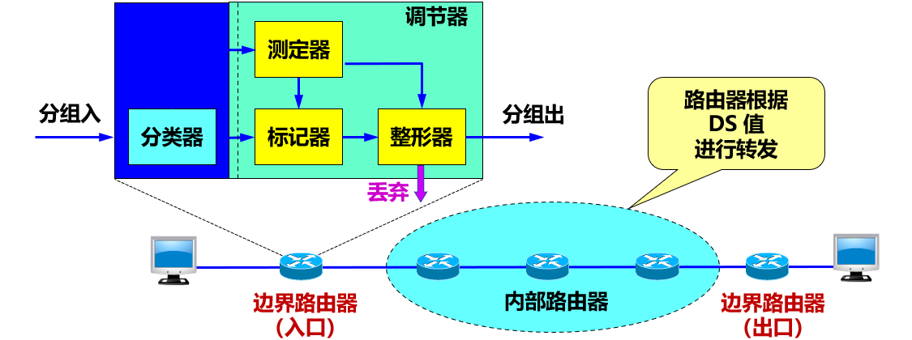

**每跳行为 PHB**
- 每跳行为 PHB (Per-Hop Behavior)：转发分组时**体现**服务水平。
- 行为：指在转发分组时如何处理分组。
- 每跳：强调行为只涉及到本路由器转发的这一跳的行为，与下一个路由器如何处理无关。
- 与 IntServ / RSVP 考虑的服务质量是“端到端”的很不一样。

DiffServ 定义的两种 PHB
- 迅速转发 PHB
  - EF PHB (Expedited Forwarding PHB)。
  - 离开路由器的通信量的数据率必须**等于或大于**某一数值。
  - 用来构造通过 DS 域的低丢失率、低时延、低时延抖动、确保带宽的端到端服务（即不排队或很少排队）。
  - 这种服务对端点来说像点对点连接或虚拟租用线，又称为 Premium（优质）服务。
- 确保转发 PHB
  - AF PHB (Assured Forwarding PHB)。
  - 将通信量划分为**四个等级**，给每一种等级提供**最低数量**的带宽和缓存空间。
  - 对于其中的每一个等级再划分出三个“**丢弃优先级**” 。当发生网络拥塞时，对于每一个等级的 AF，路由器首先丢弃“丢弃优先级”较高的分组。

区分服务 DiffServ
- 可以看出：区分服务 DiffServ 比较灵活，因为它并没有定义特定的服务或服务类别。
- 当新的服务类别出现而旧的服务类别不再使用时，DiffServ 仍然可以工作。
