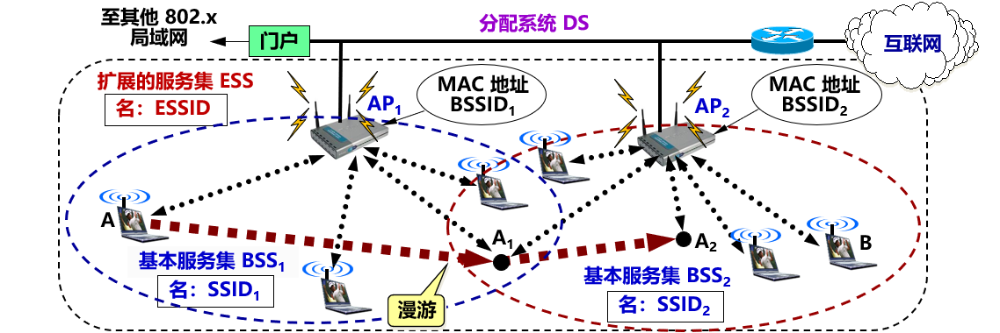

## 9.1 无线局域网 WLAN

### 9.1.1 无线局域网的组成
- 无线局域网 WLAN (Wireless Local Area Network) ：采用无线通信技术的局域网。
- 特点：
  - 提供了移动接入的功能
  - 节省投资，建网速度较快
  - 支持便携设备联网
- 由于手机普及率日益增高，通过无线局域网接入到互联网已成为当今上网的最常用的方式。

- 便携站和移动站表示的意思并不一样。
- 便携站：便于移动，但在工作时，其位置是固定不变的。
- 移动站：不仅能够移动，还可以在移动的过程中进行通信。

- 可分为两大类：
  - 有固定基础设施的 WLAN
  - 无固定基础设施的 WLAN
- 所谓“固定基础设施”是指预先建立起来的、能够覆盖一定地理范围 的一批固定基站。

**IEEE 802.11**
- IEEE 802.11 是一个有**固定基础设施**的无线局域网的国际标准。
  - 使用星形拓扑，中心叫做**接入点 AP** (Access Point)。
    - AP 是无线局域网的**基础设施**，也是一个**链路层**的设备。
    - AP 也叫做**无线接入点 WAP** (Wireless Access Point)。
    - 无线局域网中的站点对网内或网外的通信**都必须通过 AP**。
  - 在 MAC 层使用 **CSMA/CA** 协议
- 凡使用 802.11 系列协议的局域网又称为 **Wi-Fi** 。

- IEEE 802.11 的**基本服务集 BSS** 和**扩展服务集 ESS**
- 基本服务集 BSS (Basic Service Set )是无线局域网的**最小构件**。
- 一个 BSS 包括一个接入点 AP 和若干个移动站。
- 必须为该 AP 分配一个不超过 32 字节的**服务集标识符 SSID** (Service Set IDentifier) （即该 AP 的无线局域网的**名字**）和一个通信信道。
  > 一个 BSS 所覆盖的地理范围叫做一个**基本服务区 BSA** (Basic Service Area)。
- 每个 AP 有一个唯一的 48 位 MAC 地址，名称是**基本服务集标识符 BSSID**。在无线局域网中传送的各种帧的首部中，都必须有节点的 MAC 地址（即 BSSID，但不是 SSID）。
  > 用户通常都知道所连接的无线局域网 SSID，但可以不知道其 BSSID。
- 一个 BSS 可以通过 AP 连接到一个**分配系统 DS** (Distribution System)，然后再连接到另一个 BSS，构成了一个**扩展服务集 ESS** (Extended Service Set)。
- ESS 也有个标识符，是不超过 32 字符的字符串名字 (**不是地址**)，叫做**扩展服务集标识符 ESSID**。
- DS 的作用：使 ESS 对上层的表现就像一个 BSS 一样。
- DS 可以使用**以太网**（最常用）、点对点链路或其他无线网络。
- ESS 还可为无线用户提供到 802.x 局域网（非802.11无线局域网）的**接入**。通过**门户** (Portal) 设备实现。门户相当于一个网桥。
- 移动站 A 如果要和另一个 BSS 中的移动站 B 通信，就必须经过两个接入点 AP1 和 AP2，即 A→AP1→AP2→B。
- 移动站 A 漫游到位置 A1 时，选择和信号较强的一个 AP 联系。当漫游到位置 A2 时，就只能和 AP2 联系了。
  > BSS 的服务范围是由 AP 所发射的电磁波的辐射范围确定的。
- 移动站只要能够和其中一个 AP 联系上，就可以一直保持与另一个移动站 B 的通信。

信道 (channel)
- 无线局域网通常使用 2.4 GHz 和 5 GHz 频段。每一个频段划分为若干个信道，供各无线局域网使用。
- 802.11b 使用 2.4 GHz 频段，带宽约 85 MHz。定义了 11 个部分重叠的信道集。相邻信道的中心频率相差 5 MHz，每个信道的带宽约为 22 MHz。
  

关联 (association)
- 一个移动站若要加入到一个 BSS，就必须先与某个 AP **建立关联**。
- 建立关联：表示这个移动站加入了选定的 AP 所属的子网，并和这个 AP 之间创建了一个**虚拟线路**。
- 只有关联的 AP 才能向这个移动站发送数据帧，而这个移动站也只有通过关联的 AP 才能向其他站点发送数据帧。

建立关联的两种方法
- 被动扫描
  
  1. AP 周期性发出**信标帧** (beacon frame)，其中包含 SSID 、速率等系统参数。
  2. 移动站 A 扫描 11 个信道，选择加入到 AP2 所在的基本服务集 BSS2，向 AP2 发出**关联请求帧** (Association Request frame)。
  3. AP2 同意移动站 A 发来的关联请求，向移动站A发送**关联响应帧** (Association Response frame)。
- 主动扫描
  
  1. 移动站 A 主动发出广播的**探测请求帧** (Probe Request frame)，让所有能够收到此帧的接入点知道有移动站要求建立关联。
  2. 两个 AP 都回答**探测响应帧** (Probe Response frame)。
  3. 移动站 A 向 AP2 发出**关联请求帧** (Association Response frame)。
  4. AP2 向移动站 A 发送关联响应帧，与移动站 A 建立关联。

> 一个移动站可以**同时**进行主动扫描和被动扫描。

重建关联 (reassociation) 和分离 (dissociation)
- 移动站使用**重建关联** (reassociation) 服务，可把这种关联转移到另一个接入点。
- 当使用**分离** (dissociation) 服务时，可终止这种关联。

安全地建立关联
- 用户在和附近的接入点 AP 建立关联时，一般还要键入用户密码。
- 初期加密方案：**有线等效的保密 WEP** (Wired Equivalent Privacy)。
- 现在加密方案：**无线局域网受保护的接入 WPA** (WiFi Protected Access) 或 WPA2 。

**移动自组网络**
- 又称为**自组网络** (ad hoc network) 。
- 是没有固定基础设施（即没有 AP）的无线局域网。
- 移动站都处于平等状态。
  

> 三个主要问题：路由选择协议，多播，安全。

- 服务范围通常是受限的，一般不和外界的其他网络相连接。
- 移动自组网络也就是**移动分组无线网络**。
- 优点：
  - 方便灵活。
  - 生存性非常好。

无线传感器网络 WSN
- **无线传感器网络 WSN** (Wireless Sensor Network) ：由大量**传感器**结点通过无线通信技术构成的**自组网络**。
- 应用：进行各种数据的采集、处理和传输。
- 特点：
  - 不需要很高的带宽，但大部分时间必须保持低功耗。
  - 对协议栈的大小有严格的限制。
  - 对网络安全性、结点自动配置、网络动态重组等方面有一定的要求。

传感器结点的形状和组成

无线传感器网络主要的应用领域
- 组成各种**物联网 IoT** (Internet of Things) ，例如：
  - 环境监测与保护；
  - 战争中对敌情的侦查和对兵力、装备、物资等的监控；
  - 医疗中对病房的监测和对患者的护理；
  - 在危险的工业环境中的安全监测；
  - 城市交通管理、建筑内的温度/照明/安全控制等。

移动自组网络不同于移动 IP
- 移动 IP
  - 漫游的主机可以用多种方式连接到互联网。
  - 漫游的主机可以直接或通过无线链路连接到固定网络上的另一个子网。
  - 需要地址管理和增加协议的互操作性。
  - 核心网络功能仍然是各种路由选择协议。
- 移动自组网络
  - 把移动性扩展到无线领域中的自治系统。
  - 具有自己特定的路由选择协议，并且可以不和互联网相连。
  - 即使和互联网相连时，移动自组网络也是以末梢网络 (stub network) 方式工作。
  - 末梢网络：不允许外部通信量穿越该网络。

几种不同的接入
- 固定接入 (fixed access)：在作为网络用户期间，用户设置的地理位置保持不变。
- 移动接入 (mobility access)：用户设置能够以车辆速度移动时进行网络通信。当发生切换时，通信仍然是连续的。
- 便携接入 (portable access)：在受限的网络覆盖面积中，用户设备能够在以步行速度移动时进行网络通信，提供有限的切换能力。
- 游牧接入 (nomadic access)：用户设备的地理位置至少在进行网络通信时保持不变。如用户设备移动了位置，则再次进行通信时可能还要寻找最佳的基站。

### 9.1.2 802.11 局域网的物理层
- 802.11 标准中物理层相当复杂。根据物理层的不同（如工作频段、数据率、调制方法等），对应的标准也不同。

| 标准             | 别名    | 频段        | 最高数据率 | 物理层    | 优缺点                                                                                      |
| ---------------- | ------- | ----------- | ---------- | --------- | ------------------------------------------------------------------------------------------- |
| 802.11b(1999年)  | Wi-Fi 1 | 2.4 GHz     | 11 Mbit/s  | 扩频      | 最高数据率较低，价格最低，信号传播距离最远，且不易受阻碍                                    |
| 802.11a(1999年)  | Wi-Fi 2 | 5 GHz       | 54 Mbit/s  | OFDM      | 最高数据率较高，支持更多用户同时上网，价格最高，信号传播距离较短，且易受阻碍。              |
| 802.11g(2003年)  | Wi-Fi 3 | 2.4 GHz     | 54 Mbit/s  | OFDM      | 最高数据率较高，支持更多用户同时上网，信号传播距离最远，且不易受阻碍，价格比 802.11b 贵。   |
| 802.11n(2009年)  | Wi-Fi 4 | 2.4 / 5 GHz | 600 Mbit/s | MIMO OFDM | 使用多个发射和接收天线达到更高的数据传输率，当使用双倍带宽 (40 MHz) 时速率可达 600 Mbit/s。 |
| 802.11ac(2014年) | Wi-Fi 5 | 5 GHz       | 7 Gbit/s   | MIMO OFDM | 完全遵循 802.11i 安全标准的所有内容，使得无线连接能够在安全性方面达到企业级用户的需求。     |
| 802.11ax(2019年) | Wi-Fi 6 | 2.4 / 5 GHz | 9.6 Gbit/s | MIMO OFDM | 侧重解决密集环境下（如火车站、机场）提高吞吐量密度（即单位面积的吞吐量）                    |

802.11 的物理层的几种实现方法
- 802.11 的物理层有以下几种实现方法：
  - 扩频
  - 多入多出 MIMO (Multiple Input Multiple Output)
  - 正交频分复用 OFDM (Orthogonal Frequency Division Multiplexing)
  - 跳频扩频 FHSS （已很少用）
  - 红外线 IR （已很少用）

### 9.1.3 802.11 局域网的 MAC 层协议

> 必须解决共享信道上的**碰撞问题**

**CSMA/CA 协议**
- 无线局域网**不能**简单地搬用 CSMA/CD 协议。因为：
  - **碰撞检测（CD）**要求：一个站点在发送本站数据的同时，还必须不间断地检测信道，但接收到的信号强度往往会远远小于发送信号的强度，在无线局域网的设备中要实现这种功能就**花费过大**。
  - 即使能够实现碰撞检测的功能，并且在发送数据时检测到信道是空闲的时候，在接收端仍然有**可能发生碰撞**。

无线局域网的特殊问题

> **隐蔽站问题** (hidden station problem)：由于无线信号覆盖范围和穿透能力有限，A 和 C 检测不到彼此的无线信号，都以为 B 是空闲的，因而都向 B 发送数据，结果发生碰撞。

必须考虑的特点
1. 无线局域网的适配器**无法实现**碰撞检测；
2. 检测到信道空闲，其实信道**可能并不空闲**；
3. 即使能够在硬件上实现无线局域网的碰撞检测功能，也无法检测出**隐蔽站问题**带来的碰撞。

CSMA/CA 协议
- 无线局域网不能使用 CSMA/CD。
- 但可以使用 CSMA 协议。
- 改进：
  - 增加**碰撞避免 CA** (Collision Avoidance) ：尽量减少碰撞发生的概率。
  - 使用 CSMA/CA 的同时，使用**停止等待协议**：链路层确认，解决碰撞后重传。

802.11 的 MAC 层

> MAC 层通过**协调功能**来确定在基本服务集 BSS 中的移动站何时可以发送或接收数据。包括**两个子层**：DCF 和 PCF。

- 分布协调功能 DCF
  - DCF 子层：不采用任何中心控制。每个节点使用 CSMA/CA 机制的分布式接入算法，让各个站通过争用信道来获取发送权。因此 DCF 向上提供**争用服务**。所有实现都必须有 DCF 功能。
- 点协调功能 PCF
  - PCF 子层：可选。使用集中控制的接入算法，用类似于探询的方法把发送数据权轮流交给各个站，从而避免碰撞。自组网络没有 PCF 子层。
  - 对时间敏感的业务，如分组话音，应使用提供无争用服务的 PCF。

CSMA/CA 协议的要点

**时间间隔 DIFS 的重要性**
- 在完成发送后，必须再等待一段很短的时间（继续监听）才能发送下一帧。这段时间的通称是**帧间间隔 IFS** (InterFrame Space)。
- 两种常用的帧间间隔：
  - 分布协调功能帧间间隔 **DIFS**。
  - 短 (Short) 帧间间隔 **SIFS**。

SIFS
- 是最短的帧间间隔，用来分隔属于一次对话的各帧。
- 一个站应当能够在这段时间内从发送方式切换到接收方式。
- 使用 SIFS 的帧类型有：ACK 帧、CTS 帧、由过长的 MAC 帧分片后的数据帧，以及所有回答 AP 探测请求帧和在 PCF 方式中接入点 AP 发送出的任何帧。

DIFS
- 比 SIFS 的帧间间隔要长得多。在 DCF 方式中，DIFS 用来发送数据帧和管理帧。
- 802.11 标准规定：凡在空闲时间想发送数据的站点，必须等待时间 DIFS 后才能发送。保证了确认帧 ACK 得以优先发送。

DIFS 很重要
- A 监听信道。若信道在时间间隔 DIFS 一直都是空闲的，A 就可以在 t0 时间发送数据帧 DATA。
- B 收到数据帧后，必须进行 CRC 检验。若检验无差错，再从接收状态转为发送状态。经过时间间隔 SIFS 后，向 A 发送确认帧 ACK。
- 从 A 发送数据帧 DATA 开始，到收到确认 ACK 为止的这段时间 (DATA + SIFS + ACK) 内，必须不允许任何其他站发送数据，这样才不会发生碰撞。

避免发生碰撞的两种机制
- 虚拟载波监听
  - 软件实现。
  - 源站 A 把要占用信道的时间（DATA + SIFS + ACK），写入其数据帧 DATA 的首部。
  - 所有处在站点 A 的广播范围内的各站都能够收到这一信息，并创建自己的**网络分配向量 NAV** (Network Allocation Vector)。
  - NAV 指出：信道忙的持续时间，意思是：“其他站点不能在这段时间发送数据”。
- 载波监听
  - 在物理层用硬件实现。
  - 每个站检查收到的信号强度是否超过一定的门限数值，用此判断是否有其他移动站在信道上发送数据。
  - 任何站要发送数据之前，必须监听信道。只要监听到信道忙，就不能发送数据。

**争用信道的过程**

- 在站点 A 和 B 通信的过程中，站点 C 和 D 也要发送数据。但 C 和 D 检测到信道忙，因此必须**推迟接入**(defer access)，以免发生碰撞。
- 在等待信道进入空闲状态后，都经过规定的时间间隔 DIFS 再同时发送数据必然产生碰撞。因此，CSMA/CA 规定：所有推迟接入的站都必须在**争用期**执行统一的**退避算法**开始**公平**地**争用信道**。
- 争用期也叫做**争用窗口 CW** (Contention Window)。争用窗口由许多时隙 (time slot) 组成。例如，争用窗口 CW = 15 即窗口大小是 15 个时隙。

时隙长度的确定
- 方法：在下一个时隙开始时，每个站点都能检测出在前一个时隙开始时信道是否忙（这样就可采取适当对策）。
- **时隙长短**在不同 802.11 标准中可以有不同数值。
- 例如：802.11g
  - 一个时隙时间为 9us；
  - SIFS = 10 us；
  - DIFS = SIFS + (2 * Slot time) = 28us。

退避算法
- 站点在**进入争用期**时，应在 0 ~ CW 个时隙中**随机**生成一个退避时隙数，并设置**退避计时器** (backoff timer)。
- 当几个站同时争用信道时，计时器**最先降为零**的站首先接入媒体，发送数据帧。这时信道转为忙，而其他正在退避的站则**冻结**其计时器，保留计时器的数值不变，推迟到下次争用信道时**接着倒计时**。
- 这样的规定对所有的站是**公平的**。

“推迟接入”和“退避 (backoff)”的区别
- 推迟接入：
  - 发生在信道处于忙的状态，为的是等待争用期的到来，以便执行退避算法来争用信道。
  - 这时退避计时器处于冻结状态。
- 退避：
  - 是争用期各站点执行的算法，退避计时器进行倒计时。
  - 这时信道是空闲的，并且总是出现在时间间隔 DIFS 的后面。

争用窗口
- 建议值： $15 (最小) \le 争用窗口 CW \le 1023 (最大)$。
- CSMA/CA规定：如果未收到确认帧，则必须重传。但每重传一次，争用窗口的数值就近似加倍。
- 假定：选择初始争用窗口 $CW = 2^4 – 1 = 15$，第 i 次退避就在 $2^{4+i} – 1$ 个时隙中随机地选择一个，即：
  - 第 1 次重传时，随机退避的时隙数应在 0 ~ 31 之间生成。
  - 第 2 次重传时，随机退避的时隙数应在 0 ~ 63 之间生成。
  - 第 3 次重传时，随机退避的时隙数应在 0 ~ 127 之间生成。
  - 第 4 次重传时，随机退避的时隙数应在 0 ~ 255 之间生成。
  - 第 5 次重传时，随机退避的时隙数应在 0 ~ 511 之间生成。
  - 第 6 次以及 6 次以上重传时，随机退避的时隙数应在 0 ~ 1023 之间生成，争用窗口 CW **不再增大**了。

退避算法的使用场景

1. 要发送数据时检测到信道忙。
2. 已发出的数据帧未收到确认，重传数据帧。
3. 接着发送后续的数据帧（为了防止一个站长期垄断发送权）。

> 当站点想发送数据，并检测信道连续空闲时间超过 DIFS 时，即可立即发送数据，而不必经过争用期。

**对信道进行预约**
- 假设：B 站正好在 A 占用信道时要发送数据。B 检测到信道忙，于是推迟到争用信道时与 A 一起争用信道。但正巧 A 和 B 又生成了同样大小的随机退避时隙数。结果就发生了碰撞，A 和 B 都必须再重传。
- 为进一步减少碰撞，还需要再采用一些措施：**信道预约**。
  

> 隐蔽站问题：A 站或 B 站向接入点 AP 发送数据时， C 站接收不到这些信号。C 站向 AP 发送的信号也传播不到远处的 A 站或 B 站。
> 
> 以上措施使得 A 站和接入点 AP（以及 A 站和 B 站）的通信过程中，发生碰撞的概率大大降低，特别是减少了隐蔽站的干扰问题。

信道预约
- 使用 RTS 帧和 CTS 帧会使整个网络的通信效率有所下降，多浪费信道的时间 `[RTS + SIFS + CTS + SIFS]`。
- 但与数据帧相比，开销不算大。这两种控制帧都很短，其长度分别为 20 字节和 14 字节。而数据帧最长可达 2346 字节。
- 若不使用这种控制帧，一旦发生碰撞而导致数据帧重发，浪费的时间就更多。

信道预约不能完全避免碰撞
- 即使使用了 RTS 和 CTS 对信道进行预约，但碰撞也有可能发生。
- 例如：有的站可能在时间 t1 或 t2 就发送了数据（这些站可能是没有收到 RTS 帧或 CTS 帧或 NAV），结果必定与 RTS 帧或 CTS 帧发生碰撞。
- A 站若收不到 CTS 帧，就不能发送数据帧，而必须重传 RTS 帧。
- A 站只有正确收到 CTS 帧后才能发送数据帧。

信道预约不是强制的
- 信道预约**不是强制性**规定。各站可以自己决定使用或不使用信道预约。
- 只有当数据帧的长度**超过**某一数值时，使用 RTS 帧和 CTS 帧才比较合适。
- 因为无线信道的误码率比有线信道的高得多，所以，无线局域网的 MAC 帧长一般应当短些，以便在出错重传时减小开销。

### 9.1.4 802.11 局域网的 MAC 帧
802.11 帧共有三种类型：**控制帧**、**数据帧**和**管理帧**。

- RTS 帧格式（帧控制字段中的子类型为 1011）
  
- CTS 和 ACK 帧格式（帧控制字段中的子类型分别为 1100 和 1101）
  

802.11 数据帧的三大部分
- MAC 首部：共 30 字节。复杂。
- 帧主体：数据部分，不超过 2312 字节。802.11 帧的长度通常都小于 1500 字节。
- 帧检验序列 FCS：尾部，共 4 字节 。

**关于 802.11 数据帧的地址**
- 数据帧有四个地址字段。
  
  - 地址 1 永远是接收地址（即直接接收数据帧的节点地址）。
  - 地址 2 永远是发送地址（即实际发送数据帧的节点地址）。
  - 地址 3 和地址 4 **取决于**数据帧中的“来自AP”和“去往AP”这两个字段的数值。
  - 注意：上述地址都是 MAC 地址，即硬件地址，而 AP 的 MAC 地址是 BSSID。

最常用的两种情况

复杂情况：站点处在不同的两个子网中

**序号控制字段、持续期字段和帧控制字段**
- 序号控制：占 16 位，其中序号子字段占 12 位，分片子字段占 4 位。
- 持续期：占 16 位。
- 帧控制：共分为 11 个子字段：
  1. 协议版本：现在是 0。
  2. 类型和子类型：用来区分帧的功能。
  3. 更多分片：置为 1 时表明这个帧属于一个帧的多个分片之一。
  4. 功率管理：占 1 位，用来指示移动站的功率管理模式。
  5. WEP：占 1 位。若 WEP = 1，表明对帧主体字段采用了加密算法。

分片的发送举例
> 为了提高传输效率，在信道质量较差时，需要把一个较长的帧划分为许多较短的分片。

## 9.2 无线个人区域网 WPAN
- 无线个人区域网 WPAN (Wireless Personal Area Network) ：在个人工作地方把属于个人使用的电子设备用无线技术连接起来**自组网络**，不需要使用接入点 AP。
- 整个网络的范围大约在 10 m 左右。
- WPAN 可以是一个人使用，也可以是若干人共同使用。
- 与**个人区域网 PAN** (Personal Area Network) 并不完全等同，因为 PAN 不一定都是使用无线连接的。

WPAN 和 WLAN 不一样
- WPAN：
  - 是以个人为中心使用的无线个人区域网；
  - 实际上是一个低功率、小范围、低速率和低价格的电缆替代技术。
- WLAN：
  - 是同时为许多用户服务的无线局域网；
  - 是一个大功率、中等范围、高速率的局域网。

WPAN 标准
- 由 IEEE 的 802.15 工作组制定，包括 MAC 层和物理层的标准。
- WPAN 都工作在 2.4 GHz 的 ISM 频段。
- 欧洲的 ETSI 标准则把无线个人区域网取名为 HiperPAN。

**蓝牙系统 (Bluetooth)**
- 最早使用的 WPAN。
- 1994 年，由爱立信公司推出，其标准是 IEEE 802.15.1 。
- 第 1 代蓝牙：数据率 = 720 kbit/s，通信范围 = 10 米左右。
- 蓝牙 4.0：
  - 低耗能蓝牙 BLE (Bluetooth Low Energy)：
    - 适用于数据量很小的节点，电池可以连续工作 4 ~ 5 年；
    - 距离增大到 30 m，数据率可达 1 Mbit/s。
  - 传统蓝牙 (classic Bluetooth)：
    - 数据率提高到 3 Mbit/s，传输距离可达 100 m。
- 蓝牙 5.0：数据率上限达 24 Mbit/s，传输距离最高可达 300 m。

皮可网 (piconet)
- 蓝牙使用 **TDM** 方式和扩频跳频 **FHSS** 技术组成不用接入点 AP 的**皮可网** (piconet)。
- 每一个皮可网有一个**主设备** (Master) 和**最多 7 个**工作的**从设备** (Slave)。
- 通过共享主设备或从设备，可以把多个皮可网链接起来，形成一个范围更大的**扩散网** (scatternet)。

蓝牙系统中的皮可网和扩散网

**低速 WPAN**
- 主要用于工业监控组网、办公自动化与控制等领域
- 速率是 2 ~ 250 kbit/s。
- 标准是 IEEE 802.15.4。新修订的标准是 IEEE 802.15.4-2006。
- 低速 WPAN 中最重要的就是 **ZigBee**。
- ZigBee 技术主要用于各种电子设备（固定的、便携的或移动的）之间的无线通信。

ZigBee 的特点
- **通信距离短** (10 ~ 80 m)，传输数据**速率低**，**成本低**廉。
- **功耗非常低**
  - 对于某些工作时间和总时间之比小于 1% 的情况，电池的寿命甚至可以超过 10 年。
- **网络容量大**
  - 一个 ZigBee 的网络最多包括有 255 个结点，其中一个是主设备，其余则是从设备。
  - 若是通过网络协调器，**整个网络**最多可以支持超过 64000 个结点。

ZigBee 标准与协议栈

- 在 IEEE 802.15.4 标准基础上发展而来。所有 ZigBee 产品也是 802.15.4 产品。
- IEEE 802.15.4 只是定义了 ZigBee 协议栈的**最低的两层**（物理层和 MAC 层），而上面的两层（网络层和应用层）则是由 ZigBee 联盟定义的。

- IEEE 802.15.4 **物理层**使用的三个频段
  | 频段            | 数据率     | 信道数 |
  | --------------- | ---------- | ------ |
  | 2.4 GHz（全球） | 250 kbit/s | 16     |
  | 915 MHz（美国） | 40 kbit/s  | 10     |
  | 868 MHz（欧洲） | 20 kbit/s  | 1      |
- **MAC 层**主要沿用 802.11 无线局域网标准的 CSMA/CA 协议。
- 在**网络层**，ZigBee 可采用星形和网状拓扑，或两者的组合。

ZigBee 的组网方式
- 一个 ZigBee 网络最多可以有 255 个节点。
- 节点按功能的强弱可划分为两大类：
  - **全功能设备** FFD (Full-Function Device)
    - 充当**协调器** (coordinator)，负责维护整个 ZigBee 网络的节点信息，同时还可以与其他 ZigBee 网络的协调器交换数据。
    - 通过各网络协调器的相互通信，可以得到覆盖更大范围、超过65000 个节点的 ZigBee网络。
  - **精简功能设备** RFD (Reduced-Function Device)
    - 是 ZigBee 网络中数量最多的**端设备**。
    - 电路简单，存储容量较小，因而成本较低。
    - RFD 结点**只能**与处在该星形网中心的 FFD 结点交换数据。

  > 有一个全功能设备 FFD 充当网络的**协调器**。
  > ZigBee 网络中**数量最多**的端设备是精简功能设备 RFD 结点。
  > 

**高速 WPAN**
- 用于在**便携式多媒体装置**之间传送数据，支持11 ~ 55 Mbit/s 的数据率，标准是 802.15.3。
- IEEE 802.15.3a 工作组还提出了更高数据率的物理层标准的**超高速** WPAN，使用**超宽带** UWB 技术：
  - 工作在 3.1 ~ 10.6 GHz 微波频段，有非常高的信道带宽。
  - 信号的带宽应超过信号中心频率的 25% 以上，或信号的绝对带宽超过 500 MHz。
  - 使用了瞬间高速脉冲，可支持 100 ~ 400 Mbit/s 的数据率，可用于小范围内高速传送图像或 DVD 质量的多媒体视频文件。

## 9.3 蜂窝移动通信网

### 9.3.1 蜂窝无线通信技术的发展简介
- 移动通信的种类很多，如蜂窝移动通信、卫星移动通信、集群移动通信、无绳电话通信等。
- 蜂窝移动网络的发展非常迅速，其信号的**覆盖面**已远远超过 Wi-Fi 无线局域网的覆盖面。
- 随着技术的发展，使用蜂窝无线通信进行电话通信的**手机**已经发展成为接入到互联网最主要的用户设备。
- 在移动的环境下，蜂窝无线通信网已经成为不可或缺的**接入网**。

**蜂窝移动通信系统问世**
- 第一代 (1G) 蜂窝移动通信系统
  - 1978 年底问世。
  - 使用**模拟技术**和传统的**电路交换**及**频分多址 FDMA** 提供电话服务。
  - 移动通信系统的手机相当笨重（俗称大哥大）。

**2G 蜂窝移动通信系统**
- 第二代 (2G) 蜂窝移动通信系统
  - 1990 年后开始。
  - 基于**数字技术**。
  - 代表：欧洲提出的 **GSM** 系统等。

GSM 2G 蜂窝通信系统的重要组成构件

- 小区 (cell)：整个网络服务区划分成许多小区 (即蜂窝)。
- 基站：每个小区设置一个，覆盖小区，负责与本小区各个移动站的联络和控制。移动站的发送或接收都必须经过基站完成，因此基站又称为**收发基站**。
- 频率复用：相邻小区采用不同的频率，解决了同频干扰，**频率可以重复使用**。
- 电路交换：提供基本的**话音**通信服务。
- 空中接口：移动用户到基站之间的空口（即**无线空中接口**），采用的**多址方式**是 **FDMA/TDMA** 的混合系统。

GSM FDMA/TDMA

- 把可用频带（上行和下行各占用 25 MHz）划分为 125 个带宽为 200 kHz 的子频带，再把每个**子频带**进行**时分复用**，每个 TDM 帧划分为 8 个**时隙**。每个通话的用户占用一个 TDM 帧中的一个特定时隙。
- 上行：从移动站到基站。下行：从基站到移动站。

GSM 2G 蜂窝通信系统的重要组成构件

- GSM：包括**基站子系统**和**网络子系统**（常称为**核心网**）。
- 基站子系统：包括几十个基站和一个**基站控制器 BSC** (Base Station Controller)。
- BSC：为本基站子系统中的几十个基站服务：分配无线信道，确定所在小区，漫游时进行信道切换。
- 核心网：包括移动交换中心 **MSC** (Mobile Switching Center)和网关移动交换中心**GMSC** (Gateway Mobile Switching Center)。
- MSC：负责用户的授权和账单，用户呼叫连接的建立和释放，不同基站子系统之间漫游时的信道切换。
- GMSC：将 MSC 连接到公用电话网或其他移动通信网。

**数据通信被引入移动通信系统**
- 为了满足移动数据通信需求，引入了：
  - 通用分组无线服务 GPRS (General Packet Radio Service)（俗称 2.5G）；
  - 增强型数据速率 GSM 演进 EDGE (Enhanced Data rate for GSM Evolution) 系统（俗称 2.75G）。
- 空口调制方式：由高斯最小频移键控 GMSK (Gaussian Minimum Shift Keying) 提高到 8PSK；
- 网元：引入了分组控制单元 PCU (Packet Control Unit)。
  - PCU 通常和 BSC 集成在一起，负责处理有关数据通信的业务。
  > PCU 根据用户数据业务的突发性质，动态地分配空口资源给用户，提高了空口资源的利用率，提供的最大速率为 171.2 kbit/s（GPRS）和 384 kbit/s（EDGE）。

引入 GPRS 后的核心网组成

- 核心网：电路交换域 + 分组交换域。
- 电路交换域：负责话音通信。分组交换域：负责数据通信。
- 分组交换域：服务 GPRS 支持节点 SGSN (Serving GPRS Support Node) + 网关 GPRS 支持节点 GGSN (Gateway GPRS Support Node)。
- SGSN：在基站控制器和 GGSN 之间转发 IP 数据报；与 MSC 交互，完成用户授权、通信切换，移动节点位置信息维护等功能。
- GGSN：网络接入控制，把多个 SGSN 连接起来后接入互联网。又称为 GPRS 路由器。分组过滤，保证 GPRS 网络的安全。

**3G 蜂窝移动通信**
- 第三代 (3G) 蜂窝移动通信系统
  - 1996 年正式标准名称：IMT-2000。
  - 工作在 2000 MHz 频段，数据率可达 2000 kbit/s（固定站）和 384 kbit/s（移动站）。
  - 包括中国通信标准化协会 CCSA (China Communications Standards Association) 的 7 个组织成立了第三代移动通信合作伙伴计划 3GPP (3rd Generation Partnership Project )。
  - 3GPP 制订的 3G 标准：通用移动通信系统 UMTS (Universal Mobile Telecommunications System)
  - 3GPP R99：下行和上行的数据率都要超过 384 kbit/s。

3G UMTS 蜂窝通信系统的重要组成构件

- 引入了无线接入网概念：通用移动通信系统陆地无线接入网 UTRAN ( UMTS Terrestrial Radio Access Network) ，由多个无线网络系统组成。
- 无线网络控制器 RNC (Radio Network Controller)：通过 MSC 连接到的蜂窝话音网络；通过 SGSN 和 GGSN 连接到分组交换的互联网。
- SGSN 和 GGSN 设备同时支持 2G/3G 功能。从互联网无法看到 GGSN 以内的 3G 节点的移动性，GGSN 对 UMTS 外部都把这些隐藏了。

3G UMTS 与 2G GSM 的主要区别：集中在 UTRAN 侧
- 空口：
  - 使用**直接序列宽带码分多址 DS-WCDMA** (Direct Sequence Wideband CDMA)，或**时分同步码分多址 TD-SCDMA** (Time Division-Synchronous Code Division Multiple Access)。
  - 每个移动用户使用的带宽比 GSM 增大很多，能以更高的数据率享用多种移动宽带多媒体业务。
- 3G UMTS也不断提高数据率。例如：
  - WCDMA 引入**高速分组接入增强型版本 HSPA+** (High Speed Packet Access+) ，下行数据率可达到 21 Mbit/s（5 MHz带宽），大大 超过了 3G 最初设定的指标。

我国使用三种 3G 国际标准
- 3GPP 组织中由欧洲提出的**宽带码分多址 WCDMA** (Wideband CDMA)（UMTS的标准，中国联通使用）；
- 3GPP 组织中由美国提出的 **CDMA2000**（中国电信使用）；
- 3GPP 组织中主要由中国提出的**时分同步码分多址 TD-SCDMA** (Time Division-Synchronous CDMA)（UMTS标准，中国移动使用）。
  - TD-SCDMA 和 WCDMA 仅在接入网空口部分有差异。
  - CDMA2000 的核心网和接入网与 TD-SCDMA/WCDMA 都不同。

> 3G 蜂窝移动通信是以传输多媒体数据业务为主的通信系统，而且必须兼容 2G 的功能（即能够通电话和发送短信），这就是所谓的**向后兼容**。

**4G 蜂窝移动通信系统**
- 第四代 (4G) 蜂窝移动通信系统
  - 2008 年，名称定为高级国际移动通信 **IMT-Advanced** (International Mobile Telecommunications-Advanced) 。
  - IMT-Advanced 的一个最重要的特点：**取消了电路交换**，无论传送数据还是话音，全部使用分组交换技术，或称为**全网 IP 化**。
  - IMT-Advanced 目标峰值数据率：固定的和低速移动通信时应达到 1 Gbit/s，在高速移动通信时（如在火车。汽车上）应达到 100 Mbit/s。

长期演进 LTE (Long-Term Evolution)
- 4G 标准比 3G 的标准高出很多。在当时的技术条件下，很难实现。
- LTE 标准：
  - 3GPP R8 版本。
  - 显示为“4G”，但**不是真正的 4G**。俗称为 3.9G 或 3.95G。
  - 信道带宽为 20 MHz时，其下行和上行数据率应分别达到 100 Mbit/s 和 50 Mbit/s。

LTE 体系结构

- 由三大部分组成：用户设备 **UE**、演进的无线接入网 **E-UTRAN** (Evolved-UTRAN) 和演进的分组核心网 **EPC** (Evolved Packet Core)。
- LTE 网络中不再保留电路交换。采用**全 IP** 网络是 LTE 网络结构中的一个重大变革。

LTE 提高数据率的一些方法
- 无线接入网的下行信道（eNB→UE）与上行信道（UE→eNB）采用了**不同**的复用方式。
- **下行信道**采用正交频分多址 **OFDMA**。
- OFDM 技术采用了多个子载波**并行传输**的方法，利用各子载波之间的**正交性**，子信道的频谱可以相互**重叠**，但在解调时并**不产生**子载波间干扰。大大提高了频谱利用率。
- OFDM 使每个子信道的数据率降低，有效地**减少**了由**多径效应**带来的**符号间干扰**，降低了误比特率。
- 采用了高阶调制 **64 QAM**，1 码元携带 6 bit 的信息量。
- 采用了多天线的多入多出 **MIMO** 技术。

LTE 体系结构

- E-UTRAN：取消了无线网络控制器 RNC，并把基站称为演进的节点 B (eNB)。eNB 兼有 3G 中的基站 NB 和无线网络控制器 RNC 的功能，是 LTE 中功能最复杂的设备。
- 核心网 EPC：全 IP 网络，分为**用户层面**和**控制层面**。
- eNB：三个主要构件。(1) **天线**。(2)**无线模块**：对发往空口的信号或从空口接收的信号进行**调制**或**解调**。(3) **数字模块**：作为空口与核心网的**接口**，对经过此模块的所有信号进行处理。
- 控制层面：基站 eNB 连接 MME 和 HSS，处理 UE 的登记、切换、呼叫、寻呼等**信令消息**。
- 数据层面：基站 eNB 在用户设备 UE 与核心网之间传送 IP **数据报**。
- 分组数据网络网关 P-GW (Packet Data Network GateWay)：是核心网通向互联网的**网关路由器**或**边界路由器**，与 3GPP 或非 3GPP 的外部数据网的**接口**。也是核心网对外的**锚点**(Anchor point)。负责给所有用户设备 UE 分配 IP 地址和确保服务质量 **QoS** 的实施。UE 的数据报在 eNB 封装到用户层面的 GPRS 隧道协议 (**GTP-U 隧道**)中，从 eNB 经 S-GW 到达 P-GW。
- 服务网关 S-GW (Serving GateWay)：是无线接入网与核心网之间的**网关路由器**。负责用户层面的数据分组的**转发**和**路由选择**，起到路由器的作用。还负责 eNB 到 S-GW 以及 S-GW 到 P-GW 的**隧道管理**。S-GW 是数据层面中移动性的**锚点**。
- S-GW 和 P-GW 可以在**同一个或不同**物理节点实现。
- 归属用户服务器 HSS (Home Subscriber Server)：是一个**中心数据库**，存储网络运营商所保存的用户基本数据。
- 移动性管理实体 MME (Mobility Manegement Entity)：是一个**信令实体**，负责基站与核心网之间、以及用户与核心网之间的所有信令交换。大的核心网需要有多个MME 来处理大量的**信令交换**。MME 必须从 HSS 获得用户的有关信息。

LTE 必须向后兼容 3G 和 2G
- 4G/3G/2G：表示如果 LTE 手机所在地还没有被 4G 网络覆盖，那么该手机还可使用原来 3G/2G 网络的功能。
- 最初采用**电路交换回落 CSFB** (Circuit Switched Fallback)，表示再退回到 3G/2G 的电路交换的网络来处理电话通信业务。
- 2012 年，基于 IP 的 **VoLTE** (Voice over LTE) 问世。
  - 能够提供高质量的电话通信；
  - 但要靠与 P-GW 相连的 IP 多媒体子系统 IMS (IP Multimeda Subsystem)。
  - IMS **不属于** LTE，而是属于 IP 服务的范围，是 LTE 之外的另一个分组交换的网络系统。

### 9.3.2 LTE 网络与互联网的连
- 当用户设备 UE（如手机）开机后，就**登记**到 LTE 网络，以便使用网络资源传送 IP 数据业务。
- LTE 网络内的数据路径由两大部分组成：
  - 空口无线链路（UE→eNB）。
  - 核心网中的隧道（eNB→S-GW→P-GW）。

LTE 的协议栈（用户层面）

- GTP-U：GPRS 隧道协议GTP (GPRS Tunneling Protocol)，用户层面 (User plane)。或 GTP。
- 分组数据汇聚协议 PDCP (Packet Data Convergence Protocol) 子层：支持 IP 分组在无线链路更加有效的传输，包括对 IP 首部进行压缩/解压缩。
- 无线链路控制 RLC (Radio Link Control) 子层：可提供三种不同可靠性等级的运行方式。还具有分组重新排序、重复数据检测、以及使用差错检测协议 ARQ 进行数据重传的功能。
- 媒体接入控制 MAC 子层：完成复用和分用的功能。在无线信道质量较差的环境下，采用**混合自动重传请求 HARQ** (Hybrid ARQ) 协议，可以有效地减少重传次数。此外，还按照 eNB 调度程序的安排，把无线资源**动态分配**给 UE，从而保证了服务质量 QoS。
- 物理层 PHY：发送时对 MAC 子层传来的数据进行编码和调制，把比特插入到每一帧中适当的时隙中发送出去。接收时进行解调和解码，把收到的比特上传给 MAC 子层。采用一种**自适应调制编码 AMC** (Adaptive Modulation and Coding) 技术。基站 eNB 根据用户终端反馈的信道状况，**动态**调整物理层采用的调制方式（QPSK 或 16 QAM 或 64 QAM）和编码速率。

UE 登记后，若在一段时间没有数据业务
- 释放：
  - UE 和 eNB 之间的**空口链路**；
  - eNB 和 S-GW 之间的 GTP-U **隧道**。
  - UE 空口进入**空闲状态**。
- 保持：
  - S-GW 与 P-GW 之间的 GTP-U **隧道**；
  - UE 的 **IP 地址**。只要 UE 移动时不超过 P-GW 的覆盖范围，P-GW 分配给 UE 的 IP 地址就不改变。

例：UE 访问百度网站（www.baidu.com）
- UE 向所在小区的基站 eNB 发送连接请求。
- eNB 收到连接请求后，就要**建立**空口链路和 eNB → S-GW 之间的GTP-U 隧道。
  > 注意：S-GW → P-GW 之间原有的 GTP-U 隧道仍存在着。
- 然后， UE 发送 IP 分组，从 IP 层先传送到下面的第 2 层（现在L2具有三个子层）。

1. UE 发送的 IP分组：
   - 目的地址 IPD = BD （BD 表示 www.baidu.com）。
   - 源地址 IPS = UE （UE 表示 UE 的 IP 地址）。
2. 在 eNB → S-GW 隧道中传输 IP 分组
   - 基站 eNB 的 PDCP 把收到的数据解封后，用协议 GTP-U 进行封装，并把一个 GTP 隧道端点标识符 TEID (Tunnel Endpoint Identifier) TEID1 写入到 GTP 首部中。
   - 在 eNB → S-GW 隧道中传送的 IP 分组：
     - 目的地址 IPD = S-GW。
     - 源地址IPS = eNB。
3. 在 S-GW → P-GW 隧道中传输 IP 分组
   - S-GW 收到 IP 分组后，用同样的方法解封，并再次用协议 GTP-U 进行封装，把一个该 GTP 隧道端点标识符 TEID2 写入到 GTP 首部中。
   - 在 S-GW → P-GW 隧道中传送的 IP 分组：
     - 目的地址 IPD = P-GW。
     - 源地址 IPS = S-GW。

- 最后，P-GW 把从 GTP-U 隧道收到的 IP 分组解封，得到 UE 发送的 IP 分组，转发到互联网的百度网站。

为何使用 GTP 隧道？
- 在 UE 漫游时，所关联的基站 **eNB 会经常改变**。使得 P-GW/GGSN 和 S-GW/SGSN 无法根据 UE 的 IP 地址，用传统的路由选择协议，把 IP 分组转发到 UE。
- 但所有的 eNB、S-GW 和 P-GW 的地理位置都是**固定不变**的，因而可以让**核心网 EPC 只负**责核心网**内部的路由选择**。
- 采用 GTP 隧道方式，核心网将 UE 发送到互联网的 IP 分组**封装**为新的 IP 分组，在隧道中传送到 P-GW。以后再由 P-GW 转发给互联网中的其他路由器。同理，从互联网发送给 UE 的 IP 分组，一律先转发到 P-GW，由 P-GW 负责确定从哪个隧道转发到 S-GW 和 eNB，最后再从 eNB 转发到目的 UE。

例：百度服务器向 UE 发送数据
- 百度服务器并不知道 UE 的空口状态，而只知道 UE 的 IP 地址。
- 正常 IP 分组转发
  - 百度服务器以 UE 的 IP 地址为目的地址，构成 IP 分组发送出去。
  - 互联网中的路由器根据 IP 分组的目的地址，能够找到 UE 所驻留的 P-GW。
- 在隧道中转发给 S-GW
  - P-GW 通过 UE 的 IP 地址就能通过对应的 GTP-U 隧道，把 IP 分组封装为 GTP-U 分组，在隧道中转发给 S-GW。

S-GW 通过 eNB 向 UE 转发。有两种情况：
- S-GW 和 eNB 之间的 GTP-U隧道存在。
  - S-GW 把 GTP-U 分组通过隧道发送给 eNB。
  - eNB 把 GTP-U 分组解封，在空口链路上采用 PDCP/RLC/MAC/PHY 层封装，把数据发送给 UE。
- S-GW 和 eNB 之间的 GTP-U 隧道不存在。
  - 此时，UE 处于空口空闲状态。
  - 因为 LTE 中的所有基站 eNB 都不知道 UE 在什么地方，S-GW 只好先把收到的 IP 分组**暂时缓存**，并触发移动性管理实体 **MME 寻呼 UE**（有时称为唤醒 UE）。

MME 寻呼 UE
- 跟踪区 TA (Tracking Area)
  - 整个覆盖范围划分为很多跟踪区 TA，由唯一的跟踪区标识 TAI (Tracking Area Identity) 标识。
  - TA 是 LTE 系统中**位置更新**和**寻呼**的基本单位。
  - 一个跟踪区 TA 可以覆盖多个小区。
  - 处于待机状态的 UE 必须收听邻近 eNB 的广播，以便知道自己位于哪个 TA 中。
  - UE 必须**周期性**向核心网的 MME 报告自己的 TAI，以便 MME 能够寻呼到自己。
- 跟踪区列表 TAL (Tracking Area List)
  - 为了避免 UE 在 TA 区域间频繁切换时造成核心网信令负荷过重，MME 把一组（1 ~ 16 个）TA 写入一个**跟踪区列表 TAL**。
  - 当 UE 在 TAL 范围内跨 TA 漫游时，**不必**向 MME 发送 TA 更新报文。
  - 如果这时 MME 需要寻呼UE，只需在一个 **TAL 的小范围**内进行寻呼。

UE 跟踪区列表 TAL 更新的过程

- UE 在位置①，属于跟踪区 TA1。UE 把这个位置信息报告给 MME，然后MME 向 UE 发送一个跟踪区列表 TAL1。
- 当 UE 漫游到位置 ② 和 ③ 时，其跟踪区列表没变，因此不向 MME 发送TA更新报文。
- 当 UE 漫游到位置 ④ 时，发现 TA4 不在自己的跟踪区列表 TAL1 中，因此向 MME 发送 TA 更新报文，MME 把更新的 TAL2 发送给 UE。只要 UE 在 TAL2 内漫游（即在 TA3 和 TA4 范围中），就可以不向 MME 发送 TA 更新报文，减小了对核心网的信令压力。

MME 寻呼 UE
- MME 对 UE 进行寻呼时，不必在整个 LTE 网络范围内广播，而只需向 UE 所在的跟踪区列表 TAL 内数量不太多的基站 eNB 发送寻呼报文。
- 当某个基站 eNB 寻呼到 UE 后，UE 就在小区响应寻呼，触发 eNB **建立**与 S-GW 之间的 GTP-U 隧道。
- 之后，S-GW 把刚才缓存的 IP 分组**转发**给 eNB，**再转发**给 UE。
- 由于分组交换流量的突发性，同时为了节省无线空口资源，UE 经常会处于空闲状态，因此可能会发生频繁的寻呼。

UE 在空口链路已建立的情况下进行漫游
- UE 在漫游中不断测量小区**导频信号强度**，并将测量结果上报给基站 eNB。
- 若 eNB 发现有更合适的小区，会触发 UE 进行**切换**，并在新小区**建立**空口链路，**释放**旧小区的空口链路，同时也把 eNB 和 S-GW 之间的 GTP-U隧道从旧小区**切换**到新小区。
- 由于 S-GW 覆盖范围很大，通常 S-GW 和 P-GW 之间的 GTP-U 隧道并不会重新建立。
- 在切换过程中，数据通信不会中断。

UE 与互联网的通信
- 不难看出，从一个 UE 发送到百度服务器的**往返 IP 分组**共通过 **4 段隧道**，一共要在 GTP 首部中使用 **4 个**不同的 GTP 隧道端点标识符 TEID：
  - 两个上行隧道。
  - 两个下行隧道。

其他 4G 无线网络技术
- IEEE 802.16 标准：全球微波接入的互操作性 WiMAX (Worldwide Interoperability for Microwave Access) 标准，
- 2011 年，3GPP R10：LTE-Advanced，简称为LTE-A，达到了ITU-R 制订的 4G 标准。
- 2015 年，3GPP R13：LTE-A Pro，吞吐量超过了 3 Gbit/s，俗称4.5G，表示已经超过 4G 的水平了。
- 从 2017 年第 4 季度开始，3GPP 又陆续发布 R15/16 等第 5 代蜂窝移动通信系统 5G 标准的版本。

## 9.4 移动 IP

### 9.4.1 移动 IP 的基本概念
- 传统计算机的位置都是固定不变的。
- 便携式笔记本电脑允许用户在不同地点上网，使用不同的 IP 地址，不是移动 IP。
- 在移动中浏览网页，若要在移动中的 TCP 连接不中断，就必须使移动站的 **IP 地址**在移动中**保持不变**。
- LTE 中手机可以在漫游（移动）中保持与互联网的通信。
- 移动 IP (Mobile IP) ：由 IETF 开发的一种技术，允许计算机移动到外地时，仍然保留其原来的 IP 地址。
- 移动 IP 要解决的问题：使用户的移动性对上层的网络应用透明。

移动 IP 使用的基本概念

- 移动站 A 必须有一个原始地址，即**永久地址**，或**归属地址** (home address)。移动站原始连接到的网络叫做**归属网络** (home network)。**永久地址和归属网络的关联是不变的**。**归属代理** (home agent) 让地址的改变对互联网的其余部分透明，它通常就是连接在归属网络上的路由器，代理功能在**应用层**完成。归属代理既是路由器，也是主机。
- 当移动站 A 移动到另一个地点，接入的网络称为**被访网络** (visited network)或**外地网络** (foreign network)。被访网络中使用的代理叫做**外地代理** (foreign agent)，它通常就是连接在被访网络上的路由器。为移动站 A **在被访网络中**创建的**临时地址**叫做**转交地址** (care-of address)。

注意：
- 1，**转交地址**是供移动站、归属代理以及外地代理使用的，各种应用程序都**不使用**这种转交地址。
- 2，转交地址在互联网中并**不唯一**。外地代理可以给好几个移动站指派同样的转交地址，甚至把自己的 IP 地址指派为移动站的转交地址。这样并不会引起混乱，因为当外地代理要向连接在被访网络上的移动站发送数据报时，直接使用这个移动站的 MAC 地址（当移动站首次和外地代理通信时，外地代理就记录下这个移动站的 MAC 地址）。
- 有时，移动站本身也可以充当外地代理，即移动站和外地代理是同一个设备。这时的转交地址叫做**同址转交地址**(co-located care-of address)。

通信者 B 和移动站 A 通信的四个重要步骤

1. B 发送给 A 的数据报的目的地址是：131.8.6.7。此数据报被 A 的**归属代理截获**（只有当 A 离开归属网络时，归属代理才能截获发给 A 的数据报）。
2. 归属代理把 B 发来的数据报进行**再封装**，新的数据报的目的地址是：15.5.6.7，就是 A 现在的转交地址。使用**隧道技术**或 **IP-in-IP** 将新封装的数据报发送到被访网络的**外地代理**。
3. 被访网络中的**外地代理**把收到的封装的数据报进行**拆封**，取出 B 发送的原始数据报，然后**转发**给移动站 A。这个数据报的目的地址是：131.8.6.7，就是 A 的永久地址。A 收到 B 发送的原始数据报后，也得到了 **B 的IP地址**。
4. 如果现在 A 要向 B 发送数据报，A 仍然使用自己的永久地址作为数据报的源地址，用 B 的 IP 地址作为数据报的目的地址。这个数据报显然没有必要在通过 A 的归属代理进行转发了。

网络层应增加的新功能
1. 移动站到外地代理的协议。
2. 外地代理到归属代理的登记协议。
3. 归属代理数据报封装协议。
4. 外地代理拆封协议。

三角形路由选择问题
- 间接路由选择：把数据报发往移动站的归属网络，由**归属代理**完成以后的**寻址**工作，进而完成数据报**转发**的方式。
- 问题：可能会引起数据报转发的**低效**，即三角形路由选择问题(triangle routing problem)。

> 本来在 B 和 A 之间可能有一条更有效的路由，但现在要走另外两条路：先要把数据报从 B 发送到 A 的归属代理，然后再转发给漫游到被访网络的 A。
> 如果 B 所在的网络就是 A 到达的被访网络呢？
> 直接交付即可，根本不需要使用路由器。

使用直接路由选择向移动站发送数据报

让通信者 B 创建一个**通信者代理** (correspondent agent)，让通信者代理向归属代理**询问**到移动站在被访网络的转交地址。然后由通信者代理把数据报用**隧道技术**发送到被访网络的外地代理，最后再由这个外地代理拆封，把数据报转发给移动站。

需要解决的两个问题
- 如何使通信者代理向移动站的归属代理**查询到**移动站的转交地址？
  > 增加一个移动用户定位协议 (mobile-user location protocol)
- 当移动站**再移动**到其他网络时，怎样得到移动站的位置信息？
  > 使用锚外地代理 (anchor foreign agent)

使用直接路由选择向移动站发送数据报的重要步骤

1. B 的通信者代理从移动站 A 的归属代理得到 A 所漫游到的被访网络 N1 的外地代理。把移动站**首次漫游**到的被访网络的外地代理称为**锚外地代理** (anchor foreign agent)。
2. 通信者代理把 B 发给 A 的数据报再封装后，发送到 A 的**锚外地代理**。
3. 锚外地代理把拆封后的数据报发送给 A。
4. A **移动**到另一个被访网络 N2 。
5. A 向被访网络 N2 的**新外地代理**登记。
6. 新外地代理把 A 的新转交地址告诉**锚外地代理**。
7. 锚外地代理收到发给 A 的封装数据报后，用 A 的新转交地址对数据报进行再封装，然后发送给被访网络 N2 上的**新外地代理**，拆封后转发给移动站 A。

> 如果 A 再漫游到另一个网络，也是通过锚外地代理转发给 A 的数据报。

### 9.4.2 移动网络对高层协议的影响
- 漫游时，会经常更换移动用户到无线网络的连接点，网络连接就会发生很短时间的中断。这种情况对高层协议有没有影响呢？
  - TCP 报文段会丢失
  - TCP 拥塞控制就会采取措施，减小其拥塞窗口，使 TCP 发送方的报文段发送速率降低。

使用三种方法处理问题
1. 本地恢复。差错出现在什么地方，就在什么地方改正。例如，在无线局域网中使用的自动请求重传 ARQ 协议就属于本地恢复措施。
2. 让 TCP 发送方知道什么地方使用了无线链路。仅在有线网络部分发生了拥塞，TCP 才采用拥塞控制的策略。但要区分是在有线网段还是无线网段出现报文段丢失，则还需要一些特殊的技术。
3. 把含有移动用户的端到端 TCP 连接拆成两个互相串接的 TCP 连接。从移动用户到无线接入点是一个 TCP 连接（无线信道），而剩下的使用有线网段连接的部分则是另一个 TCP 连接。
